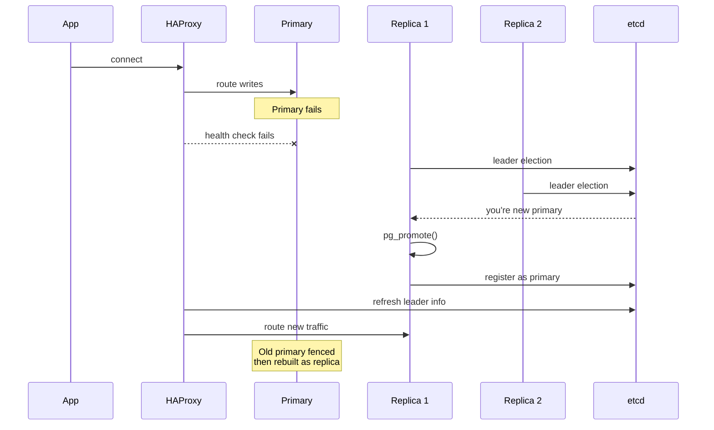

# High Availability and Failover

> **One-liner**: HA combines replication, automatic failover, leader election, and a routing layer so a single-node failure doesn't take the database down.

---

## Quick Reference

| Component | Job |
|-----------|-----|
| **Primary + replica(s)** | replication (see [[02 - Replication]]) |
| **Cluster manager** | Patroni / repmgr / pg_auto_failover — health check, election, promotion |
| **Distributed config store** | etcd / Consul / ZooKeeper — single source of truth for "who's primary" |
| **Routing layer** | HAProxy / PgBouncer / pgcat / `pg_listenaddr` switch | clients always connect to "the primary" alias |
| **VIP / DNS** | failover-time IP move; or service discovery |
| **Witness / quorum** | breaks ties to avoid split-brain |
| **Fencing** | guarantees old primary is fully off before promoting new one |

| Term | Meaning |
|------|---------|
| **RTO** | Recovery Time Objective — how fast back online |
| **RPO** | Recovery Point Objective — how much data you can lose |
| **Split-brain** | two nodes both think they're primary — disaster |
| **STONITH** | "Shoot The Other Node In The Head" — forced shutdown of failing primary |
| **Quorum** | majority needed to elect a leader |

---

## Core Concept

A reliable HA setup answers four questions:

1. **Who's the primary right now?** A distributed config store (etcd/Consul) holds the truth; cluster managers update it during failover.
2. **How do clients find the primary?** Routing layer (HAProxy with health checks, PgBouncer, or service discovery). DNS alone is too slow because of TTL caching.
3. **What if the primary becomes unreachable but isn't dead?** Need a quorum — at least 3 nodes (or 2 + a witness) — and **fencing** so the old primary can't keep accepting writes.
4. **Did the new primary lose data?** With sync replication, no. With async, possibly the last few transactions. RPO depends on this choice.

The most popular open-source orchestrators:
- **Patroni** — Python, integrates with etcd/Consul/ZK, very widely deployed
- **repmgr** — by 2ndQuadrant; simpler manual + automatic failover
- **pg_auto_failover** — by Citus team; minimal architecture

In the cloud, you usually get HA from the managed service (RDS Multi-AZ, Aurora, Azure HA, AlloyDB). The principles still matter for understanding RPO/RTO and verifying behavior.

---

## Diagram



---

## Syntax & API

### Patroni — minimal config
```yaml
# /etc/patroni/patroni.yml on each node
scope: shop-cluster
namespace: /pg/
name: pg-node-1                  # unique per node

restapi:
  listen: 0.0.0.0:8008
  connect_address: 10.0.0.11:8008

etcd3:
  hosts: 10.0.0.21:2379,10.0.0.22:2379,10.0.0.23:2379

bootstrap:
  dcs:
    ttl: 30
    loop_wait: 10
    retry_timeout: 10
    maximum_lag_on_failover: 1048576
    synchronous_mode: true
    postgresql:
      use_pg_rewind: true
      parameters:
        wal_level: replica
        hot_standby: 'on'
        max_wal_senders: 10
        max_replication_slots: 10
        synchronous_commit: 'on'
        synchronous_standby_names: '*'

postgresql:
  listen: 0.0.0.0:5432
  connect_address: 10.0.0.11:5432
  data_dir: /var/lib/postgresql/16/main
  authentication:
    superuser:    {username: postgres, password: '...'}
    replication:  {username: replicator, password: '...'}
```

```bash
# Start (systemd or manual)
sudo systemctl start patroni
patronictl -c /etc/patroni/patroni.yml list
```

### HAProxy routing in front of Patroni
```text
# /etc/haproxy/haproxy.cfg
listen postgres_write
    bind *:5432
    mode tcp
    option httpchk OPTIONS /primary
    http-check expect status 200
    server pg-node-1 10.0.0.11:5432 check port 8008
    server pg-node-2 10.0.0.12:5432 check port 8008 backup
    server pg-node-3 10.0.0.13:5432 check port 8008 backup

listen postgres_read
    bind *:5433
    mode tcp
    balance roundrobin
    option httpchk OPTIONS /replica
    http-check expect status 200
    server pg-node-1 10.0.0.11:5432 check port 8008
    server pg-node-2 10.0.0.12:5432 check port 8008
    server pg-node-3 10.0.0.13:5432 check port 8008
```

### Manual failover (any setup)
```sql
-- On the chosen replica
SELECT pg_promote();

-- Old primary must NOT come back as primary; restore it as a replica
-- Use pg_rewind to fast-forward (instead of full base backup)
```

```bash
sudo -u postgres pg_rewind \
  --source-server="host=newprimary user=replicator" \
  --target-pgdata=/var/lib/postgresql/16/main
# Then start it as a follower (standby.signal + primary_conninfo)
```

### Service discovery via Patroni REST API
```bash
# Each node exposes simple HTTP endpoints
curl 10.0.0.11:8008/primary       # 200 if this node is primary, else 503
curl 10.0.0.11:8008/replica       # 200 if it's a (healthy) replica
curl 10.0.0.11:8008/health        # 200 if running
curl 10.0.0.11:8008/cluster       # JSON with cluster topology
```

### Test failover
```bash
patronictl -c /etc/patroni/patroni.yml switchover
patronictl -c /etc/patroni/patroni.yml failover
```

---

## Common Patterns

```text
Pattern: 3-node HA across availability zones
- AZ-A: primary
- AZ-B: sync replica (RPO=0 if AZ-A fails)
- AZ-C: async replica + DR/backup target
- Patroni quorum across all three; etcd outside the DB nodes
```

```text
Pattern: blue/green for zero-downtime upgrades
- Set up green cluster on new PG version
- Logical replication green ← blue
- Cut over routing when green caught up
- Keep blue alive a few hours for rollback
```

```text
Pattern: read scaling with HA
- Writes → HAProxy primary VIP
- Reads → HAProxy replica VIP (round-robin healthy replicas)
- Reads tolerate a few hundred ms of lag
```

---

## Gotchas & Tips

- **Test failover regularly** — quarterly drills surface broken automation, missing alerts, and config drift.
- **Quorum requires odd numbers (3, 5)** — 2-node setups can't safely auto-failover (split-brain risk). Add a witness node or third replica.
- **DNS-based routing has TTL latency** — clients cache stale entries. Prefer L4 proxies (HAProxy) or sidecars.
- **Connection pooling matters** — apps reusing connections to a dead primary need to *re-resolve*. Restart pools on failover events.
- **`synchronous_standby_names`** — be careful: if no replica is up, sync writes block forever. Use `ANY 1 (...)` over `FIRST 1 (...)` to allow any replica to ack.
- **Fencing prevents split-brain** — hard. Patroni fences via etcd lease + DB-side controls; cloud providers fence via API. Don't skip it.
- **`pg_rewind` saves a full base-backup** — it requires `wal_log_hints` or data checksums; turn them on at initdb time.
- **Replication lag = RPO** — sync gives RPO=0 in normal ops; async means lost transactions equal to lag.
- **HA != backup** — replication propagates `DROP TABLE` instantly. You still need backups (see [[15 - Backup and Restore]]).
- **Monitor everything** — replication lag, WAL piling on slots, primary CPU, election events, switchovers. Alert on stuck states.
- **Cloud HA** (RDS Multi-AZ, Aurora, Azure HA) handles most of this transparently — but read the SLAs to know your real RTO/RPO.

---

## See Also

- [[02 - Replication]]
- [[15 - Backup and Restore]]
- [[09 - Performance Tuning]]
- [[17 - Cloud Databases]]
