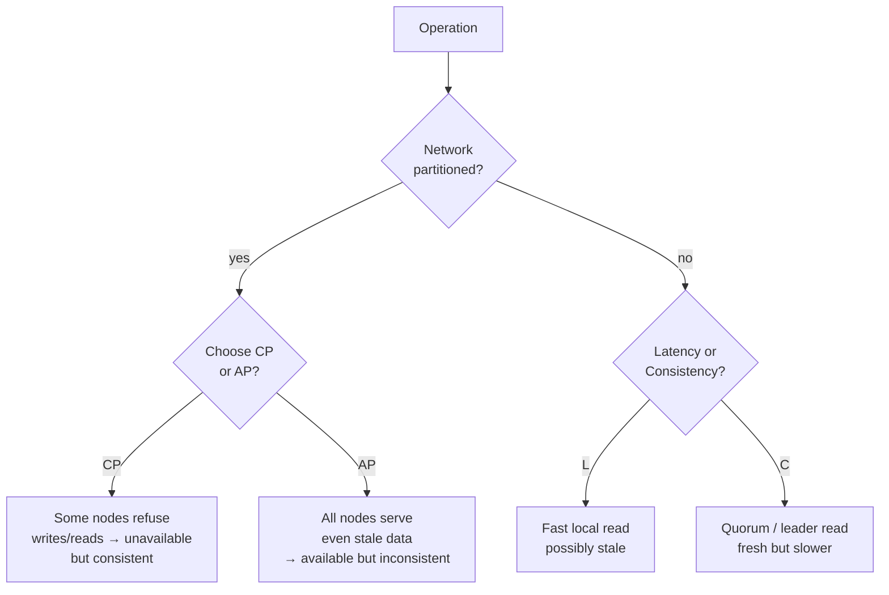

# CAP and PACELC

> **One-liner**: When the network partitions, a distributed DB must choose Consistency or Availability; even when it's healthy, every system trades Latency for Consistency.

---

## Quick Reference

| Letter | Meaning |
|--------|---------|
| **C**onsistency | every read sees the latest committed write (linearizability) |
| **A**vailability | every request receives a response (not necessarily latest) |
| **P**artition tolerance | system keeps working when nodes can't talk |
| **L**atency | round-trip cost during normal operation |
| **E**lse | "Else" — when not partitioned |

**CAP**: during a Partition, pick CP or AP.
**PACELC**: extends CAP — even when **E**verything's fine, you still pick **L**atency vs **C**onsistency.

| System | CAP | PACELC |
|--------|-----|--------|
| PostgreSQL primary | CP (single primary; partition = unavailable) | PC/EC (consistent under most conditions) |
| PostgreSQL with sync replica | CP | PC/EC |
| Cassandra | AP | PA/EL (latency over consistency) |
| MongoDB (primary read) | CP | PC/EC |
| MongoDB (secondary read, eventual) | AP | PA/EL |
| DynamoDB (default eventually consistent) | AP | PA/EL |
| DynamoDB (strongly consistent reads) | CP | PC/EC |
| Cosmos DB (5 levels) | tunable | tunable |
| Redis (single node) | CA-ish (no real partition tolerance) | EC |
| Redis Cluster | AP-ish | PA/EL |

---

## Core Concept

The original **CAP theorem** (Brewer, 2000) says a distributed system cannot simultaneously provide all three of:
- **Consistency** (linearizable: every node sees the same data)
- **Availability** (every request gets a response)
- **Partition tolerance** (the system keeps running when network splits)

Since networks *will* partition, the real choice is **CP or AP**.

But CAP only describes behavior **during a partition** — most of the time, networks aren't partitioned, so it underspecifies systems' actual tradeoffs. Daniel Abadi's **PACELC** adds: even when there's **No** partition (i.e., **E**lse), there's a tradeoff between **L**atency and **C**onsistency.

A consistent read may need to coordinate across replicas — extra round-trips, extra latency. A "fast" read can be returned from one node immediately but might be stale.

Different systems make different choices, and many modern stores let you tune **per request**. DynamoDB's `ConsistentRead` flag is one toggle; Cosmos DB exposes 5 levels; Cassandra lets you pick `ONE` / `QUORUM` / `ALL` per query.

The practical advice: don't ask "which letters does my DB support?" Ask "what consistency does this *operation* need?" — and pick the configuration accordingly.

---

## Diagram



---

## Consistency models (in plain words)

From strictest to loosest:

| Model | Guarantee | Cost |
|-------|-----------|------|
| **Linearizable / Strict** | reads see the latest committed write — as if there's one global clock | high; needs coordination |
| **Sequential** | all clients see the same order, may not be real-time | similar |
| **Causal** | causally related ops are ordered; concurrent ones may differ per client | moderate; tracks dependencies |
| **Read-your-writes** | a client always sees its own writes | cheap if you stick to one node / session |
| **Monotonic reads** | a client never goes backwards in time | sticky session |
| **Eventually consistent** | given no new writes, replicas converge | cheapest, weakest |

PostgreSQL's primary gives you linearizable reads (within the primary). A sync replica + read-from-replica can be linearizable too if you wait for ack. Reading from an async replica is at best eventual + bounded staleness.

---

## Examples

### CP under partition: Postgres primary
```sql
-- Primary partitioned from the world: writes block / fail
-- App sees timeout → "the write didn't go through"
-- Better than two copies of truth; might be unacceptable if availability is paramount
```

### AP under partition: Cassandra
```sql
-- Two coordinators take writes for the same key on each side of partition
-- Both versions are stored; on heal, last-writer-wins or app-defined merge
-- App reads might see one or the other for a window, then converge
```

### Tunable consistency: Cosmos DB
```text
Levels:
- Strong            (linearizable; cross-region writes wait)
- Bounded staleness (lag bound: K ops or T seconds)
- Session           (read-your-writes for a single session)
- Consistent prefix (no out-of-order; no real-time guarantee)
- Eventual          (cheapest)

App chooses per-request
```

### Tunable per query: Cassandra
```sql
-- Read with QUORUM (consistency)
SELECT * FROM users WHERE id = ? CONSISTENCY QUORUM;

-- Read with ONE (latency)
SELECT * FROM users WHERE id = ? CONSISTENCY ONE;

-- Write with QUORUM (3 of 5 must ack)
INSERT INTO users (...) VALUES (...) USING CONSISTENCY QUORUM;
```

### DynamoDB
```text
-- Eventually consistent (default, half the cost)
GetItem({ConsistentRead: false})

-- Strongly consistent (single-region, costs more)
GetItem({ConsistentRead: true})
```

---

## Common Patterns

```text
Pattern: read-your-writes via session pinning
- Use sticky sessions to the primary for clients that just wrote
- After grace period, reads can fall back to replicas
```

```text
Pattern: bounded staleness for dashboards
- Acceptable lag: 30 seconds for revenue dashboard
- Read from async replica
- Show "as of N seconds ago" in UI
```

```text
Pattern: idempotent operations + at-least-once delivery
- Distributed systems often retry; design for repeat
- Use unique request IDs; deduplicate at write
- Far easier than perfect consistency
```

```text
Pattern: CRDTs for AP systems
- Conflict-free replicated data types: counters, sets, maps
- All replicas converge regardless of merge order
- Used in shopping carts, collaborative editors
```

---

## Gotchas & Tips

- **CAP doesn't mean "pick 2 of 3"** — partition tolerance is forced. The pick is C-vs-A *during* partition.
- **Single-node DBs aren't really "CA"** — they fail entirely on hardware loss. Treat any production DB as distributed.
- **Eventual ≠ never** — it's "given no further updates, replicas will agree." Bound the window in monitoring.
- **Monotonic reads need stickiness** — without it, two reads might hit different replicas at different points in their replication; the second can be older than the first.
- **Linearizability composes; eventual consistency does not** — pipelines of eventual systems explode in subtle ways.
- **You can't bolt strong consistency on at the API layer** — at best you simulate it (read repair, quorums) at higher latency.
- **Mongo's "primary read" is consistent only if you stick to primary** — reading from secondaries is eventual unless you set `readConcern: 'linearizable'` (slow).
- **DynamoDB's strong reads cost 2× consumption** — design with eventual when possible.
- **Cosmos DB session consistency** is the practical sweet spot — covers most app needs at moderate cost.
- **Postgres logical replication is async** — using a replica for "live" reads needs care. Sync replication is the way to keep linearizable reads off the primary.

---

## See Also

- [[01 - Database Overview]]
- [[02 - Replication]]
- [[05 - Distributed Transactions]]
- [[17 - Cloud Databases]]
