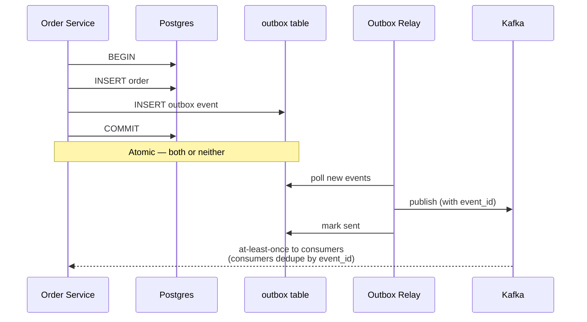

# Distributed Transactions

> **One-liner**: Across services or databases, you can't have ACID — embrace Saga + Outbox + idempotency, not 2PC.

---

## Quick Reference

| Pattern | What it is | When to use |
|---------|------------|-------------|
| **2PC** (Two-Phase Commit) | coordinator asks all participants "prepare?", then "commit/abort" | rare; classic XA; blocking on coordinator failure |
| **Saga** | sequence of local txs + compensating actions on failure | service-to-service workflows |
| **Outbox** | write business state + outbox event in same DB tx; relay events later | guarantee at-least-once event publish |
| **Inbox / Idempotency key** | dedup repeated events on consumer | exactly-once processing on retries |
| **TCC** (Try–Confirm–Cancel) | reserve resources, then confirm or cancel | bookings; stronger than Saga, more code |

| Concept | Meaning |
|---------|---------|
| **At-least-once delivery** | event might be received multiple times — design idempotently |
| **Compensating action** | undo for a step that already committed |
| **Choreography** | services react to events; no central coordinator |
| **Orchestration** | one process drives the saga; clearer to debug |

---

## Core Concept

**ACID across services is not free**. The classic solution, **2PC**, gets you ACID — at a cost: every participant locks resources during the prepare phase, and a coordinator crash leaves everyone stuck. Modern microservices avoid 2PC.

Instead, decompose: each service owns its data and its own local transaction. Coordinate with **Sagas** — a sequence of local transactions, with **compensating actions** to undo earlier steps if a later one fails.

The hard part is **publishing the event reliably**. If you write to your DB and then try to publish to a queue, either step can fail without the other. The **Outbox pattern** solves this: write the event into an `outbox` table inside the same DB transaction as the business change, then a separate process reads `outbox` and publishes.

Consumers must be **idempotent** — "received twice" is normal. Use a unique event ID + an `inbox` table (or Redis SET) to dedupe.

**Choreography** (services react to events) is loose-coupled but hard to trace. **Orchestration** (a saga manager calls services) is centralized and easier to reason about.

---

## Diagram



---

## Syntax & API

### Outbox table
```sql
CREATE TABLE outbox (
    id            UUID        PRIMARY KEY DEFAULT gen_random_uuid(),
    aggregate     TEXT        NOT NULL,        -- 'order'
    aggregate_id  TEXT        NOT NULL,        -- order id
    event_type    TEXT        NOT NULL,        -- 'OrderPlaced'
    payload       JSONB       NOT NULL,
    created_at    TIMESTAMPTZ NOT NULL DEFAULT now(),
    sent_at       TIMESTAMPTZ
);

CREATE INDEX idx_outbox_unsent ON outbox (created_at) WHERE sent_at IS NULL;
```

### Write business state + outbox in one tx
```csharp
await using var tx = await conn.BeginTransactionAsync();
try
{
    var orderId = await conn.QuerySingleAsync<int>(
        @"INSERT INTO orders (user_id, total) VALUES (@UserId, @Total) RETURNING id",
        new { order.UserId, order.Total }, tx);

    await conn.ExecuteAsync(
        @"INSERT INTO outbox (aggregate, aggregate_id, event_type, payload)
          VALUES ('order', @id, 'OrderPlaced', @p::jsonb)",
        new { id = orderId.ToString(),
              p  = JsonSerializer.Serialize(new { orderId, order.UserId, order.Total }) },
        tx);

    await tx.CommitAsync();
}
catch
{
    await tx.RollbackAsync();
    throw;
}
```

### Outbox relay (poll → publish → mark)
```csharp
public async Task RelayAsync(CancellationToken ct)
{
    while (!ct.IsCancellationRequested)
    {
        await using var conn = await db.OpenConnectionAsync(ct);
        await using var tx = await conn.BeginTransactionAsync(ct);

        var batch = await conn.QueryAsync<OutboxRow>(
            @"SELECT * FROM outbox
              WHERE sent_at IS NULL
              ORDER BY created_at
              LIMIT 100
              FOR UPDATE SKIP LOCKED", transaction: tx);

        foreach (var row in batch)
        {
            await producer.PublishAsync(row.EventType, row.Payload, row.Id, ct);
        }

        await conn.ExecuteAsync(
            "UPDATE outbox SET sent_at = now() WHERE id = ANY(@Ids)",
            new { Ids = batch.Select(b => b.Id).ToArray() }, tx);

        await tx.CommitAsync(ct);
        if (batch.Count == 0) await Task.Delay(500, ct);
    }
}
```

`SKIP LOCKED` lets multiple relay workers run safely; `FOR UPDATE` prevents double-publish within a worker.

### Inbox / idempotency on consumers
```sql
CREATE TABLE processed_events (
    event_id    UUID        PRIMARY KEY,
    processed_at TIMESTAMPTZ NOT NULL DEFAULT now()
);
```

```csharp
public async Task HandleAsync(EventEnvelope env)
{
    await using var tx = await conn.BeginTransactionAsync();
    try
    {
        var inserted = await conn.ExecuteAsync(
            @"INSERT INTO processed_events (event_id) VALUES (@id)
              ON CONFLICT DO NOTHING", new { id = env.EventId }, tx);
        if (inserted == 0) { await tx.CommitAsync(); return; }   // already done

        // ... business handling ...
        await tx.CommitAsync();
    }
    catch { await tx.RollbackAsync(); throw; }
}
```

### Saga (orchestration sketch)
```csharp
public class PlaceOrderSaga
{
    public async Task ExecuteAsync(PlaceOrder cmd, CancellationToken ct)
    {
        var reservation = await inventory.ReserveAsync(cmd.Items, ct);
        try
        {
            var payment = await payments.ChargeAsync(cmd.UserId, cmd.Total, ct);
            try
            {
                await orders.CreateAsync(cmd, payment.Id, ct);
            }
            catch
            {
                await payments.RefundAsync(payment.Id, ct);          // compensate
                throw;
            }
        }
        catch
        {
            await inventory.ReleaseAsync(reservation.Id, ct);        // compensate
            throw;
        }
    }
}
```

### 2PC in Postgres (PREPARE TRANSACTION) — rare
```sql
BEGIN;
INSERT INTO orders (...) VALUES (...);
PREPARE TRANSACTION 'order-tx-42';
-- Now another participant can ACK; only after both ack:
COMMIT PREPARED 'order-tx-42';
-- or:
ROLLBACK PREPARED 'order-tx-42';
```

Avoid 2PC unless you're integrating with an XA transaction manager and accept the operational pain.

---

## Common Patterns

```text
Pattern: idempotency key on the boundary
- Client sends a unique key on every request
- API stores key + result; replays return the cached result
- Frees retry/network from worrying about duplication
```

```text
Pattern: at-most-once humans, at-least-once machines
- Don't ask the user to retry when retry is a machine concern
- Pipelines are at-least-once + idempotent consumers
- Humans see "operation in progress" until confirmed
```

```text
Pattern: outbox → Debezium → Kafka
- Don't poll outbox; let Debezium tail Postgres WAL
- More efficient and lower-latency than polling
- See [[13 - ETL and CDC]]
```

```text
Pattern: choreography vs orchestration
- < 5 steps, simple flow → choreography (services react)
- Complex business flows, retries, audits → orchestration (durable workflow engine: Temporal, Cadence, AWS Step Functions)
```

---

## Gotchas & Tips

- **Don't use 2PC across the network** — every coordinator failure is a hangup. Even with timeouts, locks accumulate.
- **Outbox is the canonical pattern** — write event + state in one tx. Anything else has gaps.
- **Idempotency is not optional** — at-least-once delivery + retries = duplicates. Plan for them.
- **Compensations aren't "undo"** — they're business actions ("refund", "release reservation"). Some side effects can't be undone (an email was sent); design accordingly.
- **Track saga state explicitly** — durable workflow systems (Temporal, Hangfire, Quartz) save you from re-implementing retries, timeouts, and crash-recovery.
- **Keep aggregates small** — sagas span aggregates by design; if every operation needs a saga, the boundaries are wrong.
- **Time is not a synchronizer** — clocks drift. Use logical clocks (Lamport, vector clocks) or sequence numbers, not wall-clock for ordering across services.
- **Backpressure on outbox** — if the relay falls behind, it's an alert. The table grows otherwise.
- **Test failure paths** — chaos-test compensation handlers; they're rarely exercised but matter most.
- **Eventual consistency leaks to UI** — show optimistic state ("processing…") until events confirm.

---

## See Also

- [[02 - Transactions and ACID]]
- [[06 - CQRS and Event Sourcing]]
- [[04 - CAP and PACELC]]
- [[13 - ETL and CDC]]
