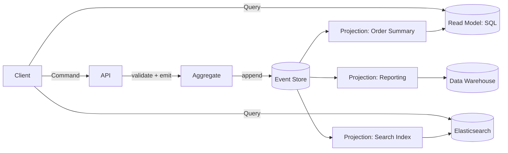

# CQRS and Event Sourcing

> **One-liner**: CQRS splits writes (commands) from reads (queries); Event Sourcing makes the **event log** the source of truth and projects it into read models.

---

## Quick Reference

| Concept | Meaning |
|---------|---------|
| **Command** | "do this" (intent) — `PlaceOrder`, `ChangeAddress` |
| **Event** | "this happened" (fact) — `OrderPlaced`, `AddressChanged` |
| **Query** | "tell me" (read) — does not mutate state |
| **Aggregate** | a consistency boundary; commands operate on it |
| **Event store** | append-only log of events (per aggregate) |
| **Projection / read model** | a derived view, built by replaying events |
| **Snapshot** | periodic compact state to skip early replay |
| **Idempotent handler** | safely processes the same event twice |

| Pattern | What it gives you |
|---------|-------------------|
| **CQRS only** | optimize read & write models independently |
| **Event Sourcing** | full history, time travel, audit, replayable read models |
| **CQRS + ES together** | the canonical combo (read models projected from events) |

---

## Core Concept

**CQRS** (Command Query Responsibility Segregation) treats reads and writes as different problems with different shapes. The write side enforces invariants on a small, normalized aggregate. The read side serves whatever shape the UI needs — denormalized, indexed differently, sometimes in a different store.

**Event Sourcing** changes *what* you store. Instead of "the current state of an order," you store the events that produced it: `OrderPlaced`, `ItemAdded`, `Paid`, `Shipped`. Current state is the **left-fold** of those events. The event log is the source of truth; views are derived.

Together: commands → produce events → events appended to event store → projections subscribe and update read models.

Benefits:
- **Audit by design** — every change is an event, with timestamp and actor
- **Time travel** — re-run projections to a past time
- **Multiple read models** — same events, many views
- **Decoupling** — read services scale independently of writes

Costs:
- **Eventual consistency** between write and read sides
- **Schema evolution is harder** — you can't edit history; events are immutable
- **Operationally heavier** — event store, projection runners, replay tooling

Don't reach for CQRS+ES until the domain demands it (rich audit, branching workflows, fundamental complexity). Plain CRUD is fine for most apps.

---

## Diagram



---

## Syntax & API

### Event store schema (Postgres-as-event-store)
```sql
CREATE TABLE events (
    stream_id       UUID        NOT NULL,
    version         BIGINT      NOT NULL,
    event_type      TEXT        NOT NULL,
    data            JSONB       NOT NULL,
    metadata        JSONB,
    occurred_at     TIMESTAMPTZ NOT NULL DEFAULT now(),
    PRIMARY KEY (stream_id, version)
);

-- Optimistic concurrency: version is increment-by-one within the stream
-- Append fails if expected_version mismatches
```

### Append events with optimistic concurrency
```csharp
public async Task AppendAsync(Guid streamId, long expectedVersion, IEnumerable<Event> events)
{
    await using var tx = await conn.BeginTransactionAsync();
    var actual = await conn.ExecuteScalarAsync<long?>(
        "SELECT max(version) FROM events WHERE stream_id = @s", new { s = streamId }, tx) ?? -1;

    if (actual != expectedVersion)
        throw new ConcurrencyException(expectedVersion, actual);

    long v = actual + 1;
    foreach (var e in events)
    {
        await conn.ExecuteAsync(@"
            INSERT INTO events (stream_id, version, event_type, data, metadata)
            VALUES (@s, @v, @t, @d::jsonb, @m::jsonb)",
            new { s = streamId, v = v++, t = e.Type,
                  d = JsonSerializer.Serialize(e.Data),
                  m = JsonSerializer.Serialize(e.Metadata) }, tx);
    }
    await tx.CommitAsync();
}
```

### Aggregate root (replay + decide)
```csharp
public class Order
{
    public Guid Id { get; private set; }
    public OrderStatus Status { get; private set; }
    public long Version { get; private set; } = -1;
    private readonly List<Event> _new = new();

    public IReadOnlyList<Event> NewEvents => _new;

    public static Order Replay(Guid id, IEnumerable<Event> history)
    {
        var o = new Order { Id = id };
        foreach (var e in history) o.Apply(e, fresh: false);
        return o;
    }

    // Command
    public void Place(decimal total)
    {
        if (Status != default) throw new InvalidOperationException("Already placed");
        Apply(new Event("OrderPlaced", new { total }), fresh: true);
    }

    // Apply event to state
    private void Apply(Event e, bool fresh)
    {
        switch (e.Type)
        {
            case "OrderPlaced":   Status = OrderStatus.Placed; break;
            case "OrderShipped":  Status = OrderStatus.Shipped; break;
        }
        Version++;
        if (fresh) _new.Add(e);
    }
}
```

### Projection — keep a denormalized read model
```sql
CREATE TABLE order_summary (
    id        UUID PRIMARY KEY,
    user_id   INT NOT NULL,
    status    TEXT NOT NULL,
    total     NUMERIC NOT NULL,
    placed_at TIMESTAMPTZ
);
```

```csharp
public async Task ProjectAsync(EventEnvelope env)
{
    switch (env.Type)
    {
        case "OrderPlaced":
            var d = JsonSerializer.Deserialize<OrderPlaced>(env.Data);
            await conn.ExecuteAsync(@"
                INSERT INTO order_summary (id, user_id, status, total, placed_at)
                VALUES (@id, @u, 'Placed', @t, @ts)
                ON CONFLICT (id) DO NOTHING",
                new { id = env.StreamId, u = d.UserId, t = d.Total, ts = env.OccurredAt });
            break;

        case "OrderShipped":
            await conn.ExecuteAsync(
                "UPDATE order_summary SET status = 'Shipped' WHERE id = @id",
                new { id = env.StreamId });
            break;
    }
}
```

### Snapshots (avoid replaying long histories)
```sql
CREATE TABLE snapshots (
    stream_id  UUID PRIMARY KEY,
    version    BIGINT NOT NULL,
    state      JSONB  NOT NULL,
    taken_at   TIMESTAMPTZ NOT NULL DEFAULT now()
);
```

```csharp
// Load: try snapshot first, then replay events with version > snapshot.version
var snap = await snapshots.LoadAsync(streamId);
var events = await store.LoadFromAsync(streamId, snap?.Version ?? -1);
var order = snap is null ? Order.Replay(streamId, events) : Order.RestoreSnapshot(snap, events);
```

### Replay all events to rebuild a read model
```csharp
// One-shot: drop and rebuild
await conn.ExecuteAsync("TRUNCATE order_summary");

await foreach (var batch in store.StreamAllAsync(fromVersion: 0))
    await projector.ProjectAsync(batch);
```

---

## Common Patterns

```text
Pattern: CQRS without ES
- Commands write to a normalized SQL schema
- A separate denormalized read model is updated synchronously (in tx) or via outbox+events
- No event log; simpler than full ES
- Most apps that need CQRS only need this much
```

```text
Pattern: outbox-as-event-store integration
- App writes business state + outbox in one tx
- Outbox events become the integration log (not the source of truth)
- Lighter than full ES; fits typical microservice work
- See [[05 - Distributed Transactions]]
```

```text
Pattern: dedicated event store
- EventStoreDB, Kurrent, Marten (Postgres-backed) — purpose-built
- Streams, projections, subscriptions, snapshotting out of the box
- Less DIY than rolling on raw Postgres
```

---

## Gotchas & Tips

- **Don't ES everything** — only aggregates that actually benefit from history. Mix ES aggregates with CRUD where appropriate.
- **Events are immutable** — fix bugs by emitting new compensating events, not by editing past ones.
- **Versioning event schemas is hard** — plan for it from day one. Wrap events in envelopes with `event_type` and a version number.
- **Eventual consistency between writes and reads** — UIs need optimistic UI or "processing..." indicators.
- **Snapshots are an optimization, not the truth** — recompute from events on demand.
- **Replay must be idempotent and deterministic** — don't put `now()` or random IDs in projections (use the event's timestamp).
- **GDPR / right-to-be-forgotten conflicts with immutable events** — strategies: encrypt PII per-stream and discard the key, or accept rewrites at audit cost.
- **Long streams need snapshots** — a 1M-event stream replays slowly; snapshot every 100–1000 events.
- **Concurrency on append** — optimistic via expected_version; use `SERIALIZABLE` or unique `(stream_id, version)` to enforce.
- **Multiple read models from one log** — that's the superpower; use it. Don't try to make one perfect read model.
- **Marten** (Postgres-backed) is the easy way for .NET — Postgres + JSONB + projection runners + LINQ queries.

---

## See Also

- [[05 - Distributed Transactions]]
- [[07 - Temporal and Audit Tables]]
- [[13 - ETL and CDC]]
- [[04 - CAP and PACELC]]
