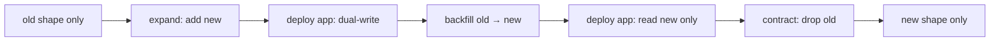

# Schema Evolution

> **One-liner**: Zero-downtime schema changes follow the **expand → migrate → contract** pattern: deploy backwards-compatible additions first, migrate data, then remove the old shape — never all at once.

---

## Quick Reference

| Phase | What you do |
|-------|-------------|
| **Expand** | add new columns/tables/indexes; both old and new shapes coexist |
| **Migrate** | dual-write from app; backfill historical rows |
| **Contract** | flip reads to new shape; remove old columns/tables |

| Operation | Postgres lock | Safe online? |
|-----------|---------------|--------------|
| `ADD COLUMN <type>` (no default, PG 11+) | brief AccessExclusive | yes |
| `ADD COLUMN <type> DEFAULT <const>` (PG 11+) | brief AccessExclusive | yes (no rewrite) |
| `ADD COLUMN <type> NOT NULL` (no default) | requires non-null backfill | needs care |
| `ADD CONSTRAINT … CHECK NOT VALID` then `VALIDATE CONSTRAINT` | low-lock validation | yes |
| `CREATE INDEX CONCURRENTLY` | ShareUpdateExclusive | yes |
| `DROP INDEX CONCURRENTLY` | low | yes |
| `ALTER TYPE` (column) | full rewrite if size changes | usually no — use new column |
| `ALTER TABLE … RENAME COLUMN` | brief AccessExclusive | yes, but app must support both names |

---

## Core Concept

A naive migration changes the schema and the app at the same time. In a multi-instance deploy or a rolling restart, both old and new app code run simultaneously — and *they must both work*.

The **expand → migrate → contract** pattern decouples the schema and code lifecycle:

1. **Expand** — additive only. Add new column / new table / new index. Old code keeps working; new code can use new shape.
2. **Deploy** new app code that reads/writes both old and new (dual-write) or only new (after backfill).
3. **Migrate / backfill** — populate the new shape from the old.
4. **Switch reads** — new code stops reading the old shape.
5. **Contract** — drop old columns/tables/indexes after a safety window.

Big rule: **every step is reversible** by going back one step. If migration fails, the previous app version still works because the old shape is still there.

Also: think about lock duration. `ALTER TABLE` operations that rewrite the table block writes for the duration. Postgres has fast paths (PG 11+ for `ADD COLUMN … DEFAULT`) and tools (`pg_repack`, `pgroll`) for the harder cases.

---

## Diagram



---

## Syntax & API

### Add a NOT NULL column without rewrite
```sql
-- DON'T: ALTER TABLE users ADD COLUMN status TEXT NOT NULL;
-- (errors on existing rows; takes AccessExclusive while filling)

-- DO (PG 11+): nullable + default → backfill → set NOT NULL
ALTER TABLE users ADD COLUMN status TEXT;
UPDATE users SET status = 'active' WHERE status IS NULL;     -- batched (see below)
ALTER TABLE users ALTER COLUMN status SET DEFAULT 'active';
ALTER TABLE users ALTER COLUMN status SET NOT NULL;
```

### Batched backfill to avoid long locks / huge undo
```sql
DO $$
DECLARE
    n INT;
BEGIN
    LOOP
        WITH chunk AS (
            SELECT id FROM users WHERE status IS NULL LIMIT 5000 FOR UPDATE SKIP LOCKED
        )
        UPDATE users SET status = 'active'
        WHERE id IN (SELECT id FROM chunk);
        GET DIAGNOSTICS n = ROW_COUNT;
        EXIT WHEN n = 0;
        PERFORM pg_sleep(0.05);                  -- breathe
    END LOOP;
END $$;
```

### Add CHECK constraint without locking writes
```sql
-- Two-step: NOT VALID skips initial scan; validation acquires lower lock
ALTER TABLE orders ADD CONSTRAINT ck_total_pos CHECK (total >= 0) NOT VALID;
ALTER TABLE orders VALIDATE CONSTRAINT ck_total_pos;
```

### Add foreign key without long lock
```sql
-- 1. Add the column nullable
ALTER TABLE orders ADD COLUMN warehouse_id INT;

-- 2. Backfill, optionally batched
UPDATE orders SET warehouse_id = 1 WHERE warehouse_id IS NULL;

-- 3. Add FK as NOT VALID, then validate
ALTER TABLE orders
    ADD CONSTRAINT fk_orders_warehouse
    FOREIGN KEY (warehouse_id) REFERENCES warehouses(id) NOT VALID;
ALTER TABLE orders VALIDATE CONSTRAINT fk_orders_warehouse;
```

### Rename a column (expand/contract)
```sql
-- Step 1: add new column with same data
ALTER TABLE users ADD COLUMN full_name TEXT;
UPDATE users SET full_name = name;

-- Step 2: deploy app that reads both, writes both
-- Step 3: deploy app that reads/writes only full_name
-- Step 4: drop old
ALTER TABLE users DROP COLUMN name;
```

### Change a column type
```sql
-- DON'T: ALTER TABLE orders ALTER COLUMN total TYPE NUMERIC(18,4);
-- (rewrites the whole table under AccessExclusive)

-- DO: new column + dual-write + drop old
ALTER TABLE orders ADD COLUMN total_v2 NUMERIC(18,4);
UPDATE orders SET total_v2 = total;          -- batched
-- App writes both for a window
-- Then:
ALTER TABLE orders DROP COLUMN total;
ALTER TABLE orders RENAME COLUMN total_v2 TO total;
```

### Replace an index without dropping it
```sql
CREATE INDEX CONCURRENTLY idx_orders_user_date_v2
    ON orders (user_id, placed_at DESC) INCLUDE (total);

-- App / planner now uses the new one
DROP INDEX CONCURRENTLY idx_orders_user_date;
ALTER INDEX idx_orders_user_date_v2 RENAME TO idx_orders_user_date;
```

### Online table-rewrite tools
```bash
# pg_repack — vacuum-full equivalent without ACCESS EXCLUSIVE
pg_repack -h localhost -d shop -t orders --no-superuser-check

# pgroll — declarative migrations with implicit expand/contract (Xata)
pgroll start migrations/01_add_status.json
pgroll complete
pgroll rollback        # before complete
```

---

## Common Patterns

```text
Pattern: feature flag in front of schema
- Migration adds new column / behind-the-scenes
- App reads from new column only when feature flag enabled
- Decouples deploy from cutover; flag-flip is the real change
```

```text
Pattern: shadow read / read mirror
- App reads from old + new in parallel; logs differences
- Confirms parity before flipping reads
- Expensive but high-confidence for critical paths
```

```text
Pattern: idempotent backfill jobs
- Backfill in a worker, not in a migration
- Resumeable: track last id processed; SKIP LOCKED for parallelism
- Migration only updates schema; data work is its own deployment
```

```text
Pattern: blue/green databases for irreversible changes
- Stand up new schema in parallel
- Logical replication primary → green (with type changes applied)
- Cut over when caught up
- See [[02 - Replication]]
```

---

## Gotchas & Tips

- **`ACCESS EXCLUSIVE` blocks all reads and writes** — even for milliseconds, that's a tiny outage. Use `lock_timeout` and retry.
- **`lock_timeout = '5s'`** — set in the migration session so a stuck DDL aborts instead of queueing.
- **Long-running migrations cause replication lag** — replicas replay synchronously; a 30-minute rewrite freezes them.
- **Don't run two big DDLs in one tx** — Postgres holds locks for the whole tx. Many small txs > one giant one.
- **`CREATE INDEX CONCURRENTLY` can't run inside a tx** — wrap each in its own migration step.
- **`NOT VALID` constraints don't enforce on existing rows** — validate later. New writes do enforce.
- **`pg_repack` rewrites tables online** — but needs disk for a duplicate copy and a primary key.
- **Test on production-sized data** — what's instant on dev (10k rows) is hours on prod (100M).
- **Avoid `CASCADE` in `DROP`** — surprise drops of dependent objects you didn't account for.
- **Schema migration tools differ in safety** — EF Core and ActiveRecord generate `ALTER TABLE` happily without `CONCURRENTLY`. Hand-edit in production migrations.
- **Communicate during contract phase** — old code must be fully deprecated before drop. Track via deploy logs / feature flags.
- **Auditing**: keep migration logs; production schema today is the cumulative effect of every step.

---

## See Also

- [[12 - Database Migrations]]
- [[02 - Replication]]
- [[09 - Performance Tuning]]
- [[10 - Deadlocks and Blocking]]
