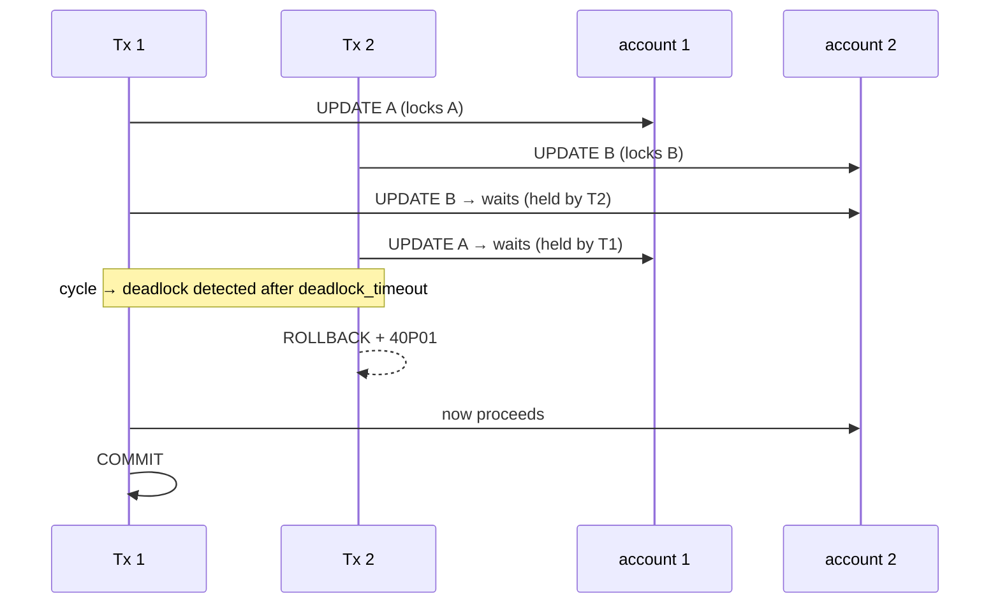

# Deadlocks and Blocking

> **One-liner**: A deadlock happens when two transactions each hold a lock the other wants — Postgres detects it and aborts one with `40P01`; blocking is the same idea but only one direction.

---

## Quick Reference

| Symptom | What's happening |
|---------|------------------|
| Query hangs for seconds | **blocking** — another tx holds a needed lock |
| Query errors with `40P01` | **deadlock** — Postgres broke a cycle |
| Query errors with `40001` | **serialization failure** under SERIALIZABLE — retry |
| `pg_stat_activity` shows `wait_event_type = 'Lock'` | waiting on row/table lock |
| Long `idle in transaction` | tx holding locks while doing nothing — find and kill |

| Tool | Use |
|------|-----|
| `pg_blocking_pids(pid)` | array of pids blocking a given pid |
| `pg_locks` × `pg_stat_activity` | who-blocks-whom map |
| `deadlock_timeout` (default 1s) | how long to wait before deadlock detection runs |
| `log_lock_waits = on` | log waits longer than `deadlock_timeout` |
| `pg_terminate_backend(pid)` | kill (last resort) |
| `pg_cancel_backend(pid)` | cancel current statement |

---

## Core Concept

Locks coordinate writes. When two transactions each lock a row the other needs, neither can proceed — a **deadlock**. Postgres detects it (after `deadlock_timeout`, default 1 second), picks a victim, rolls it back, and returns SQLSTATE `40P01` to the app.

**Blocking** is the simpler case: one tx waits because another holds the lock. There's no cycle, so no error — just a wait. Long blocking is usually worse than deadlocks (the app stalls instead of failing fast).

Three causes cover most incidents:

1. **Inconsistent lock order** — transactions update the same rows in different orders. Always lock by primary key, ascending.
2. **Long-running transactions** — anything that holds locks while waiting on humans, network, or sleep is a problem.
3. **Implicit locks from FK enforcement** — inserting/updating in the child table takes a `KEY SHARE` lock on the parent row. Concurrent updates to that parent's PK can deadlock.

The fix is almost always: shorten transactions, lock in consistent order, retry on `40P01` / `40001` with backoff.

---

## Diagram



---

## Syntax & API

### Reproduce a deadlock
```sql
-- Session 1
BEGIN;
UPDATE accounts SET balance = balance - 1 WHERE id = 1;
-- pause...
UPDATE accounts SET balance = balance + 1 WHERE id = 2;

-- Session 2 (concurrently)
BEGIN;
UPDATE accounts SET balance = balance - 1 WHERE id = 2;
-- pause...
UPDATE accounts SET balance = balance + 1 WHERE id = 1;
-- One session gets:
--   ERROR: deadlock detected
--   DETAIL: Process 12345 waits for ShareLock on transaction 678; blocked by process 67890.
--   ...
--   SQLSTATE: 40P01
```

### Diagnose blocking — who's blocking whom?
```sql
SELECT
    blocked.pid                      AS blocked_pid,
    blocked.usename                  AS blocked_user,
    blocked.wait_event_type,
    blocked.wait_event,
    age(now(), blocked.query_start)  AS waiting_for,
    LEFT(blocked.query, 80)          AS blocked_query,
    blocking.pid                     AS blocking_pid,
    blocking.usename                 AS blocking_user,
    blocking.state                   AS blocking_state,
    LEFT(blocking.query, 80)         AS blocking_query
FROM pg_stat_activity blocked
JOIN pg_stat_activity blocking ON blocking.pid = ANY(pg_blocking_pids(blocked.pid))
WHERE blocked.wait_event_type = 'Lock'
ORDER BY waiting_for DESC;
```

### Lock objects (low-level)
```sql
SELECT l.locktype, l.relation::regclass AS rel, l.mode, l.granted,
       a.pid, a.state, a.query
FROM pg_locks l
JOIN pg_stat_activity a USING (pid)
WHERE NOT l.granted OR l.mode IN ('ExclusiveLock','AccessExclusiveLock')
ORDER BY l.relation, l.granted;
```

### Cancel / kill
```sql
SELECT pg_cancel_backend(<pid>);       -- polite: cancels current statement
SELECT pg_terminate_backend(<pid>);    -- nuclear: kills the connection

-- Kill all idle-in-transaction holders > 5 minutes
SELECT pg_terminate_backend(pid)
FROM pg_stat_activity
WHERE state = 'idle in transaction'
  AND xact_start < now() - INTERVAL '5 minutes';
```

### Auto-cancel waiting writes
```sql
SET lock_timeout = '5s';        -- per-session: don't wait longer than 5s for a lock
SET statement_timeout = '30s';
SET idle_in_transaction_session_timeout = '60s';
```

### Log lock waits server-wide
```ini
# postgresql.conf
log_lock_waits     = on
deadlock_timeout   = '1s'         -- default; lower → earlier detection, more CPU
log_min_duration_statement = '500ms'
```

### Retry pattern (.NET)
```csharp
const int MaxAttempts = 3;
for (int attempt = 1; attempt <= MaxAttempts; attempt++)
{
    try
    {
        await using var tx = await conn.BeginTransactionAsync();
        // work...
        await tx.CommitAsync();
        return;
    }
    catch (PostgresException ex) when (ex.SqlState is "40P01" or "40001" && attempt < MaxAttempts)
    {
        await Task.Delay(Random.Shared.Next(20, 100) * attempt); // jitter
    }
}
throw new MaxRetriesExceededException();
```

### Lock in consistent order
```sql
-- WRONG: order varies → deadlock prone
BEGIN;
SELECT * FROM accounts WHERE id = $a FOR UPDATE;
SELECT * FROM accounts WHERE id = $b FOR UPDATE;

-- RIGHT: always ascending PK
BEGIN;
SELECT * FROM accounts WHERE id IN ($a, $b)
    ORDER BY id FOR UPDATE;
```

### Avoid blocking: SKIP LOCKED for queues
```sql
WITH next AS (
    SELECT id FROM jobs
    WHERE status = 'pending'
    ORDER BY created_at
    LIMIT 1
    FOR UPDATE SKIP LOCKED
)
UPDATE jobs SET status = 'running' WHERE id IN (SELECT id FROM next)
RETURNING *;
-- Workers don't block each other; one row each
```

---

## Common Patterns

```text
Pattern: short transactions with retry
- Open conn → BEGIN → all work → COMMIT
- No external I/O, no waiting on users
- Wrap with retry on 40P01/40001 + jitter
```

```text
Pattern: advisory locks for cross-session coordination
- pg_advisory_xact_lock(123) — a tx-scoped lock by integer ID
- Useful when row-level isn't enough (e.g., "only one job runs at a time")
- Released automatically on tx end
```

```sql
-- Pattern: detect long blockers in a monitoring query
SELECT count(*) FILTER (WHERE wait_event_type = 'Lock') AS waiting,
       max(now() - query_start) FILTER (WHERE wait_event_type = 'Lock') AS longest_wait
FROM pg_stat_activity;
-- Alert when waiting > N or longest_wait > T
```

---

## Gotchas & Tips

- **Always lock in PK order** — alphabetical, numerical, doesn't matter — just consistent across all code paths.
- **FK lookups take low-level locks** — inserting `orders(user_id)` while another tx updates `users.id` can cycle. Use `ON UPDATE NO ACTION` and avoid changing PKs.
- **`SELECT FOR UPDATE` is the right tool when you'll write** — but use `FOR NO KEY UPDATE` if you won't change keys (less restrictive).
- **`ALTER TABLE` takes ACCESS EXCLUSIVE** — even brief, blocks readers. Set `lock_timeout` to fail fast and retry.
- **`idle in transaction` is the silent killer** — kill long ones; set `idle_in_transaction_session_timeout`.
- **Deadlock errors are normal** at concurrency — log and retry; alert only if rate is unusual.
- **Don't widen lock scope by accident** — `UPDATE` without an indexed predicate may scan and lock more rows. EXPLAIN to see.
- **Postgres lock graph is at the row level for `UPDATE`/`DELETE`** — table-level locks come from DDL, not normal DML.
- **`hot_standby_feedback = on`** prevents queries on a replica from being canceled by primary's vacuum, at the cost of bloat on primary. Tradeoff.
- **PostgreSQL doesn't support `NOWAIT` on locks held by self** — it just proceeds. Cross-tx is the relevant case.
- **Use `pg_blocking_pids()`** instead of joining `pg_locks` manually; it's the supported way to discover blockers.

---

## See Also

- [[04 - Locking and Concurrency]]
- [[03 - Isolation Levels]]
- [[09 - Performance Tuning]]
- [[02 - Transactions and ACID]]
