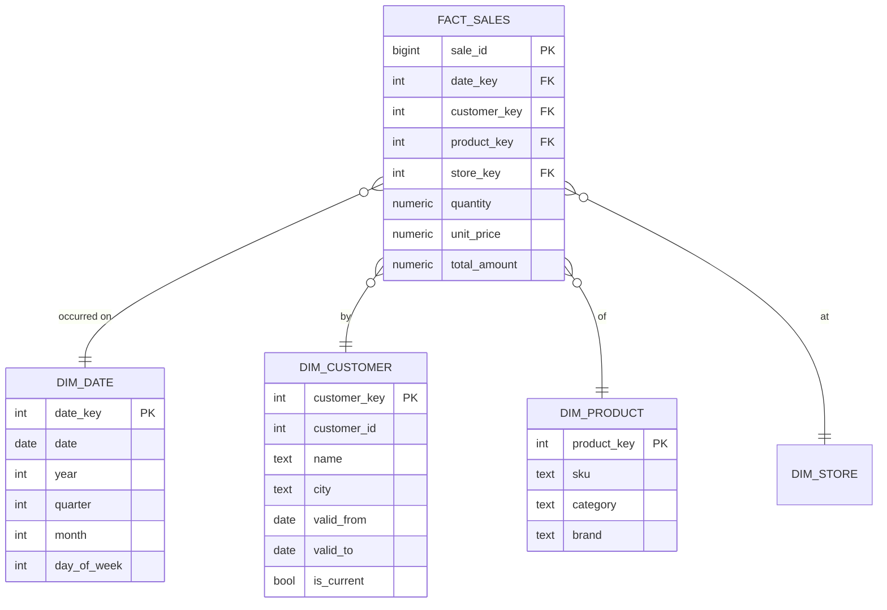

# Data Warehousing

> **One-liner**: A warehouse separates analytical reads (OLAP) from transactional writes (OLTP), models data as facts + dimensions, and accepts redundancy in exchange for fast aggregations.

---

## Quick Reference

| Concept | Meaning |
|---------|---------|
| **OLTP** | Online Transaction Processing — many small writes, normalized |
| **OLAP** | Online Analytical Processing — large reads, aggregations |
| **Fact table** | measurements/events; many rows; numeric measures + FKs to dimensions |
| **Dimension** | descriptive context: customer, product, date, geography |
| **Star schema** | one fact joined to dimensions directly; denormalized dimensions |
| **Snowflake schema** | star + further-normalized dimensions (extra joins) |
| **Grain** | what one row in a fact represents ("one order item per day") |
| **SCD** (Slowly Changing Dimensions) | how to track dimension history (Type 1, 2, 3, …) |
| **Conformed dimension** | a dimension shared across facts (one `dim_date` reused everywhere) |
| **ETL / ELT** | Extract-Transform-Load vs Extract-Load-Transform |

| Engine | Use |
|--------|-----|
| **Postgres** | small/mid warehouses; great as a starter |
| **Postgres + cstore_fdw / hydra** | columnar storage extension |
| **ClickHouse** | extremely fast columnar OLAP |
| **Snowflake / BigQuery / Redshift** | cloud-native, separated storage/compute |
| **Apache Druid / Pinot** | sub-second analytics on streaming |

---

## Core Concept

A transactional schema is normalized for **integrity**: lots of small tables, joins everywhere, every change tracked. Great for "place an order" — terrible for "show me revenue by product category by month for the last 5 years across 8 regions" (dozens of joins, billions of rows scanned).

A warehouse instead optimizes for **scans + aggregates**:

- **Wider, denormalized tables** (one big fact, fat dimensions)
- **Columnar storage** when possible (read only the columns you aggregate)
- **Pre-aggregated rollups** for common questions (`daily_revenue`)
- **Append-only** data flow (no UPDATE in place; use SCD Type 2)

The **star schema** is the standard model:

- One **fact** table = one event/measurement per row, FK columns to each relevant dimension, and numeric measures
- Several **dimension** tables = descriptive attributes you'll filter or group by
- Joins are simple (every join is fact ↔ dimension)
- Dimensions are denormalized (snowflake schemas re-normalize them; usually not worth the joins)

**SCD Type 2** is how you keep dimension history (e.g., a customer changes city). Each version becomes a new row with `valid_from` / `valid_to` and a surrogate key. Facts join to the version that was current at the fact's timestamp.

For most apps, start with Postgres OLTP + a `daily_*` materialized view layer. Move to a dedicated warehouse only when scan-time on the OLTP DB hurts.

---

## Diagram



---

## Syntax & API

### Star schema build (Postgres)
```sql
-- Date dimension (typical)
CREATE TABLE dim_date (
    date_key       INT PRIMARY KEY,         -- YYYYMMDD
    date           DATE NOT NULL UNIQUE,
    year           INT NOT NULL,
    quarter        INT NOT NULL,
    month          INT NOT NULL,
    month_name     TEXT NOT NULL,
    day            INT NOT NULL,
    day_of_week    INT NOT NULL,
    is_weekend     BOOLEAN NOT NULL,
    is_holiday     BOOLEAN NOT NULL DEFAULT false
);

-- Populate 10 years
INSERT INTO dim_date
SELECT
    TO_CHAR(d, 'YYYYMMDD')::INT AS date_key,
    d::DATE                     AS date,
    EXTRACT(YEAR FROM d)::INT,
    EXTRACT(QUARTER FROM d)::INT,
    EXTRACT(MONTH FROM d)::INT,
    TO_CHAR(d, 'Month'),
    EXTRACT(DAY FROM d)::INT,
    EXTRACT(DOW FROM d)::INT,
    EXTRACT(DOW FROM d) IN (0, 6),
    false
FROM generate_series('2020-01-01'::DATE, '2030-12-31'::DATE, '1 day') AS d;
```

```sql
-- SCD Type 2 customer dimension
CREATE TABLE dim_customer (
    customer_key   BIGINT GENERATED ALWAYS AS IDENTITY PRIMARY KEY,
    customer_id    INT  NOT NULL,            -- natural / source key
    name           TEXT NOT NULL,
    email          TEXT NOT NULL,
    city           TEXT,
    country        TEXT,
    valid_from     DATE NOT NULL,
    valid_to       DATE,                     -- NULL = current
    is_current     BOOLEAN NOT NULL DEFAULT true
);
CREATE INDEX idx_dim_customer_natural ON dim_customer (customer_id, is_current);
```

```sql
-- Fact table — one row per sale line
CREATE TABLE fact_sales (
    sale_id        BIGINT GENERATED ALWAYS AS IDENTITY,
    date_key       INT     NOT NULL REFERENCES dim_date(date_key),
    customer_key   BIGINT  NOT NULL REFERENCES dim_customer(customer_key),
    product_key    BIGINT  NOT NULL REFERENCES dim_product(product_key),
    store_key      BIGINT  NOT NULL REFERENCES dim_store(store_key),
    quantity       INT     NOT NULL,
    unit_price     NUMERIC(10,2) NOT NULL,
    total_amount   NUMERIC(12,2) NOT NULL,
    PRIMARY KEY (sale_id, date_key)             -- date_key for partitioning
) PARTITION BY RANGE (date_key);

-- Indexes for filtering
CREATE INDEX ON fact_sales (date_key);
CREATE INDEX ON fact_sales (customer_key);
CREATE INDEX ON fact_sales (product_key);
```

### Typical OLAP query
```sql
-- Revenue by category by quarter for current customers
SELECT
    d.year, d.quarter,
    p.category,
    SUM(f.total_amount) AS revenue,
    COUNT(*)            AS line_count
FROM fact_sales f
JOIN dim_date     d ON d.date_key = f.date_key
JOIN dim_product  p ON p.product_key = f.product_key
JOIN dim_customer c ON c.customer_key = f.customer_key
WHERE d.year IN (2025, 2026)
  AND c.is_current
GROUP BY d.year, d.quarter, p.category
ORDER BY d.year, d.quarter, revenue DESC;
```

### SCD Type 2 update (close old, open new)
```sql
BEGIN;
-- Close current version
UPDATE dim_customer
SET valid_to = CURRENT_DATE - 1, is_current = false
WHERE customer_id = 42 AND is_current;

-- Insert new current version
INSERT INTO dim_customer (customer_id, name, email, city, country, valid_from, is_current)
VALUES (42, 'Alice', 'alice@new.com', 'Boston', 'US', CURRENT_DATE, true);
COMMIT;
```

### Materialized rollups
```sql
CREATE MATERIALIZED VIEW mv_daily_revenue AS
SELECT
    d.date,
    SUM(f.total_amount) AS revenue,
    COUNT(*)            AS line_count
FROM fact_sales f
JOIN dim_date d ON d.date_key = f.date_key
GROUP BY d.date;

CREATE UNIQUE INDEX ON mv_daily_revenue (date);

-- Refresh nightly
REFRESH MATERIALIZED VIEW CONCURRENTLY mv_daily_revenue;
```

### Columnar storage in Postgres (optional)
```sql
CREATE EXTENSION IF NOT EXISTS citus;       -- columnar comes bundled
CREATE TABLE fact_sales_columnar (LIKE fact_sales INCLUDING DEFAULTS)
    USING columnar;
-- Or use Hydra: https://hydra.so for batteries-included columnar
```

---

## Common Patterns

```text
Pattern: separate OLTP and OLAP early
- OLTP DB → CDC → warehouse (Snowflake / BigQuery / ClickHouse / TimescaleDB)
- ETL/ELT runs hourly or near-real-time
- See [[13 - ETL and CDC]]
```

```text
Pattern: hot vs cold aggregates
- "Last 24h" served from streaming aggregates (sub-second)
- "Past N years" served from precomputed materialized rollups
- Both layered behind one query API
```

```text
Pattern: conformed dimensions across facts
- One dim_customer used by fact_sales, fact_returns, fact_support
- Same surrogate keys = consistent grouping across reports
```

```text
Pattern: kimball vs data vault vs one big table (OBT)
- Kimball star schema → balance of structure + speed
- Data Vault → highly auditable, raw history, more joins
- OBT (denormalized) → simplest analytics, fastest scans, hardest evolution
- Pick based on team and access patterns
```

---

## Gotchas & Tips

- **Choose grain carefully** — "one fact row = one order line, daily" vs "one order, monthly" changes everything downstream. Document it.
- **Conformed `dim_date` is non-negotiable** — every fact joins to it; use surrogate keys (YYYYMMDD), not raw dates.
- **Surrogate keys for SCD2** — natural keys aren't unique once history is tracked.
- **Don't UPDATE facts** — facts are append-only. Corrections are reversal entries (negative facts).
- **Beware "factless facts"** — sometimes there's no measure (just events). They're fine; just count rows.
- **Dimensional integrity at load time** — never let a fact reference a non-existent dim row. Use surrogate-key lookup at ETL time.
- **Columnar stores are massive wins for OLAP** — skip B-tree intuition; columns are compressed and scanned independently.
- **Partition by date** — almost every query filters by time. Postgres native + monthly partitions are perfect.
- **One Big Table (OBT)** is great when you have one BI tool and analysts; bad when many teams remix data.
- **Don't run heavy analytics on the OLTP DB** — locks, plan-cache pollution, page-cache eviction. Replicate or CDC out.
- **Use Postgres until it hurts** — at 10s of millions of facts, plain Postgres with materialized views handles most reporting.
- **Modern stack: dbt** runs your transformations, owns lineage, tests data quality. Pair with any warehouse.

---

## See Also

- [[01 - Sharding and Partitioning]]
- [[07 - Views]]
- [[13 - ETL and CDC]]
- [[14 - Time-Series Databases]]
