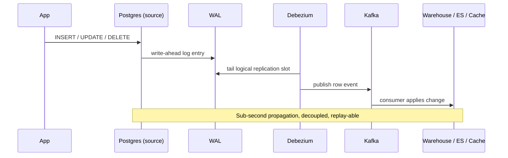

# ETL and CDC

> **One-liner**: ETL/ELT moves data between systems on a schedule; CDC streams every row change in near-real-time using the source DB's transaction log.

---

## Quick Reference

| Approach | Mechanism | Latency | Best for |
|----------|-----------|---------|----------|
| **Batch ETL** | scheduled queries → transform → load | minutes–hours | nightly reports, simple pipelines |
| **Batch ELT** | extract + load raw, transform in warehouse | minutes–hours | modern data stack (Fivetran + dbt) |
| **CDC streaming** | tail source's WAL/binlog, emit row events | seconds | event-driven systems, near-real-time analytics |
| **Triggers** | source-side row capture into a queue table | seconds | DIY when CDC isn't available; impacts source perf |

| Postgres-specific | |
|-------------------|---|
| **Logical decoding** | built-in WAL → row events stream |
| `pgoutput` | the standard logical decoding plugin (used by Debezium, native logical replication) |
| `wal2json` | older plugin emitting JSON events |
| **Replication slot** | persistent cursor; ensures CDC doesn't miss events |
| **Publication** | declares which tables to publish |

| Tool ecosystem | Use |
|----------------|-----|
| **Debezium** | open-source CDC into Kafka |
| **Fivetran / Airbyte** | managed connectors, ELT-style |
| **dbt** | SQL-based transformation in warehouse |
| **Apache NiFi / Airflow / Dagster** | workflow orchestration |
| **Striim, Decodable, Estuary** | managed streaming CDC |

---

## Core Concept

**ETL** (Extract, Transform, Load) classically queried a source DB, transformed in a tool (Informatica, SSIS), and loaded into a warehouse on a nightly schedule. Heavy, brittle, slow.

**ELT** flips the order: extract + load raw data into the warehouse, then transform inside the warehouse with SQL (dbt, Dataform). Modern warehouses are fast enough that this is cheaper and more flexible.

**CDC** (Change Data Capture) reads the source's transaction log and emits a stream of row-level events: `(table, op, before, after, timestamp)`. Consumers replay these into other systems with millisecond–second latency. Far less load on the source than polling.

Postgres has **logical decoding** built in: `wal_level = logical`, create a `PUBLICATION`, point Debezium (or native logical replication) at it. Each insert/update/delete becomes a stream event.

CDC unlocks several patterns:
- Microservice integration ([[05 - Distributed Transactions]] outbox + Debezium)
- Real-time analytics (warehouse stays current within seconds)
- Cache invalidation (downstream caches react to writes)
- Search index sync (Postgres → Elasticsearch)
- Audit trail without triggers ([[07 - Temporal and Audit Tables]])

---

## Diagram



---

## Syntax & API

### Enable logical decoding (postgresql.conf)
```ini
wal_level             = logical
max_replication_slots = 10
max_wal_senders       = 10
```

### Native logical replication (Postgres → Postgres)
```sql
-- On source
CREATE PUBLICATION shop_pub FOR TABLE users, orders, order_items;

-- On target (matching schema must already exist)
CREATE SUBSCRIPTION shop_sub
    CONNECTION 'host=source-db dbname=shop user=replicator password=…'
    PUBLICATION shop_pub
    WITH (copy_data = true);

-- Inspect
SELECT * FROM pg_publication;
SELECT * FROM pg_subscription;
SELECT * FROM pg_replication_slots;     -- on source
```

### Debezium → Kafka pipeline (sketch)
```yaml
# Debezium connector config
{
  "name": "shop-postgres",
  "config": {
    "connector.class": "io.debezium.connector.postgresql.PostgresConnector",
    "database.hostname": "postgres",
    "database.port": "5432",
    "database.user": "debezium",
    "database.password": "secret",
    "database.dbname": "shop",
    "database.server.name": "shop",
    "table.include.list": "public.orders,public.users",
    "plugin.name": "pgoutput",
    "publication.name": "shop_pub",
    "slot.name": "debezium_slot"
  }
}
```

```javascript
// Sample emitted event (Kafka message value)
{
  "op": "u",                        // c=create, u=update, d=delete, r=read (snapshot)
  "ts_ms": 1714400000000,
  "before": { "id": 1, "name": "Alice" },
  "after":  { "id": 1, "name": "Alice 2.0" },
  "source": { "table": "users", "lsn": "0/1A2B3C4D" }
}
```

### Outbox-driven CDC (recommended for service integration)
See [[05 - Distributed Transactions]]. Application writes events to an outbox table inside the same transaction; Debezium captures only that table; downstream consumers see semantic events ("OrderPlaced") instead of raw row diffs.

### Polling-based ELT (no CDC)
```sql
-- Simple watermarked copy: take rows updated since last run
CREATE TABLE etl_watermark (
    table_name TEXT PRIMARY KEY,
    last_seen_at TIMESTAMPTZ NOT NULL
);

-- In ETL job:
\set last (SELECT last_seen_at FROM etl_watermark WHERE table_name = 'orders');

\copy (
    SELECT * FROM orders WHERE updated_at > :last
) TO '/staging/orders.csv' CSV HEADER;

-- Load into warehouse
\copy warehouse.orders_staging FROM '/staging/orders.csv' CSV HEADER;
INSERT INTO warehouse.orders SELECT * FROM warehouse.orders_staging
ON CONFLICT (id) DO UPDATE SET ...;

UPDATE etl_watermark SET last_seen_at = now() WHERE table_name = 'orders';
```

### Trigger-based capture (last resort)
```sql
CREATE TABLE cdc_queue (
    id        BIGINT GENERATED ALWAYS AS IDENTITY PRIMARY KEY,
    table_name TEXT NOT NULL,
    op        TEXT NOT NULL,
    payload   JSONB NOT NULL,
    enqueued_at TIMESTAMPTZ NOT NULL DEFAULT now()
);

CREATE OR REPLACE FUNCTION enqueue_change()
RETURNS TRIGGER LANGUAGE plpgsql AS $$
BEGIN
    INSERT INTO cdc_queue (table_name, op, payload)
    VALUES (TG_TABLE_NAME, TG_OP,
            jsonb_build_object('before', to_jsonb(OLD), 'after', to_jsonb(NEW)));
    RETURN NULL;
END $$;

CREATE TRIGGER trg_orders_cdc
AFTER INSERT OR UPDATE OR DELETE ON orders
FOR EACH ROW EXECUTE FUNCTION enqueue_change();

-- Worker drains the queue
SELECT * FROM cdc_queue ORDER BY id LIMIT 1000;
DELETE FROM cdc_queue WHERE id <= last_id_processed;
```

### dbt — SQL transformations in the warehouse
```sql
-- models/marts/daily_revenue.sql
{{ config(materialized='table') }}

SELECT
    DATE_TRUNC('day', placed_at)::DATE AS day,
    COUNT(*)                           AS orders,
    SUM(total)                         AS revenue
FROM {{ ref('stg_orders') }}
GROUP BY 1
ORDER BY 1
```

```bash
dbt run        # build all models
dbt test       # run tests (unique, not_null, custom)
dbt docs serve # auto-generated lineage + docs
```

---

## Common Patterns

```text
Pattern: source DB → CDC → Kafka → many sinks
- Decouples producers from consumers
- Each sink (warehouse, cache, search, audit) consumes the same event stream
- Schema registry (Avro / Protobuf) keeps formats consistent
```

```text
Pattern: snapshot + incremental
- First load: full snapshot of source tables (Debezium does this automatically)
- Subsequent: stream only WAL events
- Failure recovery: replay from a known LSN
```

```text
Pattern: bronze / silver / gold layers (medallion)
- Bronze = raw landing (CDC events as-is)
- Silver = cleaned, conformed
- Gold   = business-ready (denormalized, aggregated)
- Each layer is its own dbt model directory
```

```text
Pattern: idempotent merge in the sink
INSERT ... ON CONFLICT (id) DO UPDATE SET ...
WHERE excluded.updated_at > target.updated_at;
```

---

## Gotchas & Tips

- **Replication slots leak WAL** — if a CDC consumer goes away, Postgres keeps WAL forever waiting. Monitor `pg_replication_slots.wal_status` and disk.
- **Heartbeat your slots** — for low-write tables, the LSN won't advance without traffic. Configure a heartbeat that emits dummy events (Debezium does this).
- **CDC misses TRUNCATE / DDL by default** — only DML. Schema changes need separate handling.
- **Schema changes break consumers** — register schemas centrally; let consumers adapt.
- **Large transactions cause CDC spikes** — a single big batch propagates as one giant change. Avoid huge updates if downstream is sensitive.
- **Outbox events > raw row events for service integration** — semantic ("OrderPlaced") vs syntactic ("orders updated"). Less downstream coupling.
- **Triggers add latency to source writes** — every INSERT pays the trigger cost. CDC via WAL doesn't.
- **Watermark-based polling is simple but brittle** — clocks, missed updates, deletes-without-tombstone. CDC handles all this.
- **Test catch-up time** — after a sink outage, can the pipeline catch up before the slot fills the disk?
- **Order matters per-partition** — Kafka partitions guarantee per-key order, not global. Don't assume cross-key ordering.
- **Compaction in the warehouse** — keep raw history in bronze; deduplicate/upsert in silver/gold.

---

## See Also

- [[02 - Replication]]
- [[05 - Distributed Transactions]]
- [[12 - Data Warehousing]]
- [[06 - CQRS and Event Sourcing]]
