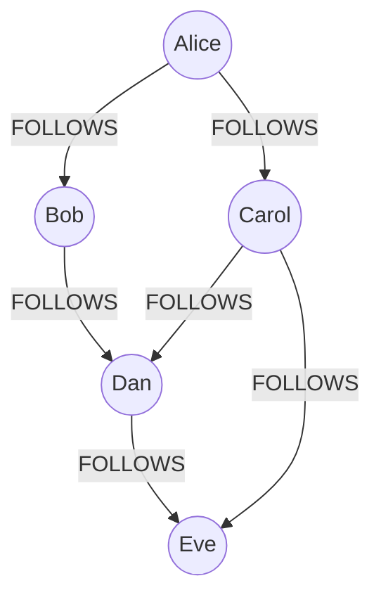

# Graph Databases

> **One-liner**: When relationships are the data — friends-of-friends, fraud rings, recommendation paths — a graph DB traverses them in milliseconds where SQL needs many joins.

---

## Quick Reference

| Engine | Query language |
|--------|----------------|
| **Neo4j** | Cypher (the de-facto standard) |
| **JanusGraph / DSE Graph** | Apache TinkerPop / Gremlin |
| **AWS Neptune** | both Gremlin and SPARQL |
| **ArangoDB** | AQL (multi-model: doc + graph) |
| **Apache AGE** | extension that brings Cypher to Postgres |

| Concept | Meaning |
|---------|---------|
| **Node** | entity (person, account, page) — has labels and properties |
| **Relationship / edge** | typed, directed link with properties |
| **Property** | key-value on node or edge |
| **Label** | tag for grouping nodes (`User`, `Product`) |
| **Path** | sequence of nodes connected by edges |
| **Traversal** | walking the graph from a starting node |

---

## Core Concept

A relational DB models entities; relationships are foreign keys, joined on demand. Each step in a traversal is a join, and joins on big tables get expensive fast — "Alice's friends' friends' friends" is 3+ joins.

A **graph DB** indexes the relationships themselves. Each node holds direct pointers to its neighbors. Traversing 5 hops costs ~5 lookups, not 5 joins. The query language reflects the model — patterns like `(a)-[:FOLLOWS]->(b)-[:FOLLOWS]->(c)` describe the shape.

When graphs win:
- **Recommendation engines** ("users who liked X also liked Y")
- **Fraud detection** (find connected components, suspicious cycles)
- **Knowledge graphs** (Wikidata, ontologies, structured search)
- **Network analysis** (social, IT topology, supply chain)
- **Path finding** (shortest path, all paths under a constraint)

When graphs *don't* win:
- Tabular reporting (use SQL)
- Simple lookups by key (use KV)
- Small datasets where joins are cheap (use SQL)

A common pattern: Postgres as the system of record, with a subset (the "social graph") mirrored to Neo4j via CDC for traversal queries.

---

## Diagram



A traversal `(Alice)-[:FOLLOWS*1..3]->(target)` finds Bob, Carol, Dan, Eve.

---

## Syntax & API

### Cypher (Neo4j) — basics

#### Create
```cypher
CREATE (alice:User {id: 1, name: 'Alice'})
CREATE (bob:User   {id: 2, name: 'Bob'})
CREATE (carol:User {id: 3, name: 'Carol'})
CREATE (alice)-[:FOLLOWS {since: date()}]->(bob)
CREATE (alice)-[:FOLLOWS]->(carol)
CREATE (bob)-[:FOLLOWS]->(carol);
```

#### Read
```cypher
// All users Alice follows
MATCH (a:User {name: 'Alice'})-[:FOLLOWS]->(target)
RETURN target.name;

// Friends-of-friends Alice doesn't already follow
MATCH (a:User {name: 'Alice'})-[:FOLLOWS]->()-[:FOLLOWS]->(fof)
WHERE NOT (a)-[:FOLLOWS]->(fof) AND fof <> a
RETURN DISTINCT fof.name;

// Shortest path 1–6 hops
MATCH p = shortestPath(
    (a:User {name: 'Alice'})-[:FOLLOWS*1..6]->(b:User {name: 'Eve'})
)
RETURN [n IN nodes(p) | n.name] AS path, length(p);
```

#### Variable-length traversal with filter
```cypher
MATCH (a:User {name: 'Alice'})-[:FOLLOWS*1..3]->(target:User)
WHERE target.created_at > date('2026-01-01')
RETURN DISTINCT target.name, target.created_at
ORDER BY target.created_at DESC LIMIT 20;
```

#### Update / merge (upsert)
```cypher
MERGE (a:User {id: 1})
ON CREATE SET a.name = 'Alice', a.created_at = datetime()
ON MATCH  SET a.last_seen = datetime();

MERGE (a:User {id: 1})-[r:FOLLOWS]->(b:User {id: 2})
ON CREATE SET r.since = date();
```

#### Delete
```cypher
// Delete a relationship
MATCH (:User {id: 1})-[r:FOLLOWS]->(:User {id: 2}) DELETE r;

// Delete a node and its relationships
MATCH (u:User {id: 1}) DETACH DELETE u;
```

#### Aggregation
```cypher
MATCH (u:User)-[:FOLLOWS]->(target)
RETURN u.name AS follower, count(target) AS following_count
ORDER BY following_count DESC LIMIT 10;
```

#### Indexing
```cypher
CREATE INDEX user_id_idx FOR (u:User) ON (u.id);
CREATE CONSTRAINT user_unique FOR (u:User) REQUIRE u.id IS UNIQUE;
CREATE FULLTEXT INDEX user_search FOR (u:User) ON EACH [u.name, u.email];
```

### Gremlin (TinkerPop)
```groovy
// Add nodes
g.addV('User').property('id', 1).property('name', 'Alice').next()
g.addV('User').property('id', 2).property('name', 'Bob').next()

// Add edge
g.V().has('User','id',1).addE('FOLLOWS').to(g.V().has('User','id',2)).next()

// Friends-of-friends
g.V().has('User','name','Alice')
    .out('FOLLOWS').out('FOLLOWS').dedup()
    .has('name', neq('Alice'))
    .values('name')
```

### Apache AGE (Cypher in Postgres)
```sql
CREATE EXTENSION age;
SELECT * FROM ag_catalog.create_graph('shop');

SELECT * FROM cypher('shop', $$
    MATCH (u:User)-[:FOLLOWS]->(target)
    RETURN u.name, target.name
$$) AS (follower agtype, following agtype);
```

### .NET driver (Neo4j)
```csharp
var driver = GraphDatabase.Driver("bolt://localhost:7687",
    AuthTokens.Basic("neo4j", "password"));

await using var session = driver.AsyncSession();
var result = await session.ExecuteReadAsync(async tx =>
{
    var cursor = await tx.RunAsync(@"
        MATCH (a:User {id: $id})-[:FOLLOWS*1..2]->(t:User)
        RETURN DISTINCT t.name AS name", new { id });
    return await cursor.ToListAsync(r => r["name"].As<string>());
});
```

---

## Common Patterns

```cypher
// Pattern: detect cycles (fraud rings)
MATCH (a:Account)-[:TRANSFER*3..6]->(a)
RETURN a, length(p);
```

```cypher
// Pattern: collaborative filtering recommendation
MATCH (me:User {id: $id})-[:LIKED]->(item:Product)<-[:LIKED]-(other:User)
MATCH (other)-[:LIKED]->(rec:Product)
WHERE NOT (me)-[:LIKED]->(rec)
RETURN rec.name, count(*) AS score
ORDER BY score DESC LIMIT 10;
```

```cypher
// Pattern: PageRank-style centrality (with GDS library)
CALL gds.pageRank.stream({
    nodeProjection: 'User',
    relationshipProjection: 'FOLLOWS'
})
YIELD nodeId, score
RETURN gds.util.asNode(nodeId).name AS user, score
ORDER BY score DESC LIMIT 20;
```

```text
Pattern: Postgres + Neo4j hybrid
- Postgres = source of truth (users, orders, products)
- CDC propagates relationship-relevant changes (follow, like) to Neo4j
- Neo4j answers traversal queries; Postgres serves CRUD
```

---

## Gotchas & Tips

- **Don't use a graph DB for all your data** — only the relationship-heavy slice. Mirror the rest from your relational system.
- **Direction matters** — `(a)-[:FOLLOWS]->(b)` is different from `(b)-[:FOLLOWS]->(a)`. Be explicit; querying both directions costs more.
- **Variable-length paths can explode** — `*1..6` over a dense graph traverses millions of paths. Use `LIMIT`, filter aggressively, or use `shortestPath`.
- **Index lookup nodes** — `MATCH (u:User {name: 'Alice'})` without an index does a full scan. Index `(:User).id` and any frequent lookup property.
- **`MERGE` is upsert but careful with the pattern shape** — `MERGE (a)-[r:FOLLOWS]->(b)` only matches if the whole pattern exists; if `r` is missing, it creates the relationship even if `a`, `b` exist.
- **Properties are denormalized** — same as a document store. There's no FK enforcement.
- **Neo4j Aura / Enterprise** for clustering / HA — community edition is single-node.
- **Backup with `neo4j-admin`** — graph dump format. Test restores like any DB.
- **Gremlin is verbose but engine-agnostic** — Cypher is more readable but Neo4j-specific.
- **Watch the Cartesian explosion warning** — Cypher will warn you if your `MATCH` produces independent patterns; usually means missing relationship.
- **Modeling tips** — relationships should encode what they mean (`:LIKED` not `:RELATES`); store on the edge what's specific to the connection (date, weight); store on the node what's specific to the entity.

---

## See Also

- [[20 - NoSQL Fundamentals]]
- [[01 - Database Overview]]
- [[16 - Search Engines]]
- [[18 - Vector Databases]]
