# Senior Database Engineer — Interview Questions & Answers

> **Scope**: 5+ years of experience with relational + at least one NoSQL system. Focus is on **trade-off analysis**, **production incidents**, **performance under load**, **distributed data**, and **operational discipline** — not SQL trivia.

Senior database interviews probe how you reason about *durability, consistency, throughput, and recovery* under real-world constraints. Most questions have no single right answer — the interviewer wants to hear constraints, alternatives, and the reasoning behind your pick.

---

## Table of Contents

1. [Schema Design & Modeling](#schema-design--modeling)
2. [Indexing & Query Optimization](#indexing--query-optimization)
3. [Transactions & Concurrency](#transactions--concurrency)
4. [Performance Tuning](#performance-tuning)
5. [Replication & High Availability](#replication--high-availability)
6. [Sharding & Distributed Data](#sharding--distributed-data)
7. [Schema Evolution & Migrations](#schema-evolution--migrations)
8. [NoSQL & Polyglot Persistence](#nosql--polyglot-persistence)
9. [Backup, Recovery, Security](#backup-recovery-security)
10. [Observability](#observability)
11. [.NET Data Access](#net-data-access)

---

## Schema Design & Modeling

### 1. Walk me through when you'd denormalize, and the trade-offs.

**Listening for:** measured pragmatism. Juniors over-normalize; bad seniors over-denormalize.

Denormalize when:

- A read endpoint is dominated by a multi-join aggregate that's hot enough to dominate CPU.
- You need point-in-time accuracy — denormalize the price *at the time of order*, never join back to the live `products.price`.
- An aggregate is expensive to recompute (running totals, monthly rollups) — materialized views or summary tables.
- You're moving toward a read model (CQRS) and the read side is allowed to diverge from the canonical write model.

Costs:

- Update anomalies — the same fact in multiple places.
- Write amplification — one logical change touches many rows.
- More complex backfills when the rule changes.

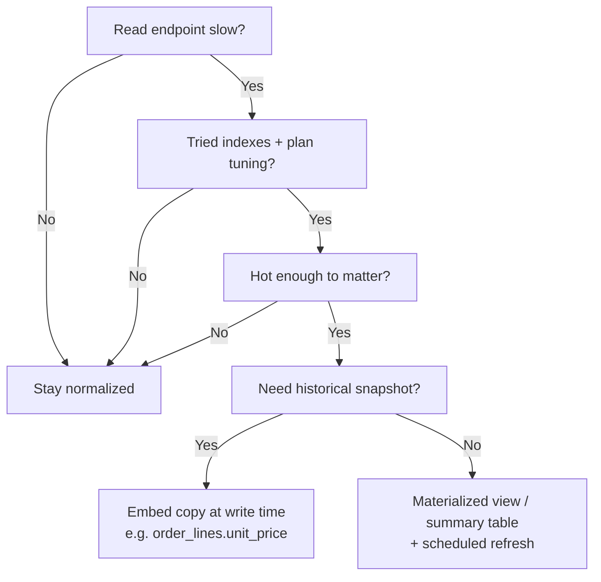
```mermaid
flowchart TD
    Q[Read endpoint slow?] -->|No| Norm[Stay normalized]
    Q -->|Yes| Idx[Tried indexes + plan tuning?]
    Idx -->|No| Norm
    Idx -->|Yes| Hot[Hot enough to matter?]
    Hot -->|No| Norm
    Hot -->|Yes| Snap[Need historical snapshot?]
    Snap -->|Yes| Embed[Embed copy at write time<br/>e.g. order_lines.unit_price]
    Snap -->|No| Mat[Materialized view / summary table<br/>+ scheduled refresh]
```

**Senior signal:** "I'd reach for **materialized views** or a **read model** before I'd embed denormalized columns in the OLTP table."

---

### 2. Surrogate vs natural keys — and why aren't UUIDs free?

**Surrogate key:** synthetic (`BIGSERIAL`, `IDENTITY`, UUID). Stable, opaque, no business meaning.
**Natural key:** business-meaningful (`isbn`, `email`, `(country, tax_id)`).

Default to **surrogate** for primary keys, with a `UNIQUE` constraint on the natural key. Natural keys change — countries split, people remarry, schemes get reissued — and changing a PK cascades through every FK.

**UUIDs are expensive when used as a clustered/PK in a B-tree:**

- 16 bytes vs 8 for `BIGINT` → fatter indexes, fewer rows per page, more I/O.
- Random UUIDs cause **page splits** on insert → fragmentation + write amplification.
- FK joins become 2× memory pressure across the hot working set.

Fixes if you must use UUIDs:

- **UUIDv7** (time-ordered) — inserts are append-mostly again.
- Or `BIGSERIAL` PK + a separate UUID for public/external IDs.

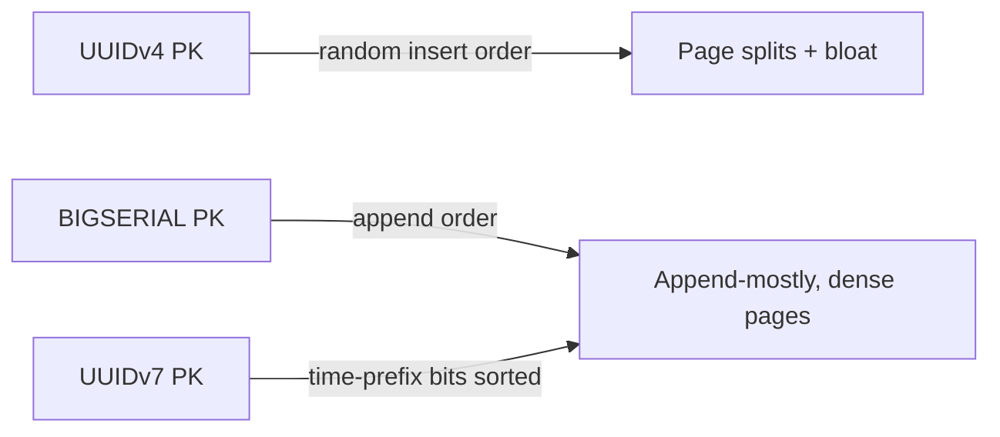
```mermaid
graph LR
    A[UUIDv4 PK] -->|random insert order| Split[Page splits + bloat]
    B[BIGSERIAL PK] -->|append order| Append[Append-mostly, dense pages]
    C[UUIDv7 PK] -->|time-prefix bits sorted| Append
```

---

### 3. Soft delete — when do you use it and what does it cost?

**Use it when:**

- Regulatory or audit needs require retaining "deleted" rows.
- Users can undo deletes.
- Foreign-key relationships make hard deletes cascade unpredictably.

**Costs:**

- *Every* query now needs `WHERE deleted_at IS NULL` — or you risk leaking deleted rows.
- Indexes balloon with tombstones; consider **partial indexes** `WHERE deleted_at IS NULL`.
- Uniqueness constraints get awkward: `UNIQUE(email)` breaks if a deleted user re-registers. Solve with `UNIQUE(email) WHERE deleted_at IS NULL` (Postgres partial unique).
- Hidden bloat — without a cleanup job, "deleted" rows live forever.

**Alternative:** an `archive_*` table populated by a trigger or a partitioned table by `deleted_at` so the cold partition can be dropped wholesale.

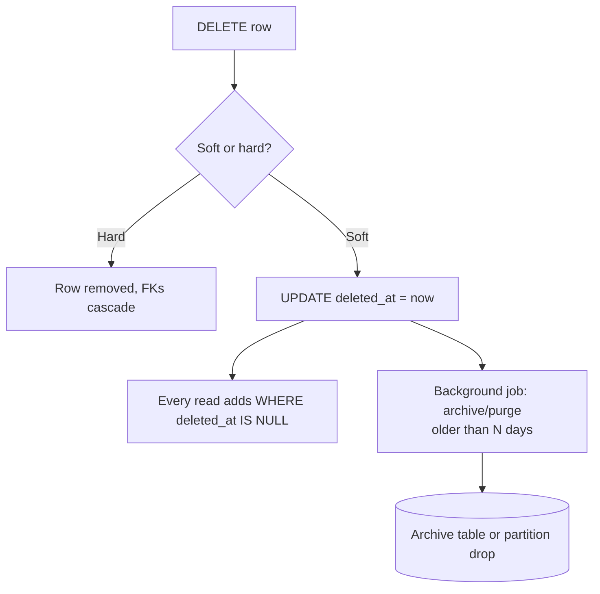
```mermaid
flowchart TD
    DelReq[DELETE row] --> Mode{Soft or hard?}
    Mode -->|Hard| Gone[Row removed, FKs cascade]
    Mode -->|Soft| SetFlag[UPDATE deleted_at = now]
    SetFlag --> Filter[Every read adds WHERE deleted_at IS NULL]
    SetFlag --> Reaper[Background job: archive/purge<br/>older than N days]
    Reaper --> Archive[(Archive table or partition drop)]
```

---

### 4. Designing for multi-tenancy: pick your tenancy model.

| Model | Isolation | Operational cost | Use when |
| ----- | --------- | ---------------- | -------- |
| **Single DB, shared schema, `tenant_id` column** | Low (logical only) | Lowest | Many small tenants, uniform schema, SaaS B2C/SMB |
| **Single DB, schema-per-tenant** | Medium | Medium (migrations × N) | Tens to hundreds of tenants needing some isolation |
| **DB-per-tenant** | High (physical) | High (backups × N, connections × N) | Few large tenants, regulatory isolation, noisy neighbors |
| **Sharded by tenant_id** | Medium | High | Many tenants + very large data per tenant |

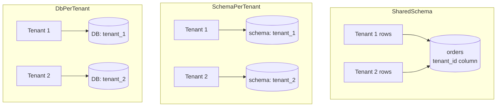
```mermaid
graph TB
    subgraph SharedSchema
      T1[Tenant 1 rows] --> Tbl[(orders<br/>tenant_id column)]
      T2[Tenant 2 rows] --> Tbl
    end
    subgraph SchemaPerTenant
      T3[Tenant 1] --> S1[(schema: tenant_1)]
      T4[Tenant 2] --> S2[(schema: tenant_2)]
    end
    subgraph DbPerTenant
      T5[Tenant 1] --> DB1[(DB: tenant_1)]
      T6[Tenant 2] --> DB2[(DB: tenant_2)]
    end
```

**Senior signal:** "Shared-schema with `tenant_id` + **row-level security** is the default. I escalate to schema-per-tenant when one customer's queries hurt the rest, or DB-per-tenant when compliance demands it."

---

### 5. Polymorphic relationships in SQL — how do you model them?

Three usable patterns, each with costs:

1. **Concrete tables per type** (`order_payments`, `subscription_payments`). Strong FKs, no nullable columns. Awkward unioning.
2. **Single table inheritance with type discriminator + nullable columns**. Simple queries, terrible referential integrity (no FK to a "parent" of two types).
3. **Exclusive arc** — one FK column per possible parent type, `CHECK` constraint that exactly one is non-null.

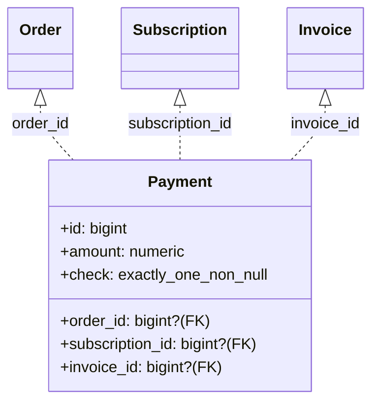
```mermaid
classDiagram
    class Payment {
      +id: bigint
      +amount: numeric
      +order_id: bigint? (FK)
      +subscription_id: bigint? (FK)
      +invoice_id: bigint? (FK)
      +check: exactly_one_non_null
    }
    class Order
    class Subscription
    class Invoice
    Order <|.. Payment : order_id
    Subscription <|.. Payment : subscription_id
    Invoice <|.. Payment : invoice_id
```

Avoid Rails-style `(parent_type text, parent_id bigint)` — Postgres can't FK to it; orphans become inevitable.

---

### 6. EAV (Entity-Attribute-Value) — when is it warranted, and when is it a trap?

**Warranted** when truly schemaless extensions are needed (per-customer custom fields, product catalogues with thousands of unique attributes per category). Even then, prefer `JSONB` with a GIN index over a classical EAV triple-table.

**Trap** when used to "avoid migrations" for normal columns. Query performance collapses (joins on the value table for every attribute), validation moves into app code, the type system disappears.

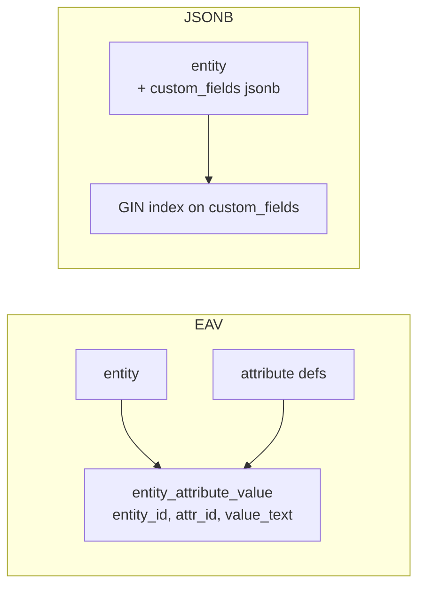
```mermaid
graph LR
    subgraph EAV
      ENT[entity] --> EAV2[entity_attribute_value<br/>entity_id, attr_id, value_text]
      ATTR[attribute defs] --> EAV2
    end
    subgraph JSONB
      ENT2[entity<br/>+ custom_fields jsonb] --> GIN[GIN index on custom_fields]
    end
```

JSONB beats EAV on query speed, indexability (`jsonb_path_ops`), and app ergonomics for >90% of cases.

---

### 7. JSONB vs separate table — what tips the decision?

| Use JSONB | Use a separate table |
| --------- | -------------------- |
| Sparse / heterogeneous attributes | Uniform shape across all rows |
| Whole-document reads and writes | Field-level updates that don't rewrite the row |
| Few or no aggregations on inner fields | Aggregates / joins on inner fields |
| Document version travels with the row | Cross-row relations on the inner fields |
| Indexable via GIN with a few hot paths | Many distinct query predicates |

**Hidden cost of JSONB:** every update rewrites the entire `jsonb` value (TOAST). For large documents with frequent partial updates, normalize.

---

## Indexing & Query Optimization

### 8. Walk me through reading an `EXPLAIN ANALYZE` plan.

Read **bottom-up**, **right-to-left**. Each node shows `(cost) actual time= rows= loops=`.

What to look for in order:

1. **Total time** — the buck-stops here. Compare to the slow-query threshold.
2. **Estimate vs actual rows** — if `rows=` is off by 10× or more, statistics are stale (`ANALYZE`) or stats target is too low.
3. **Seq Scan on big tables** — missing or unusable index.
4. **Nested Loop with high loops count** — N+1 in SQL form. Want Hash Join or Merge Join.
5. **Sort spilling to disk** (`Sort Method: external merge Disk`) — bump `work_mem` or precompute via index.
6. **Bitmap heap recheck** — usually fine, but high `Heap Blocks: lossy=` means `work_mem` is too low.
7. **Index Cond vs Filter** — `Filter` means rows came back from the index and were thrown away. Compose a better index.

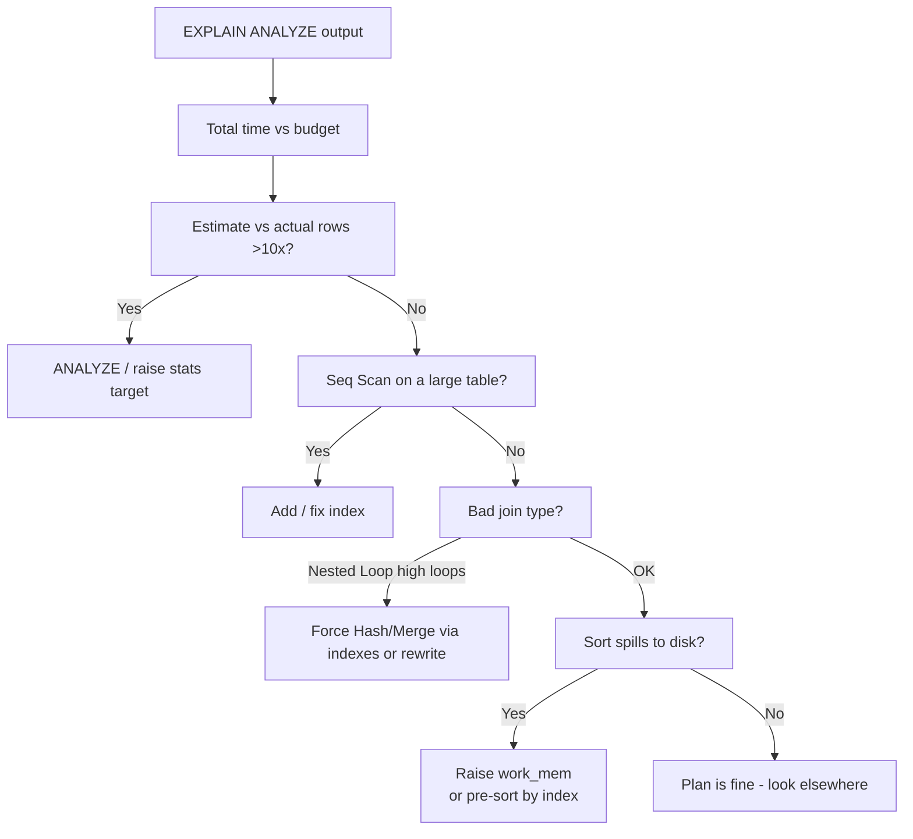
```mermaid
flowchart TD
    Plan[EXPLAIN ANALYZE output] --> Time[Total time vs budget]
    Time --> Estim[Estimate vs actual rows >10x?]
    Estim -->|Yes| Stats[ANALYZE / raise stats target]
    Estim -->|No| Scan[Seq Scan on a large table?]
    Scan -->|Yes| Idx[Add / fix index]
    Scan -->|No| Join[Bad join type?]
    Join -->|Nested Loop high loops| Hash[Force Hash/Merge via indexes or rewrite]
    Join -->|OK| Sort[Sort spills to disk?]
    Sort -->|Yes| Mem[Raise work_mem<br/>or pre-sort by index]
    Sort -->|No| Done[Plan is fine - look elsewhere]
```

Always add `EXPLAIN (ANALYZE, BUFFERS, FORMAT TEXT)` — `BUFFERS` shows cache hits vs disk reads, which prose alone hides.

---

### 9. B-tree, Hash, GIN, GiST, BRIN — pick one per workload.

| Index | Strength | Weakness | Use for |
| ----- | -------- | -------- | ------- |
| **B-tree** | Equality + range + ORDER BY + LIKE 'abc%' | Nothing dramatic | Default for scalar columns |
| **Hash** | Equality only, smaller for very wide keys | No range, no ORDER BY | Rare in Postgres; use B-tree |
| **GIN** | Multi-value (arrays, jsonb, tsvector, trigram) | Slow writes | JSONB search, full-text, `pg_trgm` |
| **GiST** | Geometric, range types, fuzzy nearest-neighbor | Slower point lookup than B-tree | PostGIS, range overlap |
| **SP-GiST** | Non-balanced partitioned trees | Niche | IP prefixes, phone numbers |
| **BRIN** | Tiny (~kb), correlated columns | Useless for random data | Append-only time-series with date PK |

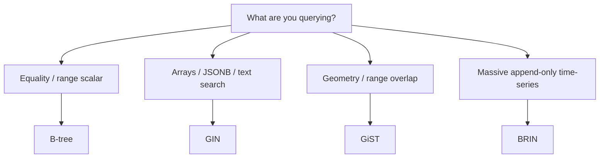
```mermaid
graph TD
    Q[What are you querying?] --> Eq[Equality / range scalar]
    Q --> Multi[Arrays / JSONB / text search]
    Q --> Geo[Geometry / range overlap]
    Q --> TS[Massive append-only time-series]
    Eq --> BT[B-tree]
    Multi --> G[GIN]
    Geo --> Gist[GiST]
    TS --> BR[BRIN]
```

**Senior signal:** mention `text_pattern_ops` for `LIKE 'abc%'` on `text` columns with non-default collation, and `jsonb_path_ops` for smaller, faster JSONB containment.

---

### 10. Composite index column order — how do you decide?

Rules of thumb:

1. **Leftmost prefix rule** — `(a, b, c)` supports `(a)`, `(a, b)`, `(a, b, c)` queries but **not** `(b)` alone.
2. **Equality columns first**, then range, then sort.
3. **Highest selectivity first** — but only among equality predicates.
4. If you need `ORDER BY` to use the index, the trailing columns must match the sort order.

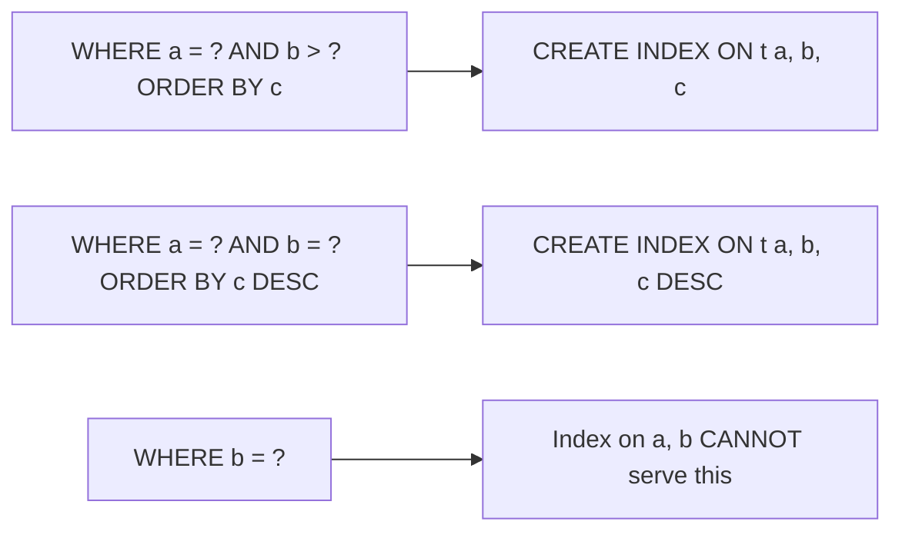
```mermaid
graph LR
    Q[WHERE a = ? AND b > ? ORDER BY c] --> Idx[CREATE INDEX ON t a, b, c]
    Q2[WHERE a = ? AND b = ? ORDER BY c DESC] --> Idx2[CREATE INDEX ON t a, b, c DESC]
    Q3[WHERE b = ?] --> Bad[Index on a, b CANNOT serve this]
```

Composite indexes are *cheaper than multiple single-column indexes* per planning, but more expensive on writes. Don't make six of them when three composite ones cover all the query shapes.

---

### 11. Covering indexes (`INCLUDE`) — when to reach for them.

A covering index satisfies the query entirely from the index, skipping the heap fetch ("index-only scan").

```sql
CREATE INDEX idx_orders_user_status
  ON orders (user_id, status)
  INCLUDE (total_amount, created_at);
```

Worth it when:

- The selected columns are *narrow* and *rarely change* (or you accept that updates will hit the index).
- The query is hot and the table is wide (so avoiding the heap matters).
- You have `VACUUM` keeping the visibility map fresh — without it, index-only scans degrade to regular ones.

Not worth it when including wide columns just to "save a fetch" — the index doubles in size and write cost.

---

### 12. When does an index *hurt* performance?

- **Write amplification** — every INSERT/UPDATE/DELETE updates every index. A table with 12 indexes spends most write time on index maintenance.
- **Low-cardinality indexes** on boolean / `status` columns where 90% of rows have the same value → planner often picks a seq scan anyway.
- **Stale/unused indexes** — wasting buffer cache, slowing writes. Detect with `pg_stat_user_indexes.idx_scan = 0`.
- **Bloat** from heavy update workloads — an "indexed" lookup becomes random I/O across a fragmented btree.
- **Wrong column order** — index exists but planner can't use it for the actual predicate.

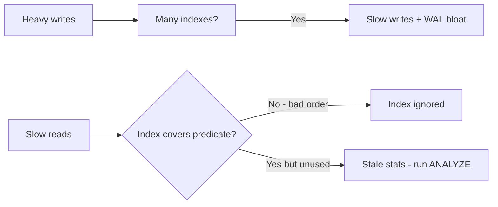
```mermaid
flowchart LR
    Writes[Heavy writes] --> Many[Many indexes?]
    Many -->|Yes| Slow[Slow writes + WAL bloat]
    Reads[Slow reads] --> Cov{Index covers predicate?}
    Cov -->|No - bad order| Wrong[Index ignored]
    Cov -->|Yes but unused| Stats[Stale stats - run ANALYZE]
```

Audit periodically: drop indexes with `idx_scan = 0` for the past month after confirming with the app team.

---

### 13. Partial indexes — give a real use case.

Index only the rows that matter:

```sql
-- Pending orders are < 1% of the table but 95% of queries hit them
CREATE INDEX idx_orders_pending
  ON orders (created_at)
  WHERE status = 'pending';

-- Soft-delete-aware unique
CREATE UNIQUE INDEX uq_active_email
  ON users (email)
  WHERE deleted_at IS NULL;
```

Smaller, faster, less write overhead. The planner uses the partial index *only* when the predicate matches — exactly.

---

### 14. Index bloat — how do you detect and fix?

Symptoms: query latency creeps up despite stable plans; `pg_relation_size` of an index grows faster than the table.

**Detect:**

```sql
SELECT schemaname, relname, indexrelname,
       pg_size_pretty(pg_relation_size(indexrelid)) AS size,
       idx_scan, idx_tup_read
FROM pg_stat_user_indexes
ORDER BY pg_relation_size(indexrelid) DESC LIMIT 20;
```

For deep diagnosis use `pgstattuple` (`SELECT * FROM pgstattuple_approx('idx_name');` shows dead-tuple ratio).

**Fix:**

- `REINDEX INDEX CONCURRENTLY idx_name;` (PG 12+) — rebuilds without long lock.
- For severe table bloat: `pg_repack` (online compaction).
- Tune `autovacuum_vacuum_scale_factor` lower on hot tables.

---

### 15. SARGable predicates — what kills index usage?

"Search ARGument able" — a predicate the planner can map to an index range scan.

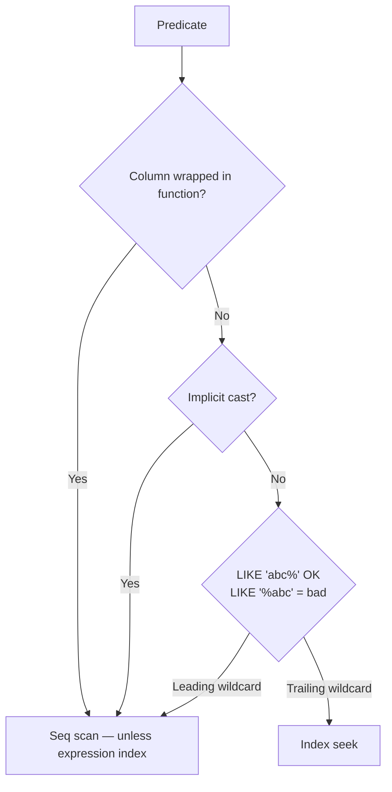
```mermaid
flowchart TD
    Q[Predicate] --> Wrap{Column wrapped in function?}
    Wrap -->|Yes| Bad[Seq scan — unless expression index]
    Wrap -->|No| Cast{Implicit cast?}
    Cast -->|Yes| Bad
    Cast -->|No| Lead{LIKE 'abc%' OK<br/>LIKE '%abc' = bad}
    Lead -->|Trailing wildcard| Good[Index seek]
    Lead -->|Leading wildcard| Bad
```

Examples of killers:

- `WHERE lower(email) = ?` — wrap `email` → no index. Fix: expression index on `lower(email)`.
- `WHERE created_at::date = '2026-05-01'` — implicit cast prevents index. Use `created_at >= '2026-05-01' AND created_at < '2026-05-02'`.
- `WHERE name LIKE '%foo%'` — leading wildcard. Fix: `pg_trgm` GIN index.
- `WHERE id::text = '42'` — implicit cast from text input. Cast on the parameter, not the column.

---

## Transactions & Concurrency

### 16. Explain the four isolation levels and the phenomena they prevent.

| Level | Dirty read | Non-repeatable read | Phantom read | Serialization anomaly |
| ----- | ---------- | ------------------- | ------------ | --------------------- |
| Read Uncommitted | ✗ allowed | ✗ allowed | ✗ allowed | ✗ allowed |
| **Read Committed** (PG default) | ✓ prevented | ✗ allowed | ✗ allowed | ✗ allowed |
| Repeatable Read | ✓ | ✓ | ✓ (in PG, via snapshot) | ✗ allowed |
| Serializable | ✓ | ✓ | ✓ | ✓ |

Postgres has **no** Read Uncommitted (it silently maps to Read Committed). Postgres **Repeatable Read** uses snapshot isolation — phantom reads are prevented as a side effect, unlike the SQL standard's textbook definition. **Serializable** uses **SSI** (Serializable Snapshot Isolation) — may throw `serialization_failure`; the app must retry.

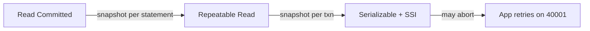
```mermaid
flowchart LR
    RC[Read Committed] -->|snapshot per statement| Repeat[Repeatable Read]
    Repeat -->|snapshot per txn| Ser[Serializable + SSI]
    Ser -->|may abort| Retry[App retries on 40001]
```

**Senior signal:** "Most apps stay on Read Committed and use explicit row locks (`FOR UPDATE`) where they need serializability — Serializable's retry budget is real."

---

### 17. Postgres MVCC — how does it actually work?

Every row version (tuple) carries `xmin` (creator txn) and `xmax` (deleter txn). Each txn sees a *snapshot*: only tuples where `xmin` is committed before snapshot AND (`xmax` is null or aborted or after snapshot).

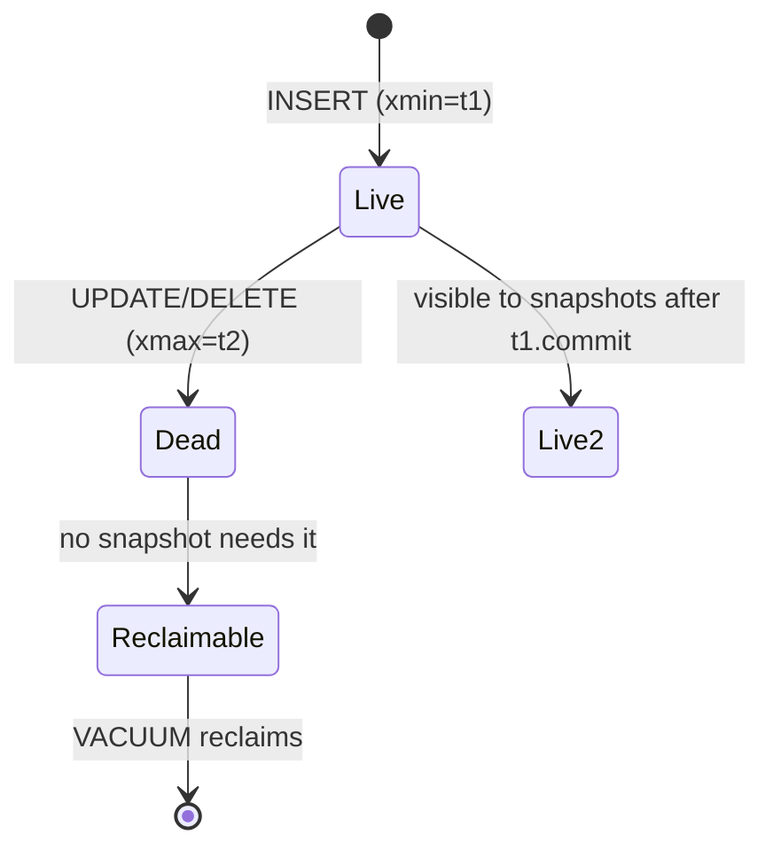
```mermaid
stateDiagram-v2
    [*] --> Live: INSERT (xmin=t1)
    Live --> Dead: UPDATE/DELETE (xmax=t2)
    Live --> Live2: visible to snapshots after t1.commit
    Dead --> Reclaimable: no snapshot needs it
    Reclaimable --> [*]: VACUUM reclaims
```

Consequences:

- **UPDATE writes a new tuple**, not in-place. Wide tables get bloat fast under update churn.
- **Long-running txns block VACUUM** — dead tuples accumulate. Watch `pg_stat_activity` for old `xact_start`.
- **Index entries point at heap tuples**; HOT updates can skip index updates if no indexed column changed AND the new tuple fits the same page.

---

### 18. Pessimistic vs optimistic locking — pick the right one.

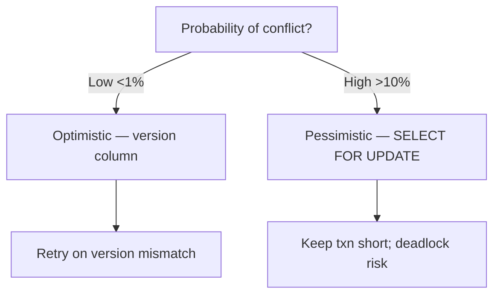
```mermaid
flowchart TD
    Q[Probability of conflict?] -->|Low <1%| Opt[Optimistic — version column]
    Q -->|High >10%| Pess[Pessimistic — SELECT FOR UPDATE]
    Opt --> Retry[Retry on version mismatch]
    Pess --> Short[Keep txn short; deadlock risk]
```

**Optimistic** (EF Core rowversion / `xmin` / version column):

```sql
UPDATE orders SET status='shipped', version = version + 1
WHERE id = $1 AND version = $2;
-- 0 rows affected => someone else updated; retry or surface error
```

**Pessimistic** (row lock):

```sql
BEGIN;
SELECT * FROM orders WHERE id = $1 FOR UPDATE;
-- ... mutate ...
COMMIT;
```

Use pessimistic for **inventory decrements**, **fund transfers**, **reservation systems** — where lost updates are expensive. Use optimistic for **user profile edits**, **shopping carts**, **collaborative documents with explicit conflict UX**.

---

### 19. `SELECT FOR UPDATE` vs `FOR NO KEY UPDATE` vs `FOR SHARE` vs `FOR KEY SHARE`.

| Mode | Blocks other... | When to use |
| ---- | --------------- | ----------- |
| `FOR UPDATE` | UPDATE/DELETE/SELECT FOR UPDATE/SHARE | Mutating the row exclusively |
| `FOR NO KEY UPDATE` | UPDATE/DELETE (non-key)/FOR NO KEY UPDATE | Updating non-key columns; lets FK consistency checks proceed |
| `FOR SHARE` | UPDATE/DELETE/FOR UPDATE | Reading a row that must stay alive until commit |
| `FOR KEY SHARE` | UPDATE that changes a key / DELETE | Default lock taken by FK validation; the lightest |

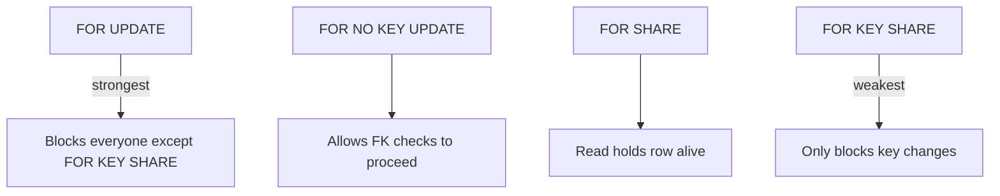
```mermaid
graph TD
    FU[FOR UPDATE] -->|strongest| Lock[Blocks everyone except FOR KEY SHARE]
    FNKU[FOR NO KEY UPDATE] --> AllowFK[Allows FK checks to proceed]
    FS[FOR SHARE] --> ReadStable[Read holds row alive]
    FKS[FOR KEY SHARE] -->|weakest| FKOnly[Only blocks key changes]
```

`FOR NO KEY UPDATE` is the right default when you're updating a parent row that other tables FK to — using `FOR UPDATE` will block FK consistency checks from concurrent inserts on the child.

---

### 20. Implement a job queue using `SKIP LOCKED`.

Naive `SELECT ... FOR UPDATE LIMIT 1` serializes all workers — each waits for the row before. `SKIP LOCKED` lets each worker grab a different row.

```sql
WITH next AS (
  SELECT id FROM jobs
  WHERE status = 'pending' AND run_at <= now()
  ORDER BY run_at
  FOR UPDATE SKIP LOCKED
  LIMIT 1
)
UPDATE jobs SET status='running', started_at=now()
FROM next WHERE jobs.id = next.id
RETURNING jobs.*;
```

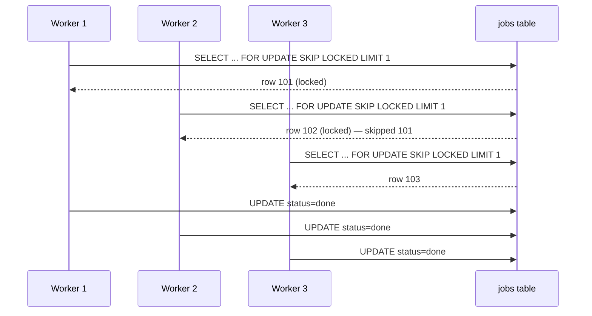
```mermaid
sequenceDiagram
    participant W1 as Worker 1
    participant W2 as Worker 2
    participant W3 as Worker 3
    participant Q as jobs table
    W1->>Q: SELECT ... FOR UPDATE SKIP LOCKED LIMIT 1
    Q-->>W1: row 101 (locked)
    W2->>Q: SELECT ... FOR UPDATE SKIP LOCKED LIMIT 1
    Q-->>W2: row 102 (locked) — skipped 101
    W3->>Q: SELECT ... FOR UPDATE SKIP LOCKED LIMIT 1
    Q-->>W3: row 103
    W1->>Q: UPDATE status=done
    W2->>Q: UPDATE status=done
    W3->>Q: UPDATE status=done
```

Real-world tweaks: visibility-timeout pattern (`status='running' AND started_at < now() - interval '5 min'` reclaims abandoned jobs), partition by `run_at` for retention, separate index `(status, run_at) WHERE status='pending'`.

---

### 21. Deadlock detection and recovery — what's the story?

Postgres detects deadlocks after `deadlock_timeout` (default 1s) and **kills one transaction** with `40P01 deadlock_detected`. Your app must retry.

Common cause: two transactions acquiring the same rows in opposite order.

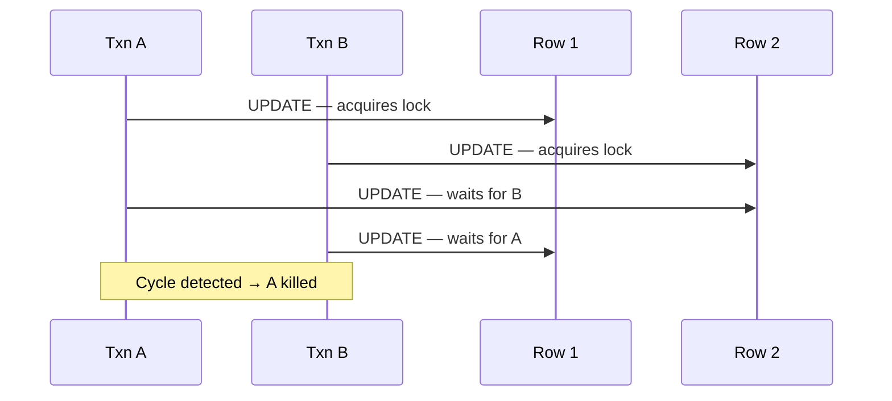
```mermaid
sequenceDiagram
    participant T1 as Txn A
    participant T2 as Txn B
    participant R1 as Row 1
    participant R2 as Row 2
    T1->>R1: UPDATE — acquires lock
    T2->>R2: UPDATE — acquires lock
    T1->>R2: UPDATE — waits for B
    T2->>R1: UPDATE — waits for A
    Note over T1,T2: Cycle detected → A killed
```

**Prevention:**

- Acquire locks in a **consistent order** across the codebase (e.g., always lower id first).
- Keep transactions short. Don't hold a lock across an HTTP call.
- Use **advisory locks** (`pg_advisory_xact_lock(key)`) for higher-level coordination.
- For app-level retries: catch `40001` (serialization failure) and `40P01` (deadlock), retry with jitter, cap attempts.

---

### 22. Read-after-write consistency under read replicas — how do you achieve it?

Reads from replicas are eventually consistent. Patterns:

1. **Sticky reads after writes** — route a session's reads to the primary for N seconds after a write.
2. **Pass the LSN** — capture `pg_current_wal_lsn()` after commit, then on the replica `SELECT pg_wal_replay_lsn() >= $lsn`; if not, read from primary.
3. **Synchronous replication** for the affected commit — `SET synchronous_commit = remote_apply` on writes that need strong RAW consistency.

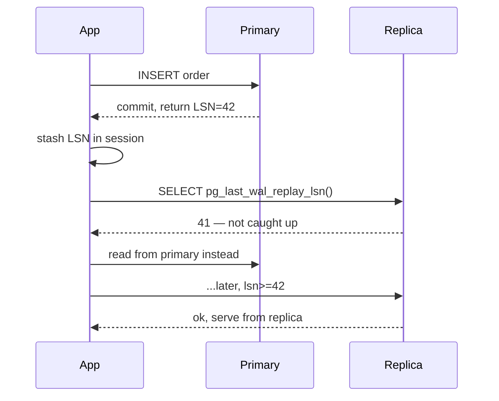
```mermaid
sequenceDiagram
    participant App
    participant P as Primary
    participant R as Replica
    App->>P: INSERT order
    P-->>App: commit, return LSN=42
    App->>App: stash LSN in session
    App->>R: SELECT pg_last_wal_replay_lsn()
    R-->>App: 41 — not caught up
    App->>P: read from primary instead
    App->>R: ...later, lsn>=42
    R-->>App: ok, serve from replica
```

In .NET: a connection router that inspects the operation type and a session-stored "min LSN" gate.

---

## Performance Tuning

### 23. A query slowed down overnight. Walk through your diagnosis playbook.

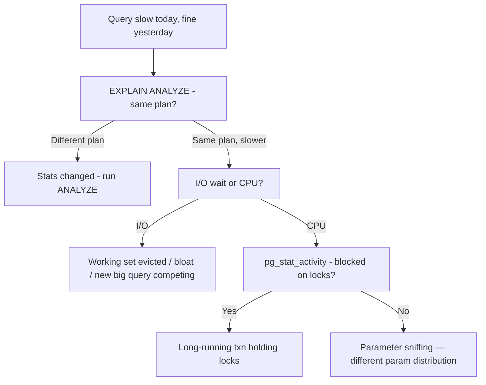
```mermaid
flowchart TD
    Slow[Query slow today, fine yesterday] --> Plan[EXPLAIN ANALYZE - same plan?]
    Plan -->|Different plan| Stats[Stats changed - run ANALYZE]
    Plan -->|Same plan, slower| IO[I/O wait or CPU?]
    IO -->|I/O| Cache[Working set evicted / bloat / new big query competing]
    IO -->|CPU| Lock[pg_stat_activity - blocked on locks?]
    Lock -->|Yes| LongTxn[Long-running txn holding locks]
    Lock -->|No| Params[Parameter sniffing — different param distribution]
```

Steps:

1. **Compare plans**: `EXPLAIN ANALYZE` today vs the version from monitoring. Different plan? Stats issue or planner regression.
2. **Check `pg_stat_statements`**: did calls/sec, mean time, rows change? Often a different *parameter value* with very different selectivity.
3. **Check locks**: `pg_locks` joined to `pg_stat_activity`, sorted by `wait_event_type`.
4. **Check bloat**: `pgstattuple` on the involved table/indexes.
5. **Check autovacuum lag**: `pg_stat_user_tables.last_autovacuum`.
6. **Check noisy neighbor**: new big report query, dump, or replication slot piling WAL.

---

### 24. PgBouncer modes — session vs transaction vs statement.

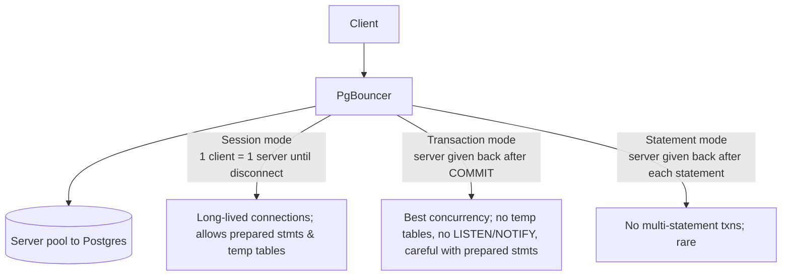
```mermaid
graph TD
    Client --> Bouncer[PgBouncer]
    Bouncer --> Pool[(Server pool to Postgres)]
    Bouncer -->|Session mode<br/>1 client = 1 server until disconnect| App1[Long-lived connections; allows prepared stmts & temp tables]
    Bouncer -->|Transaction mode<br/>server given back after COMMIT| App2[Best concurrency; no temp tables, no LISTEN/NOTIFY, careful with prepared stmts]
    Bouncer -->|Statement mode<br/>server given back after each statement| App3[No multi-statement txns; rare]
```

| Mode | Concurrency | Features lost |
| ---- | ----------- | ------------- |
| Session | Lowest (each client holds a connection) | None |
| **Transaction** | High (default in production) | Session-scoped: `LISTEN/NOTIFY`, `SET LOCAL` is ok but `SET` is not, temp tables, server-side cursors |
| Statement | Highest | All multi-statement transactions |

Most .NET apps run transaction mode with **`Server-Side Prepared Statements`** disabled in Npgsql (`No Reset On Close=true; Max Auto Prepare=0`) or use `Server-Compatibility=Redshift` style.

---

### 25. Parameter sniffing — what is it and how do you defeat it?

A prepared/generic plan is cached based on the *first* parameter's selectivity. If subsequent calls have very different distributions (`status='pending'` matching 1% vs `status='archived'` matching 90%), the cached plan is wrong.

Postgres uses **custom plans** for the first 5 executions then switches to a **generic plan** if it's not significantly worse. You can force:

```sql
SET plan_cache_mode = force_custom_plan;   -- always re-plan
-- or
SET plan_cache_mode = force_generic_plan;  -- never re-plan
```

In Npgsql: `Max Auto Prepare=0` disables server-side prepared statements entirely → planner re-plans every call. Trade-off: planning cost vs plan stability.

For SQL Server folks: `OPTION (RECOMPILE)` is the same idea.

---

### 26. VACUUM, autovacuum, and bloat — how do you tune them?

**Autovacuum** triggers when:

- `n_dead_tup > autovacuum_vacuum_threshold + autovacuum_vacuum_scale_factor * n_live_tup`

On a 100M-row table with default `scale_factor=0.2`, autovacuum waits for **20M dead tuples** before kicking in. That's catastrophic. Per-table override:

```sql
ALTER TABLE big_hot_table SET (
  autovacuum_vacuum_scale_factor = 0.01,
  autovacuum_vacuum_threshold = 1000,
  autovacuum_analyze_scale_factor = 0.005
);
```

```mermaid
flowchart LR
    Update[UPDATE/DELETE] --> Dead[Dead tuples accumulate]
    Dead --> Trig[Threshold reached?]
    Trig -->|Yes| AV[Autovacuum: mark space reusable, update visibility map]
    AV --> VM[Index-only scans now work]
    Trig -->|No| Bloat[Bloat grows -> slow scans, slow indexes]
    Bloat --> Manual[Manual VACUUM or pg_repack]
```

**Senior signals:**

- VACUUM does NOT shrink the file by default — only `VACUUM FULL` (rewrites, takes ACCESS EXCLUSIVE lock) or `pg_repack`/`pg_squeeze` (online).
- `autovacuum_max_workers` defaults to 3 — bump on bigger boxes.
- `autovacuum_vacuum_cost_limit` throttles I/O — raise it on SSDs.

---

### 27. `pg_stat_statements` — what do you actually look at?

```sql
SELECT query,
       calls,
       total_exec_time,
       mean_exec_time,
       stddev_exec_time,
       rows / NULLIF(calls, 0) AS avg_rows,
       shared_blks_hit,
       shared_blks_read
FROM pg_stat_statements
ORDER BY total_exec_time DESC LIMIT 20;
```

**Sort by `total_exec_time` first** — that's where time is actually going. A 50ms query called 1M times beats a 5s query called twice.

Then look at:

- **`mean_exec_time` + `stddev_exec_time`** — high stddev = parameter-sniffing or skewed data.
- **`shared_blks_read` / `shared_blks_hit`** — cache hit ratio. Reads >> hits = working set doesn't fit RAM.
- **`rows / calls`** — surprising row counts often reveal missing predicates or WHERE clause bugs.

Pair with **`pg_stat_activity`** for live queries and **`auto_explain`** to capture plans of slow ones automatically.

---

### 28. When do you cache vs index vs materialize?

```mermaid
flowchart TD
    Slow[Slow read] --> Reshape{Can a better index/query fix it?}
    Reshape -->|Yes| Idx[Index / rewrite]
    Reshape -->|No| Fresh{Acceptable staleness?}
    Fresh -->|None| Inline[Optimize join, partition, denormalize]
    Fresh -->|Seconds-minutes| Mat[Materialized view + scheduled refresh]
    Fresh -->|Sub-second consistency| MemC[Memcached/Redis cache aside]
    Fresh -->|Eventual| ReadModel[CQRS read model fed by events]
```

The order: **fix the query → add the right index → materialize → cache externally → introduce a read model**. Don't skip steps.

---

## Replication & High Availability

### 29. Streaming vs logical replication — pros, cons, use cases.

| Feature | Streaming (physical) | Logical |
| ------- | -------------------- | ------- |
| Granularity | Whole cluster, binary identical | Per-table, per-row, transformable |
| Versions | Same major version | Cross-version OK |
| Failover target | Yes (hot standby) | No (writeable target; not a "standby") |
| Use cases | HA, read replicas, PITR | Selective replication, ETL/CDC, blue/green upgrades, multi-region writes |
| DDL replication | Yes | **No** — DDL must be applied separately |
| Sequences | Replicated | NOT replicated; reset after promotion |

```mermaid
graph LR
    subgraph Streaming
      P1[(Primary)] -->|WAL stream| R1[(Replica - read only)]
      R1 -->|cascade| R2[(Replica 2)]
    end
    subgraph Logical
      P2[(Publisher)] -->|decoded changes per table| S1[(Subscriber - writeable)]
      P2 -->|same source, different table set| S2[(Subscriber 2)]
    end
```

**Senior signal:** logical replication is the modern blue/green upgrade path — replicate to a new major version, then cut over.

---

### 30. Failover orchestration — Patroni, repmgr, cloud-managed.

```mermaid
sequenceDiagram
    participant App
    participant LB as HAProxy / Pooler
    participant P as Primary
    participant R1 as Standby A
    participant R2 as Standby B
    participant DCS as etcd / Consul

    Note over P,R2: Healthy state
    P--xR1: heartbeats stop (primary crash)
    DCS->>DCS: Patroni loses leader lock
    R1->>DCS: race to acquire leader lock
    R1->>DCS: won
    R1->>R1: promote (pg_ctl promote)
    R1->>R2: rewire as new primary source
    LB->>DCS: query for current primary
    DCS-->>LB: R1
    LB->>R1: route writes
    App->>LB: writes resume
```

**Patroni** is the de-facto open-source choice: Postgres + etcd/Consul/ZooKeeper for leader election + a REST API the load balancer queries. Watch for:

- **Split-brain** — needs a real DCS, not just an additional watchdog. The DCS quorum is the source of truth.
- **Fencing / STONITH** — the old primary must be killed or refuse writes before the new one accepts them, or you'll diverge.
- **Connection routing** — apps must re-resolve via HAProxy/PgBouncer/PgCat, not via DNS TTL.

**Cloud-managed** (RDS, Aurora, Azure Flexible) hides all of this behind a managed endpoint. Trade-off: convenience vs lock-in, custom-extension support, replication into your own warm standby.

---

### 31. Read-replica lag — how do you measure and handle it?

Measure with:

```sql
-- on the replica
SELECT now() - pg_last_xact_replay_timestamp() AS replica_lag;

-- on the primary, with replication slot
SELECT slot_name, pg_size_pretty(pg_wal_lsn_diff(pg_current_wal_lsn(), restart_lsn))
FROM pg_replication_slots;
```

Handle:

1. **Route critical reads to the primary** — orders status after place-order, profile after profile-edit.
2. **Wait-for-LSN** pattern (Q22).
3. **Cap WAL retention** — runaway slots from disconnected replicas fill disk. Set `max_slot_wal_keep_size`.
4. **Synchronous replication** for the specific commit that needs RAW.

```mermaid
graph LR
    Lag[Replica lag growing] --> Causes
    Causes --> Big[Big transactions stream slowly]
    Causes --> Long[Long-running query on replica blocks WAL apply<br/>hot_standby_feedback set?]
    Causes --> CPU[Replica CPU saturated]
    Causes --> Net[Network saturated]
    Causes --> Slot[Inactive slot retaining WAL]
```

---

### 32. Synchronous vs asynchronous replication — what are you trading?

| Mode | Durability | Latency | Availability |
| ---- | ---------- | ------- | ------------ |
| Async (default) | Loses recent commits on primary crash | Lowest | Highest — primary commits regardless |
| `synchronous_commit = on` + sync standby | No commit lost if standby acked | Higher (network RTT + standby fsync) | If standby unreachable, **writes block** unless multiple `synchronous_standby_names` |
| `remote_apply` | Read-your-writes on replica | Highest | Same caveats |

**Senior signal:** "I configure **at least two synchronous candidates** (`ANY 1 (s1, s2)`) — single sync standby = single point of stall."

---

## Sharding & Distributed Data

### 33. When do you shard, and how do you pick the shard key?

Shard when **one node can no longer hold the working set** in RAM, even after vertical scaling and read replicas. Sharding adds operational and query complexity — it's the last resort.

**Shard-key rules:**

1. Distributes data evenly (no celebrity tenants).
2. Most queries can be answered from a single shard (co-location).
3. Doesn't change for a row's lifetime.
4. Joinable predicates land on the same shard.

Typical picks: `tenant_id`, `user_id`, `region_id`. Bad picks: `created_at` (hot recent shard), monotonically increasing IDs (last shard takes all writes).

```mermaid
graph TD
    Q[Query path] --> SK{Includes shard key?}
    SK -->|Yes| Single[Single shard - fast]
    SK -->|No| Scatter[Scatter/gather across all shards - slow]
    SK -->|Cross-shard JOIN| Pain[Avoid: replicate dimension data<br/>or denormalize]
```

**Citus** for Postgres lets you declare `SELECT create_distributed_table('orders', 'tenant_id');` and runs scatter-gather automatically.

---

### 34. Cross-shard joins — strategies.

```mermaid
flowchart TD
    Join[Need to join across shards] --> Ref{One side small + read-mostly?}
    Ref -->|Yes| Replicate[Replicate as a reference table<br/>copy to every shard]
    Ref -->|No| Coloc{Can you co-locate?}
    Coloc -->|Yes - same shard key| Local[Local join on each shard]
    Coloc -->|No| Avoid[Avoid in the hot path:<br/>denormalize, ETL into a warehouse, or use a read model]
```

Postgres FDW / Citus reference tables handle the first case. If you find yourself "needing" frequent cross-shard joins, your shard key is probably wrong.

---

### 35. CAP vs PACELC — which is more useful?

CAP says: during a network partition you pick Consistency or Availability. But partitions are rare. **PACELC** extends it: even with no partition (the "Else"), you pick between **Latency** and **Consistency**.

| System | If Partition | Else (normal) | Notes |
| ------ | ------------ | ------------- | ----- |
| Single-node Postgres | CP | EC (slight latency cost for fsync) | Sync standby = stronger C, higher L |
| Cassandra | AP | EL | Tunable per query |
| DynamoDB | AP | EL by default | Strong reads available at cost |
| Spanner / CockroachDB | CP | EC | Trades latency for global strong consistency |
| Cosmos DB | configurable | configurable | Five consistency levels |

```mermaid
graph TD
    Partition[Partition occurs] --> Pick1{CP or AP?}
    Pick1 -->|CP| RejectWrites[Reject writes on minority side]
    Pick1 -->|AP| AcceptDiverge[Accept writes, reconcile later]
    NoPart[No partition] --> Pick2{EL or EC?}
    Pick2 -->|EL| FastEventual[Async replication, fast]
    Pick2 -->|EC| Sync[Sync replication, slower but consistent]
```

---

### 36. Outbox pattern in detail — why and how.

Problem: write to DB + publish to broker atomically. Direct dual-write loses messages on crash between the two.

```mermaid
sequenceDiagram
    participant App
    participant DB
    participant Disp as Outbox Dispatcher
    participant Bus as Message Bus
    App->>DB: BEGIN
    App->>DB: INSERT orders ...
    App->>DB: INSERT outbox (event_id, payload, created_at)
    App->>DB: COMMIT
    loop poll or LISTEN/NOTIFY
        Disp->>DB: SELECT * FROM outbox WHERE published_at IS NULL ORDER BY id LIMIT N
        Disp->>Bus: publish each
        Bus-->>Disp: ack
        Disp->>DB: UPDATE outbox SET published_at = now() WHERE id IN (...)
    end
```

Variants:

- **Poll loop** (simplest) — `SELECT ... FOR UPDATE SKIP LOCKED LIMIT N` so multiple dispatchers don't double-publish.
- **LISTEN/NOTIFY trigger** — Postgres notifies the dispatcher on insert; near-zero latency.
- **CDC (Debezium)** — read WAL directly, eliminate the dispatcher. Most production-grade.

Always make consumers **idempotent** keyed by `event_id` — outbox provides at-least-once.

---

### 37. 2PC vs Saga — visualize the difference.

**2PC** (Two-Phase Commit) — distributed transaction coordinator commits across resource managers atomically.

```mermaid
sequenceDiagram
    participant C as Coordinator
    participant A as Service A
    participant B as Service B
    C->>A: Prepare
    C->>B: Prepare
    A-->>C: Vote-Yes
    B-->>C: Vote-Yes
    C->>A: Commit
    C->>B: Commit
    Note over C,B: Coordinator crash between prepare & commit = blocked resources
```

Limitations: synchronous, blocks if coordinator dies, requires resource manager support (most modern stores don't speak XA), scales poorly.

**Saga** — sequence of local transactions with compensations.

```mermaid
sequenceDiagram
    participant O as Orchestrator
    participant Pay as Payment
    participant Inv as Inventory
    participant Ship as Shipping
    O->>Pay: Charge
    Pay-->>O: Charged
    O->>Inv: Reserve
    Inv-->>O: ReservationFailed
    O->>Pay: Refund (compensation)
    Pay-->>O: Refunded
```

Saga sacrifices atomicity for availability. Each step is its own transaction; failures fire compensations. Two flavors: **orchestrated** (central coordinator) or **choreographed** (each service publishes events others react to). Orchestrated is easier to reason about; choreographed is more loosely coupled.

---

## Schema Evolution & Migrations

### 38. Zero-downtime: add a `NOT NULL` column to a billion-row table.

Naive `ALTER TABLE t ADD COLUMN c text NOT NULL DEFAULT 'x'` rewrites every row, takes an `ACCESS EXCLUSIVE` lock.

```mermaid
flowchart LR
    S1[1. ADD COLUMN nullable] --> S2[2. Deploy app that writes the new column]
    S2 --> S3[3. Backfill in batches]
    S3 --> S4[4. Add CHECK constraint NOT VALID]
    S4 --> S5[5. VALIDATE CONSTRAINT - takes share lock, no rewrite]
    S5 --> S6[6. SET NOT NULL]
```

Postgres 11+ trick: `ADD COLUMN ... DEFAULT 'x' NOT NULL` is **fast** if the default is a constant — metadata only, no rewrite. But for a *computed* default (`gen_random_uuid()`) or values from another column, the explicit phased approach above is mandatory.

---

### 39. Expand/contract pattern — renaming a column safely.

You can't just `ALTER TABLE ... RENAME COLUMN` — every running client breaks.

```mermaid
flowchart TD
    Step1[Expand: ADD new_col, copy from old_col via trigger or backfill] --> Step2[Deploy app that writes both old + new]
    Step2 --> Step3[Deploy app that reads from new]
    Step3 --> Step4[Deploy app that writes only new]
    Step4 --> Step5[Contract: DROP old_col]
```

The same shape applies to **type changes** (`text` → `jsonb`), **table splits**, **rename of a table** — anything where two deployment versions of the app must coexist briefly.

---

### 40. Backfilling billions of rows — strategy.

Don't run `UPDATE t SET c = ... ` as one transaction — it'll lock, bloat, and probably OOM the WAL sender.

```mermaid
flowchart LR
    Start[Choose batch key e.g. PK range] --> Loop[Loop: process N rows]
    Loop --> Tx[Start txn, UPDATE WHERE id BETWEEN x AND x+N, COMMIT]
    Tx --> Sleep[Sleep / yield - let autovacuum keep up]
    Sleep --> Check[Done? else next batch]
    Check -->|Done| Verify[Verify counts + spot-checks]
```

```sql
DO $$
DECLARE
  v_min bigint := 0;
  v_max bigint;
  v_step int := 5000;
BEGIN
  SELECT max(id) INTO v_max FROM big_table;
  WHILE v_min <= v_max LOOP
    UPDATE big_table SET new_col = derive(old_col)
    WHERE id BETWEEN v_min AND v_min + v_step - 1
      AND new_col IS NULL;
    COMMIT;
    PERFORM pg_sleep(0.05);  -- let autovacuum + replicas catch up
    v_min := v_min + v_step;
  END LOOP;
END $$;
```

Use **pg-batch**, **pgbackrest's table-rewrite tools**, or a custom worker. Monitor replication lag — if a backfill pushes WAL faster than replicas apply, your standby falls behind.

---

## NoSQL & Polyglot Persistence

### 41. When does NoSQL beat relational?

| Workload | Best fit |
| -------- | -------- |
| Massive write throughput, time-ordered | Cassandra, DynamoDB, Timescale |
| Hot key-value lookups, sub-ms | Redis, DynamoDB |
| Document-shaped data with many optional fields | MongoDB, Cosmos |
| Wide rollups over append-only events | Cassandra, ScyllaDB |
| Many-hop relationships | Neo4j, JanusGraph |
| Inverted-index search & relevance | Elasticsearch, OpenSearch |
| Embedding similarity | pgvector, Qdrant, Pinecone |

```mermaid
graph TD
    Shape{Data shape}
    Shape -->|Tabular with strong relations| Rel[PostgreSQL]
    Shape -->|Document, optional fields| Doc[MongoDB]
    Shape -->|Key + value, ms lookups| KV[Redis / DynamoDB]
    Shape -->|Time-series append-mostly| TS[Timescale / InfluxDB]
    Shape -->|Graph traversal| Graph[Neo4j]
    Shape -->|Full-text + scoring| Search[Elasticsearch]
    Shape -->|Embeddings| Vec[pgvector / Qdrant]
```

**Senior signal:** "Start with Postgres. It speaks JSONB, full-text, vectors, time-series via Timescale, and graph-ish queries via recursive CTEs. Only move out when a dedicated engine clearly wins on a measured workload."

---

### 42. MongoDB schema design — embed or reference?

```mermaid
flowchart TD
    Rel[Related data] --> Card{Cardinality + access pattern}
    Card -->|One-to-few, read together| Embed[Embed as sub-document]
    Card -->|One-to-many bounded < few hundred| Embed
    Card -->|One-to-many unbounded| Ref[Reference by ObjectId]
    Card -->|Many-to-many| Ref
    Card -->|Updated independently / lifecycle differs| Ref
```

Rules:

- **Embed** if you almost always retrieve children with the parent and counts are bounded.
- **Reference** if children update independently, grow unbounded, or are shared.
- 16MB document cap — embedded arrays of growing size *will* hit it eventually.
- No JOINs natively — `$lookup` is a left-outer join but it's slow and breaks shard locality.

Schema design in document stores is **about query patterns**, not about normalization theory.

---

### 43. Redis as a cache — eviction, keys, pitfalls.

```mermaid
flowchart TD
    Mem[maxmemory reached] --> Pol{maxmemory-policy}
    Pol -->|noeviction| Err[Returns OOM on writes]
    Pol -->|allkeys-lru| LRU[Evicts least-recently-used across all keys]
    Pol -->|allkeys-lfu| LFU[Evicts least-frequently-used - better for cache]
    Pol -->|volatile-ttl| TTL[Evicts soonest-to-expire among those with TTL]
```

Production defaults: `allkeys-lfu`. Pure noeviction is appropriate when Redis is a primary store, not a cache.

**Pitfalls:**

- **Cache stampede** — TTL expires under load → 10k clients miss simultaneously → DB pile-up. Fix with single-flight (`SETNX` lease key), early-recompute, or `HybridCache`.
- **Hot key** — single key handles 80% of traffic, single shard bottleneck. Shard the value (split by hash bucket), or add an L1 in-process cache.
- **Big keys** — a hash with millions of fields = O(N) ops. Split into multiple keys.
- **No TTL** + writes = unbounded growth → OOM.
- **Persistence trade-offs** — AOF + everysec is the durable-but-fast default; RDB-only snapshots can lose minutes on crash.

---

## Backup, Recovery, Security

### 44. PITR — how does it work, and how do you test it?

```mermaid
graph LR
    Base[Base backup<br/>pg_basebackup or pgbackrest] --> Restore[Restore base to target]
    WAL[(Archived WAL files)] --> Replay[Replay WAL up to target time/LSN]
    Restore --> Replay
    Replay --> Recovered[(Database at point-in-time)]
```

The recipe:

1. Take periodic **base backups** (daily/weekly). pgBackRest, Barman, or pg_basebackup.
2. **Archive WAL continuously** (`archive_command = 'pgbackrest archive-push %p'`).
3. To recover to time T: restore newest base backup *before* T, set `recovery_target_time = 'T'`, start Postgres, it replays WAL until T.

**Test it monthly** in a parallel environment. An untested backup is a hope, not a backup. Game-day drills: pick a random T, restore, run a smoke-test script, time the whole thing — that's your real RTO.

---

### 45. RPO vs RTO — driving the backup strategy.

```mermaid
graph LR
    Now[Now] -->|RPO data loss tolerance| LastBackup[Last recoverable point]
    Crash[Crash at T] -->|RTO time to recover| Healthy[Service healthy again]
```

| RPO target | What you need |
| ---------- | ------------- |
| 24h | Daily logical dumps |
| 1h | Hourly base + WAL archive |
| 1min | Continuous WAL archiving (PITR) |
| 0 | Synchronous replication + sync standby |

| RTO target | What you need |
| ---------- | ------------- |
| Days | Restore from S3 cold storage |
| Hours | Restore from warm backup repo |
| Minutes | Hot standby with automatic failover (Patroni) |
| Seconds | Multi-AZ managed (Aurora MultiMaster, Cosmos) |

**Senior signal:** "RPO drives backup *frequency*; RTO drives backup *speed* and *automation*. Decoupling them lets me design each independently."

---

### 46. Row-level security (RLS) — when and how?

```sql
ALTER TABLE orders ENABLE ROW LEVEL SECURITY;

CREATE POLICY tenant_isolation ON orders
  USING (tenant_id = current_setting('app.tenant_id')::bigint);
```

The app sets `SET app.tenant_id = 42;` after authentication. Every query, even one that forgets `WHERE tenant_id`, is filtered.

```mermaid
flowchart TD
    App[App authenticates user] --> Set[SET app.tenant_id]
    Set --> Q[SELECT * FROM orders]
    Q --> Pol[Policy auto-adds WHERE tenant_id = current setting]
    Pol --> Result[Tenant-scoped rows only]
```

Trade-offs:

- **Plan cache impact** — RLS predicates inline; the planner may pick different plans per tenant.
- **Bypass with `BYPASSRLS`** role attribute — admin/migration users.
- **Performance** — index on `tenant_id` becomes mandatory; partial indexes per tenant are sometimes worth it.
- **Mistake guard** — combine with a default-deny: `CREATE POLICY` with `USING (false)`, then specific policies grant access.

---

### 47. Audit logging without killing performance.

Three patterns:

1. **Triggers** (per-row, simple, expensive). `AFTER INSERT/UPDATE/DELETE` writes to `audit_log`.
2. **Logical decoding / CDC** to a separate store (Kafka, S3, OpenSearch). Zero overhead on OLTP.
3. **Database audit extensions** (`pgaudit`, SQL Server Extended Events). Catches DBA-level DDL/grants too.

```mermaid
flowchart TD
    Write[INSERT/UPDATE/DELETE] --> Trig{Audit mechanism}
    Trig -->|Trigger| Aud[audit_log row written in same txn]
    Trig -->|CDC| WAL[(WAL) ]
    WAL --> Debez[Debezium / pg_recvlogical] --> Kafka[(Kafka)]
    Kafka --> Sink[OpenSearch / S3 / Snowflake]
    Trig -->|pgaudit| Log[Postgres log file]
```

For high-throughput OLTP, **CDC > triggers**. Triggers double write cost on every audited row; CDC moves the work off-CPU.

---

## Observability

### 48. Metrics that matter for a database.

```mermaid
graph TB
    subgraph Throughput
      TPS[Transactions/sec]
      QPS[Queries/sec]
      WAL[WAL bytes/sec]
    end
    subgraph Latency
      P50[p50/p95/p99 query time]
      Lock[Lock wait time]
      Replica[Replication lag]
    end
    subgraph Saturation
      CPU[CPU %]
      Mem[Buffer cache hit ratio]
      IO[Disk IOPS / queue depth]
      Conn[Connections vs max]
    end
    subgraph Errors
      Dead[Deadlocks/min]
      Ser[Serialization failures/min]
      Disc[Connection failures]
    end
```

USE method (Utilization, Saturation, Errors) per resource; RED method (Rate, Errors, Duration) per query class. Wire them into Prometheus + Grafana + alerts on **trend changes**, not just thresholds.

The single most useful query you can plot: top 10 queries by `total_exec_time` over time. Plan regressions show up here first.

---

## .NET Data Access

### 49. EF Core N+1 — how do you spot and prevent?

**Symptom:** one HTTP request triggers 50 SELECTs to the same table.

**Spot it with:**

- EF Core logging at `Information` level — count the SELECTs per request.
- `MiniProfiler` showing the query tree.
- A test asserting `dbContext.ChangeTracker.Entries().Count()` or query count via an interceptor.

**Prevent:**

- `.Include(o => o.Items).ThenInclude(...)` for eager loading.
- `.AsSplitQuery()` when the cartesian product is huge.
- Project to a DTO with `.Select(o => new { ... })` — joins only the columns you need.
- **No lazy loading** in API code paths. Set `UseLazyLoadingProxies()` off.

```mermaid
sequenceDiagram
    participant App
    participant EF as EF Core
    participant DB
    Note over App,DB: N+1 (lazy or implicit)
    App->>EF: orders.ToList()
    EF->>DB: SELECT * FROM orders
    loop for each order
      App->>EF: order.Items access
      EF->>DB: SELECT * FROM items WHERE order_id = ?
    end
    Note over App,DB: Eager with Include
    App->>EF: orders.Include(o=>o.Items).ToList()
    EF->>DB: SELECT ... LEFT JOIN items ...
```

---

### 50. EF Core vs Dapper — when to pick which?

| Use EF Core | Use Dapper |
| ----------- | ---------- |
| Domain model with rich relationships | Read-heavy, performance-critical paths |
| You want migrations, change tracking, lazy/eager loading | Hand-tuned SQL with predictable plans |
| Most CRUD + business logic | Reporting endpoints with joins/aggregates |
| Team prefers LINQ ergonomics | Team is comfortable with SQL |

You can **mix**: EF Core for writes and most reads, Dapper for the 5% of hot endpoints. Share the same `DbConnection` from `dbContext.Database.GetDbConnection()`.

```mermaid
flowchart TD
    Endpoint[Endpoint request] --> Type{Write or read?}
    Type -->|Write / mutation| EF[EF Core: change tracking + validation]
    Type -->|Read - simple| EF
    Type -->|Read - hot / complex SQL| Dap[Dapper: hand SQL → DTO]
```

---

### 51. Bulk insert/update strategies in .NET.

| Volume | Strategy |
| ------ | -------- |
| Up to ~100 rows | `dbContext.AddRange + SaveChangesAsync` |
| 100–10k | `EFCore.BulkExtensions` or `Z.EntityFramework.Extensions` |
| 10k–1M | Postgres `COPY` via Npgsql `BeginBinaryImport`; SQL Server `SqlBulkCopy` |
| 1M+ | COPY into staging table → server-side `INSERT ... SELECT` with `ON CONFLICT` upsert |

```csharp
// Npgsql binary COPY — fastest bulk insert
await using var writer = await conn.BeginBinaryImportAsync(
    "COPY orders (id, total, created_at) FROM STDIN (FORMAT BINARY)");
foreach (var o in batch)
{
    await writer.StartRowAsync();
    await writer.WriteAsync(o.Id, NpgsqlDbType.Bigint);
    await writer.WriteAsync(o.Total, NpgsqlDbType.Numeric);
    await writer.WriteAsync(o.CreatedAt, NpgsqlDbType.TimestampTz);
}
await writer.CompleteAsync();
```

```mermaid
flowchart LR
    Rows[Source rows] --> COPY[Npgsql binary COPY into staging]
    COPY --> Upsert[INSERT INTO target SELECT FROM staging<br/>ON CONFLICT id DO UPDATE]
    Upsert --> Cleanup[TRUNCATE staging]
```

**Senior signal:** "I avoid `SaveChanges` in a loop. Either batch, or use COPY. The factor between the two is usually 20–100×."

---

## See Also

- Related interview file: [[Senior .NET Developer]] — overlapping coverage on outbox, sagas, distributed transactions.
- Vault topics: [[Master Index]] for deeper notes on isolation levels, indexing, replication, EF Core.
- External: PostgreSQL docs `EXPLAIN` chapter; *Designing Data-Intensive Applications* (Kleppmann); *PostgreSQL High Performance* (Smith).

---

*Senior database interviews reward clarity, war stories, and the willingness to say "it depends, here's why" — not memorized lists. Pick two or three areas you can speak to with depth and concrete production stories.*
