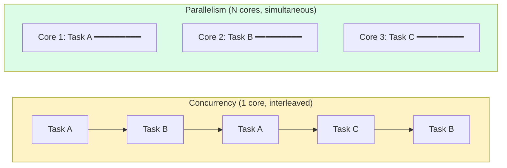
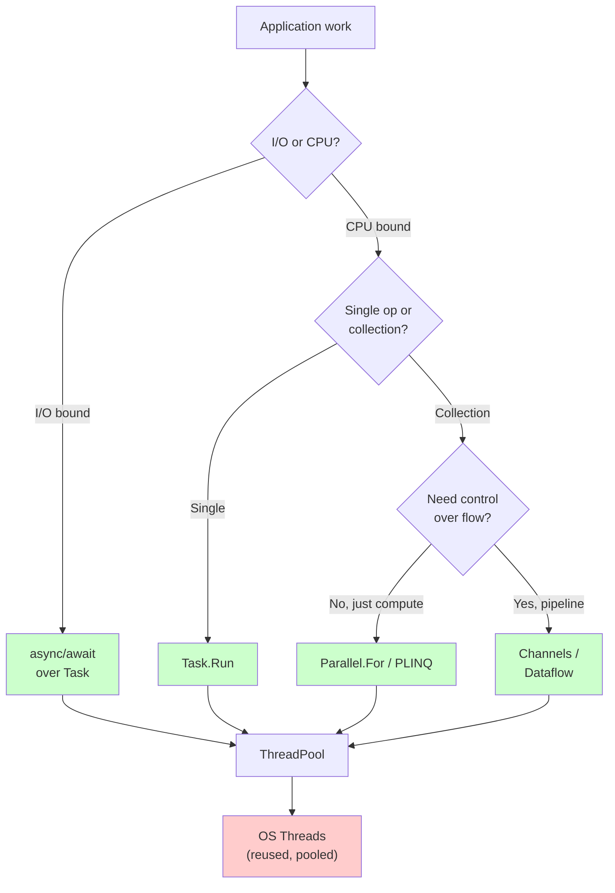
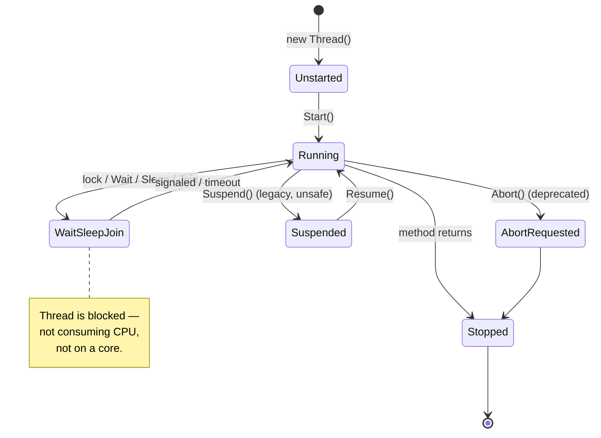
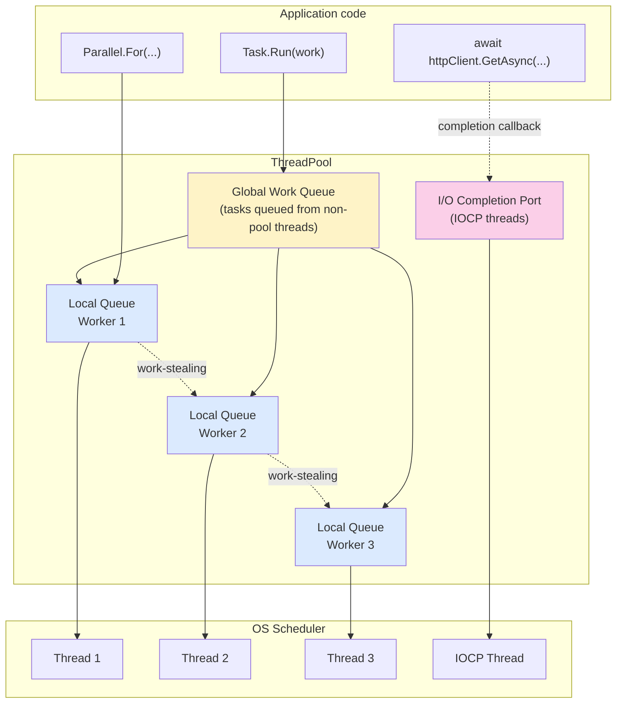
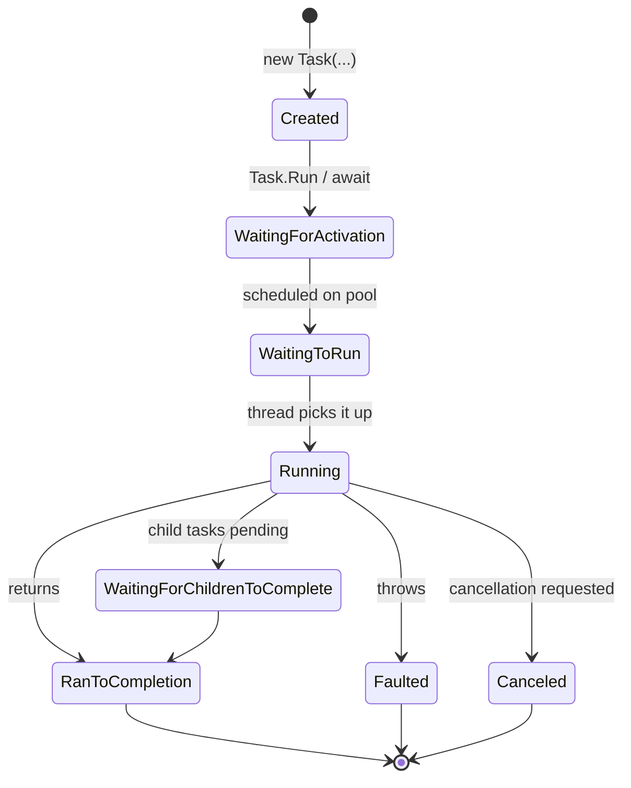
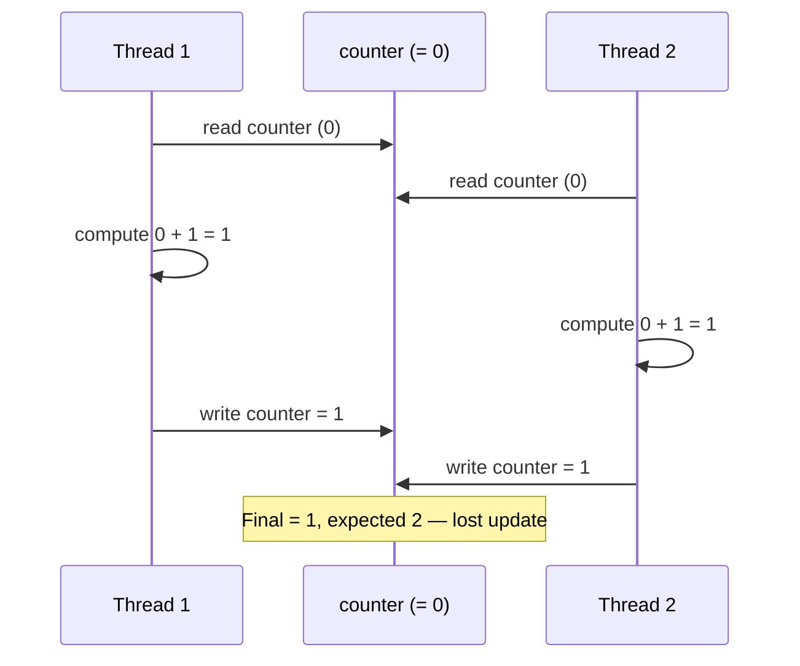

# Threading and Concurrency

> **One-liner**: A **thread** is an OS-level execution unit; a **Task** is a higher-level work item scheduled on the thread pool — modern .NET strongly favors `Task` and `async` over manual thread management.

---

## Quick Reference

| Type | Cost | Use for |
|------|------|---------|
| `Thread` | Heavy (~1 MB stack, OS handle) | Almost never directly — legacy / interop |
| `Thread` (background) | Heavy | Long-lived blocking work that must not prevent app exit |
| `ThreadPool` | Reused threads | Short bursts; managed by `Task` automatically |
| `Task` | Lightweight wrapper | Default for everything async/parallel |
| `Task.Run` | Schedules on pool | CPU-bound work from sync code |
| `Parallel.For/ForEach` | Pool-backed loop | Embarrassingly-parallel data |
| `PLINQ` (`AsParallel`) | Pool-backed query | Parallel LINQ over big data |
| `Channel<T>` | Pool-friendly queue | Producer/consumer pipelines — see [[09 - Channels and Pipelines]] |

| Term | Meaning |
|------|---------|
| **Concurrency** | Many tasks **in flight** (interleaved on one or more cores) |
| **Parallelism** | Many tasks **executing simultaneously** on multiple cores |
| **Race condition** | Outcome depends on thread interleaving |
| **Deadlock** | Two threads each waiting for a lock the other holds |
| **Livelock** | Threads active but making no progress (yielding to each other) |
| **Starvation** | A thread never gets scheduled / never acquires a resource |
| **Thread-safe** | Correct under concurrent access (no data races, invariants hold) |
| **Reentrant** | Safe to call recursively or from multiple threads |
| **Atomic op** | Indivisible — either fully observed or not at all |
| **Context switch** | OS swapping one thread off a core for another (~1–10 µs) |

| Tool | Purpose |
|------|---------|
| `Environment.ProcessorCount` | Logical cores available |
| `Thread.CurrentThread.ManagedThreadId` | .NET thread ID (debug logs) |
| `Thread.CurrentThread.IsThreadPoolThread` | Is current thread from the pool? |
| `ThreadPool.GetAvailableThreads` | Free worker / IOCP threads |
| `dotnet-counters monitor System.Runtime` | Live thread-pool stats |
| Visual Studio **Parallel Stacks** window | See what every thread is doing |

---

## Core Concept

A **thread** is the OS unit of scheduling — created by the OS, costly (typically 1 MB of stack space plus a kernel handle and TLS slots). Each core runs one thread at a time; the OS rapidly **context-switches** between many runnable threads to give the illusion of concurrency on a single core.

The **thread pool** maintains a small set of reusable worker threads to avoid the cost of constant thread creation. A **`Task`** is a .NET-level abstraction over "some work to be done" — the default scheduler runs Tasks on the thread pool. `await` releases the current thread and resumes the Task on a thread pool thread when the awaitable completes — see [[06 - Async and Await]].

**Concurrency** ≠ **parallelism**. Concurrency is structuring code so many things *can* be in progress (interleaved on one core or spread across many). Parallelism is *physically* doing many things simultaneously — only possible with multiple cores. Async I/O gives you concurrency on a single thread; `Parallel.For` gives you parallelism across cores.

**Race conditions** happen when two threads read+modify shared state without synchronization. Fix with (a) avoid sharing — immutable data, message passing, per-thread state, or (b) synchronize — locks, atomic ops (see [[08 - Synchronization Primitives]]).

I/O-bound? Use **async**. CPU-bound? Use **Task.Run / Parallel.For / PLINQ**. Don't create raw `Thread` objects in modern code unless you have a specific reason (long-lived dedicated thread, interop, custom apartment state).

---

## Diagram

### Concurrency vs Parallelism



> Concurrency is about **structure** (many in-flight). Parallelism is about **execution** (many at once). Async is concurrent but not necessarily parallel.

### Decision tree — pick the right primitive



### Thread state lifecycle



### ThreadPool architecture



> Worker threads pull from their **local queue** first (LIFO, cache-friendly), fall back to the **global queue**, then **steal** from peers. I/O completions land on dedicated **IOCP** threads — separate budget from worker threads.

### Task state lifecycle



### Race condition — interleaving timeline



---

## Syntax & API

### Raw Thread (legacy — avoid for new code)
```csharp
var t = new Thread(() =>
{
    Console.WriteLine($"On thread {Environment.CurrentManagedThreadId}");
});
t.IsBackground = true;     // doesn't prevent app exit
t.Priority = ThreadPriority.Normal;
t.Start();
t.Join();                  // wait for it (blocks caller)
```

> **Foreground vs background**: a foreground thread keeps the process alive until it exits; a background thread is killed when all foreground threads end. Pool threads are always background.

### Parameterized Thread
```csharp
var t = new Thread(state => Process((string)state!));
t.Start("payload");

// Or strongly-typed via closure (preferred)
string payload = "payload";
var t2 = new Thread(() => Process(payload));
t2.Start();
```

### ThreadPool directly (rare — prefer Task)
```csharp
ThreadPool.QueueUserWorkItem(_ => DoWork());

// Inspect pool state
ThreadPool.GetMinThreads(out int minWorker, out int minIOCP);
ThreadPool.GetMaxThreads(out int maxWorker, out int maxIOCP);
ThreadPool.GetAvailableThreads(out int availWorker, out int availIOCP);
```

### Task — preferred
```csharp
// Fire-and-forget on pool — exceptions become unobserved!
_ = Task.Run(() => DoCpuWork());

// Schedule + await result
var task = Task.Run(() => ComputeHash(data));
byte[] hash = await task;

// CPU-bound multi-return
Task<int>[] tasks = Enumerable.Range(0, 10)
    .Select(i => Task.Run(() => Compute(i)))
    .ToArray();
int[] results = await Task.WhenAll(tasks);

// First to complete wins
Task<string> first = await Task.WhenAny(taskA, taskB);
```

### Parallel.For / ForEach
```csharp
// Synchronous parallel loop — blocks until done
Parallel.For(0, 1_000_000, i =>
{
    results[i] = Compute(i);
});

Parallel.ForEach(items, item =>
{
    Process(item);
});

// Async parallel (.NET 6+)
await Parallel.ForEachAsync(urls, async (url, ct) =>
{
    await DownloadAsync(url, ct);
}, new ParallelOptions { MaxDegreeOfParallelism = 8 });
```

### PLINQ
```csharp
var primes = numbers
    .AsParallel()
    .Where(IsPrime)
    .ToList();

// Order matters? Add AsOrdered()
var firstHundredPrimes = numbers
    .AsParallel()
    .AsOrdered()
    .Where(IsPrime)
    .Take(100)
    .ToList();

// Tune partitioning
var sum = numbers
    .AsParallel()
    .WithDegreeOfParallelism(4)
    .WithExecutionMode(ParallelExecutionMode.ForceParallelism)
    .Sum();
```

### Race condition (BAD)
```csharp
int counter = 0;

Parallel.For(0, 1000, _ =>
{
    counter++;     // ❌ NOT thread-safe — read, increment, write are 3 ops
});

Console.WriteLine(counter);   // < 1000, varies each run
```

### Fix with Interlocked (atomic)
```csharp
int counter = 0;

Parallel.For(0, 1000, _ =>
{
    Interlocked.Increment(ref counter);   // ✅ atomic CPU instruction
});
// counter == 1000
```

### Fix with lock
```csharp
int counter = 0;
object gate = new();

Parallel.For(0, 1000, _ =>
{
    lock (gate) { counter++; }            // ✅ correct, but slower than Interlocked
});
```

### CancellationToken in parallel loop
```csharp
using var cts = new CancellationTokenSource(TimeSpan.FromSeconds(2));

try
{
    Parallel.ForEach(items,
        new ParallelOptions { CancellationToken = cts.Token },
        item => Process(item));
}
catch (OperationCanceledException) { /* ... */ }
```

### Thread-local data
```csharp
var threadLocal = new ThreadLocal<int>(() => 0, trackAllValues: true);

Parallel.For(0, 1000, _ =>
{
    threadLocal.Value++;        // each thread has its own counter
});

int total = threadLocal.Values.Sum();   // aggregate across all participating threads
```

### AsyncLocal — the async-flow equivalent
```csharp
// ThreadLocal sticks to a thread; AsyncLocal flows with the logical async context
private static readonly AsyncLocal<string?> _correlationId = new();

async Task HandleRequestAsync(string id)
{
    _correlationId.Value = id;
    await ProcessAsync();        // _correlationId.Value still readable here
}                                // even after thread changes across awaits
```

### Memory model — `volatile` and barriers
```csharp
private volatile bool _stop;     // reads/writes never reordered around this field

void Worker()
{
    while (!_stop)               // sees writes from other threads promptly
    {
        DoWork();
    }
}

// Heavier hammer when volatile isn't enough
Volatile.Write(ref _stop, true);
bool s = Volatile.Read(ref _stop);
Thread.MemoryBarrier();          // full fence — rarely needed
```

### Diagnostic: who is hogging the pool?
```bash
# Live counters — watch threadpool-thread-count, threadpool-queue-length
dotnet-counters monitor --process-id <PID> System.Runtime

# Capture a stack trace of every thread (when app appears stuck)
dotnet-stack report --process-id <PID>
```

---

## Common Patterns

### Bounded concurrency over a list
```csharp
// Pattern: batched parallel processing with bounded concurrency
await Parallel.ForEachAsync(urls,
    new ParallelOptions { MaxDegreeOfParallelism = 10 },
    async (url, ct) =>
    {
        var data = await DownloadAsync(url, ct);
        await SaveAsync(data, ct);
    });
```

### Bounded concurrency with SemaphoreSlim (more flexible)
```csharp
using var gate = new SemaphoreSlim(initialCount: 10);

var tasks = urls.Select(async url =>
{
    await gate.WaitAsync();
    try { return await DownloadAsync(url); }
    finally { gate.Release(); }
});

var results = await Task.WhenAll(tasks);
```

### CPU-bound task wrapped for async caller
```csharp
public Task<long> ChecksumAsync(byte[] data) =>
    Task.Run(() => ComputeChecksum(data));     // uses pool
```

### Avoid sharing — return per-iteration result
```csharp
var sums = Enumerable.Range(0, files.Length).AsParallel()
    .Select(i => SumFile(files[i]))
    .ToArray();

long total = sums.Sum();    // single-threaded final reduce
```

### Producer/consumer — prefer Channels over manual locking
```csharp
var channel = Channel.CreateBounded<WorkItem>(capacity: 100);

// Producer
_ = Task.Run(async () =>
{
    foreach (var item in source)
        await channel.Writer.WriteAsync(item);
    channel.Writer.Complete();
});

// Consumer
await foreach (var item in channel.Reader.ReadAllAsync())
    await ProcessAsync(item);
```
> See [[09 - Channels and Pipelines]] for full coverage.

### Long-running dedicated thread
```csharp
// When a task should NOT run on the pool (e.g., long-lived background loop)
Task.Factory.StartNew(
    () => RunForever(),
    TaskCreationOptions.LongRunning);   // hint: spawn a fresh thread, not pool
```

### Aggregation without locks (combiner pattern)
```csharp
long total = 0;

Parallel.For(0, items.Length,
    localInit:   () => 0L,                                    // per-thread state
    body:        (i, _, local) => local + items[i],           // accumulate locally
    localFinally: local => Interlocked.Add(ref total, local)  // merge once per thread
);
```

---

## Gotchas & Tips

### Don't mix paradigms
- **`Task.Run` from async code is usually wrong** — `async` already releases threads on I/O. Wrapping I/O in `Task.Run` just costs a thread switch.
- **Async methods on the thread pool can starve the pool** if blocked synchronously — never call `.Result` or `.Wait()` on a Task inside async-running code (`sync over async` antipattern).
- **`Parallel.ForEach` blocks** the calling thread. From async code use `Parallel.ForEachAsync`.

### Pool starvation
- If all pool threads are blocked synchronously, async work cannot resume. Symptom: requests pile up, latency spikes, no CPU usage. Fix: stop blocking — make it async all the way down.
- The pool **grows slowly** (~1 thread per ~500 ms) once past `MinThreads`. Bursts hit a wall. Tune `ThreadPool.SetMinThreads` only if you've measured starvation.

### Parallelism limits
- **CPU count limits speedup** — `MaxDegreeOfParallelism` defaults to `Environment.ProcessorCount`. Going higher hurts more than it helps for CPU-bound work.
- **Hyperthreading lies** — `ProcessorCount` reports logical cores, not physical. Memory-bound workloads scale with physical cores; compute-bound may benefit from logical.
- **Amdahl's Law**: speedup is capped by the serial fraction. A 10% serial section caps speedup at 10× regardless of cores.

### Sharing pitfalls
- **Random shared state is the enemy** — captured variables, statics, fields are all shared. If you can avoid sharing, do.
- **Foreach captured variable** in older C# (pre-5.0) shared the iteration variable across closures — modern compilers fix this, but watch in `for` loops.
- **`Dictionary<K,V>` is NOT thread-safe**, even for reads if any thread might write. Use `ConcurrentDictionary<K,V>` (see [[08 - Synchronization Primitives]]).

### Cancellation and exceptions
- **Unobserved Task exceptions** trigger `TaskScheduler.UnobservedTaskException` and historically crashed the process — at minimum, log them.
- `Parallel.For` and `Task.WhenAll` aggregate exceptions into `AggregateException` — call `.Flatten()` or unwrap in catch.
- **Cooperative cancellation only** — pass and check `CancellationToken`; threads are not killed.

### Timing primitives
- **`Thread.Sleep` blocks the thread** — in async code use `Task.Delay`.
- **`Thread.Yield()`** lets the OS run another ready thread on the same core; rarely useful in modern code.
- **`SpinWait.SpinUntil(...)`** busy-waits briefly before yielding — only correct for short waits (microseconds).

### Identifying threads
- **`Thread.CurrentThread.ManagedThreadId`** is the .NET ID, not the OS thread ID. Same OS thread can host different .NET IDs over time (rare).
- **`Thread.CurrentThread.IsThreadPoolThread`** = `true` for any pool-backed work; useful when logging.

### Memory model
- **The .NET memory model is weak** — without barriers, reads/writes can be reordered. Use `lock`, `Interlocked`, `Volatile.Read/Write`, or immutable shared data.
- **`volatile` is not a substitute for a lock** — it provides ordering on a single field, not atomicity for compound operations.

### Diagnosis quick checklist
- High latency, low CPU → likely **starvation** (sync-over-async or blocking on the pool).
- High CPU, low throughput → contention (locks, false sharing) or oversubscription.
- Sporadic wrong results → race condition; reproduce with `Parallel.For` and a lot of iterations.
- Hangs → deadlock; capture `dotnet-stack report` and look for two threads each holding what the other waits on.

---

## See Also

- [[06 - Async and Await]] — how `await` plays with the pool
- [[08 - Synchronization Primitives]] — `lock`, `Interlocked`, `Semaphore`, concurrent collections
- [[09 - Memory Management and GC]] — value vs reference, allocation pressure
- [[09 - Channels and Pipelines]] — producer/consumer without locks
- [[10 - Parallel and Dataflow]] — TPL Dataflow blocks for pipelines
- [[06 - Performance Optimization]] — benchmarking parallel code
- [[07 - Memory Leaks and Profiling]] — diagnosing thread/pool issues
