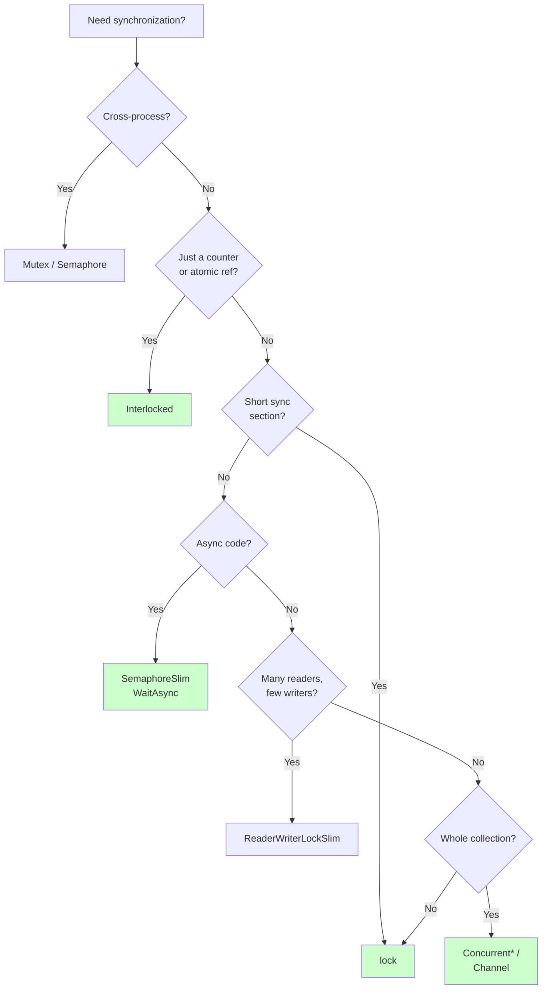
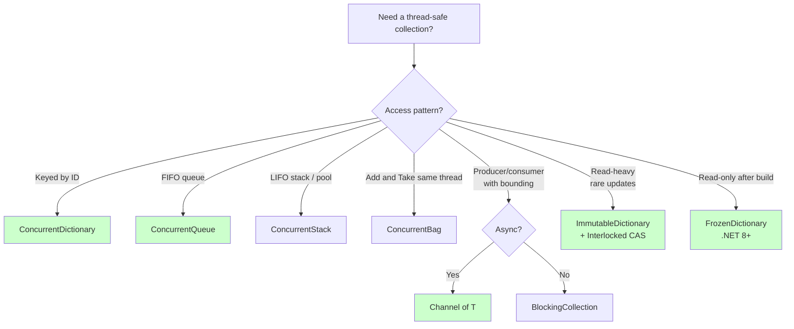
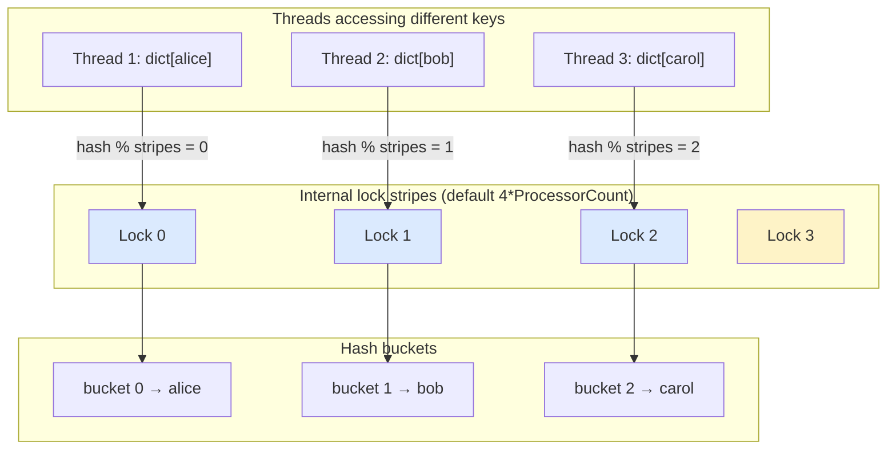
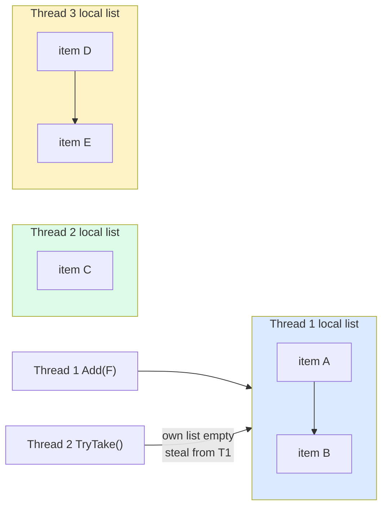

# Synchronization Primitives

> **One-liner**: When threads share state, you need synchronization — pick the **lightest tool** that does the job: `Interlocked` < `lock` < `SemaphoreSlim` < `ReaderWriterLockSlim` < concurrent collections < channels.

---

## Quick Reference

### Locks and signals
| Primitive | Use for | Cost |
|-----------|---------|------|
| `Interlocked` | Atomic int/long/ref ops (counter, CAS) | very low |
| `lock` (`Monitor`) | Short critical sections, single process | low |
| `Mutex` | Cross-process exclusion | high (kernel) |
| `SemaphoreSlim` | Bounded concurrency, **async-friendly** | low–medium |
| `Semaphore` | Cross-process bounded concurrency | high |
| `ReaderWriterLockSlim` | Many readers, few writers | medium |
| `ManualResetEventSlim` | Signal one-or-many waiters | low |
| `AutoResetEvent` | Signal one waiter, auto-reset | medium |
| `CountdownEvent` | Wait until N signals | medium |
| `Barrier` | Phase-synchronize multiple workers | medium |
| `SpinLock` | Ultra-short critical sections, no allocations | very low (busy-wait) |

### Concurrent collections — `System.Collections.Concurrent`
| Type | Order | Internals | Best for |
|------|-------|-----------|----------|
| `ConcurrentDictionary<K,V>` | unordered | lock striping (16 buckets default) | shared keyed cache, counters per key |
| `ConcurrentQueue<T>` | FIFO | lock-free linked array segments | producer/consumer queue |
| `ConcurrentStack<T>` | LIFO | lock-free CAS on head | pool of reusable items |
| `ConcurrentBag<T>` | unordered | thread-local lists + stealing | same thread adds & removes (object pools) |
| `BlockingCollection<T>` | wraps any | adds bounding + blocking + completion | classic producer/consumer with `Take`/`Add` |
| `Channel<T>` | FIFO | bounded or unbounded, async | **modern** producer/consumer — see [[09 - Channels and Pipelines]] |
| `ImmutableDictionary<K,V>` | varies | persistent tree, copy-on-write | read-heavy, infrequent updates |
| `ImmutableList<T>`, `ImmutableArray<T>` | as-stored | persistent / frozen | snapshots passed across threads |
| `FrozenDictionary<K,V>` (.NET 8+) | unordered | read-only optimized | build once, read forever |

> Rule of thumb: **adding a `lock` around a regular `Dictionary` is usually slower** than using `ConcurrentDictionary`. Don't roll your own.

---

## Core Concept

The cheapest synchronization is **none**: prefer immutable data, message passing (channels), or per-thread state. When sharing is unavoidable, escalate gradually:

1. Single counter or reference? **`Interlocked`**
2. Short critical section, sync code? **`lock`**
3. Need to throttle async work? **`SemaphoreSlim`**
4. Reads vastly outnumber writes? **`ReaderWriterLockSlim`** *or* **`ImmutableDictionary` + CAS**
5. Whole keyed/queued/bagged collection? **`Concurrent*`** types
6. Pipeline / producer-consumer? **`Channel<T>`**

**Never** `lock` inside `async` — `lock` doesn't release on `await`, blocking other threads. Use `SemaphoreSlim.WaitAsync()` instead.

**Avoid `Mutex`** unless you need cross-process — it's much slower than `lock` because it's kernel-mode.

Concurrent collections are not magic — they only make **single operations** atomic. A check-then-act sequence (`if (!dict.ContainsKey(k)) dict.Add(k, v)`) is still a race. Use the **fused atomic methods** (`TryAdd`, `GetOrAdd`, `AddOrUpdate`).

---

## Diagram

### Picking the right primitive



### Picking the right concurrent collection



### ConcurrentDictionary — internal lock striping



> Different keys usually hash to different stripes, so writes proceed in parallel. Only collisions on the same stripe serialize.

### ConcurrentBag — per-thread storage with work stealing



> Each thread adds to its **own list** (no contention). On `TryTake`, a thread first looks at its own list; if empty, it **steals** from another. Best when the same thread mostly adds and removes its own items.

---

## Syntax & API

### Interlocked
```csharp
int counter = 0;
Parallel.For(0, 1000, _ => Interlocked.Increment(ref counter));

// Compare-and-swap (CAS) — lock-free state update
int original;
int updated;
do
{
    original = state;
    updated = original + 1;
} while (Interlocked.CompareExchange(ref state, updated, original) != original);

// Atomic add returns new value
long total = Interlocked.Add(ref _bytes, length);

// Atomic exchange of reference
var prev = Interlocked.Exchange(ref _current, newInstance);
```

### lock (Monitor)
```csharp
private readonly object _lock = new();      // dedicated private lock object
private List<int> _items = new();

public void Add(int x)
{
    lock (_lock)
    {
        _items.Add(x);
    }
}

public IReadOnlyList<int> Snapshot()
{
    lock (_lock)
    {
        return _items.ToList();    // copy under lock
    }
}
```

### SemaphoreSlim — async-friendly
```csharp
private readonly SemaphoreSlim _gate = new(initialCount: 5, maxCount: 5);

public async Task<string> CallApiAsync(string url)
{
    await _gate.WaitAsync();
    try
    {
        return await _http.GetStringAsync(url);
    }
    finally
    {
        _gate.Release();
    }
}
// Limits concurrent API calls to 5 — no thread blocking
```

### Mutex (cross-process)
```csharp
using var mutex = new Mutex(initiallyOwned: false, name: "Global\\MyApp_singleton");

if (!mutex.WaitOne(TimeSpan.Zero))
{
    Console.WriteLine("Already running");
    return;
}
try { /* singleton work */ }
finally { mutex.ReleaseMutex(); }
```

### ReaderWriterLockSlim
```csharp
private readonly ReaderWriterLockSlim _rw = new();
private Dictionary<string, int> _cache = new();

public int? Read(string key)
{
    _rw.EnterReadLock();
    try { return _cache.TryGetValue(key, out var v) ? v : null; }
    finally { _rw.ExitReadLock(); }
}

public void Write(string key, int value)
{
    _rw.EnterWriteLock();
    try { _cache[key] = value; }
    finally { _rw.ExitWriteLock(); }
}
```

---

### ConcurrentDictionary — full API
```csharp
var dict = new ConcurrentDictionary<string, int>();

// Add (returns false if key exists)
dict.TryAdd("alice", 30);

// Get-or-add — factory may run more than once on a race
int score = dict.GetOrAdd("bob", _ => ExpensiveCompute());

// Atomic add-or-update — combines insert + update
dict.AddOrUpdate(
    key: "alice",
    addValue: 1,
    updateValueFactory: (_, old) => old + 1);

// Atomic update only if the current value matches
bool updated = dict.TryUpdate("alice", newValue: 5, comparisonValue: 4);

// Remove
if (dict.TryRemove("alice", out var removed)) { /* ... */ }

// Atomic remove-if-equal (.NET 5+)
dict.TryRemove(new KeyValuePair<string, int>("alice", 5));

// Snapshot — `ToArray()` is atomic; `foreach` is consistent but may miss
//            concurrent additions made mid-iteration.
foreach (var kvp in dict) Console.WriteLine($"{kvp.Key} = {kvp.Value}");

// Tune the number of stripes if you have heavy contention or huge cardinality
var dict2 = new ConcurrentDictionary<string, int>(
    concurrencyLevel: Environment.ProcessorCount * 8,
    capacity: 10_000);
```

> **Counters per key** — the canonical pattern: `dict.AddOrUpdate(key, 1, (_, old) => old + 1)`. For very hot keys, store the value as `int[1]` and use `Interlocked.Increment(ref dict[key][0])` to avoid the dictionary's internal lock per increment.

### ConcurrentQueue — FIFO
```csharp
var queue = new ConcurrentQueue<WorkItem>();

queue.Enqueue(new WorkItem("a"));
queue.Enqueue(new WorkItem("b"));

while (queue.TryDequeue(out var item))
    Process(item);

// Peek without removing
if (queue.TryPeek(out var head)) { /* ... */ }

int approxCount = queue.Count;   // O(n) on .NET Framework, O(1) on .NET Core+
```

### ConcurrentStack — LIFO / pool
```csharp
var stack = new ConcurrentStack<byte[]>();

stack.Push(buffer);
if (stack.TryPop(out var reused)) { /* reuse */ }

// Bulk operations — fewer CAS retries under contention
stack.PushRange(new[] { b1, b2, b3 });
byte[][] popped = new byte[10][];
int got = stack.TryPopRange(popped);
```

### ConcurrentBag — per-thread, with stealing
```csharp
var bag = new ConcurrentBag<int>();

Parallel.For(0, 1000, i => bag.Add(i * i));    // add on the thread that produced

while (bag.TryTake(out var v))                 // remove (prefers same thread)
    Console.WriteLine(v);
```

> Use `ConcurrentBag` for **object pools** where producers and consumers tend to be the same thread (e.g., per-thread buffer reuse). For cross-thread producer/consumer, prefer `ConcurrentQueue` or `Channel`.

### BlockingCollection — bounded + completion
```csharp
// Wraps any IProducerConsumerCollection<T> (default ConcurrentQueue)
using var bc = new BlockingCollection<WorkItem>(boundedCapacity: 100);

// Producer
_ = Task.Run(() =>
{
    foreach (var item in source) bc.Add(item);   // blocks if full
    bc.CompleteAdding();
});

// Consumer (multiple allowed)
foreach (var item in bc.GetConsumingEnumerable())  // blocks until item or completion
    Process(item);

// Async equivalent — prefer Channel<T> for new code
```

### Channel — modern producer/consumer
```csharp
var channel = Channel.CreateBounded<WorkItem>(new BoundedChannelOptions(100)
{
    FullMode = BoundedChannelFullMode.Wait,
    SingleReader = true,
    SingleWriter = false,
});

// Producer
await channel.Writer.WriteAsync(item);
channel.Writer.Complete();

// Consumer
await foreach (var item in channel.Reader.ReadAllAsync())
    await ProcessAsync(item);
```
*(Full coverage in [[09 - Channels and Pipelines]].)*

### ImmutableDictionary — read-heavy, copy-on-write
```csharp
private volatile ImmutableDictionary<string, int> _config =
    ImmutableDictionary<string, int>.Empty;

public int Get(string key) => _config[key];   // lock-free read, always consistent

public void Update(string key, int value)
{
    ImmutableDictionary<string, int> snapshot, updated;
    do
    {
        snapshot = _config;
        updated = snapshot.SetItem(key, value);
    }
    while (Interlocked.CompareExchange(ref _config, updated, snapshot) != snapshot);
}
```

### FrozenDictionary — read-only after build (.NET 8+)
```csharp
// Build phase — slow, optimizes for lookup
FrozenDictionary<string, int> lookup = new Dictionary<string, int>
{
    ["alice"] = 1,
    ["bob"]   = 2,
}.ToFrozenDictionary();

// Read phase — fastest possible, fully thread-safe (no writes possible)
int v = lookup["alice"];
```

---

## Common Patterns

### Lazy thread-safe init
```csharp
public sealed class Service
{
    private static readonly Lazy<Service> _instance =
        new(() => new Service(), LazyThreadSafetyMode.ExecutionAndPublication);

    public static Service Instance => _instance.Value;
    private Service() { }
}
```

### Throttled parallel HTTP
```csharp
private readonly SemaphoreSlim _gate = new(10);

public async Task<string[]> FetchManyAsync(string[] urls)
{
    var tasks = urls.Select(async url =>
    {
        await _gate.WaitAsync();
        try { return await _http.GetStringAsync(url); }
        finally { _gate.Release(); }
    });
    return await Task.WhenAll(tasks);
}
```

### Per-key counters (analytics)
```csharp
private readonly ConcurrentDictionary<string, int> _hits = new();

public void RecordHit(string url) =>
    _hits.AddOrUpdate(url, 1, (_, old) => old + 1);

public IReadOnlyDictionary<string, int> Snapshot() =>
    _hits.ToArray().ToDictionary(kvp => kvp.Key, kvp => kvp.Value);
```

### Idempotent GetOrAdd with Lazy
```csharp
// Problem: GetOrAdd's factory may run twice on a race.
// Fix: store Lazy<T> so only one factory invocation succeeds.
private readonly ConcurrentDictionary<string, Lazy<HttpClient>> _clients = new();

public HttpClient ClientFor(string baseUrl) =>
    _clients.GetOrAdd(baseUrl,
        url => new Lazy<HttpClient>(() => new HttpClient { BaseAddress = new Uri(url) })
    ).Value;
```

### Object pool with ConcurrentBag
```csharp
public sealed class BufferPool
{
    private readonly ConcurrentBag<byte[]> _bag = new();

    public byte[] Rent() =>
        _bag.TryTake(out var buf) ? buf : new byte[4096];

    public void Return(byte[] buf)
    {
        Array.Clear(buf);
        _bag.Add(buf);
    }
}
// In .NET, prefer ArrayPool<byte>.Shared for byte[] specifically.
```

### Producer/consumer with Channel (preferred)
```csharp
var channel = Channel.CreateBounded<Job>(100);

var consumer = Task.Run(async () =>
{
    await foreach (var job in channel.Reader.ReadAllAsync())
        await Process(job);
});

foreach (var job in source)
    await channel.Writer.WriteAsync(job);
channel.Writer.Complete();

await consumer;
```

### Copy-on-write for read-heavy state
```csharp
private volatile ImmutableDictionary<string, int> _config =
    ImmutableDictionary<string, int>.Empty;

public int Get(string key) => _config[key];   // lock-free read

public void Update(string key, int value)
{
    ImmutableDictionary<string, int> snapshot, updated;
    do
    {
        snapshot = _config;
        updated = snapshot.SetItem(key, value);
    }
    while (Interlocked.CompareExchange(ref _config, updated, snapshot) != snapshot);
}
```

---

## Gotchas & Tips

### Locks
- **Never `lock` on `this`, on a `Type`, or on a string** — these are public/shared and may collide with other code. Always use a private `object _lock = new();`.
- **`lock` inside `async` is a bug** — locks are tied to the thread, but `await` may resume on a different one. Use `SemaphoreSlim.WaitAsync()`.
- **`SemaphoreSlim` is not reentrant** — same thread can't acquire it twice. Don't call a method that also waits on the same semaphore.
- **`Interlocked` operates only on `int`/`long`/`IntPtr`/reference** — for richer atomics use `lock` or immutable + CAS.
- **Dispose `SemaphoreSlim`/`Mutex`/`ReaderWriterLockSlim`** — they hold OS handles or wait counters.

### Concurrent collections
- **`GetOrAdd` / `AddOrUpdate` factories may run more than once** under contention — only one result is stored, but the factory itself is not exclusive. Make it cheap and idempotent, or wrap in `Lazy<T>`.
- **`ConcurrentBag` is optimized for same-thread add+remove** — for cross-thread producer/consumer prefer `ConcurrentQueue` or `Channel`.
- **`Count` is not free** — on `ConcurrentQueue`/`ConcurrentStack` it traverses; on `ConcurrentDictionary` it briefly takes all stripes.
- **Enumeration is a snapshot, not exclusive** — `foreach` over a `ConcurrentDictionary` won't throw on concurrent modification (unlike `Dictionary`), but you may see a moving target. Call `ToArray()` for a true snapshot.
- **Check-then-act on a concurrent collection is still a race** — `if (!dict.ContainsKey(k)) dict.Add(k, v)` can lose. Use `TryAdd` / `GetOrAdd` / `AddOrUpdate`.
- **`BlockingCollection` blocks threads** — in async code prefer `Channel<T>`.
- **Adding a `lock` around `Dictionary` is usually slower** than just using `ConcurrentDictionary` with proper striping.
- **`ImmutableDictionary` is O(log n)** per operation; if your map is small and read-mostly with no writes after build, `FrozenDictionary` is faster.
- **Concurrent collections won't help if the protected operation spans multiple calls** — that's a critical section, use `lock` or `SemaphoreSlim`.

### Memory / ordering
- **`volatile` is rarely what you want** — it gives weaker guarantees than most people expect. Prefer `Interlocked` or `lock`.
- **CAS loops can livelock** under heavy contention — bound retries or fall back to a lock.

---

## See Also

- [[07 - Threading and Concurrency]] — when synchronization becomes necessary
- [[06 - Async and Await]] — async-friendly primitives
- [[09 - Channels and Pipelines]] — modern producer/consumer
- [[10 - Parallel and Dataflow]] — TPL Dataflow blocks
- [[06 - Collections]] — non-thread-safe baseline collections
- [[08 - Span and Memory Types]] — zero-allocation buffers (often pooled)
