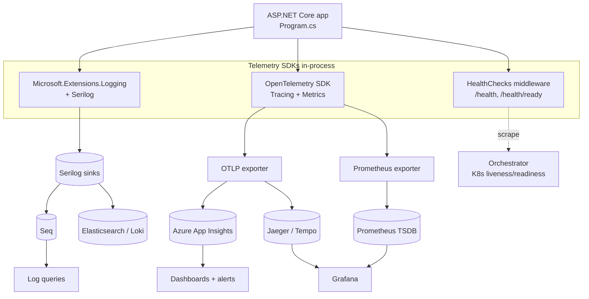

# Production Monitoring and Diagnostics

> **One-liner**: Production .NET incidents follow a small number of repeatable patterns; the job is to (1) have logs / metrics / traces wired up *before* the incident, (2) drive a tight observe → hypothesize → instrument → fix loop *during* it, and (3) recognize the pattern fast enough that the fix is the *known* fix.

---

## Quick Reference

### Symptom → first-look tool

| Symptom | First tool to reach for | Then |
|---------|-------------------------|------|
| Latency spike on one endpoint | APM trace (App Insights / Jaeger) for a slow request | Look for the longest span; check downstream dependency |
| Memory growing forever | `dotnet-counters monitor` → `gc-heap-size` | `dotnet-gcdump collect`, diff two snapshots |
| CPU pinned at 100% | `dotnet-counters monitor` → `cpu-usage` + `threadpool-thread-count` | `dotnet-trace collect --profile cpu-sampling` |
| Requests queue / timeouts under load | `threadpool-queue-length`, `threadpool-thread-count` | Check for sync-over-async (`.Result`, `.Wait()`) |
| 500s after a deploy | Logs filtered by `level=Error`, last 15 min | Check exception type; correlate with the deploy SHA |
| EF query slow | `Microsoft.EntityFrameworkCore.Database.Command` log at `Information` | Inspect generated SQL; `EXPLAIN` it; add index |
| One pod crashes repeatedly | `kubectl logs --previous`, exit code, OOMKilled? | Check container memory limit vs heap; dump on crash |
| Cold start slow | App Insights "Server response time" first request after scale-out | Pre-warm, ReadyToRun, AOT, smaller image |

### Tool → primary use

| Tool | Use |
|------|-----|
| **OpenTelemetry** (`OpenTelemetry.Extensions.Hosting`) | Logs + metrics + traces, vendor-neutral, OTLP export |
| **Serilog** (`Serilog.AspNetCore`) | Structured logging with sinks (Seq, Elasticsearch, file) |
| **Application Insights** (`Azure.Monitor.OpenTelemetry.AspNetCore`) | Azure-hosted APM: live metrics, end-to-end traces, profiler |
| **Prometheus + Grafana** | OSS metrics scrape + dashboards; pair with OTel Prom exporter |
| **Seq** | Local/self-hosted structured-log query UI; great for dev/staging |
| **`dotnet-counters`** | Live counter monitor — no instrumentation needed |
| **`dotnet-trace`** | EventPipe collection — CPU sampling, GC events, async causality |
| **`dotnet-dump`** | Full process dump for offline analysis with SOS / WinDbg |
| **`dotnet-gcdump`** | Lightweight heap snapshot — diff to find retention paths |
| **`dotnet-stack`** | Print managed call stacks of all threads — fast deadlock triage |
| **PerfView** (Windows) | ETW traces, allocation profiling, contention analysis |
| **JetBrains dotMemory / dotTrace** | GUI heap/CPU profilers; remote-attach capable |
| **`/health` endpoints** (`Microsoft.Extensions.Diagnostics.HealthChecks`) | Liveness + readiness probes for orchestrators |

---

## Core Concept

Observability rests on three pillars. **Logs** answer *what happened* — a discrete event with structured properties. **Metrics** answer *how much, how often* — numeric time-series like requests per second or Gen 2 collection count. **Traces** answer *where time went* — the causal span tree of one request as it flows through services and dependencies. You need all three because each pillar is a poor substitute for the others: logs without traces lose causality, metrics without logs lose detail, and traces without metrics lose the trend.

The diagnostic loop is **Observe → Hypothesize → Instrument → Fix → Verify**. Observe the symptom in a dashboard or alert. Hypothesize a cause from the shape of the data. Instrument to confirm — add a counter, take a dump, capture a trace. Fix narrowly. Verify the symptom is gone *and* no new symptom appeared. The loop only works if telemetry is already wired up; bolting on logging at 2 AM during an outage is the most expensive engineering hour in your career.

Pattern recognition is the senior-engineer multiplier. Most production incidents are a small recurring set of shapes — thread pool starvation, connection-pool exhaustion, an N+1 query, an unclosed event subscription, a runaway log. Once you have seen each shape twice, the next occurrence is a five-minute fix instead of a five-hour drill.

Without this discipline, teams thrash: they restart pods, roll back deploys, blame the network, and the real cause survives to bite again next week. The rest of this note is the cheat-sheet form of that vocabulary.

---

## Diagram



---

## Syntax & API

### Structured logging with Serilog

```bash
dotnet add package Serilog.AspNetCore
dotnet add package Serilog.Sinks.Console
dotnet add package Serilog.Sinks.Seq
```

```csharp
// Program.cs
using Serilog;

var builder = WebApplication.CreateBuilder(args);

builder.Host.UseSerilog((ctx, sp, cfg) => cfg
    .ReadFrom.Configuration(ctx.Configuration)
    .Enrich.FromLogContext()
    .Enrich.WithMachineName()
    .Enrich.WithEnvironmentName()
    .WriteTo.Console(outputTemplate:
        "[{Timestamp:HH:mm:ss} {Level:u3}] {SourceContext} {Message:lj} {Properties:j}{NewLine}{Exception}")
    .WriteTo.Seq("http://seq:5341"));

var app = builder.Build();
app.UseSerilogRequestLogging();   // one log per request, with elapsed ms + status
app.MapGet("/orders/{id:int}", (int id, ILogger<Program> log) =>
{
    log.LogInformation("Fetching order {OrderId}", id);   // structured, NOT $"" interpolation
    return Results.Ok(new { id });
});
app.Run();
```

**Why structured**: each property becomes a queryable column in Seq / Elasticsearch — `OrderId=42` is filterable; a string `"Fetching order 42"` is not. **Never** use string interpolation in `ILogger` calls — you lose the property *and* you incur the format cost even when the log level is filtered out.

### OpenTelemetry — traces and metrics

```bash
dotnet add package OpenTelemetry.Extensions.Hosting
dotnet add package OpenTelemetry.Instrumentation.AspNetCore
dotnet add package OpenTelemetry.Instrumentation.Http
dotnet add package OpenTelemetry.Instrumentation.EntityFrameworkCore
dotnet add package OpenTelemetry.Instrumentation.Runtime
dotnet add package OpenTelemetry.Exporter.OpenTelemetryProtocol
```

```csharp
// Program.cs (additive)
using OpenTelemetry.Resources;
using OpenTelemetry.Trace;
using OpenTelemetry.Metrics;

builder.Services.AddOpenTelemetry()
    .ConfigureResource(r => r.AddService("orders-api", serviceVersion: "1.4.2"))
    .WithTracing(t => t
        .AddAspNetCoreInstrumentation()
        .AddHttpClientInstrumentation()
        .AddEntityFrameworkCoreInstrumentation(o => o.SetDbStatementForText = true)
        .AddOtlpExporter())     // points at OTEL_EXPORTER_OTLP_ENDPOINT
    .WithMetrics(m => m
        .AddAspNetCoreInstrumentation()
        .AddHttpClientInstrumentation()
        .AddRuntimeInstrumentation()    // GC, threadpool, exceptions, contention
        .AddOtlpExporter());
```

```csharp
// Custom span around a critical section
using System.Diagnostics;
private static readonly ActivitySource Activity = new("orders-api");

public async Task<Order> PlaceOrderAsync(OrderRequest req, CancellationToken ct)
{
    using var act = Activity.StartActivity("PlaceOrder");
    act?.SetTag("user.id", req.UserId);
    act?.SetTag("order.total_cents", req.TotalCents);
    // ... business logic ...
    return order;
}
```

**Why both**: traces show *where* time went in one request (a single span tree per HTTP call); metrics show *how much* over time (P99 latency, requests/sec, GC count). Logs without traces = no causality; metrics without logs = no detail.

### Health checks — liveness vs readiness

```bash
dotnet add package Microsoft.Extensions.Diagnostics.HealthChecks
dotnet add package AspNetCore.HealthChecks.SqlServer
dotnet add package AspNetCore.HealthChecks.Redis
```

```csharp
builder.Services.AddHealthChecks()
    .AddSqlServer(builder.Configuration.GetConnectionString("Sql")!, tags: ["ready"])
    .AddRedis(builder.Configuration.GetConnectionString("Redis")!, tags: ["ready"])
    .AddCheck("self", () => HealthCheckResult.Healthy(), tags: ["live"]);

app.MapHealthChecks("/health/live",  new() { Predicate = c => c.Tags.Contains("live")  });
app.MapHealthChecks("/health/ready", new() { Predicate = c => c.Tags.Contains("ready") });
```

```yaml
# Kubernetes Deployment fragment
livenessProbe:
  httpGet: { path: /health/live,  port: 8080 }
  periodSeconds: 10
  failureThreshold: 3
readinessProbe:
  httpGet: { path: /health/ready, port: 8080 }
  periodSeconds: 5
  failureThreshold: 2
```

**Liveness** = "is the process alive enough to keep?" — fail → restart. **Readiness** = "should we route traffic to it?" — fail → remove from load-balancer rotation but **don't** restart. Confusing them causes restart storms (readiness failing → liveness restarts → readiness still failing → loop).

### Live diagnostics — `dotnet-counters` / `-trace` / `-dump` / `-gcdump`

```bash
dotnet tool install -g dotnet-counters
dotnet tool install -g dotnet-trace
dotnet tool install -g dotnet-dump
dotnet tool install -g dotnet-gcdump
dotnet tool install -g dotnet-stack

# Find the target PID
dotnet-counters ps

# Live counters — System.Runtime + ASP.NET + Kestrel + EF
dotnet-counters monitor -p <PID> --counters System.Runtime,Microsoft.AspNetCore.Hosting,Microsoft.EntityFrameworkCore

# 30-second CPU sampling trace → SpeedScope
dotnet-trace collect -p <PID> --profile cpu-sampling --duration 00:00:30 --format Speedscope

# Heap snapshot (no full dump — fast, smaller)
dotnet-gcdump collect -p <PID> -o before.gcdump
# ... reproduce workload ...
dotnet-gcdump collect -p <PID> -o after.gcdump
# Open both in Visual Studio or PerfView; "Diff" view shows new retainers

# Full process dump (for SOS / WinDbg / dotnet-dump analyze)
dotnet-dump collect -p <PID> -o crash.dmp
dotnet-dump analyze crash.dmp
> threads
> clrstack
> dumpheap -stat
> gcroot <address>

# All managed call stacks — instant deadlock triage
dotnet-stack report -p <PID>
```

Running inside a container? Mount `/tmp` shared with the host or use `kubectl exec -it <pod> -- bash` and install the tool there. The tools attach via the **diagnostic port** (a Unix socket at `/tmp/dotnet-diagnostic-<pid>`), so no debug build, no source code, no app restart is required.

### Application Insights — Azure drop-in

```bash
dotnet add package Azure.Monitor.OpenTelemetry.AspNetCore
```

```csharp
builder.Services.AddOpenTelemetry().UseAzureMonitor(o =>
{
    o.ConnectionString = builder.Configuration["AppInsights:ConnectionString"];
});
```

You now get: distributed traces (per request, per dependency), Live Metrics Stream (real-time), Failures + Performance blades, Profiler (production CPU/allocation traces), Snapshot Debugger (exception state on first occurrence). Sampling defaults to adaptive — turn it down to `1.0` for low-traffic apps so you don't miss the one error you care about.

---

## Common Patterns

### Pattern 1 — High request latency (P95/P99 spike)

**Symptoms**:
- P95/P99 rises sharply while P50 stays flat — a *tail-latency* problem, not a baseline one
- The spike is concentrated on one endpoint, or one downstream dependency dominates the trace
- APM trace tree shows a single long span that wasn't there yesterday

**Confirm with**:
```bash
# APM: filter requests where duration > P95 in last 1h, sort desc, open the span tree
# Live counters:
dotnet-counters monitor -p <PID> --counters Microsoft.AspNetCore.Hosting,Microsoft.AspNetCore.Server.Kestrel
# .NET 8+: per-request duration lives in the `http.server.request.duration`
# histogram (Meter API), not in EventCounters — read it from Prometheus / OTLP / App Insights.
```

**Root causes**:
- N+1 EF query (one parent SELECT, N child SELECTs) introduced by a new include path
- Downstream HTTP dependency slowed down; your timeout is generous so latency leaks through
- Sync I/O on the request thread (`.Result`, `.Wait()`) — see Pattern 4
- Lock contention on a shared singleton — `monitor-lock-contention-count` rising
- Cold cache after a deploy or scale-out — first N requests hit the database

**Fix**:
```csharp
// EF: collapse N+1 with Include + project + AsNoTracking
var orders = await db.Orders
    .AsNoTracking()
    .Where(o => o.UserId == userId)
    .Include(o => o.Items)              // single JOIN, not N queries
    .Select(o => new OrderDto(o.Id, o.Total, o.Items.Select(i => i.Sku)))
    .ToListAsync(ct);
```

```csharp
// HttpClient with bounded latency budget + circuit breaker
builder.Services.AddHttpClient<PricingClient>(c =>
{
    c.BaseAddress = new Uri("https://pricing.internal");
    c.Timeout = TimeSpan.FromSeconds(2);
})
.AddStandardResilienceHandler(o =>
{
    o.Retry.MaxRetryAttempts = 2;
    o.CircuitBreaker.FailureRatio = 0.5;
});
```

Each call now has a hard timeout, latency is bounded, and an unhealthy dependency trips the breaker instead of dragging every request behind it. See [[16 - Entity Framework Core]] for query shaping and [[11 - Caching]] for warming strategies that hide cold-cache latency.

### Pattern 2 — Memory growth / managed leak

**Symptoms**:
- Working set grows monotonically across hours or days — *not* a saw-tooth shape (saw-tooth is healthy GC)
- `gc-heap-size`, `gen-2-size`, and `gen-2-gc-count` all rise; `loh-size` may grow if large arrays leak
- Pod eventually hits the memory limit and is `OOMKilled` by the orchestrator

**Confirm with**:
```bash
dotnet-counters monitor -p <PID> --counters System.Runtime[gc-heap-size,gen-2-size,gen-2-gc-count,alloc-rate]
dotnet-gcdump collect -p <PID> -o before.gcdump
# ... drive workload for 5 minutes ...
dotnet-gcdump collect -p <PID> -o after.gcdump
# Open both in VS Diagnostic Tools or PerfView, use the Diff view; sort by "Size Diff" desc
```

**Root causes**:
- Event handler subscribed but never unsubscribed — publisher holds subscriber forever
- Static collection (`Dictionary`, `List`) growing without bound — no eviction policy
- Captured `this` in a long-lived lambda passed to `Timer`, `PeriodicTimer`, or an event
- `HttpClient` constructed per request — `SocketsHttpHandler` rotation hangs onto sockets
- `DbContext` registered Singleton (or held by a long-lived service) — entity tracker grows forever
- `Task.Delay` / `Timer` started with no `CancellationToken` and never stopped

**Fix**:
```csharp
public sealed class OrderView : IDisposable
{
    private readonly OrderService _svc;
    public OrderView(OrderService svc)
    {
        _svc = svc;
        _svc.Changed += OnChanged;
    }
    private void OnChanged(object? s, EventArgs e) { /* refresh */ }
    public void Dispose() => _svc.Changed -= OnChanged;   // break the chain
}

// Bound the cache
builder.Services.AddMemoryCache(o => o.SizeLimit = 100_000);

// One typed client, factory-managed sockets
builder.Services.AddHttpClient<PricingClient>();
```

A managed leak is always a reference-chain bug: the GC can't collect what something still points at. The fix is to break the chain — unsubscribe, dispose, expire, or weaken the reference. Walk through [[07 - Memory Leaks and Profiling]] for the full diagnosis playbook.

### Pattern 3 — CPU spike sustained at ~100%

**Symptoms**:
- `cpu-usage` pegged near 100% across all cores; the host or container shows the same
- Latency rises across every endpoint, not just one
- Throughput may collapse if the loop is starving the request pipeline

**Confirm with**:
```bash
# 30-second CPU sample → upload speedscope.json to https://www.speedscope.app
dotnet-trace collect -p <PID> --profile cpu-sampling --duration 00:00:30 --format Speedscope
```

**Root causes**:
- Tight loop — missing `await`, a retry-without-backoff loop, or accidental recursion
- Regex catastrophic backtracking on user-supplied input
- JSON serialization of huge objects on the hot path (deep object graph, no source-gen)
- `LogDebug` / `LogTrace` running in production without an `IsEnabled` guard — string-formatting cost dominates
- GC stuck — see Pattern 7 (GC pressure can manifest as CPU spike)

**Fix**:
```csharp
// Bound regex work — 50ms timeout, compiled once
private static readonly Regex Sku = new(@"^[A-Z]{3}-\d{6}$",
    RegexOptions.Compiled, matchTimeout: TimeSpan.FromMilliseconds(50));

// Source-gen JSON — no reflection on hot path
[JsonSerializable(typeof(OrderDto))]
internal partial class AppJsonContext : JsonSerializerContext { }

// Guard verbose logging
if (log.IsEnabled(LogLevel.Debug))
    log.LogDebug("Order payload: {Payload}", JsonSerializer.Serialize(order));
```

A sustained CPU spike means the hot path is doing more work per call than it should. Sampling tells you which call. See [[06 - Performance Optimization]] for hot-path discipline and [[15 - Source Generators]] for compile-time alternatives to reflection.

### Pattern 4 — Thread pool starvation

**Symptoms**:
- `threadpool-queue-length` climbs steadily; work is queued but not started
- `threadpool-thread-count` rises *slowly* — about one new thread every 500ms (the hill-climbing heuristic)
- Latency spikes across **all** endpoints simultaneously, including health checks
- Liveness probes start failing; Kubernetes restarts the pod even though it isn't really broken

**Confirm with**:
```bash
dotnet-counters monitor -p <PID> --counters System.Runtime[threadpool-queue-length,threadpool-thread-count,threadpool-completed-items-count]
dotnet-stack report -p <PID> | grep -E "Wait|Result"   # threads parked inside .Result / .Wait()
```

**Root causes**:
- Sync-over-async: `.Result`, `.Wait()`, or `Task.Run(async).Result` — a thread is blocked waiting for an async operation that itself needs a thread to complete
- Library missing `ConfigureAwait(false)` and being called from a captured context
- Sync I/O (`File.ReadAllText`, `WebClient`) sitting on an async request path
- `Task.Run` used to offload I/O-bound work — wastes a thread on something that should be awaited

**Fix**:
```csharp
// BAD — blocks a pool thread waiting for an async result
public IActionResult GetThing(int id) =>
    Ok(_svc.GetAsync(id).Result);

// GOOD — async all the way down, no thread is parked
public async Task<IActionResult> GetThing(int id, CancellationToken ct) =>
    Ok(await _svc.GetAsync(id, ct));

// Temporary workaround (NOT a fix): raise the floor so hill-climbing doesn't bottleneck startup
// Call BEFORE host.Run() — only buys you time while you remove the sync-over-async
ThreadPool.SetMinThreads(workerThreads: 200, completionPortThreads: 200);
```

The root cause is always "wait for I/O on a CPU thread" or "wait for an async result synchronously". Raising the min thread count masks symptoms but doesn't fix the bug. See [[06 - Async and Await]] for the full async discipline.

### Pattern 5 — Database connection pool exhaustion

**Symptoms**:
- Bursts of `Timeout expired. The timeout period elapsed prior to obtaining a connection from the pool` exceptions
- Latency rises proportional to load; new requests can't even acquire a connection
- `Microsoft.Data.SqlClient.EventSource[active-hard-connections]` is pinned at the pool ceiling

**Confirm with**:
```bash
dotnet-counters monitor -p <PID> --counters Microsoft.Data.SqlClient.EventSource[active-hard-connections,hard-connects,soft-connects]
# Also inspect the connection string — default Max Pool Size is 100
```

**Root causes**:
- `DbContext` / `SqlConnection` not disposed — `using`/`await using` missing, or exception path leaks
- Long-running transaction holding the connection open while it does *other* work (HTTP call, slow loop)
- `DbContext` registered as Singleton — it must be Scoped; one connection is held forever per app instance
- `Max Pool Size` too low for the load profile
- Connection leak under exception paths — connection is never returned to the pool

**Fix**:
```csharp
// Correct registration — Scoped is the default and the right answer
builder.Services.AddDbContext<AppDb>(o => o.UseSqlServer(connStr));

// Or, for short-lived units of work outside a request scope, use a factory
builder.Services.AddDbContextFactory<AppDb>(o => o.UseSqlServer(connStr));

// Consume the factory inside a service method — always dispose
public async Task<Order?> GetAsync(int id, CancellationToken ct)
{
    await using var db = await _factory.CreateDbContextAsync(ct);
    return await db.Orders.FindAsync([id], ct);
}

// Tuning, only after fixing the leak
// "Server=...;Database=...;Max Pool Size=200;Connection Lifetime=300"
```

Pool exhaustion is almost always a leak or a lifetime bug, not a sizing bug. Raise the pool only after you have confirmed the steady-state demand. See [[16 - Entity Framework Core]] for `DbContext` lifetimes and pooling.

### Pattern 6 — Deadlock (async or `lock`-based)

**Symptoms**:
- Specific endpoints hang forever — no exception, no completion, no log
- `dotnet-stack` shows threads waiting on each other's monitors or semaphores
- In legacy ASP.NET (Framework, not Core), `.Result` deadlocks with the captured `SynchronizationContext`

**Confirm with**:
```bash
dotnet-stack report -p <PID>     # look for "Awaiting on" + cycles in the lock graph
# Or take a dump and inspect inside dotnet-dump analyze
dotnet-dump collect -p <PID> -o hang.dmp
dotnet-dump analyze hang.dmp
> threads
> syncblk
> clrstack -all
```

**Root causes**:
- Locks acquired in inconsistent order across code paths (A→B in one, B→A in another)
- Async code under a captured `SynchronizationContext` (UI, legacy ASP.NET) blocking on `.Result`
- A `Monitor`-based lock held *across* an `await` (the C# compiler now blocks `lock { await }`, but `Monitor.Enter` / `Monitor.Exit` around `await` still compiles — the continuation may resume on a different thread that can't re-enter). Use `SemaphoreSlim` for any critical section that needs `await` inside it.
- Two `SemaphoreSlim` instances acquired in opposite orders by two requests

**Fix**:
```csharp
// Rule: always acquire _userLock BEFORE _orderLock — never reverse.
// Document the order; review it in every PR that touches either lock.
private readonly SemaphoreSlim _userLock  = new(1, 1);
private readonly SemaphoreSlim _orderLock = new(1, 1);

public async Task TransferAsync(int userId, int orderId, CancellationToken ct)
{
    await _userLock.WaitAsync(ct);
    try
    {
        await _orderLock.WaitAsync(ct);
        try
        {
            // critical section
        }
        finally { _orderLock.Release(); }
    }
    finally { _userLock.Release(); }
}
```

.NET Core has no captured `SynchronizationContext` by default, so the classic ASP.NET Framework `.Result` deadlock is largely gone — but `SemaphoreSlim` cycles and lock-order bugs survive everywhere. Prefer async-friendly coordination primitives and document acquisition order. See [[08 - Synchronization Primitives]] for the full toolbox.

### Pattern 7 — GC pressure (frequent Gen 2 + LOH growth)

**Symptoms**:
- `gen-2-gc-count` rising rapidly; `loh-size` grows
- CPU spikes correlate with GC pauses (Workstation GC) or throughput dips (Server GC)
- `% time in GC` exceeds ~10% — the runtime is spending real time collecting, not working

**Confirm with**:
```bash
dotnet-counters monitor -p <PID> --counters System.Runtime[gc-heap-size,gen-0-gc-count,gen-1-gc-count,gen-2-gc-count,loh-size,poh-size,alloc-rate,gc-fragmentation,time-in-gc]
# Detailed GC events for PerfView "GC Stats"
dotnet-trace collect -p <PID> --providers Microsoft-Windows-DotNETRuntime:0x1:4 --duration 00:01:00
```

**Root causes**:
- Large arrays or strings ≥ 85 KB — go straight to the LOH and are expensive to collect
- Per-request reallocation of large buffers instead of pooling
- Boxing in hot loops — `object[]` of value types, `string.Format` with value-type args
- `StringBuilder` allocated per call instead of reused
- Server GC disabled in a server workload — Workstation GC pauses the app threads

**Fix**:
```csharp
// Pool large buffers — never alloc on the hot path
private static readonly ArrayPool<byte> Pool = ArrayPool<byte>.Shared;

public async Task ProcessAsync(Stream s, CancellationToken ct)
{
    byte[] buf = Pool.Rent(128 * 1024);
    try { await s.ReadExactlyAsync(buf, ct); /* ... */ }
    finally { Pool.Return(buf); }
}

// Stack-allocate small scratch buffers — no GC at all
Span<char> tmp = stackalloc char[64];
```

```xml
<!-- csproj — turn on Server GC for server workloads -->
<PropertyGroup>
  <ServerGarbageCollection>true</ServerGarbageCollection>
  <ConcurrentGarbageCollection>true</ConcurrentGarbageCollection>
</PropertyGroup>
```

GC isn't slow — *allocation* is. Pool, reuse, or stack-allocate the hot path. See [[09 - Memory Management and GC]] for generation mechanics and [[08 - Span and Memory Types]] for zero-allocation patterns.

### Pattern 8 — 5xx error spike from unhandled exceptions

**Symptoms**:
- A burst of HTTP 500s within minutes of a deploy, feature flag flip, or downstream change
- App Insights Failures blade (or equivalent) shows one exception type dominating the burst
- Other endpoints are unaffected — the blast radius is narrow

**Confirm with**:
```bash
# Pseudo-query for Seq / App Insights / Loki
# level >= Error AND timestamp > now-30m | summarize count() by ExceptionType | top 5
# Then open one full exception with stack trace
```

**Root causes**:
- New code path with a missing null-check → `NullReferenceException`
- Serialization shape mismatch — DTO version changed but consumer is older
- Migration not run on production database → `SqlException` "invalid column name"
- Downstream timeout surfacing as `TaskCanceledException` mapped to 500
- `JsonException` from a malformed payload that should be a deterministic 400, not a 500

**Fix**:
```csharp
// Map deliberate failures to the right status code instead of letting the default 500 swallow them
app.UseExceptionHandler(errorApp => errorApp.Run(async ctx =>
{
    var ex = ctx.Features.Get<IExceptionHandlerFeature>()?.Error;
    (int status, string code) = ex switch
    {
        JsonException                                            => (400, "bad_request"),
        TaskCanceledException                                    => (504, "upstream_timeout"),
        ArgumentException                                        => (400, "invalid_argument"),
        InvalidOperationException io when io.Message.Contains("not found") => (404, "not_found"),
        _                                                        => (500, "internal_error")
    };
    ctx.Response.StatusCode = status;
    await ctx.Response.WriteAsJsonAsync(new { error = code });
}));
```

5xx in the wrong place ruins alert thresholds — every 400 misclassified as 500 pages an on-call. Map deliberate failures to deterministic codes. See [[08 - Exception Handling]] for global handler patterns and `ProblemDetails`.

### Pattern 9 — Cold-start latency (slow first request)

**Symptoms**:
- First request after a deploy or scale-out takes seconds, not milliseconds
- App Insights "Server response time" shows a single spike at the start of each instance's lifetime
- Worst in serverless (Functions), K8s scale-from-zero, and rolling restarts

**Confirm with**:
```bash
# Separate cold from warm with a small load test
hey -n 1   -c 1  https://api.example/ping       # cold
hey -n 1000 -c 50 https://api.example/ping      # warm
# Trace the first 15s after startup — CPU sampling catches JIT/reflection cost
dotnet-trace collect -p <PID> --profile cpu-sampling --duration 00:00:15 --format Speedscope
# For JIT-specific events, add the runtime provider with the JIT keyword (0x10):
#   dotnet-trace collect -p <PID> --providers Microsoft-Windows-DotNETRuntime:0x10:5 --duration 00:00:15
```

**Root causes**:
- JIT compilation of hot paths on first execution
- Lazy DI registrations resolving for the first time on the first request
- EF Core model warmup — `OnModelCreating` runs once per process, on first DbContext use
- Reflection-heavy startup (Newtonsoft.Json converters, AutoMapper profile scan)
- Container image cold — image pull + filesystem cache empty

**Fix**:
```xml
<!-- csproj — ReadyToRun precompiles to native; TieredPGO learns hot paths -->
<PropertyGroup>
  <PublishReadyToRun>true</PublishReadyToRun>
  <TieredCompilation>true</TieredCompilation>
  <TieredPGO>true</TieredPGO>
</PropertyGroup>
```

```csharp
// EF Core — use a compiled model so OnModelCreating doesn't run on first request
builder.Services.AddDbContext<AppDb>(o => o
    .UseSqlServer(connStr)
    .UseModel(AppDbModel.Instance));   // generated by dotnet ef dbcontext optimize

// Warm up critical paths after the host is ready
app.Lifetime.ApplicationStarted.Register(async () =>
{
    using var scope = app.Services.CreateScope();
    var orders = scope.ServiceProvider.GetRequiredService<OrdersService>();
    await orders.WarmUpAsync();
});
```

For strict cold-start budgets (Functions, edge workloads) consider Native AOT. See [[16 - Native Interop and AOT]] for the AOT trade-offs and [[17 - Docker and Containers]] for image-cold mitigations.

### Pattern 10 — Log flooding / disk I/O saturation from runaway logging

**Symptoms**:
- Disk I/O saturated; logs grow hundreds of megabytes per minute
- Network egress spikes if logs ship over the wire (App Insights, Loki, Elasticsearch)
- Latency rises because the logger is *blocking* on a full I/O queue — business code stalls on `Console.Out`

**Confirm with**:
```bash
# In your log backend (Seq / App Insights / Loki):
#   count() by SeverityLevel    in the last 15 minutes
# On the host:
iotop -aoP | head             # top processes by accumulated I/O
ls -lhS /var/log/app | head   # biggest log files
# Microsoft-Extensions-Logging is an EventSource (events, not counters) — capture with dotnet-trace:
dotnet-trace collect -p <PID> --providers Microsoft-Extensions-Logging --duration 00:00:30
```

**Root causes**:
- A `LogDebug` left inside a hot loop and promoted to `Information` accidentally
- Exception logged at every retry attempt — N retries = N stack traces per failed call
- Full request/response bodies logged on every request (multi-KB payloads)
- Sink misconfigured as synchronous — every log line is a flush
- App Insights sampling disabled on a high-traffic app — every span shipped

**Fix**:
```csharp
// Don't log inside retry callbacks — let the resilience handler emit one event per terminal failure
builder.Services.AddHttpClient<PricingClient>()
    .AddStandardResilienceHandler(o =>
    {
        o.Retry.MaxRetryAttempts = 3;
        o.Retry.OnRetry = args => default;   // intentionally empty — don't log per attempt
    });
```

`appsettings.Production.json` — raise verbose categories to Warning in prod:

```json
{
  "Logging": {
    "LogLevel": {
      "Default": "Information",
      "Microsoft.AspNetCore": "Warning",
      "Microsoft.EntityFrameworkCore.Database.Command": "Warning"
    }
  }
}
```

```csharp
// Async, buffered, non-blocking file sink — never stall business code on log I/O
Log.Logger = new LoggerConfiguration()
    .WriteTo.Async(a => a.File(
        path: "/var/log/app/app-.log",
        rollingInterval: RollingInterval.Day,
        buffered: true),
        bufferSize: 10_000,
        blockWhenFull: false)
    .CreateLogger();
```

Logs that block your app are an outage. Tune verbosity per category, sample at the SDK or sink, and never let log I/O sit on the request path. See [[18 - Logging]] for the full logging configuration guide.

---

## Gotchas & Tips

- **Wire telemetry up before you need it.** The cheapest moment to add OpenTelemetry / Serilog / health checks is the day you create the project. The most expensive moment is during an outage.
- **Use structured logging — always.** `log.LogInformation("Fetched {Count} orders for {UserId}", orders.Count, userId)` is filterable. `log.LogInformation($"Fetched {orders.Count} orders for {userId}")` is a haystack.
- **Health checks: liveness ≠ readiness.** Liveness fails → restart. Readiness fails → de-route only. Combine them and you'll restart healthy pods just because Redis is slow.
- **Sampling is not a dirty word.** 100% trace retention is unaffordable at scale. Adaptive sampling preserves the rare error trace and the latency tail without flooding the backend.
- **Correlate via `TraceId`.** Add `traceparent` propagation across services; surface `TraceId` in every error response. Without it, "find the related log line" is a needle-in-haystack at 2 AM.
- **One log per request is enough for the happy path.** `UseSerilogRequestLogging()` adds one log per request with duration + status. Inside business logic, log decisions, not narration.
- **Don't `.Result` / `.Wait()` an async call.** It's how you discover thread pool starvation in production. Search for `\.Result` and `\.Wait\(\)` in your codebase periodically.
- **`IHttpClientFactory` exists for a reason.** Direct `new HttpClient()` exhausts sockets *and* misses DNS changes (cached forever). Always go through the factory.
- **The default `DbContext` lifetime is Scoped — keep it.** Singleton `DbContext` is the #1 cause of connection-pool exhaustion and stale-data bugs.
- **`dotnet-counters` is free — install it on every prod host.** Counters add no overhead unless someone is monitoring; they ship inside the runtime; they answer "what is the app doing right now?" in five seconds.
- **Take heap snapshots in pairs.** A single snapshot tells you "what's in memory now"; two snapshots taken around a workload tell you "what *grew*" — the latter is where leaks live.
- **Map exceptions to status codes.** A 5xx is "we broke"; a 4xx is "you sent bad data". Conflating them ruins alert thresholds.
- **Reserve `LogError` for actionable surprises.** If "user typed an invalid email" is logged at Error, alert fatigue kills your team. Use `Warning` or `Information` for expected-bad input.
- **Profile in production-shaped environments.** A profile on your laptop with cached data and no concurrency tells you nothing about the prod hot path. Use App Insights Profiler, dotMemory remote-attach, or a staging environment with a representative load test.
- **Save dumps on crash automatically.** Set `DOTNET_DbgEnableMiniDump=1` and `DOTNET_DbgMiniDumpType=4` (heap dump) on container images you care about — when the next OOM happens you'll have forensic data without re-deploying.

---

## See Also

- [[18 - Logging]] — `ILogger`, log levels, structured logging, Serilog
- [[07 - Memory Leaks and Profiling]] — full diagnosis walkthrough for leaks
- [[06 - Performance Optimization]] — BenchmarkDotNet, ArrayPool, hot paths
- [[06 - Async and Await]] — sync-over-async is the root of half this note
- [[08 - Synchronization Primitives]] — async-friendly coordination
- [[09 - Memory Management and GC]] — Gen 0/1/2, LOH, GC modes
- [[08 - Span and Memory Types]] — zero-allocation hot paths
- [[16 - Entity Framework Core]] — N+1, `AsNoTracking`, DbContext lifetimes
- [[11 - Caching]] — cache-aside, `IMemoryCache`, `IDistributedCache`
- [[08 - Exception Handling]] — global handlers, `ProblemDetails`
- [[17 - Docker and Containers]] — container limits, `DOTNET_DbgEnableMiniDump`
- [[18 - CI-CD and DevOps]] — promoting builds, smoke-test gates, deploy correlation
