# OAuth 2.0, OIDC, SSO and Keycloak with .NET

> **One-liner**: **OAuth 2.0** is a delegated-authorization framework, **OIDC** layers identity on top of it, **SSO** is the user-visible outcome — and **Keycloak** is the open-source identity provider that implements all three so your .NET app never has to.

---

## Quick Reference

### Terminology

| Term | Meaning |
| ---- | ------- |
| **OAuth 2.0** | Framework for delegated **authorization** — granting a client limited access to a resource owner's data without sharing credentials. |
| **OIDC (OpenID Connect)** | Thin layer over OAuth 2.0 that adds **authentication** + an `id_token` describing *who* the user is. |
| **SSO (Single Sign-On)** | The user logs in once and gets access to many apps. Implemented via OIDC, SAML, or Kerberos. |
| **IdP (Identity Provider)** | The server that authenticates the user and issues tokens (Keycloak, Auth0, Entra ID, Okta). |
| **RP / Client** | The application that wants to authenticate the user (your .NET app). |
| **Resource Server** | An API that accepts access tokens and serves protected data. |
| **Resource Owner** | The human user. |
| **Access Token** | Bearer credential the API checks. Usually JWT, short-lived (5–60 min). |
| **ID Token** | JWT identifying the user, consumed by the client only. |
| **Refresh Token** | Long-lived opaque/JWT token used to get new access tokens. |
| **Scope** | A label the client asks for (`openid`, `profile`, `email`, `orders.read`). |
| **Audience (`aud`)** | Which API the access token is intended for. |
| **PKCE** | Proof Key for Code Exchange — mandatory for public clients (SPA, mobile, native). |
| **JWKS** | JSON Web Key Set — the IdP's public keys used to verify JWT signatures. |

### OAuth 2.0 Grant Types (when to pick which)

| Grant / Flow | Use for | Notes |
| ------------ | ------- | ----- |
| **Authorization Code + PKCE** | Web apps, SPAs, mobile, native | The default in 2025. PKCE replaces client secret for public clients. |
| **Client Credentials** | Service-to-service (no user) | Daemon / cron / backend integrations. |
| **Device Code** | TVs, CLIs, IoT (no browser) | User authorizes on a separate device. |
| **Refresh Token** | Renewing access tokens | Companion to Authorization Code. Rotate them. |
| **Resource Owner Password (ROPC)** | ❌ Avoid | Legacy; defeats SSO; can't do MFA. |
| **Implicit** | ❌ Avoid | Deprecated; tokens in URL fragment, no refresh. |

### Standard Endpoints (OIDC discovery)

`GET {issuer}/.well-known/openid-configuration` returns:

| Endpoint | Purpose |
| -------- | ------- |
| `authorization_endpoint` | Where the browser is redirected to log in |
| `token_endpoint` | Exchanges code → tokens, or refresh → tokens |
| `userinfo_endpoint` | Returns claims about the authenticated user |
| `jwks_uri` | Public keys to validate JWTs |
| `end_session_endpoint` | RP-initiated logout |
| `introspection_endpoint` | Validates opaque tokens (RFC 7662) |
| `revocation_endpoint` | Revokes a token (RFC 7009) |

---

## Core Concept

OAuth and OIDC are confused constantly. The cleanest separation:

- **OAuth answers: "What can this client do on behalf of the user?"** It hands the client an *access token* scoped to specific APIs. OAuth alone says nothing about *who* the user is.
- **OIDC answers: "Who is this user?"** It piggy-backs on OAuth's authorization-code flow, but adds an `id_token` (a JWT about the user, for the client) and a `userinfo` endpoint.
- **SSO** is the *experience*: log in once at the IdP, be recognized at every app that trusts the IdP. Under the hood it's OIDC sessions + IdP-side cookies; the IdP remembers you, so subsequent app logins are a redirect-and-back with no password prompt.

**Keycloak** is a turnkey IdP: realms, users, clients, federation (LDAP, social), MFA, fine-grained authorization. You point ASP.NET Core at Keycloak's discovery document and Keycloak does the heavy lifting.

The mental model you carry into every code sample:

```
User ⇄ Browser ⇄ Client (ASP.NET app) ⇄ Keycloak (IdP)
                          ⇣ access_token
                       Resource API
```

The client *never* validates credentials. It bounces the browser to Keycloak, gets a code, exchanges it for tokens, and forwards the access token to APIs.

---

## Diagram — the full picture

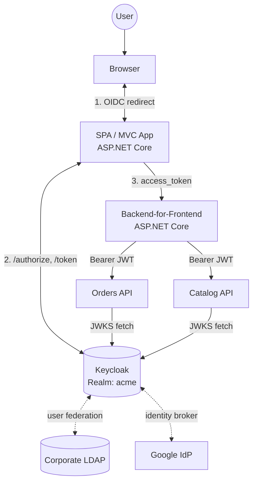

---

## OAuth 2.0 — the Authorization Code + PKCE flow in detail

The 2025 default for *every* interactive client. Even confidential server-side apps should add PKCE — defense in depth.

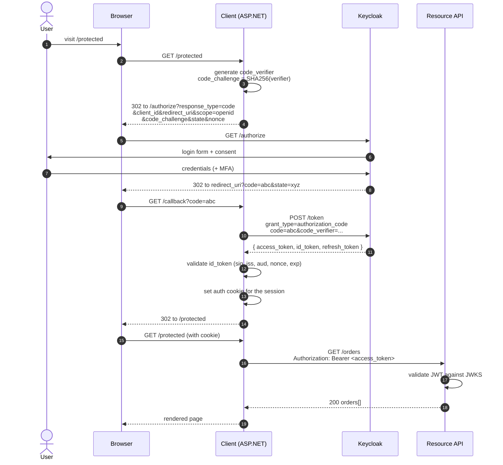

**Why PKCE matters:** without it, an attacker who intercepts the redirect (malicious app, browser extension, network) could trade the `code` for tokens. PKCE binds the `code` to a secret the attacker can't produce.

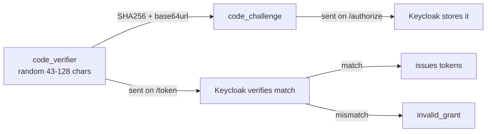

---

## Client Credentials — service-to-service

No user, no browser. Worker A wants to call API B.

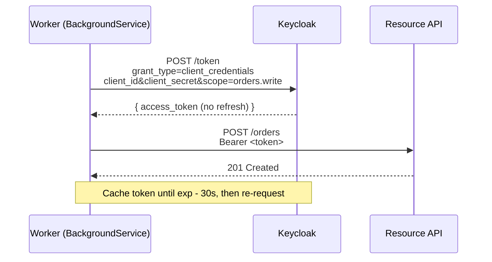

In .NET, use `IHttpClientFactory` + a typed client with a delegating handler that caches the token.

---

## Device Code — for TVs, CLIs, IoT

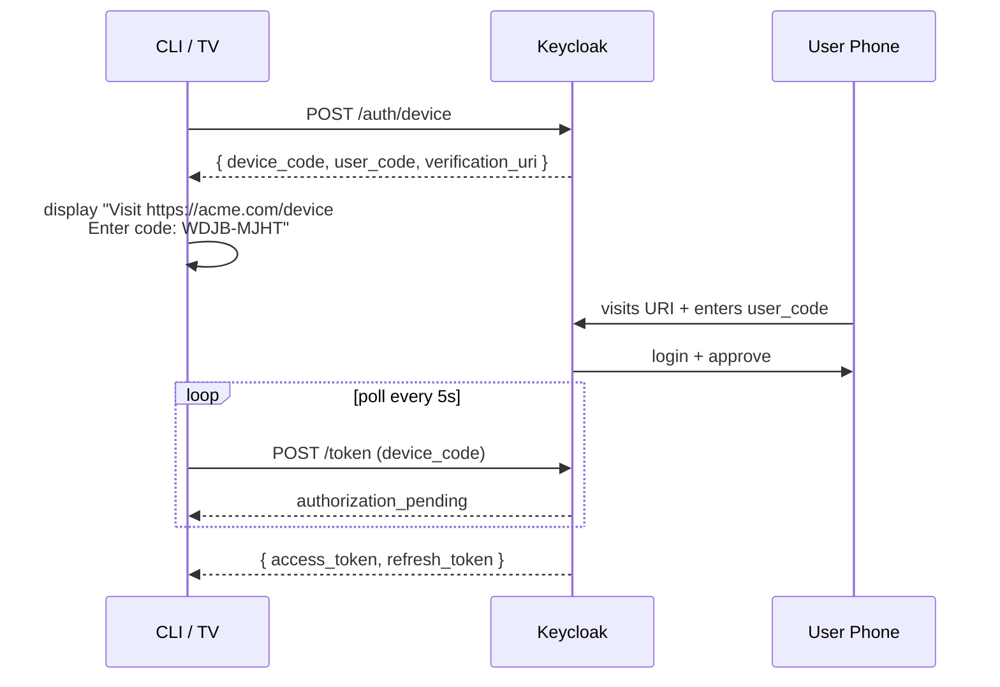

---

## Refresh Token Rotation

Short-lived access token (5–15 min) + longer-lived refresh token (hours/days). When the access token expires, the client silently exchanges the refresh token for a new pair. **Rotate** refresh tokens — issue a new one and invalidate the old on every use. If a rotated token is replayed, that's evidence of theft → revoke the whole family.

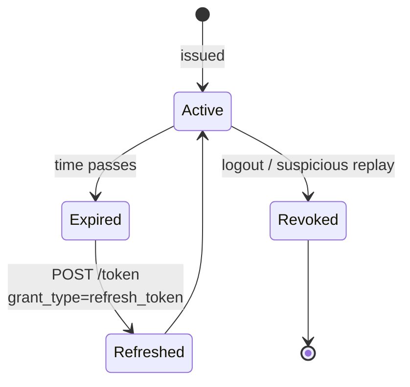

---

## OIDC — what OAuth alone is missing

OIDC adds:

1. **`id_token`** — a JWT *for the client*, containing standard claims (`sub`, `name`, `email`, `iat`, `exp`, `nonce`, `aud`).
2. **`/userinfo`** — endpoint returning user claims; useful when you don't want to bloat the ID token.
3. **Discovery** — `/.well-known/openid-configuration` documents every endpoint and supported feature.
4. **Standard scopes** — `openid` (required), `profile`, `email`, `address`, `phone`.

> **Key rule:** APIs validate the **access token**. Clients consume the **id_token**. Never send an id_token to an API; never validate user identity from an access token's `sub` alone unless you know the IdP injects identity claims into the access token (Keycloak does, by default).

---

## Anatomy of a JWT

```mermaid
graph LR
    Header[Header<br/>{ alg: RS256, kid: abc, typ: JWT }] -->|base64url| H1
    Payload[Payload / Claims<br/>{ iss, sub, aud, exp, iat, ... }] -->|base64url| P1
    H1[xxxxx] --> Dot1[.]
    Dot1 --> P1[yyyyy]
    P1 --> Dot2[.]
    Dot2 --> Sig[zzzzz<br/>signature]
    Sig -->|RS256 signed<br/>with private key| Signer[(IdP private key)]
```

**Claims you check on the API side:**

| Claim | Why |
| ----- | --- |
| `iss` | Must equal your trusted issuer URL (Keycloak realm). |
| `aud` | Must include your API's audience. |
| `exp` | Must be in the future. |
| `nbf` | Must be in the past (if present). |
| `iat` | Sanity-check it's not absurdly old. |
| `sub` | User id (use this, not `email`, as the primary key). |
| `azp` | Authorized party — which client requested this token. |
| Signature | Verified against `jwks_uri`. Cache JWKS, refresh on `kid` miss. |

---

## SSO — patterns and protocols

SSO is a *user-experience outcome* delivered by an underlying protocol. Three live options:

| Protocol | Notes |
| -------- | ----- |
| **OIDC** | Modern, JSON/JWT, mobile-friendly. Default in greenfield. |
| **SAML 2.0** | XML-based, dominant in enterprise/B2B. Keycloak speaks both. |
| **Kerberos** | Windows-domain SSO; integrate via SPNEGO/Negotiate. |

### SSO session anatomy

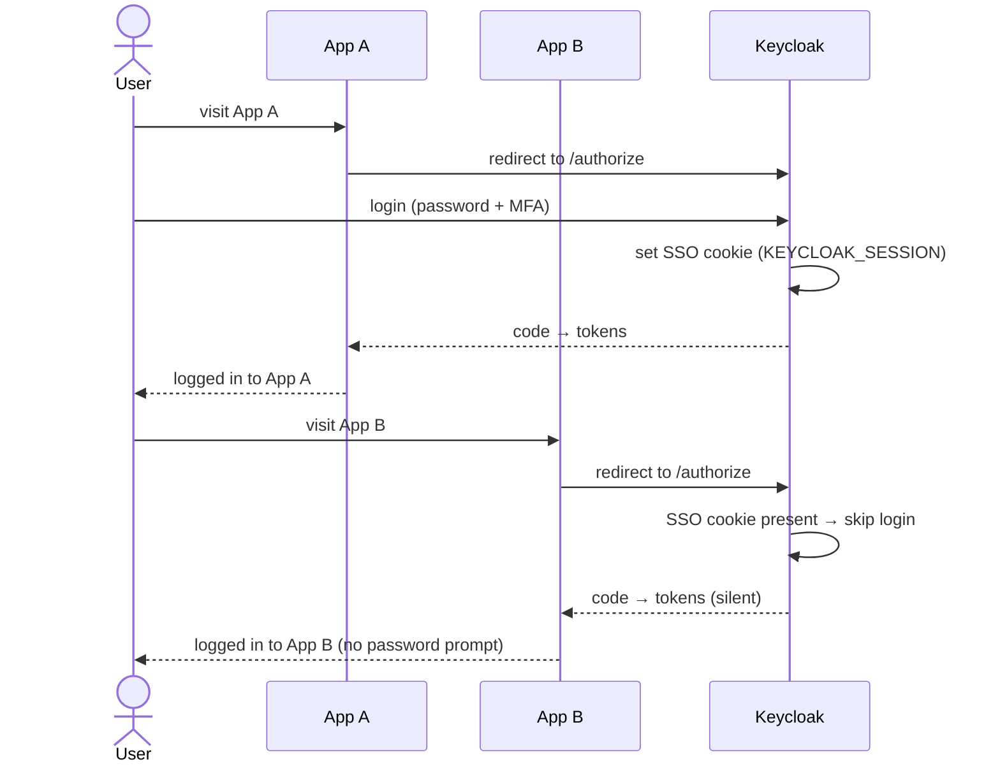

### Logout — front-channel vs back-channel

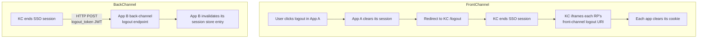

**Back-channel logout** is more reliable (no browser dependency, no third-party cookie issues) but each RP must implement a logout-token handler and a server-side session store keyed by `sid`.

---

## Keycloak Architecture

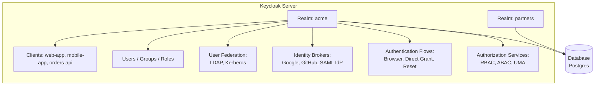

Key concepts:

| Concept | Meaning |
| ------- | ------- |
| **Realm** | Isolated tenant — own users, clients, roles, settings. One per environment or per tenant. |
| **Client** | A registered app: confidential (has secret) or public (no secret, PKCE required). |
| **Client scopes** | Reusable bundles of mappers/scopes shared across clients. |
| **Roles** | Realm-level or client-level RBAC labels. |
| **Groups** | Collections of users with inherited roles/attributes. |
| **Protocol mappers** | Decide what gets injected into id/access tokens. |
| **Authentication flow** | Configurable pipeline: cookie → kerberos → password → OTP. |

---

## Running Keycloak with Docker Compose

```yaml
# docker-compose.yml
version: "3.9"
services:
  postgres:
    image: postgres:16-alpine
    environment:
      POSTGRES_DB: keycloak
      POSTGRES_USER: keycloak
      POSTGRES_PASSWORD: keycloak
    volumes:
      - kc-data:/var/lib/postgresql/data

  keycloak:
    image: quay.io/keycloak/keycloak:25.0
    command: ["start-dev"]
    environment:
      KC_DB: postgres
      KC_DB_URL: jdbc:postgresql://postgres:5432/keycloak
      KC_DB_USERNAME: keycloak
      KC_DB_PASSWORD: keycloak
      KEYCLOAK_ADMIN: admin
      KEYCLOAK_ADMIN_PASSWORD: admin
      KC_HOSTNAME: localhost
      KC_HTTP_ENABLED: "true"
    ports:
      - "8080:8080"
    depends_on:
      - postgres

volumes:
  kc-data:
```

Bring up: `docker compose up -d`. Admin console: <http://localhost:8080>, login `admin/admin`.

### Bootstrap a realm via CLI

```bash
# inside the keycloak container
docker compose exec keycloak \
  /opt/keycloak/bin/kcadm.sh config credentials \
  --server http://localhost:8080 --realm master --user admin --password admin

# create realm
docker compose exec keycloak kcadm.sh create realms -s realm=acme -s enabled=true

# create a confidential client for the web app
docker compose exec keycloak kcadm.sh create clients -r acme \
  -s clientId=web-app -s 'redirectUris=["https://localhost:5001/signin-oidc"]' \
  -s 'webOrigins=["https://localhost:5001"]' \
  -s publicClient=false -s standardFlowEnabled=true -s frontchannelLogout=false

# create an API resource (bearer-only)
docker compose exec keycloak kcadm.sh create clients -r acme \
  -s clientId=orders-api -s bearerOnly=true

# create a role and assign to a user
docker compose exec keycloak kcadm.sh create roles -r acme -s name=orders-manager
docker compose exec keycloak kcadm.sh create users -r acme -s username=alice -s enabled=true
docker compose exec keycloak kcadm.sh set-password -r acme --username alice --new-password Password!
docker compose exec keycloak kcadm.sh add-roles -r acme --uusername alice --rolename orders-manager
```

---

## ASP.NET Core — Protecting an API with Keycloak

The API is a **resource server**: it validates the access token's signature against Keycloak's JWKS and reads the claims.

`appsettings.json`:

```json
{
  "Keycloak": {
    "Authority": "http://localhost:8080/realms/acme",
    "Audience": "orders-api",
    "RequireHttpsMetadata": false
  }
}
```

`Program.cs`:

```csharp
using Microsoft.AspNetCore.Authentication.JwtBearer;
using Microsoft.IdentityModel.Tokens;

var builder = WebApplication.CreateBuilder(args);

builder.Services
    .AddAuthentication(JwtBearerDefaults.AuthenticationScheme)
    .AddJwtBearer(o =>
    {
        o.Authority = builder.Configuration["Keycloak:Authority"];
        o.Audience  = builder.Configuration["Keycloak:Audience"];
        o.RequireHttpsMetadata = builder.Configuration
            .GetValue("Keycloak:RequireHttpsMetadata", true);

        o.TokenValidationParameters = new TokenValidationParameters
        {
            NameClaimType = "preferred_username",
            RoleClaimType = "roles",
            ValidateIssuer = true,
            ValidateAudience = true,
            ValidateLifetime = true,
            ValidateIssuerSigningKey = true,
            ClockSkew = TimeSpan.FromSeconds(30)
        };

        o.MapInboundClaims = false; // keep JWT claim names as-is
    });

builder.Services.AddAuthorization(o =>
{
    o.AddPolicy("OrdersManager", p =>
        p.RequireAssertion(ctx =>
            ctx.User.FindAll("realm_access")
               .SelectMany(c => System.Text.Json.JsonDocument
                   .Parse(c.Value).RootElement.GetProperty("roles")
                   .EnumerateArray().Select(e => e.GetString()))
               .Contains("orders-manager")));
});

var app = builder.Build();
app.UseAuthentication();
app.UseAuthorization();

app.MapGet("/orders", () => Results.Ok(new[] { new { Id = 1, Total = 99.95m } }))
   .RequireAuthorization("OrdersManager");

app.Run();
```

> **Keycloak claim quirk:** realm roles ship under `realm_access.roles` as nested JSON, not a flat `roles` claim. Either parse it (above) or add a protocol mapper in Keycloak that flattens it.

### Cleaner: a `KeycloakRolesClaimsTransformation`

```csharp
public sealed class KeycloakRolesClaimsTransformation : IClaimsTransformation
{
    public Task<ClaimsPrincipal> TransformAsync(ClaimsPrincipal principal)
    {
        if (principal.Identity is not ClaimsIdentity id) return Task.FromResult(principal);

        var realmAccess = principal.FindFirst("realm_access")?.Value;
        if (!string.IsNullOrEmpty(realmAccess))
        {
            using var doc = JsonDocument.Parse(realmAccess);
            if (doc.RootElement.TryGetProperty("roles", out var roles))
                foreach (var r in roles.EnumerateArray())
                    id.AddClaim(new Claim(ClaimTypes.Role, r.GetString()!));
        }
        return Task.FromResult(principal);
    }
}

builder.Services.AddSingleton<IClaimsTransformation, KeycloakRolesClaimsTransformation>();
```

Now `[Authorize(Roles = "orders-manager")]` works.

---

## ASP.NET Core — MVC / Razor app with OIDC login

This is the **client** side. Cookie auth for the session, OIDC challenge for login.

```csharp
using Microsoft.AspNetCore.Authentication.Cookies;
using Microsoft.AspNetCore.Authentication.OpenIdConnect;
using Microsoft.IdentityModel.Tokens;

var builder = WebApplication.CreateBuilder(args);

builder.Services
    .AddAuthentication(o =>
    {
        o.DefaultScheme = CookieAuthenticationDefaults.AuthenticationScheme;
        o.DefaultChallengeScheme = OpenIdConnectDefaults.AuthenticationScheme;
    })
    .AddCookie(o =>
    {
        o.Cookie.Name = ".acme.auth";
        o.Cookie.HttpOnly = true;
        o.Cookie.SameSite = SameSiteMode.Lax;
        o.Cookie.SecurePolicy = CookieSecurePolicy.Always;
        o.ExpireTimeSpan = TimeSpan.FromHours(8);
        o.SlidingExpiration = true;
    })
    .AddOpenIdConnect(o =>
    {
        o.Authority = "http://localhost:8080/realms/acme";
        o.ClientId  = "web-app";
        o.ClientSecret = builder.Configuration["Keycloak:ClientSecret"];
        o.ResponseType = "code";              // authorization code flow
        o.UsePkce      = true;                // PKCE on by default in .NET 8+
        o.SaveTokens   = true;                // store id/access/refresh in cookie
        o.GetClaimsFromUserInfoEndpoint = true;
        o.Scope.Add("openid");
        o.Scope.Add("profile");
        o.Scope.Add("email");
        o.Scope.Add("offline_access");        // ask for refresh token
        o.CallbackPath = "/signin-oidc";
        o.SignedOutCallbackPath = "/signout-callback-oidc";

        o.TokenValidationParameters = new TokenValidationParameters
        {
            NameClaimType = "preferred_username",
            RoleClaimType = "roles"
        };

        o.Events.OnRedirectToIdentityProviderForSignOut = ctx =>
        {
            // ensure id_token_hint goes along for RP-initiated logout
            var idToken = ctx.HttpContext.GetTokenAsync("id_token").Result;
            ctx.ProtocolMessage.IdTokenHint = idToken;
            return Task.CompletedTask;
        };
    });

builder.Services.AddAuthorization();
builder.Services.AddRazorPages();

var app = builder.Build();
app.UseHttpsRedirection();
app.UseAuthentication();
app.UseAuthorization();
app.MapRazorPages().RequireAuthorization();
app.MapGet("/logout", async ctx =>
{
    await ctx.SignOutAsync(CookieAuthenticationDefaults.AuthenticationScheme);
    await ctx.SignOutAsync(OpenIdConnectDefaults.AuthenticationScheme);
});
app.Run();
```

### How it flows

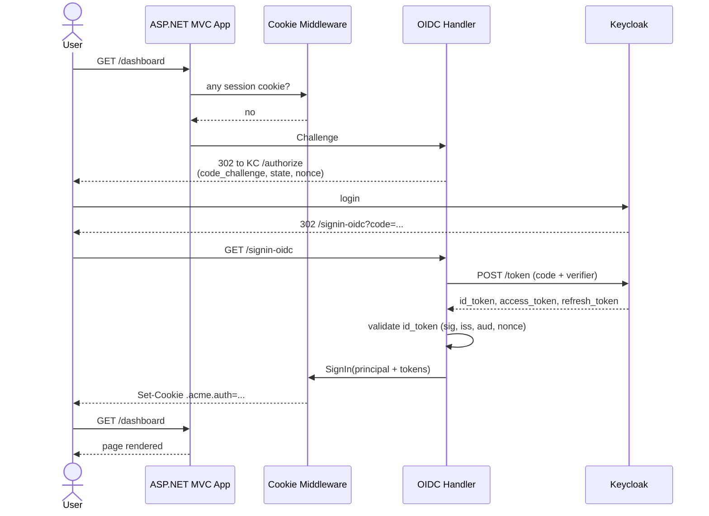

---

## Calling an API from the MVC App — passing the access token

```csharp
builder.Services.AddHttpClient("orders", c => c.BaseAddress = new("https://api.acme/"))
    .AddHttpMessageHandler<TokenForwardingHandler>();

builder.Services.AddTransient<TokenForwardingHandler>();

public sealed class TokenForwardingHandler(IHttpContextAccessor http) : DelegatingHandler
{
    protected override async Task<HttpResponseMessage> SendAsync(
        HttpRequestMessage req, CancellationToken ct)
    {
        var token = await http.HttpContext!.GetTokenAsync("access_token");
        if (!string.IsNullOrEmpty(token))
            req.Headers.Authorization = new("Bearer", token);
        return await base.SendAsync(req, ct);
    }
}
```

With `SaveTokens = true`, the cookie holds the access token. The handler attaches it to every outbound call to your API.

### Refreshing tokens silently

When the access token expires mid-session, you have two options:

1. **Re-challenge** — simplest; user sees a brief Keycloak redirect (often invisible thanks to SSO cookie).
2. **Refresh manually** in a delegating handler:

```csharp
async Task<string> RefreshAsync(HttpContext ctx)
{
    var refresh = await ctx.GetTokenAsync("refresh_token");
    using var http = new HttpClient();
    var resp = await http.PostAsync(
        "http://localhost:8080/realms/acme/protocol/openid-connect/token",
        new FormUrlEncodedContent(new Dictionary<string,string>
        {
            ["grant_type"] = "refresh_token",
            ["client_id"]  = "web-app",
            ["client_secret"] = "<secret>",
            ["refresh_token"] = refresh!
        }));
    var json = await resp.Content.ReadFromJsonAsync<JsonElement>();
    var newAccess = json.GetProperty("access_token").GetString()!;
    var newRefresh = json.GetProperty("refresh_token").GetString()!;
    // persist back into auth properties...
    return newAccess;
}
```

Or use the community package **`Duende.AccessTokenManagement.OpenIdConnect`** which automates rotation, caching, and per-request refresh.

---

## SPA + BFF pattern (recommended for browser apps)

**Don't** store tokens in `localStorage` — XSS sweeps them up. Use the **Backend-for-Frontend** pattern: the SPA talks only to a same-origin ASP.NET Core BFF over an HttpOnly cookie. The BFF holds the tokens server-side and forwards them to APIs.

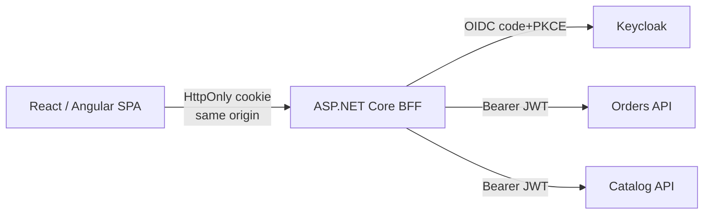

The Duende `BFF` framework or `Microsoft.AspNetCore.SpaProxy` + the OIDC handler above gives you this in a few lines. No JS library ever touches a token.

---

## Authorization Models in Keycloak

```mermaid
graph TD
    User --> Group[Group: 'EU Sales']
    Group --> RealmRole[Realm role: 'sales']
    User --> ClientRole[Client role: 'orders-api/orders-manager']
    RealmRole --> Token[Access token claims]
    ClientRole --> Token
    Token --> Policy[ASP.NET Policy:<br/>'OrdersManager' = role 'orders-manager']
    Policy --> Endpoint[/orders endpoint/]

    subgraph Fine-Grained Authorization (UMA / Keycloak Authz)
      Resource[Resource: order:42]
      Scope[Scope: read, write]
      Permission[Permission: 'managers can write']
      Policy2[Policy: role=orders-manager]
    end
```

Three options, increasing complexity:

1. **Realm/Client roles** — simple RBAC, mapped to ASP.NET roles. Default choice.
2. **Group membership + attribute mappers** — multi-tenant labels in the token.
3. **Keycloak Authorization Services (UMA 2.0)** — resource-level permissions evaluated by Keycloak. Your app sends an RPT request; Keycloak returns yes/no. Heavyweight; use only when business rules are too dynamic for code.

---

## Token Introspection — opaque tokens or revocation checks

If you turn off `aud` claims, or use opaque tokens, the API must call `/protocol/openid-connect/token/introspect` on every request. Slow — use sparingly.

```csharp
// using IdentityModel
var disco = await client.GetDiscoveryDocumentAsync(authority);
var introspect = await client.IntrospectTokenAsync(new TokenIntrospectionRequest
{
    Address = disco.IntrospectionEndpoint,
    ClientId = "orders-api",
    ClientSecret = "<secret>",
    Token = accessToken
});
if (!introspect.IsActive) return Results.Unauthorized();
```

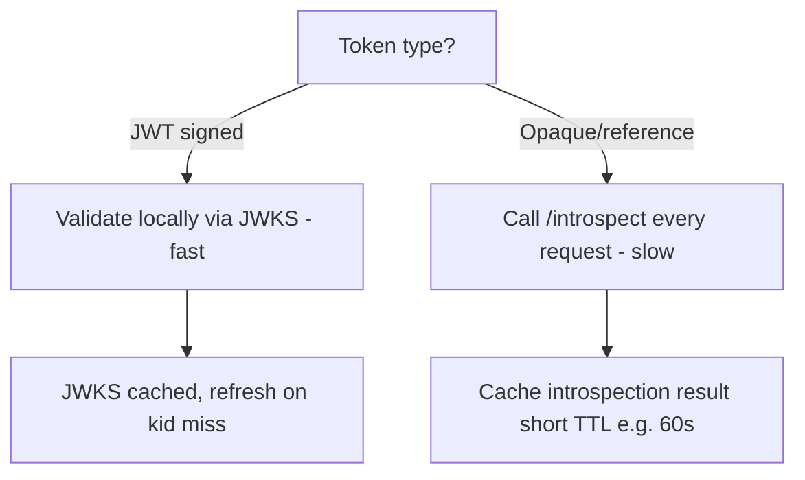

---

## Advanced — DPoP, mTLS, Proof-of-Possession

Bearer tokens are stealable. Two upgrades:

| Mechanism | Idea |
| --------- | ---- |
| **DPoP (RFC 9449)** | Client signs each request with a key bound to the token. Stolen token alone is useless without the key. |
| **mTLS / cnf claim** | Token is bound to a TLS client certificate. Used in finance/PSD2. |

Keycloak supports both as token-binding flows. .NET libraries are catching up — `Duende.AccessTokenManagement` ships DPoP in 2024+.

---

## Common Patterns

### Pattern: multi-tenant per-realm vs per-client

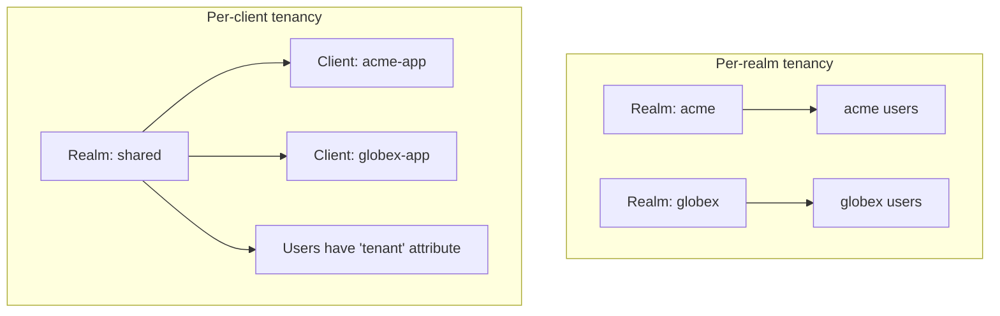

- **Per-realm** = strong isolation, harder to share users across tenants, more operational overhead.
- **Per-client** = lighter, easier user reuse, but tenant id must be enforced in every query.

### Pattern: claim mappers for tenant id

In Keycloak, create a user attribute `tenant_id`, then add a protocol mapper "User Attribute → access token claim". Your API reads `User.FindFirst("tenant_id")` and adds it to every DB filter.

### Pattern: JWKS caching with rotation

```csharp
o.ConfigurationManager = new ConfigurationManager<OpenIdConnectConfiguration>(
    $"{authority}/.well-known/openid-configuration",
    new OpenIdConnectConfigurationRetriever(),
    new HttpDocumentRetriever { RequireHttps = false })
{
    AutomaticRefreshInterval = TimeSpan.FromHours(12),
    RefreshInterval = TimeSpan.FromMinutes(5) // on kid miss
};
```

This is the default for ASP.NET Core's JwtBearer — but worth knowing when you debug "valid token rejected after rotation" issues.

### Pattern: testing protected endpoints

Use a stub IdP per test, not the real Keycloak. The `Microsoft.AspNetCore.TestHost` JwtBearer trick:

```csharp
public class TestAuthHandler(IOptionsMonitor<AuthenticationSchemeOptions> o,
    ILoggerFactory l, UrlEncoder e) : AuthenticationHandler<AuthenticationSchemeOptions>(o, l, e)
{
    protected override Task<AuthenticateResult> HandleAuthenticateAsync()
    {
        var claims = new[] { new Claim("sub", "test"), new Claim(ClaimTypes.Role, "orders-manager") };
        var identity = new ClaimsIdentity(claims, "Test");
        var ticket = new AuthenticationTicket(new ClaimsPrincipal(identity), "Test");
        return Task.FromResult(AuthenticateResult.Success(ticket));
    }
}
```

Register with `.AddAuthentication("Test").AddScheme<...>("Test", _ => {})` in `WebApplicationFactory`.

---

## Gotchas & Tips

- **Audience mismatch is the #1 cause of `401 Bearer error="invalid_token"`.** Keycloak doesn't add `aud` for the API by default — add a protocol mapper *Audience* or `tokenClaim.aud` config.
- **`MapInboundClaims = false`** stops .NET from renaming `sub` → `nameidentifier`. You almost always want this off.
- **HTTPS only in production.** Keycloak metadata won't be fetched over HTTP unless `RequireHttpsMetadata = false` (dev only).
- **Clock skew kills tokens in containers without NTP.** Default ASP.NET clock skew is 5 min — tighten to 30s once your infra is healthy.
- **Refresh tokens aren't free.** Each refresh hits Keycloak; cache and stagger refreshes if you have thousands of users.
- **`offline_access` scope = refresh token that survives session end** — use sparingly; it's effectively a long-lived credential.
- **Public clients must use PKCE.** Keycloak lets you enforce it: client → Advanced → "Proof Key for Code Exchange Code Challenge Method = S256".
- **Don't put PII in JWT claims.** Tokens often end up in logs.
- **Role explosions:** prefer policies + attribute claims over hundreds of roles. Roles in `realm_access.roles` are bytes you pay on every request.
- **`SameSite=Lax` breaks back-channel POSTs from the IdP.** For OIDC `form_post` response mode you need `SameSite=None; Secure`.
- **Front-channel logout fails behind third-party cookie blockers** (Safari ITP, Chrome 2024+). Use back-channel logout for reliability.
- **Rotate client secrets via Keycloak admin API.** A compromised secret without rotation = silent persistent breach.
- **Two ASP.NET Core deployments behind a load balancer must share Data Protection keys**, or cookies become un-decryptable on the other node. Use Redis or shared filesystem.
- **Don't validate JWT signatures yourself** unless you have a reason. Microsoft's JwtBearer is battle-tested; rolling your own is how `none`-algorithm CVEs happen.
- **`iss` matching is exact-string by default.** If you front Keycloak behind a reverse proxy, set `KC_HOSTNAME` and `KC_PROXY=edge` so the issuer is the public URL, not `localhost`.

---

## Decision Tree — which flow do I pick?

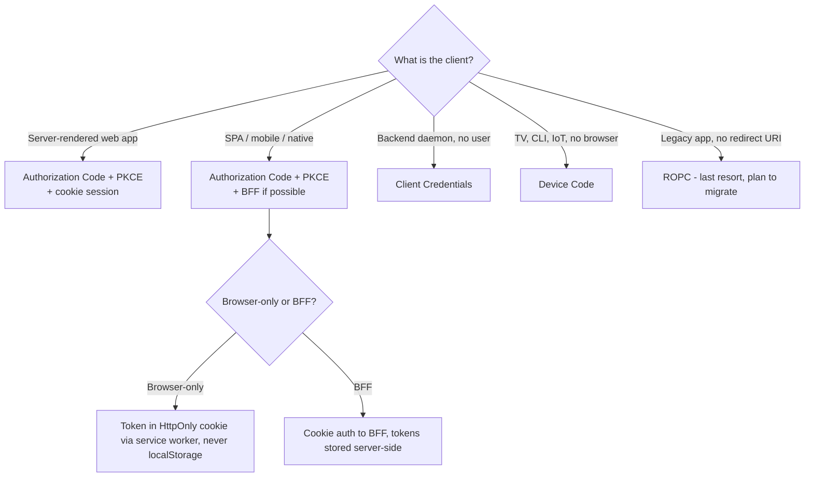

---

## See Also

- [[05 - Security and Auth]] — overview/cheatsheet companion
- [[15 - REST API]] — bearer auth on minimal APIs
- [[13 - Dependency Injection]] — typed clients, delegating handlers
- [[Senior .NET Developer]] — Q41 OAuth/OIDC walkthrough, Q43 secret management
- Keycloak docs: <https://www.keycloak.org/documentation>
- RFCs: 6749 (OAuth 2.0), 7636 (PKCE), 7519 (JWT), 8252 (Native Apps), 9126 (PAR), 9449 (DPoP)
