# Senior .NET Developer — Interview Questions & Answers

> **Scope**: 5+ years of experience. Focus is on **trade-off analysis**, **distributed systems**, **performance under load**, **runtime internals**, and **leadership-grade decisions** — not language trivia.

Senior interviews probe how you reason, not just what you remember. Many of these have no single "correct" answer; the interviewer wants to hear constraints, alternatives, and the reasoning behind your pick.

---

## Table of Contents

1. [Architecture & System Design](#architecture--system-design)
2. [Performance & Memory](#performance--memory)
3. [Async / Concurrency Deep Dive](#async--concurrency-deep-dive)
4. [Runtime Internals](#runtime-internals)
5. [Entity Framework Core Advanced](#entity-framework-core-advanced)
6. [Distributed Systems](#distributed-systems)
7. [Security](#security)
8. [Observability & Production](#observability--production)
9. [Modern .NET — AOT, Source Generators, Trimming](#modern-net--aot-source-generators-trimming)
10. [Caching](#caching)
11. [Messaging & Background Jobs](#messaging--background-jobs)
12. [Testing Strategy](#testing-strategy)
13. [Containers & Cloud-Native](#containers--cloud-native)
14. [Modern C# Language Features](#modern-c-language-features)
15. [HTTP & Networking](#http--networking)
16. [Leadership, Code Review, Trade-offs](#leadership-code-review-trade-offs)

---

## Architecture & System Design

### 1. Walk through how you'd design a high-throughput order-processing system in .NET.

**What the interviewer is listening for:** decomposition, async boundaries, persistence model, failure handling, observability.

A reasonable narrative:

1. **API surface** — accept orders via ASP.NET Core minimal APIs. Validate at the boundary, return `202 Accepted` immediately with a correlation ID.
2. **Persist + enqueue atomically** — write the order to the DB *and* an outbox row in the same transaction. A separate dispatcher reads the outbox and publishes to the message bus. This avoids the dual-write problem (DB succeeds, bus fails, or vice versa).
3. **Async processors** — `BackgroundService` or dedicated workers consume the bus (Azure Service Bus, RabbitMQ, Kafka). Each handler is **idempotent** — keyed by the order ID + a step token.
4. **State machine** — orders move through `Received → Validated → Charged → Fulfilled → Shipped`. Persist state transitions; never derive critical state from logs.
5. **Compensations** — for distributed transactions (charge → fulfill), use a saga. If fulfillment fails, fire a `RefundCharge` compensation.
6. **Read model** — denormalized projection for "list my orders" queries; updated by event handlers.
7. **Backpressure** — bounded `Channel<T>` between stages, partition by customer ID for ordering guarantees, autoscale workers on queue depth.
8. **Observability** — OpenTelemetry traces from API to all workers; metrics on queue depth, processing latency, error rate; structured logs with correlation IDs.

The key senior signals: **outbox pattern**, **idempotency keys**, **explicit state machine**, **sagas over distributed transactions**, **read/write split**.

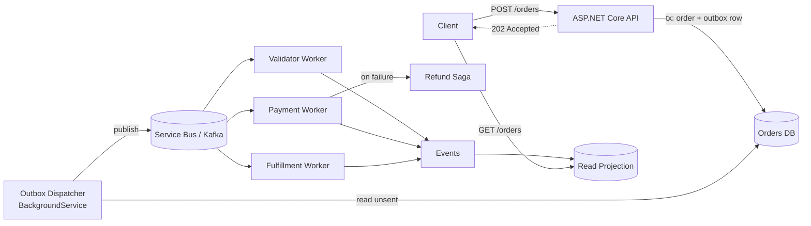

---

### 2. When does CQRS earn its keep, and when is it cargo cult?

**Earns its keep:**
- Read and write models genuinely diverge (write = normalized, read = denormalized for query speed).
- Read scale dominates — multiple read replicas, projections, materialized views.
- Complex domain logic where command handlers' explicit names (`PlaceOrderCommand`, `CancelOrderCommand`) clarify intent.
- You need an audit trail of state changes (often paired with event sourcing).

**Cargo cult:**
- A CRUD app where commands are 1:1 with HTTP verbs. You added MediatR for no benefit.
- Tiny team, tight deadlines — you pay the indirection cost without the payoff.
- "We might need it later." YAGNI.

**Without event sourcing**, CQRS is a lightweight pattern: separate read/write models, possibly different stores. **With event sourcing**, it's a much bigger commitment — events become your contract forever.

---

### 3. Explain Domain-Driven Design's bounded contexts in a .NET codebase.

A **bounded context** is a clear boundary inside which a domain term has one specific meaning. "Customer" in Sales is a sales lead; "Customer" in Billing is an account with payment methods. Different models, different invariants.

In .NET, bounded contexts typically map to:
- **Separate projects/assemblies** — `Sales.Domain`, `Billing.Domain`, no cross-references.
- **Separate databases or schemas** — each context owns its tables.
- **Anti-corruption layers** at the seams — translate `Sales.Customer` → `Billing.Customer` at the boundary, never share entity classes.
- **Integration via events** — `OrderPlaced` event from Sales is consumed by Billing, which builds its own model.

Senior signal: avoid the "shared domain library" trap. Sharing entities across contexts couples deployments and creates the "any change breaks everything" problem.

---

### 4. Hexagonal / Onion / Clean Architecture — what's the actual win?

The single useful idea: **the domain doesn't depend on infrastructure.** Interfaces (`IOrderRepository`, `IEmailSender`) live in the domain layer; implementations live in infrastructure. Composition root wires them up.

**Wins:**
- Domain logic is testable without spinning up a DB or HTTP client.
- You can swap EF Core for Dapper, or SQL Server for Postgres, with one project change.
- Clear answer to "where does this code go?"

**Costs:**
- Indirection. Every repository call has an interface.
- Mapping pain — domain `Order` ↔ EF `OrderEntity` requires mapping code (or you accept your "domain" is really anemic).
- Junior devs over-apply it to CRUD apps where one project would do.

Senior take: it pays off for **non-trivial domains with long expected lifetime**. For a tactical 6-month internal tool, a single project with controllers calling EF directly is fine.

---

### 5. Explain the Saga pattern. How would you implement it in .NET?

A **saga** is a sequence of local transactions where each step has a compensating action. Used when a workflow spans services and a distributed transaction is impractical.

**Two flavors:**

- **Choreography** — services emit events, others react. No central coordinator. Simple at small scale; hard to reason about as the graph grows.
- **Orchestration** — a central saga coordinator commands each step and tracks state. Easier to debug, observable, but introduces a single point of coordination.

In .NET:
- **MassTransit** has built-in saga support with state machines (Automatonymous-style).
- **NServiceBus** has Sagas as a first-class concept with persistence.
- **Custom**: a `BackgroundService` reading saga state from a DB, dispatching the next command.

```csharp
// Sketch of an orchestrator
public async Task Handle(PlaceOrderCommand cmd, CancellationToken ct)
{
    var saga = await _store.LoadOrCreate(cmd.OrderId);
    saga.OnPlaced(cmd);
    await _bus.Publish(new ChargeCustomer(cmd.CustomerId, cmd.Amount));
    await _store.Save(saga);
}

public async Task Handle(CustomerCharged evt, CancellationToken ct)
{
    var saga = await _store.Load(evt.OrderId);
    saga.OnCharged(evt);
    if (saga.IsComplete) return;
    await _bus.Publish(new ReserveInventory(saga.OrderId));
    await _store.Save(saga);
}

public async Task Handle(InventoryReservationFailed evt, CancellationToken ct)
{
    var saga = await _store.Load(evt.OrderId);
    saga.OnInventoryFailed(evt);
    await _bus.Publish(new RefundCustomer(saga.CustomerId, saga.Amount)); // compensation
}
```

Key signals: **persisted saga state**, **compensations are themselves commands**, **idempotency**, **timeouts** for stuck sagas.

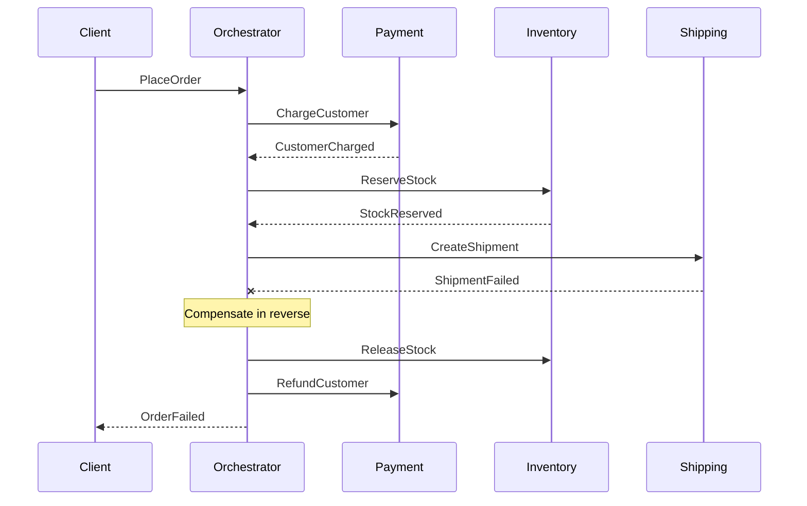

---

### 6. How do you design idempotent APIs?

**Why:** Network failures cause clients to retry. Without idempotency, retries cause double-charges, double-orders, double-emails.

**Mechanisms:**

1. **Idempotency keys** (Stripe-style) — client sends `Idempotency-Key: <uuid>` header. Server stores `(key, response)` for ~24 hours. Replay returns the same response.
2. **Natural keys** — `PUT /users/{id}` is naturally idempotent. `POST /charges` isn't, unless you key it.
3. **Conditional updates** — `If-Match: <etag>` for optimistic concurrency.

```csharp
[HttpPost("charges")]
public async Task<IActionResult> Charge([FromHeader(Name="Idempotency-Key")] string key, ChargeRequest req)
{
    var existing = await _idempotencyStore.TryGet(key);
    if (existing is not null) return Ok(existing.Response);

    var result = await _payments.Charge(req);
    await _idempotencyStore.Save(key, result, ttl: TimeSpan.FromHours(24));
    return Ok(result);
}
```

Implementation details:
- The store should be transactional with the operation, or use a "claimed" state to handle concurrent retries.
- TTL prevents unbounded growth.
- Idempotency must extend through your async pipeline — message handlers also need keys.

---

### 7. How would you build a multi-tenant SaaS in .NET?

**Tenant isolation models** — pick by compliance and scale needs:

| Model | Isolation | Cost | Use case |
|-------|-----------|------|----------|
| Database per tenant | Highest | Highest | Regulated industries, large enterprise |
| Schema per tenant | High | High | Mid-market, easier ops |
| Shared schema, `tenantId` column | Lowest | Lowest | High-volume B2C |

**Implementation pieces:**

1. **Tenant resolution middleware** — extract from subdomain, header, or JWT claim. Store in `IHttpContextAccessor` or `AsyncLocal<T>`.
2. **EF Core global query filter** — `modelBuilder.Entity<Order>().HasQueryFilter(o => o.TenantId == _tenant.Id);`. Auto-applies `WHERE TenantId = @t` to every query.
3. **Connection routing** (DB-per-tenant) — `IDbConnectionFactory` resolves the right connection string from a tenant catalog.
4. **Audit & cross-tenant guards** — every write checks tenant, never trust client-supplied tenant ID.
5. **Per-tenant configuration** — feature flags, branding, plan limits.

**The mistake to avoid:** "we'll just add a `tenantId` column later." Retrofitting is painful. Decide the model on day one.

---

### 8. When would you choose gRPC over REST in a .NET system?

**gRPC wins:**
- Service-to-service inside your platform.
- Strict contracts (`.proto` files generate client + server).
- Streaming (server, client, or bidirectional).
- Lower latency, smaller payloads (Protobuf binary).
- Polyglot ecosystems where typed clients matter.

**REST wins:**
- Public APIs (browsers, partners, mobile).
- HTTP-cacheable responses (CDN edge caching).
- Inspectable in any tool (curl, Postman, browser).
- More forgiving versioning.

In .NET 8+, gRPC is first-class with `Grpc.AspNetCore`. You can run both side-by-side on the same Kestrel host. **gRPC-Web** is a fallback when browsers must consume gRPC.

Senior take: REST at the edge, gRPC inside. Use OpenAPI for the REST contract; share `.proto` files via a contracts package for gRPC.

---

### 9. How do you handle backwards-compatible API evolution?

**Rules of thumb:**

1. **Add, never break.** New fields are optional with defaults. Removing a field requires a new version.
2. **Versioning strategies** — URL (`/v1/...`), header (`Accept: application/vnd.api.v2+json`), or query string. URL is most operationally simple.
3. **Tolerant readers** — clients ignore unknown fields, parse what they need.
4. **Deprecation discipline** — mark endpoints with `Deprecation` and `Sunset` HTTP headers; track usage; communicate timelines.
5. **Contract tests** — provider tests verify each consumer's contract still passes (Pact, or custom contract tests).

For internal services, **gRPC's Protobuf** has clear backwards-compat rules: don't reuse field numbers, don't change types, default new fields. Follow them and the wire format stays compatible across versions.

---

### 10. Microservices vs modular monolith — when do you split?

**Default to a modular monolith.** It's simpler: one deploy, one DB, one process — but with **internal module boundaries** (separate projects, no cross-references except via interfaces).

**Split into services when:**
- A team needs deployment independence.
- A component has different scaling characteristics (CPU-heavy vs I/O-heavy).
- Failure isolation is critical — one bad bug should not down everything.
- Different tech stacks are justified.

**Don't split because:**
- "Microservices are modern."
- "It'll scale better." (Not automatically.)
- "Easier to deploy small things." (Distributed deployments are *harder*, not easier.)

The classic mistake: splitting too early into a "distributed monolith" — services that must deploy together but with the latency/operational cost of being separate.

---

## Performance & Memory

### 11. Walk through diagnosing a memory leak in production.

**Step-by-step:**

1. **Confirm it's a leak** — `dotnet-counters monitor --process-id <pid>`. Watch `gen-2-gc-count`, `gc-heap-size`. If heap keeps growing across Gen 2 collections, it's a leak.
2. **Capture a dump** — `dotnet-dump collect -p <pid>` (full dump). Or use Linux `gcore`.
3. **Analyze with `dotnet-dump analyze`** or **Visual Studio diagnostic tools** or **dotMemory**.
4. **Find the dominant types** — `dumpheap -stat` shows what's on the heap. Sort by size.
5. **Find GC roots** — `!gcroot <addr>` shows what's keeping an object alive. Common culprits:
   - `static` collections (caches without eviction).
   - Event handlers (publisher → subscriber edge that's never `-=`).
   - Long-lived `DbContext`.
   - `Timer`s that capture `this`.
   - `IDisposable` not disposed (`HttpClient` instances, file handles).

```bash
dotnet-counters monitor -p 12345 --counters System.Runtime
dotnet-dump collect -p 12345
dotnet-dump analyze core_dump.dmp
> dumpheap -stat
> dumpheap -mt <method-table-addr>
> gcroot <obj-addr>
```

**Fix patterns:**
- Bounded caches with `MemoryCache` + size limits or `LruCache`.
- `WeakReference<T>` or weak event patterns.
- Scope `DbContext` per request, never inject into singletons.
- Always `using` for `IDisposable`.

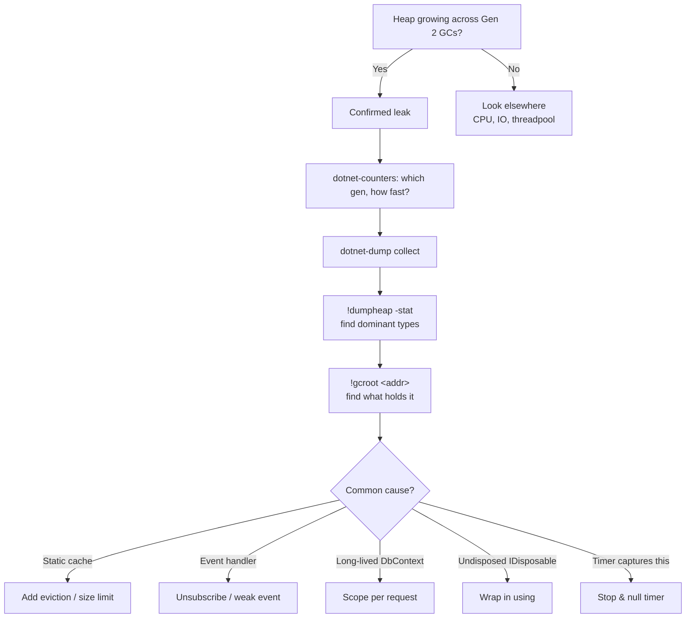

---

### 12. Span<T>, Memory<T>, ReadOnlySequence<T> — when do you reach for each?

- **`Span<T>`** — synchronous, stack-only (`ref struct`). Zero-allocation slicing of arrays, strings, `stackalloc`. Can't cross `await`. Best for parsers, formatters, hot paths.

- **`ReadOnlySpan<char>`** — substitute for substring operations. `int.Parse(span)` and friends are span-aware.

- **`Memory<T>`** — heap-friendly cousin. Can be stored in fields, captured in async lambdas, awaited around. Slower than `Span<T>` (small indirection) but works in async code.

- **`ReadOnlySequence<T>`** — multi-segment buffer (used heavily by `System.IO.Pipelines`). When data arrives in chunks (TCP), you don't pay to copy into one contiguous buffer.

```csharp
ReadOnlySpan<char> path = "/api/users/42/orders";
int idx = path.LastIndexOf('/');
ReadOnlySpan<char> last = path[(idx + 1)..];   // no allocation
```

**Senior signal**: knowing when allocation matters (1M+ ops/sec, low-latency) and when it doesn't (a config parser called once at startup — don't bother).

---

### 13. Explain `ArrayPool<T>` and when you'd use it.

`ArrayPool<T>.Shared` is a thread-safe pool of reusable arrays. Renting reduces GC pressure for short-lived buffers.

```csharp
var buffer = ArrayPool<byte>.Shared.Rent(4096);
try
{
    var read = await stream.ReadAsync(buffer, 0, 4096);
    Process(buffer.AsSpan(0, read));
}
finally
{
    ArrayPool<byte>.Shared.Return(buffer, clearArray: false);
}
```

**Use when:**
- You allocate large temporary buffers in hot paths.
- The buffer doesn't escape your method.

**Pitfalls:**
- `Rent(N)` may return an array *larger* than N. Always slice.
- **Forgetting to return** is a "leak" — pool grows.
- **Returning twice** corrupts the pool. Use a sentinel or `try/finally`.
- **Don't pool** if your code might mutate after return (concurrent access bugs).

For pipelines, prefer `MemoryPool<T>` and `IMemoryOwner<T>` for cleaner ownership semantics.

---

### 14. Server vs Workstation GC — when do you pick which?

| Mode | Throughput | Latency | Memory | Default |
|------|-----------|---------|--------|---------|
| Workstation | Lower | Lower (concurrent BG GC) | Smaller heap | Console/desktop apps |
| Server | Higher | Higher (parallel collection) | Larger heap, per-CPU | ASP.NET Core, multi-core servers |

**Server GC**:
- One heap per logical CPU (or fewer with `<GCHeapCount>`).
- Parallel collection threads.
- Higher peak memory but better throughput on multi-core.

```xml
<PropertyGroup>
  <ServerGarbageCollection>true</ServerGarbageCollection>
  <ConcurrentGarbageCollection>true</ConcurrentGarbageCollection>
</PropertyGroup>
```

**.NET 8+ DATAS** (`<GCDynamicAdaptationMode>1</GCDynamicAdaptationMode>`) — adapts heap count and size based on load. Often a better default than fixed Server GC for variable workloads.

For latency-sensitive workloads, also consider:
- `GCSettings.LatencyMode = GCLatencyMode.SustainedLowLatency` during critical sections.
- `GC.TryStartNoGCRegion(size)` for hard real-time-ish windows.

---

### 15. How do you benchmark .NET code reliably?

**Use BenchmarkDotNet.** Don't use `Stopwatch` in a `for` loop and divide.

```csharp
[MemoryDiagnoser]
[SimpleJob(RuntimeMoniker.Net80, baseline: true)]
[SimpleJob(RuntimeMoniker.Net90)]
public class StringConcatBench
{
    [Params(10, 100, 1000)]
    public int N;

    [Benchmark(Baseline = true)]
    public string PlusEqual()
    {
        var s = "";
        for (int i = 0; i < N; i++) s += i;
        return s;
    }

    [Benchmark]
    public string Builder()
    {
        var sb = new StringBuilder();
        for (int i = 0; i < N; i++) sb.Append(i);
        return sb.ToString();
    }
}
```

**Why BenchmarkDotNet:**
- Warm-up to settle JIT (tiered compilation, R2R).
- Multiple iterations, statistical analysis (mean, stddev, outliers).
- `[MemoryDiagnoser]` — bytes allocated per op.
- Cross-runtime / cross-config comparisons.

**Run release builds, run on the target hardware, measure on a quiet machine.** Don't draw conclusions from a single run.

For production-realistic measurement, use **load testing** (k6, NBomber) against a staging environment, not microbenchmarks alone.

---

### 16. Lock-free programming in .NET — when and how?

Use lock-free constructs when:
- Lock contention is the bottleneck (visible in profilers as `Monitor.Wait`).
- You need fine-grained atomicity (single counter, single reference swap).

**Tools:**
- `Interlocked.Increment`, `Interlocked.CompareExchange` — atomic on simple values.
- `volatile` — prevents reordering, doesn't fix races.
- `ConcurrentDictionary`, `ConcurrentQueue`, `ConcurrentBag` — lock-free internally, but with their own contention.
- `Channel<T>` — for producer/consumer.
- `Lazy<T>` — thread-safe lazy init.

```csharp
private long _counter;
public long Count => Interlocked.Read(ref _counter);
public void Bump() => Interlocked.Increment(ref _counter);

// CAS loop
private int _state;
public bool TryClaim()
{
    int original;
    do
    {
        original = _state;
        if (original != 0) return false;
    } while (Interlocked.CompareExchange(ref _state, 1, original) != original);
    return true;
}
```

**Reality check:** lock-free code is hard to get right. Most contention problems are better solved by:
- Sharding (per-CPU counters, sum on read).
- Reducing critical section size.
- Using `System.Threading.Channels` for queue patterns.
- Picking the right concurrent collection.

Reach for `Interlocked` when measurements show locks are the problem.

---

### 17. How does tiered compilation affect performance, and how do you opt out for benchmarks?

**Tiered compilation:**
1. **Tier 0** — fast JIT with minimal optimizations. Quick startup.
2. **Hot methods** — re-JITted at Tier 1 with full optimizations after threshold of calls.
3. **Quick JIT for loops** (.NET 6+) — handles long-running loops in Tier 0 better.

**Implications:**
- Startup is faster, steady-state is the same.
- Benchmarks show inflated times if measured before Tier 1 kicks in.

**For benchmarks**, BenchmarkDotNet handles warm-up. Or set:

```xml
<PropertyGroup>
  <TieredCompilation>false</TieredCompilation>
</PropertyGroup>
```

But normally you don't disable it — production benefits from faster startup and the steady-state perf is the same.

**ReadyToRun (R2R)** — compiles to native at publish time, eliminates Tier 0 for those methods. Use for serverless / cold-start sensitive workloads.

---

### 18. What tools do you use to investigate a CPU spike?

**Live, low-overhead:**
- `dotnet-counters` — `cpu-usage`, `gc-fragmentation`, `threadpool-thread-count`, `monitor-lock-contention`.
- `dotnet-trace` — CPU sampling, GC events. Output viewable in PerfView, Visual Studio, Speedscope.

```bash
dotnet-trace collect -p <pid> --providers Microsoft-DotNETCore-SampleProfiler --duration 00:00:30
```

**Capturing a dump:**
- `dotnet-dump collect` for heap.
- `dotnet-stack` for current stacks (instantaneous).

**Analysis:**
- **PerfView** — Microsoft's deep-dive ETW analyzer, free and powerful.
- **Visual Studio Diagnostic Tools** — friendlier UX.
- **dotTrace / dotMemory** — JetBrains, paid but excellent.
- **Speedscope** — flame graphs from `dotnet-trace`.

**Common culprits in CPU spikes:**
- Tight loops without `await`.
- Regex compiling in a hot path.
- Reflection in a hot path (cache delegates).
- Excessive boxing/allocation triggering GC.
- Lock contention (shows as kernel time + Monitor waits).

---

## Async / Concurrency Deep Dive

### 19. Explain ConfigureAwait(false) at depth — why does ASP.NET Core not need it?

In **classic ASP.NET (System.Web)**, `SynchronizationContext.Current` was a context tied to the request's HttpContext, single-threaded for the duration of a request. Awaiting without `ConfigureAwait(false)` captured that context and resumed on it. Two consequences:

1. **Deadlocks** if you blocked on async (`.Result`/`.Wait()`) — the thread holding the sync context waits for the task; the task waits for the thread.
2. **Latency** — every continuation marshalled back to the same thread, serializing parallel I/O.

**ASP.NET Core** has no `SynchronizationContext` — `SynchronizationContext.Current` is `null` during a request. Continuations run on whatever threadpool thread is available. `ConfigureAwait(false)` is therefore a no-op in ASP.NET Core code.

**However**, library authors still use `ConfigureAwait(false)` because:
- The library may run inside a sync-context'd host (WPF, WinForms, classic ASP.NET, Xamarin).
- Defensive: doesn't matter if no context, helps if there is one.

**For application code in ASP.NET Core, skip it.** It's noise.

For library code, configure with .editorconfig + analyzer (`CA2007`) to enforce it.

---

### 20. Walk through what happens when you `await` a task that's already complete.

If the awaited task is complete (`task.IsCompleted == true`):
1. The awaiter's `IsCompleted` returns `true`.
2. `GetResult()` is called inline (no continuation scheduling).
3. Execution continues synchronously.

**No state machine transition, no thread switch, no allocation** for the continuation.

This is why `ValueTask<T>` matters — when results are often available synchronously (cache hits), `Task.FromResult(...)` would still allocate a `Task` object. `ValueTask<T>` avoids that:

```csharp
public ValueTask<User> GetAsync(int id)
{
    if (_cache.TryGetValue(id, out var user)) return new ValueTask<User>(user);
    return new ValueTask<User>(LoadAsync(id));
}
```

When `await`-ed:
- Cache hit → fully synchronous, no allocation.
- Cache miss → wraps a `Task`, allocations as usual.

**Don't await `ValueTask<T>` twice** — its design assumes single-await. Use `.AsTask()` if you need to fan it out.

---

### 21. How does the threadpool decide when to spin up new threads?

The .NET threadpool:
- Maintains a "minimum" number of threads (default = number of logical processors).
- When all threads are busy and work is queued, it injects new threads slowly (one every ~500ms by default — "thread starvation").
- Up to `MaxThreads` (default ~32k).

**This causes thread starvation when you block threads on async I/O**:
- Queue of work growing.
- Threads blocked on `.Result`.
- Threadpool injects new threads slowly → tail latencies.

**Fix:**
- Don't block on async. Make the entire chain async.
- Increase minimums if startup is bursty: `ThreadPool.SetMinThreads(64, 64)`.

```bash
# Diagnostic
dotnet-counters monitor -p <pid> --counters System.Runtime[threadpool-thread-count,threadpool-queue-length]
```

If queue length is growing: starvation.

---

### 22. Explain `IAsyncEnumerable<T>` and a real use case.

Streams items as they're produced, consumed with `await foreach`. Caller doesn't wait for the entire collection.

**Use cases:**

1. **Database streaming** — process rows without buffering the whole result.

```csharp
public async IAsyncEnumerable<Order> StreamOrdersAsync(
    [EnumeratorCancellation] CancellationToken ct)
{
    await using var conn = new SqlConnection(_cs);
    await conn.OpenAsync(ct);
    await using var cmd = new SqlCommand("SELECT ... FROM Orders", conn);
    await using var reader = await cmd.ExecuteReaderAsync(ct);
    while (await reader.ReadAsync(ct))
    {
        yield return new Order { Id = reader.GetInt32(0), ... };
    }
}
```

2. **gRPC server streaming** — natural fit, framework handles flow control.

3. **Server-sent events / streaming HTTP responses** — emit rows as JSON lines.

4. **External pagination** — yield page-by-page, hide pagination from the consumer.

**Cancellation:** use `[EnumeratorCancellation]` to flow the consumer's `CancellationToken` into the producer.

**Pitfall:** ASP.NET Core's default JSON serializer streams `IAsyncEnumerable` correctly only for collection responses, not when wrapped in another object.

---

### 23. ExecutionContext, AsyncLocal<T>, ThreadLocal<T> — distinctions?

- **`ThreadLocal<T>`** — value per thread. Doesn't flow across `await`. Useful for synchronous code with thread-bound state.

- **`AsyncLocal<T>`** — value flows through `async` continuations via `ExecutionContext`. Survives thread changes. The right tool for ambient context (correlation IDs, current user, scope).

- **`ExecutionContext`** — the underlying machinery. Captured at `await`, restored on continuation. Includes `AsyncLocal`s, security context, culture.

```csharp
private static readonly AsyncLocal<string?> _correlationId = new();

public static string? CorrelationId
{
    get => _correlationId.Value;
    set => _correlationId.Value = value;
}
```

**Pitfalls:**
- `ExecutionContext` capture is *not free* — micro-cost on every `await` in hot paths.
- Setting `AsyncLocal.Value` only affects the current and downstream async flow; siblings in `Task.WhenAll` see the value at the fork point.
- Be careful storing mutable objects — they're shared by reference.

`AsyncLocal<T>` is how `HttpContext.Current` shim works in .NET — and why it's discouraged in ASP.NET Core (use `IHttpContextAccessor` instead).

---

### 24. Channel<T> in depth — bounded vs unbounded, single vs multi reader/writer.

```csharp
// Unbounded: producer never blocks
var ch = Channel.CreateUnbounded<WorkItem>(new UnboundedChannelOptions
{
    SingleReader = true,
    SingleWriter = false,    // multiple producers
});

// Bounded: producer awaits when full
var ch = Channel.CreateBounded<WorkItem>(new BoundedChannelOptions(1000)
{
    FullMode = BoundedChannelFullMode.Wait,        // back-pressure
    // alternatives: DropOldest, DropNewest, DropWrite
    SingleReader = true,
    SingleWriter = false,
});
```

**Performance tuning:**
- `SingleReader = true` enables more aggressive optimizations (fewer interlocks).
- `SingleWriter = true` likewise for producers.
- Misconfigured (`SingleReader = true` but multiple readers) causes data corruption — runtime doesn't enforce.

**Patterns:**

```csharp
// Fan-in: multiple producers, one consumer
public async Task ProducerAsync(ChannelWriter<int> writer, CancellationToken ct)
{
    for (int i = 0; i < 100; i++)
    {
        await writer.WriteAsync(i, ct);
    }
}

public async Task ConsumerAsync(ChannelReader<int> reader, CancellationToken ct)
{
    await foreach (var item in reader.ReadAllAsync(ct))
    {
        Process(item);
    }
}
```

**Use over `BlockingCollection<T>`** for any new code — async-first, lower overhead.

---

### 25. How would you implement a rate limiter in .NET?

**.NET 7+** has `System.Threading.RateLimiting` built in:

```csharp
builder.Services.AddRateLimiter(options =>
{
    options.AddFixedWindowLimiter("api", o =>
    {
        o.PermitLimit = 100;
        o.Window = TimeSpan.FromMinutes(1);
        o.QueueLimit = 10;
        o.QueueProcessingOrder = QueueProcessingOrder.OldestFirst;
    });

    options.AddTokenBucketLimiter("burst", o =>
    {
        o.TokenLimit = 100;
        o.TokensPerPeriod = 10;
        o.ReplenishmentPeriod = TimeSpan.FromSeconds(1);
    });
});

app.UseRateLimiter();
app.MapGet("/data", () => "ok").RequireRateLimiting("api");
```

**Algorithms:**
- **Fixed window** — N permits per time window. Simple, but boundary spikes (2N requests at the boundary).
- **Sliding window** — interpolated count across windows. Smoother.
- **Token bucket** — refills at a steady rate; allows bursts up to bucket size.
- **Leaky bucket** — fixed output rate, queued input.

**Distributed rate limiting** (across instances) needs Redis or similar — local RateLimiter is per-instance. For Redis: use a Lua script for atomic check-and-increment, or `INCR` with `EXPIRE`.

```csharp
// Redis sketch
var key = $"rl:{userId}:{minute}";
var count = await _redis.IncrementAsync(key);
if (count == 1) await _redis.KeyExpireAsync(key, TimeSpan.FromMinutes(1));
if (count > limit) throw new RateLimitException();
```

---

## Runtime Internals

### 26. Explain the JIT compilation pipeline.

1. **CIL** in the assembly is loaded.
2. **First call** to a method triggers JIT — Tier 0 (fast, minimal optimization).
3. Subsequent calls in tight loops or after threshold trigger **Tier 1** (full optimizations: inlining, escape analysis, bounds-check elimination).
4. **PGO (Profile-Guided Optimization)** in .NET 6+ uses Tier 0 telemetry to optimize Tier 1 (e.g., guarded devirtualization based on observed types).
5. **R2R (ReadyToRun)** — pre-compiled native code shipped in the assembly. Faster startup; gets re-JITted with PGO at runtime if dynamic PGO is enabled.

```bash
# View JIT activity
dotnet-trace collect -p <pid> --providers Microsoft-Windows-DotNETRuntime:JIT
```

**Implications:**
- First requests are slower; warm-up matters for benchmarks.
- AOT (Native AOT) skips JIT entirely — but loses dynamic codegen (`Reflection.Emit`, dynamic LINQ).

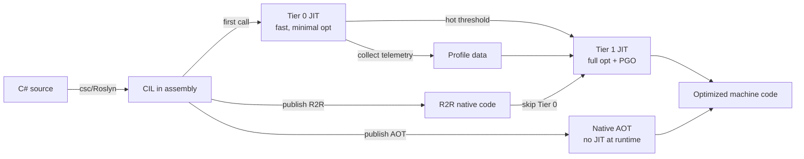

---

### 27. AssemblyLoadContext and plugin architectures.

`AssemblyLoadContext` (ALC) is .NET's plugin/isolation mechanism. Each ALC is a separate world for assembly resolution.

**Use cases:**
- **Plugins** — load assemblies, unload them later (set `isCollectible: true`).
- **Versioning** — host loads `Foo v1`, plugin loads `Foo v2`, both coexist.
- **Hot reload** — ASP.NET Core uses ALC for `dotnet watch`.

```csharp
public class PluginLoadContext : AssemblyLoadContext
{
    private readonly AssemblyDependencyResolver _resolver;

    public PluginLoadContext(string pluginPath) : base(isCollectible: true)
    {
        _resolver = new AssemblyDependencyResolver(pluginPath);
    }

    protected override Assembly? Load(AssemblyName name)
    {
        var path = _resolver.ResolveAssemblyToPath(name);
        return path != null ? LoadFromAssemblyPath(path) : null;
    }
}

// Usage
var alc = new PluginLoadContext("/plugins/MyPlugin.dll");
var asm = alc.LoadFromAssemblyPath("/plugins/MyPlugin.dll");
var pluginType = asm.GetType("MyPlugin.Entry")!;
var instance = Activator.CreateInstance(pluginType);
// ... use plugin ...
alc.Unload();
```

**Pitfalls:**
- Holding any reference (event handlers, captured `Type`) prevents unload.
- Type identity differs across ALCs — `typeof(Foo)` from host ≠ `typeof(Foo)` from plugin if both load `Foo`.

---

### 28. Source generators — what are they and when are they worth it?

**Source generators** are Roslyn components that run during compilation, inspect the syntax tree / semantic model, and emit additional source code. Output is compiled along with your code.

**vs. runtime reflection:**
- No runtime cost.
- AOT-friendly.
- Errors at compile time.
- IDE integration (generated code is browsable).

**Real examples in .NET:**
- `System.Text.Json` source generator — generates serializers, no reflection at runtime.
- `LoggerMessage` source generator — typed, allocation-free logging.
- `RegexGenerator` — `[GeneratedRegex(...)]` compiles regex at build time.
- `LibraryImport` (replaces `DllImport`) — generates marshalling code.

**Build your own when:**
- You're tempted to use `Reflection.Emit` or expression trees in a hot path.
- You're writing repetitive code (DTOs, builders, mappers) — but consider Mapperly, AutoMapper source-gen first.

```csharp
[Generator]
public class HelloGenerator : IIncrementalGenerator
{
    public void Initialize(IncrementalGeneratorInitializationContext context)
    {
        context.RegisterPostInitializationOutput(ctx =>
            ctx.AddSource("HelloGen.g.cs", "namespace MyNs { public static class Hello { public static string World => \"Hi!\"; } }"));
    }
}
```

**Pitfalls:**
- Slow generators slow down compilation.
- Hard to debug (use `<EmitCompilerGeneratedFiles>true</EmitCompilerGeneratedFiles>` to inspect output).
- Versioning and incremental gen require care (`IIncrementalGenerator` over old `ISourceGenerator`).

---

### 29. Reflection vs Expression Trees vs Source Generators — when to use each?

| Approach | Setup cost | Runtime cost | AOT-safe |
|----------|-----------|--------------|----------|
| Reflection (`MethodInfo.Invoke`) | Low | High (every call) | Mostly |
| Cached `Delegate.CreateDelegate` | Medium | Low (after creation) | Mostly |
| Compiled expression tree | High (one-time) | Very low | No (no JIT in AOT) |
| Source generator | Build-time | Zero (it's just code) | Yes |

**Decision tree:**

- One-shot reflection at startup → plain reflection is fine.
- Frequently-invoked dynamic dispatch → cache delegates or compile expressions.
- Maximum perf, AOT compatibility → source generators.

```csharp
// Cached delegate (typed)
private static readonly Func<MyDto, int> _getId =
    (Func<MyDto, int>)Delegate.CreateDelegate(
        typeof(Func<MyDto, int>),
        typeof(MyDto).GetProperty("Id")!.GetGetMethod()!);
```

---

### 30. How does `async` state machine work under the hood?

For each `async` method, the compiler emits:
1. A struct (`<MyMethod>d__N`) implementing `IAsyncStateMachine`.
2. The method body is rewritten as a state machine — each `await` is a state transition.
3. The original method becomes a thin wrapper that:
   - Allocates an `AsyncTaskMethodBuilder<T>` (struct).
   - Initializes the state machine.
   - Calls `builder.Start(ref stateMachine)`.

**On await:**
- If the awaited task is incomplete, the state machine is **boxed** to the heap (first `await` only) and a continuation is registered.
- When complete, `MoveNext()` resumes from the saved state.

**Allocations:**
- Sync completion: zero heap allocations (state machine stays a struct).
- Async completion: one boxing for the state machine + one `Task<T>` (unless using `ValueTask<T>` and result is sync).

This is why `async ValueTask<T>` is cheaper than `async Task<T>` for sync-completion-heavy methods.

```csharp
// What the compiler roughly emits (simplified)
public Task<int> FetchAsync()
{
    var sm = new <FetchAsync>d__0
    {
        <>t__builder = AsyncTaskMethodBuilder<int>.Create(),
        <>1__state = -1,
    };
    sm.<>t__builder.Start(ref sm);
    return sm.<>t__builder.Task;
}
```

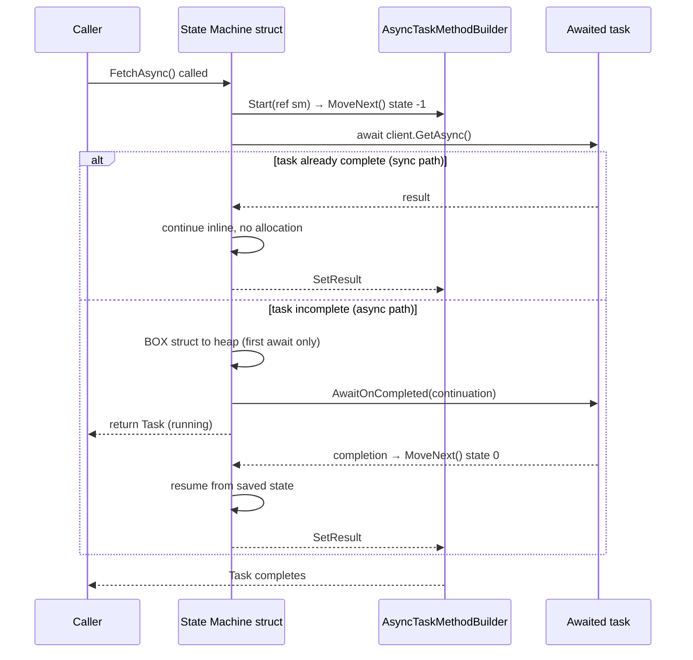

---

## Entity Framework Core Advanced

### 31. How would you optimize EF Core for a high-traffic read endpoint?

A layered approach:

1. **`AsNoTracking()` / `AsNoTrackingWithIdentityResolution()`** — skip change tracker.
2. **Project to DTOs** with `Select` — only load required columns.
3. **Compiled queries** — `EF.CompileQuery` or `EF.CompileAsyncQuery` removes expression-tree compilation overhead per call.
4. **Connection pool tuning** — `MaxPoolSize`, monitor pool exhaustion.
5. **`DbContextPool`** — `services.AddDbContextPool<MyDb>(...)` reuses contexts (saves construction cost).
6. **Indexes** — match your query patterns; check `EXPLAIN ANALYZE`.
7. **Read replicas** — point heavy queries at replicas via separate `DbContext` configurations.
8. **Output caching** at the API layer — `[OutputCache(Duration = 60)]` for cacheable responses.
9. **Distributed cache** for hot rows (Redis) — write-through or read-through.
10. **Pagination, never `OrderBy(...).ToListAsync()` without limit.**

```csharp
// Compiled query — once, reused
private static readonly Func<MyDb, int, Task<UserDto?>> _getUser =
    EF.CompileAsyncQuery((MyDb db, int id) =>
        db.Users
          .Where(u => u.Id == id)
          .Select(u => new UserDto(u.Id, u.Name))
          .FirstOrDefault());

public Task<UserDto?> GetUserAsync(int id) => _getUser(_db, id);
```

---

### 32. Bulk operations in EF Core — what are the options?

EF Core 7+ has built-in `ExecuteUpdate` / `ExecuteDelete` — single SQL command, no change tracker.

```csharp
// Bulk update
await _db.Users
    .Where(u => u.LastLoginAt < cutoff)
    .ExecuteUpdateAsync(s => s
        .SetProperty(u => u.IsActive, false)
        .SetProperty(u => u.UpdatedAt, DateTime.UtcNow));

// Bulk delete
await _db.Logs
    .Where(l => l.CreatedAt < cutoff)
    .ExecuteDeleteAsync();
```

**For bulk insert** (millions of rows):
- EF Core 8+: `db.Users.AddRange(...); db.SaveChanges();` is OK for thousands.
- For 100K+: **EFCore.BulkExtensions** (third-party) — uses `SqlBulkCopy` under the hood.
- Or drop to **Dapper** + `SqlBulkCopy` directly.
- Or batch inserts in chunks with `INSERT ... VALUES (...), (...), (...)`.

**Trade-offs:**
- `ExecuteUpdate/Delete` skip the change tracker — interceptors and audit hooks won't fire. Be deliberate.
- Bulk operations bypass domain events. If your domain emits events on save, decide explicitly whether bulk paths should too.

---

### 33. How do you safely run raw SQL in EF Core?

```csharp
// Safe — parameterized via FormattableString
var users = await _db.Users
    .FromSqlInterpolated($"SELECT * FROM Users WHERE Email = {email}")
    .ToListAsync();

// Safe — explicit parameters
await _db.Database.ExecuteSqlRawAsync(
    "UPDATE Orders SET Status = {0} WHERE Id = {1}",
    "Cancelled", orderId);
```

**Never concatenate user input into SQL** — that's classic SQL injection. `FromSqlRaw` with string concatenation is the dangerous form.

**`FromSqlInterpolated`** automatically parameterizes — the recommended path.

**Dapper** is a great fallback when EF's LINQ doesn't fit:

```csharp
var orders = await connection.QueryAsync<Order>(
    "SELECT * FROM Orders WHERE CustomerId = @customerId AND Status = @status",
    new { customerId, status });
```

Mix EF (writes, complex graphs) and Dapper (high-perf reads, complex queries) freely. They can share the same `DbConnection`.

---

### 34. DbContext lifetime — pitfalls.

`DbContext` is **not thread-safe**. Concurrent operations on the same instance throw or corrupt the change tracker.

**Standard scoped lifetime** (one per HTTP request):
- ✅ Good for typical request handling.
- ❌ Bad if your request fans out parallel work (`Task.WhenAll(_db.Users..., _db.Orders...)` — same `DbContext` used concurrently → bug).

**Solutions for parallelism:**

- **Sequential awaits** — fine for most cases.
- **`IDbContextFactory<TContext>`** — inject a factory, create short-lived contexts:

```csharp
builder.Services.AddDbContextFactory<MyDb>(o => o.UseSqlServer(cs));

public class Service(IDbContextFactory<MyDb> factory)
{
    public async Task DoWorkAsync()
    {
        await using var db1 = await factory.CreateDbContextAsync();
        await using var db2 = await factory.CreateDbContextAsync();
        // db1 and db2 are independent — safe to run concurrently
    }
}
```

**Pooled context** (`AddDbContextPool`) — reuses instances. Faster, but each pooled context resets state on return; ensure no per-request state leaks (e.g., custom interceptors with mutable state).

**Long-lived `DbContext` is a memory leak** — change tracker accumulates entities forever.

---

### 35. EF Core migrations in CI/CD — strategy.

**Don't run migrations from app startup in production.** Bad reasons:
- Race conditions when multiple instances start simultaneously.
- Failures crash the app.
- No rollback path.

**Better:**

1. **Generate idempotent SQL scripts** — `dotnet ef migrations script --idempotent`. Commit them.
2. **Run as a separate CI step** before deploying the app, against the production DB.
3. **Two-deploy pattern for breaking changes**:
   - Deploy 1: Add new column nullable + backfill.
   - Deploy 2: Make NOT NULL.
   - Deploy 3: Drop old column.
4. **Online schema migrations** for huge tables — tools like `pg_repack` (Postgres) or schema-change tools.
5. **Migrations catalog** — review every generated migration's SQL. EF doesn't always pick the right strategy.

For Kubernetes, a common pattern: a separate `migrate` Job runs before rolling out the new version of the deployment. Helm hook or Argo PreSync.

---

## Distributed Systems

### 36. How do you handle eventual consistency in user-facing flows?

Users notice "I just saved this — why don't I see it?" Solutions:

1. **Read your writes** — after a write, the next read for the same user goes to the primary, not a replica. Track via session token or sticky routing.
2. **Optimistic UI** — write to the client model, then send the API call. Reconcile on response.
3. **Synchronous read after write** — if the workflow is critical, block on the read model being updated (with timeout).
4. **Idempotent retries** — if the read model isn't updated yet, the client retries with the same idempotency key.

```csharp
// Read-your-writes via primary
public async Task<Order> CreateAsync(CreateOrderCmd cmd)
{
    var order = await _writeStore.SaveAsync(cmd);
    // For the next 10s, the user's reads go to primary
    await _stickyCache.MarkPrimaryReadFor(cmd.UserId, TimeSpan.FromSeconds(10));
    return order;
}
```

For projections built async from events: track the latest event each projection has consumed; clients pass `If-Match-Version: <eventId>` to wait for the projection to catch up before reading.

---

### 37. Outbox pattern — explain and implement.

**Problem**: dual-write — committing a transaction to the DB AND publishing a message to a bus. If one succeeds and the other fails, state is inconsistent.

**Solution**: write the message to an `Outbox` table in the same DB transaction as the business write. A separate dispatcher reads the outbox and publishes to the bus.

```csharp
public async Task PlaceOrder(OrderDto dto)
{
    using var tx = await _db.Database.BeginTransactionAsync();
    var order = new Order(dto);
    _db.Orders.Add(order);
    _db.OutboxMessages.Add(new OutboxMessage
    {
        Type = "OrderPlaced",
        Payload = JsonSerializer.Serialize(new OrderPlacedEvent(order.Id)),
        OccurredAt = DateTime.UtcNow,
    });
    await _db.SaveChangesAsync();
    await tx.CommitAsync();
}

// Dispatcher (BackgroundService)
protected override async Task ExecuteAsync(CancellationToken ct)
{
    while (!ct.IsCancellationRequested)
    {
        var msgs = await _db.OutboxMessages
            .Where(m => m.PublishedAt == null)
            .OrderBy(m => m.OccurredAt)
            .Take(100)
            .ToListAsync(ct);

        foreach (var m in msgs)
        {
            await _bus.PublishAsync(m.Type, m.Payload);
            m.PublishedAt = DateTime.UtcNow;
        }
        await _db.SaveChangesAsync(ct);
        if (msgs.Count == 0) await Task.Delay(500, ct);
    }
}
```

**Pitfalls:**
- Dispatcher must be idempotent (duplicate publishes are possible after crashes).
- Add a `claim` step (UPDATE ... SET ProcessingAt = NOW() WHERE PublishedAt IS NULL) for multiple dispatchers.
- Polling adds latency; consider Postgres `LISTEN/NOTIFY` or SQL Server change tracking for lower-latency dispatch.

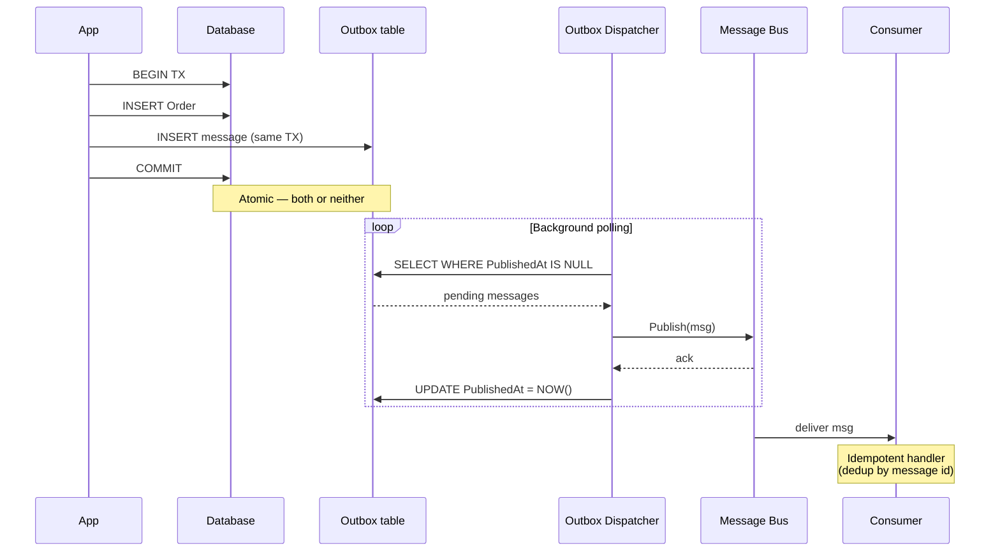

---

### 38. Distributed locks — when, how, what's the catch?

**Use:** ensure only one process executes a critical section across instances. Examples: scheduled job leader election, sequential message processing per partition.

**With Redis (RedLock):**
```csharp
await using var redLock = await _redLockFactory.CreateLockAsync(
    "resource-key",
    expiryTime: TimeSpan.FromSeconds(30),
    waitTime: TimeSpan.FromSeconds(10),
    retryTime: TimeSpan.FromSeconds(1));

if (redLock.IsAcquired)
{
    await DoCriticalWork();
}
```

**With SQL Server:** `sp_getapplock` for transactional advisory locks.

**The catch — Martin Kleppmann's "How to do distributed locking" critique:**
- Clock drift can cause the lock to expire before the holder thinks it has.
- The holder might pause (GC), expire, while still believing it holds the lock.
- Use **fencing tokens** — every lock acquisition issues a monotonically increasing token; resources verify the token before applying changes.

**Better alternative: don't use distributed locks.** Use:
- Idempotent operations.
- Single-leader designs (Kafka partitions, message broker exclusive consumer).
- DB-level uniqueness constraints + INSERT ... ON CONFLICT.

Distributed locks are a last resort.

---

### 39. Resilience: explain the Polly v8 pipeline.

Polly v8 introduced `ResiliencePipeline` — composable strategies for retry, circuit breaker, timeout, hedging, fallback, rate limiting.

```csharp
var pipeline = new ResiliencePipelineBuilder<HttpResponseMessage>()
    .AddRetry(new RetryStrategyOptions<HttpResponseMessage>
    {
        MaxRetryAttempts = 3,
        BackoffType = DelayBackoffType.Exponential,
        UseJitter = true,
        Delay = TimeSpan.FromMilliseconds(200),
        ShouldHandle = new PredicateBuilder<HttpResponseMessage>()
            .Handle<HttpRequestException>()
            .HandleResult(r => r.StatusCode == HttpStatusCode.ServiceUnavailable),
    })
    .AddCircuitBreaker(new CircuitBreakerStrategyOptions<HttpResponseMessage>
    {
        FailureRatio = 0.5,
        SamplingDuration = TimeSpan.FromSeconds(30),
        MinimumThroughput = 10,
        BreakDuration = TimeSpan.FromSeconds(60),
    })
    .AddTimeout(TimeSpan.FromSeconds(10))
    .Build();

var response = await pipeline.ExecuteAsync(
    async ct => await _httpClient.GetAsync(url, ct),
    cancellationToken);
```

**Integration with `HttpClientFactory`** (`Microsoft.Extensions.Http.Resilience`):

```csharp
builder.Services.AddHttpClient<MyClient>()
    .AddStandardResilienceHandler();   // sensible defaults
```

**Senior signals:**
- **Retries with jitter** — prevent thundering herd.
- **Circuit breaker** — stop hitting a failing dependency. Saves the dependency from worse degradation.
- **Timeout per attempt vs total** — both matter.
- **Don't retry POSTs unless idempotent.** Use idempotency keys.
- **Bulkhead** — limit concurrent calls to a single dependency to prevent it from exhausting your threadpool.

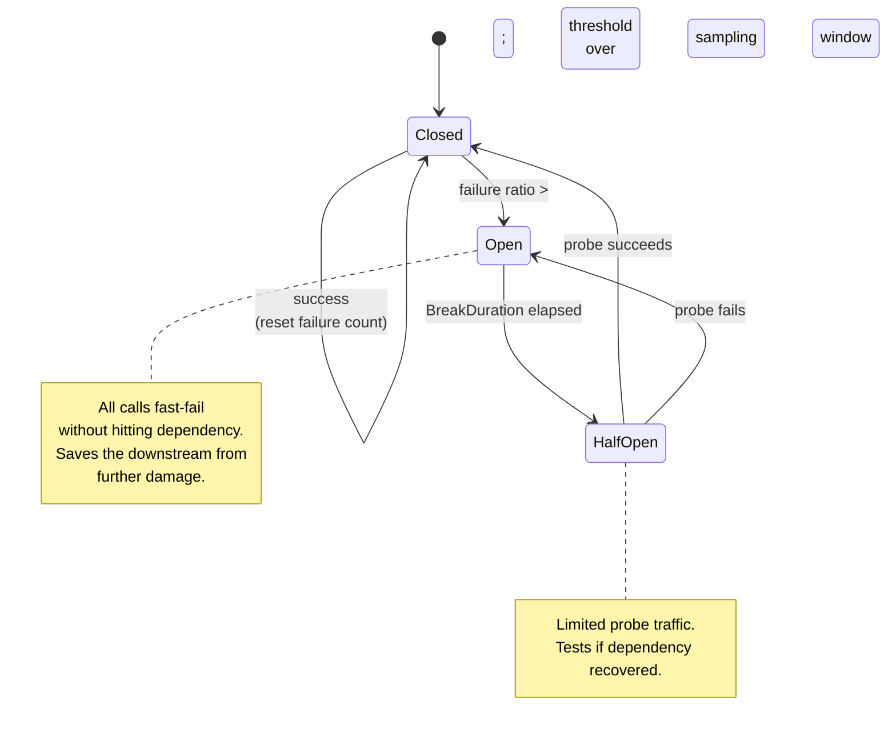

---

### 40. How do you implement graceful shutdown in ASP.NET Core?

ASP.NET Core handles SIGTERM (Linux) / Ctrl+C automatically:
1. Stops accepting new requests.
2. Waits up to `ShutdownTimeout` (default 30s) for in-flight requests to complete.
3. Calls `IHostApplicationLifetime.ApplicationStopping` → your code can clean up.
4. Disposes services.

```csharp
public class Worker(IHostApplicationLifetime lifetime, IConsumer consumer) : BackgroundService
{
    protected override async Task ExecuteAsync(CancellationToken stoppingToken)
    {
        await foreach (var msg in consumer.ReadAllAsync(stoppingToken))
        {
            try { await Process(msg, stoppingToken); }
            catch (OperationCanceledException) { break; }
        }
    }

    public override async Task StopAsync(CancellationToken cancellationToken)
    {
        // Drain any in-flight work
        await consumer.DrainAsync(cancellationToken);
        await base.StopAsync(cancellationToken);
    }
}
```

**Critical for queue consumers:** finish the current message, commit the offset, then exit. Don't lose work.

**Kubernetes-specific:**
- `terminationGracePeriodSeconds: 60` — give the pod time.
- `preStop` hook — sleep for `readinessProbe` to mark unready, so traffic stops before the pod terminates.
- Set `ASPNETCORE_SHUTDOWNTIMEOUTSECONDS` accordingly.

---

## Security

### 41. Walk through OAuth 2.0 / OIDC for a typical web app.

**Authorization Code Flow with PKCE** (the modern default):

1. User clicks "Log in with Google."
2. Browser → IdP authorize endpoint with `client_id`, `code_challenge` (SHA-256 of a random verifier), `redirect_uri`, `scope`, `state`.
3. User authenticates with IdP.
4. IdP redirects browser to `redirect_uri` with `code` and `state`.
5. Server exchanges `code + code_verifier` at the token endpoint → gets `access_token`, `id_token`, optional `refresh_token`.
6. Server validates `id_token` (signature via JWKS, `iss`, `aud`, `exp`).
7. Server creates a session (cookie) for the user.

**ASP.NET Core wiring:**

```csharp
builder.Services.AddAuthentication(options =>
{
    options.DefaultScheme = CookieAuthenticationDefaults.AuthenticationScheme;
    options.DefaultChallengeScheme = OpenIdConnectDefaults.AuthenticationScheme;
})
.AddCookie()
.AddOpenIdConnect(options =>
{
    options.Authority = "https://accounts.google.com";
    options.ClientId = builder.Configuration["Google:ClientId"];
    options.ClientSecret = builder.Configuration["Google:ClientSecret"];
    options.ResponseType = "code";
    options.Scope.Add("openid");
    options.Scope.Add("email");
    options.UsePkce = true;
    options.SaveTokens = true;
});
```

**Senior signals:**
- **PKCE for all clients**, not just public ones (defense in depth).
- **`state` parameter** — CSRF protection, must be validated.
- **`nonce`** — prevents token replay in OIDC.
- **Short-lived access tokens, long-lived refresh tokens with rotation.**
- **Don't put sensitive data in JWTs** — they're base64, not encrypted. Use opaque tokens or encrypt the payload.
- **Refresh-token rotation** — every refresh issues a new refresh token; reuse detection invalidates the chain.

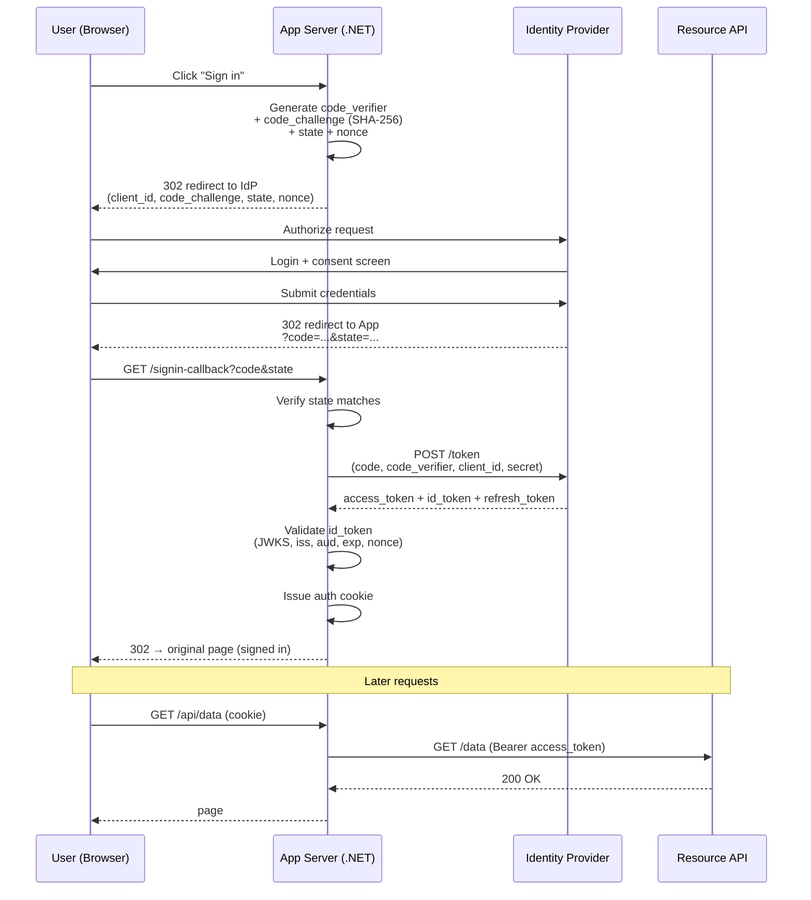

---

### 42. Common deserialization vulnerabilities in .NET.

`BinaryFormatter` is **deprecated and dangerous** — it allows constructing arbitrary types, including ones with malicious side effects (gadgets). RCE-prone.

**Safe alternatives:**
- `System.Text.Json` — only constructs configured types, supports source-gen.
- `MessagePack` — fast, binary, schema-validated.
- `Protobuf` — explicit schemas.

**Even with safe serializers, watch for:**
- **Polymorphic deserialization** — `JsonSerializer` with `TypeNameHandling.All` (Newtonsoft) or `[JsonDerivedType]`-based polymorphism. Restrict to a known set.
- **Deeply nested objects** — DoS via stack overflow. Configure `MaxDepth`.
- **Large strings / arrays** — request size limits at the HTTP layer.

```csharp
// Safer JSON config
var options = new JsonSerializerOptions
{
    MaxDepth = 32,
    AllowTrailingCommas = false,
    PropertyNameCaseInsensitive = false,
};
```

For internal binary payloads, prefer **MessagePack** with `[MessagePackSecurity(MessagePackSecurity.Trusted)]` only on internal channels, never on external input.

---

### 43. Secret management in .NET — patterns.

**Don't:**
- Commit secrets to git.
- Use `appsettings.json` for production secrets.
- Pass secrets as command-line args (visible in `ps`).

**Do:**

1. **User Secrets** for local dev (`dotnet user-secrets`).
2. **Environment variables** for containers — but they're visible in `/proc` to the same UID.
3. **Cloud secret stores** — Azure Key Vault, AWS Secrets Manager, GCP Secret Manager, HashiCorp Vault.
4. **`IConfiguration` integration** — `builder.Configuration.AddAzureKeyVault(...)`. Secrets appear as config keys.
5. **Rotation** — secrets must be rotatable without redeploy. Cache with TTL; refresh on rotation event.

```csharp
builder.Configuration.AddAzureKeyVault(
    new Uri("https://my-vault.vault.azure.net/"),
    new DefaultAzureCredential());
```

**For symmetric encryption keys at rest** — use ASP.NET Core's **Data Protection API**:
```csharp
builder.Services.AddDataProtection()
    .PersistKeysToAzureBlobStorage(...)
    .ProtectKeysWithAzureKeyVault(...);
```

Solves: cookie protection, OAuth state, anti-forgery tokens — all with proper key management and rotation.

---

### 44. SSRF, XXE, prototype pollution — how do they apply to .NET?

**SSRF (Server-Side Request Forgery):**
- App fetches URLs supplied by users → attacker makes app fetch internal resources (`http://169.254.169.254/` for AWS metadata, `http://localhost:8080/admin`).
- **Mitigations**: allowlist destinations, block private IP ranges, use a forward proxy with rules, never follow redirects from untrusted URLs.

```csharp
// Sketch — validate before fetching
if (!Uri.TryCreate(url, UriKind.Absolute, out var uri)) return BadRequest();
if (IsPrivateNetwork(uri.Host)) return Forbid();
if (uri.Scheme is not "https") return BadRequest();
var response = await _httpClient.GetAsync(uri);
```

**XXE (XML External Entity):**
- Default `XmlReader` settings used to allow DTD processing → file disclosure / SSRF.
- .NET 4.5.2+ disables DTD by default, but legacy code still has it on.
- **Always**: `new XmlReaderSettings { DtdProcessing = DtdProcessing.Prohibit, XmlResolver = null }`.

**Prototype pollution** is a JavaScript concept (`__proto__` mutation) — doesn't apply directly to .NET. The closest analog is uncontrolled JSON deserialization into dynamic types (`JObject`, `dynamic`), where attackers can shape data to bypass logic.

**General defense-in-depth:**
- Don't trust user input.
- Whitelist over blacklist.
- Run services with minimum privileges (network policies, IAM).

---

## Observability & Production

### 45. Implement structured logging, correlation IDs, and distributed tracing in ASP.NET Core.

**Stack: OpenTelemetry + Serilog (or just Microsoft.Extensions.Logging).**

```csharp
builder.Services.AddOpenTelemetry()
    .WithTracing(t => t
        .AddAspNetCoreInstrumentation()
        .AddHttpClientInstrumentation()
        .AddEntityFrameworkCoreInstrumentation()
        .AddOtlpExporter())
    .WithMetrics(m => m
        .AddAspNetCoreInstrumentation()
        .AddHttpClientInstrumentation()
        .AddRuntimeInstrumentation()
        .AddOtlpExporter());

builder.Logging.AddOpenTelemetry(o =>
{
    o.IncludeScopes = true;
    o.IncludeFormattedMessage = true;
    o.AddOtlpExporter();
});
```

**Correlation ID middleware:**

```csharp
app.Use(async (ctx, next) =>
{
    var correlationId = ctx.Request.Headers["X-Correlation-ID"].FirstOrDefault()
                       ?? Activity.Current?.TraceId.ToString()
                       ?? Guid.NewGuid().ToString("N");
    ctx.Response.Headers["X-Correlation-ID"] = correlationId;
    using (LogContext.PushProperty("CorrelationId", correlationId))   // Serilog
    {
        await next();
    }
});
```

**Custom Activity for spans:**

```csharp
private static readonly ActivitySource _activitySource = new("MyApp");

public async Task DoWorkAsync()
{
    using var activity = _activitySource.StartActivity("DoWork");
    activity?.SetTag("user.id", _user.Id);
    await Step1Async();
    activity?.AddEvent(new ActivityEvent("step1.done"));
    await Step2Async();
}
```

**The `W3C traceparent` header** flows automatically across HTTP, gRPC, and most message brokers — distributed tracing works out of the box once the OTel exporters are configured.

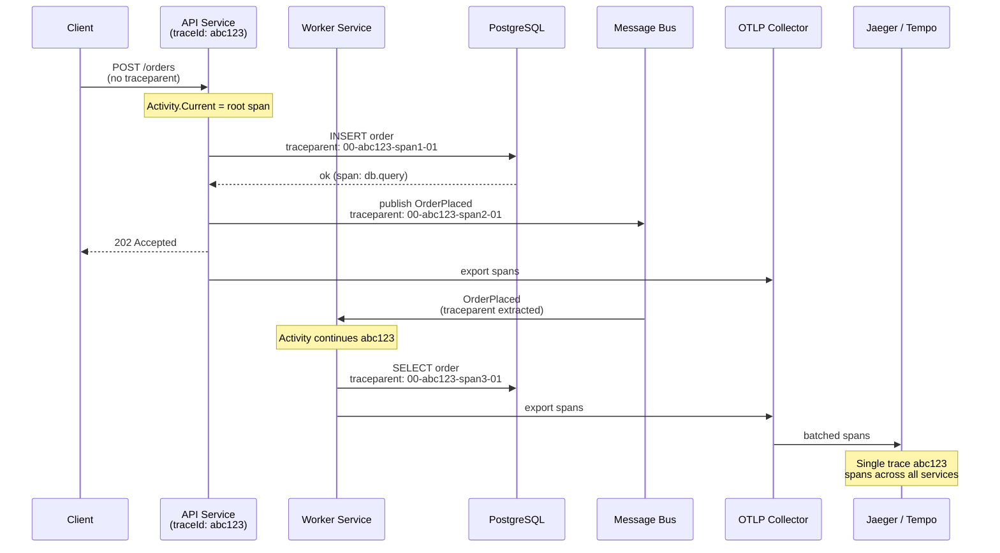

---

### 46. Health checks, readiness vs liveness.

```csharp
builder.Services.AddHealthChecks()
    .AddDbContextCheck<MyDb>(tags: ["ready"])
    .AddRedis(redisCs, tags: ["ready"])
    .AddCheck("self", () => HealthCheckResult.Healthy(), tags: ["live"]);

app.MapHealthChecks("/healthz/live", new HealthCheckOptions
{
    Predicate = h => h.Tags.Contains("live"),
});
app.MapHealthChecks("/healthz/ready", new HealthCheckOptions
{
    Predicate = h => h.Tags.Contains("ready"),
});
```

**Liveness** — "is the process alive?" Restart on failure. Should not check downstream dependencies — if Postgres is down, restarting your app doesn't help.

**Readiness** — "should I receive traffic?" Mark unready when a dependency is down or during startup. Kubernetes stops sending traffic until ready again.

**Common mistake**: putting DB checks on liveness. The whole fleet restarts when the DB hiccups.

---

### 47. Metrics that matter for a .NET service.

**RED method (per endpoint):**
- **Rate** — requests per second.
- **Errors** — error rate, by status code class.
- **Duration** — p50, p95, p99 latency.

**USE method (per resource):**
- **Utilization** — CPU %, memory %, threadpool busy %.
- **Saturation** — queue depths, threadpool queue length.
- **Errors** — exceptions, GC counts.

**.NET-specific:**
- `dotnet.gc.collections.count` (by generation).
- `dotnet.gc.heap.size`.
- `dotnet.threadpool.thread.count`, `dotnet.threadpool.queue.length`.
- `dotnet.exceptions.count`.
- `dotnet.monitor.lock.contention.count`.

**Business metrics:**
- Orders created per minute.
- Successful payments.
- Cache hit rate.

Wire via OpenTelemetry's `AddRuntimeInstrumentation` + custom `Meter`s for business metrics.

```csharp
private static readonly Meter _meter = new("MyApp");
private static readonly Counter<long> _ordersCreated = _meter.CreateCounter<long>("orders.created");

public async Task PlaceOrder(...)
{
    await _orders.SaveAsync(order);
    _ordersCreated.Add(1, new TagList { { "tier", order.Tier } });
}
```

---

### 48. Production debugging without restarting — what's available?

**`dotnet-dump`** — heap snapshot, post-mortem analysis with `dotnet-dump analyze`.

**`dotnet-trace`** — sample CPU, GC events, custom EventSource events. Live, low overhead.

**`dotnet-counters`** — live counters; check GC, threadpool, exceptions, custom counters.

**`dotnet-stack`** — instantaneous stack traces of all threads.

**`dotnet-monitor`** — sidecar exposing all the above via HTTP, with auth. Standard for K8s. Continuous profiling, automatic dump on conditions (memory threshold, GC pause).

**EventSource + ETW (Windows) / EventPipe (cross-platform)** — emit diagnostic events from your code for tooling consumption.

**Diagnostic ports** — for production-safe attach:
```bash
DOTNET_DiagnosticPorts=/tmp/dotnet-diag.sock,suspend
```

**Source-link symbols** — uploaded to a symbol server, debuggers can step into framework code.

In K8s, `dotnet-monitor` running as a sidecar is the gold standard — endpoints for `/dump`, `/trace`, `/metrics`, all gated by auth and rate limits.

---

## Modern .NET — AOT, Source Generators, Trimming

### 49. Native AOT — what does it give you, what does it cost?

**Wins:**
- **Fast startup** — no JIT, no assembly loading. Often 10–50ms.
- **Small binary** — single-file native executable.
- **Lower memory** — no JIT data structures.
- **No JIT in production** — reduced attack surface.

**Costs:**
- **No `Reflection.Emit`** — anything that compiles code at runtime is out (legacy Newtonsoft, dynamic LINQ, IL.Emit-based libs).
- **Limited reflection** — must declare what's used via `DynamicallyAccessedMembers`.
- **No `Assembly.LoadFile`** dynamically.
- **No traditional EF Core** (uses runtime expression trees) — limited support emerging.
- **Larger build artifacts than expected** sometimes (statically linked CRT).

**Good fit:**
- CLI tools (`dotnet tool`).
- Lambda / Cloud Functions / serverless (cold starts matter).
- Single-purpose microservices with no dynamic codegen needs.
- Containers where image size matters.

**Bad fit:**
- Pluggable architectures.
- Apps using Newtonsoft.Json heavily.
- Apps where dynamic runtime config drives types (rare but real).

```xml
<PropertyGroup>
  <PublishAot>true</PublishAot>
  <InvariantGlobalization>true</InvariantGlobalization>
</PropertyGroup>
```

`dotnet publish -c Release -r linux-x64`.

---

### 50. Trimming — what is it and what breaks?

**Trimming** removes unused IL from your published app. `dotnet publish -p:PublishTrimmed=true`.

**What breaks:**
- **Reflection** — `typeof(Foo).GetMethod("Bar")` might not find `Bar` if nothing references it statically.
- **Serialization** of types only constructed reflectively.
- **DI** — services discovered via reflection (some IoC containers).

**Annotations to keep things working:**

```csharp
[DynamicallyAccessedMembers(DynamicallyAccessedMemberTypes.PublicProperties)]
public T Deserialize<T>(string json) => JsonSerializer.Deserialize<T>(json)!;
```

Tells the trimmer "keep public properties on whatever T is."

**Trim-warning analyzers** (`<TrimmerSingleWarn>false</TrimmerSingleWarn>`) flag unsafe patterns at build time.

**Practical strategy:**
1. Start with `<IsTrimmable>false</IsTrimmable>` on every package.
2. Mark your own assemblies trimmable, see what breaks.
3. Annotate or refactor.
4. Source generators replace reflection → trim-safe.

System.Text.Json source generators, `LoggerMessage`, `LibraryImport`, regex `[GeneratedRegex]` — all designed to be trim/AOT-safe.

---

### 51. Minimal API perf trade-offs vs Controllers.

Both go through Kestrel + endpoint routing → similar perf for the request itself. Differences:

**Minimal APIs:**
- Lighter pipeline — no MVC filter pipeline, model binding is more direct.
- AOT-friendly with the request-delegate generator (`RequestDelegateGenerator` source gen).
- Lower allocation per request.

**Controllers:**
- MVC infrastructure adds some overhead (filters, model binders, action selector).
- More features out of the box (model validation, content negotiation, action filters).

In benchmarks, minimal APIs tend to be 10–30% lower latency at p99 in micro-benchmarks. Real-world differences are often dwarfed by your downstream calls.

**Senior take:** pick by team familiarity and feature need, not perf. If you're chasing nanoseconds, you've got bigger architectural levers.

---

## Caching

### 52. Cache stampede / dogpile — what is it and how do you prevent it?

When a hot cache entry expires, **N concurrent requests** all miss simultaneously, all hit the origin (DB / API), and all write the same value back. The origin gets crushed.

**Mitigations:**

1. **Single-flight (request coalescing)** — only one concurrent rebuild per key. The rest wait on its result.

```csharp
private static readonly ConcurrentDictionary<string, Lazy<Task<Product>>> _inflight = new();

public Task<Product> GetAsync(string key)
{
    return _inflight.GetOrAdd(key, k => new Lazy<Task<Product>>(async () =>
    {
        try
        {
            if (_cache.TryGetValue(k, out Product cached)) return cached;
            var fresh = await _origin.LoadAsync(k);
            _cache.Set(k, fresh, TimeSpan.FromMinutes(5));
            return fresh;
        }
        finally
        {
            _inflight.TryRemove(k, out _);
        }
    })).Value;
}
```

2. **Probabilistic early expiration (XFetch)** — refresh slightly before TTL expires, with probability proportional to time-to-expire.
3. **Stale-while-revalidate** — return stale value immediately, refresh in the background.
4. **Jitter on TTLs** — `TTL + Random(0..30s)` prevents synchronized expirations across keys.
5. **`HybridCache`** (.NET 9) — built-in stampede protection across in-memory + distributed layers.

**The naive `if (!cache.TryGet) cache.Set(load())`** is what causes the bug. Always coalesce.

---

### 53. `IMemoryCache` vs `IDistributedCache` vs `HybridCache` — when to use each?

| Cache | Scope | Speed | Capacity | When |
|-------|-------|-------|----------|------|
| `IMemoryCache` | Per-process | Fastest (~ns) | Limited by RAM | Single-instance, short-lived hot data |
| `IDistributedCache` | Shared (Redis/SQL) | Network hop (~ms) | Large | Multi-instance, session data, cross-instance consistency |
| `HybridCache` (.NET 9) | Both — L1 in-mem, L2 distributed | Fast on hit | Large | Most apps. Replaces hand-rolled two-tier caches. |

```csharp
// HybridCache (.NET 9)
builder.Services.AddHybridCache(o =>
{
    o.DefaultEntryOptions = new HybridCacheEntryOptions
    {
        Expiration = TimeSpan.FromMinutes(5),
        LocalCacheExpiration = TimeSpan.FromMinutes(1),
    };
});

public class ProductService(HybridCache cache, IProductRepo repo)
{
    public ValueTask<Product> GetAsync(int id, CancellationToken ct) =>
        cache.GetOrCreateAsync(
            $"product:{id}",
            async ct => await repo.LoadAsync(id, ct),
            cancellationToken: ct);
}
```

**`HybridCache` benefits:**
- Built-in stampede protection (single-flight per key).
- Tag-based invalidation.
- L1 (in-process) shields L2 (Redis) from hot keys.

**Don't use `IMemoryCache` in multi-instance apps for invalidation-sensitive data** — instances will diverge.

---

### 54. Cache invalidation strategies — name them and their trade-offs.

**The hardest problem in CS, allegedly.** Practical approaches:

| Strategy | How | Pros | Cons |
|----------|-----|------|------|
| **TTL only** | Expire after N | Simple, eventually consistent | Stale window |
| **Write-through** | Update cache on write | Always fresh | Couples write path to cache; double write risk |
| **Write-behind** | Update cache, async DB | Fast writes | Risk of data loss on crash |
| **Cache-aside** | Read: load + cache. Write: invalidate. | Standard, simple | Race: read-then-write across instances |
| **Tag-based** | Group keys by tag, invalidate tag | Bulk invalidation | Tag store overhead |
| **Versioned keys** | `product:42:v17` — bump version, old keys expire | Atomic switch | Need version source |
| **Pub/sub invalidation** | Publish "invalidate" event; instances drop entry | Fast cross-instance | Bus dependency |

```csharp
// Versioned keys — change one global version atomically
var version = await _versionStore.IncrementAsync("products");
await _cache.SetAsync($"products:{version}", data);
// Reads use the latest version → old entries become unreachable, GC'd by TTL.
```

**The hard case:** invalidate cached projection when underlying entity changes. Solutions: emit a domain event on save → consumer invalidates the cache. Couples the cache to the bus, but it's the only correct answer for multi-source aggregates.

---

### 55. Output cache vs response cache vs HTTP cache headers — what's the difference?

| Layer | Where | Controlled by |
|-------|-------|---------------|
| **HTTP cache (`Cache-Control`, `ETag`)** | Browser, CDN, intermediaries | Response headers |
| **`UseResponseCaching()`** | ASP.NET Core in-memory, respects HTTP cache headers | `[ResponseCache]` attribute |
| **`UseOutputCache()`** (.NET 7+) | ASP.NET Core, policy-based, server-controlled | `CacheOutput()` extension + policies |

**HTTP cache** is universally honored (browsers, CDNs). Always set `Cache-Control` correctly:

```csharp
app.MapGet("/static-data", (HttpContext ctx) =>
{
    ctx.Response.Headers.CacheControl = "public, max-age=3600, immutable";
    return data;
});
```

**Output caching** is more flexible — keys by route, query, headers, custom logic; supports tag-based eviction:

```csharp
builder.Services.AddOutputCache(o =>
{
    o.AddPolicy("products", b => b
        .Expire(TimeSpan.FromMinutes(5))
        .SetVaryByQuery("category")
        .Tag("products"));
});

app.MapGet("/products", () => ...).CacheOutput("products");

// Invalidate all "products"-tagged entries
await _outputCacheStore.EvictByTagAsync("products", ct);
```

**Senior take:** ship CDN-cacheable HTTP responses for public, immutable assets. Use output caching for server-rendered content with eviction needs. Don't reinvent HTTP cache.

---

## Messaging & Background Jobs

### 56. Kafka vs RabbitMQ vs Azure Service Bus — when do you pick which?

| Broker | Model | Sweet spot |
|--------|-------|-----------|
| **Kafka** | Distributed log, partitioned, retain-by-time | High throughput, stream processing, event sourcing, replay capability |
| **RabbitMQ** | Traditional broker, queues + exchanges | Task queues, RPC, complex routing, delayed messages |
| **Azure Service Bus** | Cloud broker, queues + topics | Azure-native, transactions, sessions, FIFO, dead-lettering |
| **AWS SQS / SNS** | Queue + pub/sub | AWS-native, simple, scales to infinity, no ordering by default |

**Decision factors:**
- **Throughput**: Kafka handles millions/sec; RabbitMQ tens of thousands; Service Bus thousands.
- **Retention**: Kafka stores messages for days/weeks (replay). RabbitMQ deletes on ack.
- **Ordering**: Kafka per-partition. Service Bus per-session. RabbitMQ per-queue (single consumer).
- **Operational cost**: Managed (Service Bus, Confluent Cloud) vs self-hosted (RabbitMQ on K8s).

**.NET clients:** `Confluent.Kafka`, `RabbitMQ.Client`, `Azure.Messaging.ServiceBus`. Higher-level: **MassTransit** (broker-agnostic, sagas, retries), **NServiceBus** (commercial, enterprise patterns).

---

### 57. Background jobs in .NET — `BackgroundService` vs Hangfire vs Quartz vs cloud-native?

| Option | Persistence | Scheduling | Retry | Distributed |
|--------|-------------|-----------|-------|-------------|
| `BackgroundService` | None (in-memory) | Manual (`Timer`, `PeriodicTimer`) | Manual | No (per-instance) |
| **Hangfire** | DB-backed (SQL, Redis) | Cron, delayed, recurring | Built-in | Yes (job server pool) |
| **Quartz.NET** | DB-backed | Powerful cron, calendars | Built-in | Yes (clustered scheduler) |
| **Azure Functions / AWS Lambda** | Cloud-managed | Cron triggers, queue triggers | Cloud-native | Yes |
| **K8s CronJob** | None | K8s-level cron | Pod restart | Cloud-native |

```csharp
// Hangfire example
builder.Services.AddHangfire(c => c.UseSqlServerStorage(cs));
builder.Services.AddHangfireServer();

// Fire-and-forget
BackgroundJob.Enqueue<IEmailService>(s => s.SendWelcomeAsync(userId));

// Recurring
RecurringJob.AddOrUpdate<IReportService>(
    "daily-report",
    s => s.GenerateDailyAsync(),
    Cron.Daily);

// Delayed
BackgroundJob.Schedule<IOrderService>(
    s => s.ExpireUnpaidOrderAsync(orderId),
    TimeSpan.FromHours(24));
```

**Senior signals:**
- **`BackgroundService` for in-process, transient work** (queue draining, cache warming).
- **Hangfire** for app-internal scheduled work where DB is already there. Has a UI dashboard.
- **Quartz** for complex schedules (multi-timezone, business calendars).
- **Cloud-native** (K8s CronJob, Azure Functions) when ops can manage them — separates job lifecycle from app lifecycle.
- **Don't run BackgroundService for jobs that must complete** — pod restarts kill in-flight work. Use a persistent queue.

---

### 58. Message ordering, partitioning, and exactly-once semantics.

**Ordering** is **per-partition / per-queue**, not global, in every modern broker.

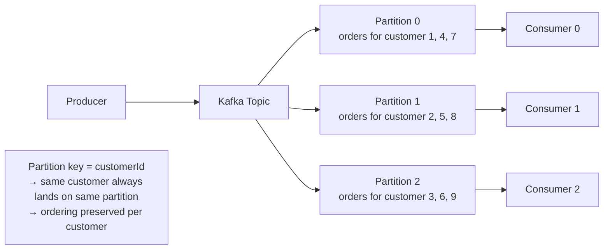

**Partitioning rules:**
- Use a **stable key** that groups events that must be ordered (`customerId`, `orderId`).
- Number of partitions ≥ number of consumers (otherwise consumers idle).
- Increasing partitions later **rebalances keys** — old keys may move. Plan capacity up front.

**Exactly-once is mostly a myth.** Every broker is **at-least-once** in practice. Achieve effective exactly-once via:

1. **Idempotent consumers** — dedupe by `messageId` (store seen IDs with TTL).
2. **Transactional outbox + idempotent handlers** — atomic publish + idempotent consume.
3. **Kafka transactions** — exactly-once across "consume → process → produce" within Kafka, but breaks if you write to external DBs.

```csharp
public async Task Handle(OrderPlacedEvent evt, CancellationToken ct)
{
    if (await _processed.HasSeenAsync(evt.MessageId, ct)) return;   // dedupe

    using var tx = await _db.BeginTransactionAsync(ct);
    await _orders.SaveAsync(MapToOrder(evt), ct);
    await _processed.MarkSeenAsync(evt.MessageId, TimeSpan.FromDays(7), ct);
    await tx.CommitAsync(ct);
}
```

---

### 59. Poison messages and dead letter queues — strategy.

A **poison message** is one that consistently fails. Without a strategy, it blocks the queue forever (or retries flood the system).

**Standard pattern:**

1. **Retry with backoff** — 3–5 attempts with exponential delays. Most failures are transient (network blip).
2. **Move to DLQ** after retry exhaustion. Most brokers (RabbitMQ, Service Bus, SQS) have native DLQ support.
3. **Alert on DLQ depth** — if it's > 0, a human should look.
4. **Replay tooling** — once the bug is fixed, drain DLQ back to main queue.

```csharp
// MassTransit retry + redelivery
cfg.UseMessageRetry(r => r.Exponential(
    retryLimit: 5,
    minInterval: TimeSpan.FromSeconds(1),
    maxInterval: TimeSpan.FromMinutes(5),
    intervalDelta: TimeSpan.FromSeconds(5)));

cfg.UseDelayedRedelivery(r => r.Intervals(
    TimeSpan.FromMinutes(5),
    TimeSpan.FromMinutes(15),
    TimeSpan.FromHours(1)));
// After all retries + redeliveries fail → DLQ
```

**Categorize failures:**
- **Transient** (timeout, 503) → retry.
- **Permanent** (validation error, deserialization failure) → DLQ immediately, don't waste retries.
- **Poison** (consumer bug) → DLQ after retries; the bug needs a code fix.

```csharp
catch (ValidationException) { throw new UnrecoverableException(...); } // skip retry
catch (TimeoutException) { throw; }                                    // retry
```

**Anti-pattern:** swallowing exceptions to "keep the consumer running." That hides bugs and pretends success.

---

## Testing Strategy

### 60. The test pyramid for a .NET service — how do you balance?

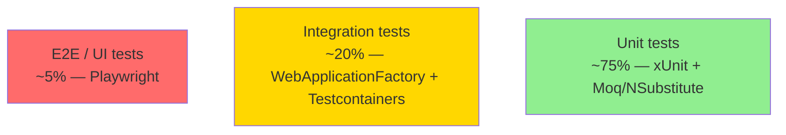

**Unit tests** (75%) — fast (<10ms), isolated, deterministic. Test pure logic, validators, handlers.

**Integration tests** (20%) — exercise the full request pipeline against in-memory or containerized dependencies. Use `WebApplicationFactory<Program>` + Testcontainers.

**E2E tests** (5%) — real browser, real environment. Cover the 5–10 critical user flows. Brittle and slow; minimize.

**Anti-patterns:**
- **Inverted pyramid** — many slow E2E tests, few unit tests. Result: 30-min CI, flaky failures.
- **No integration tests** — unit tests pass but EF queries break in prod (LINQ-to-SQL translation differences).
- **Testing implementation details** — refactor breaks 100 tests; you're testing the *how*, not the *what*.

**Senior take:** invest in integration tests. They catch the bugs that production cares about (DB queries, middleware order, DI wiring) without the brittleness of E2E.

---

### 61. Integration tests with `WebApplicationFactory` — how do you set up?

```csharp
public class ApiTests : IClassFixture<WebApplicationFactory<Program>>
{
    private readonly HttpClient _client;

    public ApiTests(WebApplicationFactory<Program> factory)
    {
        _client = factory.WithWebHostBuilder(builder =>
        {
            builder.ConfigureServices(services =>
            {
                // Replace real services with test doubles
                services.RemoveAll<IEmailSender>();
                services.AddSingleton<IEmailSender, FakeEmailSender>();

                // Or replace DbContext with in-memory / SQLite
                services.RemoveAll<DbContextOptions<MyDb>>();
                services.AddDbContext<MyDb>(o => o.UseSqlite("DataSource=:memory:"));
            });
        }).CreateClient();
    }

    [Fact]
    public async Task Get_Products_Returns_Ok()
    {
        var response = await _client.GetAsync("/api/products");
        response.EnsureSuccessStatusCode();
        var products = await response.Content.ReadFromJsonAsync<Product[]>();
        Assert.NotEmpty(products!);
    }
}
```

**Patterns:**
- **`Program` class needs to be `public`** in .NET 6+ minimal hosting model. Add `public partial class Program { }` at the bottom of `Program.cs`.
- **One factory instance per test class** (`IClassFixture`) — avoids cold-start cost.
- **Fresh DB per test** — use a transaction that rolls back, or seed/clean explicitly.
- **Authentication** — register a `TestAuthenticationHandler` that always returns a fixed `ClaimsPrincipal` for `[Authorize]` endpoints.

**Pitfall:** sharing state between tests via singletons. Either reset state in `Dispose()` or scope the singleton to the factory.

---

### 62. Testcontainers — when and why over in-memory providers?

**In-memory EF provider** has subtle differences from real DBs: case sensitivity, transaction semantics, native functions, JSON support, full-text search. Tests pass against InMemory and fail in production.

**Testcontainers** spins up a **real database in a Docker container** for the test run.

```csharp
public class DatabaseFixture : IAsyncLifetime
{
    private readonly PostgreSqlContainer _postgres = new PostgreSqlBuilder()
        .WithImage("postgres:16-alpine")
        .WithDatabase("testdb")
        .Build();

    public string ConnectionString => _postgres.GetConnectionString();

    public async Task InitializeAsync() => await _postgres.StartAsync();
    public async Task DisposeAsync() => await _postgres.DisposeAsync();
}

public class OrderRepoTests : IClassFixture<DatabaseFixture>
{
    [Fact]
    public async Task SaveAndQuery_Roundtrip()
    {
        await using var db = new MyDb(new DbContextOptionsBuilder<MyDb>()
            .UseNpgsql(_fixture.ConnectionString).Options);
        await db.Database.MigrateAsync();
        // ... real Postgres semantics
    }
}
```

**Use Testcontainers for:**
- Database integration tests.
- Redis / RabbitMQ / Kafka consumer tests.
- Anything where the real implementation matters.

**Costs:**
- Docker required on dev + CI runners.
- Slower than in-memory (seconds for container start; mitigate with `IClassFixture` for sharing).
- CI integration (`docker:dind`, GitHub Actions service containers).

For CI speed: reuse one container across all tests in a project; clean state between tests via transactions or schema reset.

---

### 63. Contract tests with Pact — when do you need them?

**Problem**: Service A consumes Service B. Service B changes its API. Tests in both repos pass. Production breaks.

**Solution — Consumer-Driven Contract Tests:**

1. **Consumer** (Service A) writes a test against a mock of B, recording its expectations as a **pact file** (JSON).
2. **Pact file** is published to a broker.
3. **Provider** (Service B) runs verification: spin up B, replay pact requests, assert responses match.

```csharp
// Consumer side (Service A)
[Fact]
public async Task GetUser_Returns_Expected_Shape()
{
    var pact = Pact.V4("OrderService", "UserService").WithHttpInteractions();
    pact.UponReceiving("a request for user 42")
        .WithRequest(HttpMethod.Get, "/users/42")
        .WillRespond()
        .WithStatus(200)
        .WithJsonBody(new { id = 42, email = Match.Type("a@b.com") });

    await pact.VerifyAsync(async ctx =>
    {
        var client = new UserClient(ctx.MockServerUri);
        var user = await client.GetAsync(42);
        Assert.Equal(42, user.Id);
    });
}
```

```csharp
// Provider side (Service B) — verify against published pacts
[Fact]
public void Verify_Pact()
{
    using var server = new WebApplicationFactory<Program>();
    var verifier = new PactVerifier();
    verifier.ServiceProvider("UserService", new Uri(server.Server.BaseAddress))
        .WithPactBrokerSource(new Uri("https://pact-broker"))
        .Verify();
}
```

**When pact tests pay off:**
- Many consumers of a single service.
- Independent deploys (no integration env where everything starts together).
- Polyglot stack — pact files are language-agnostic.

**When they're overhead:**
- Two services, same team, deploy together → integration tests are simpler.
- Public APIs with many unknown consumers → use OpenAPI contracts and broad regression tests.

---

## Containers & Cloud-Native

### 64. Multi-stage Dockerfile for .NET — what makes it good?

```dockerfile
# syntax=docker/dockerfile:1.7

# --- Build stage ---
FROM mcr.microsoft.com/dotnet/sdk:9.0 AS build
ARG BUILD_CONFIGURATION=Release
WORKDIR /src

# Copy csproj first (layer cache for restore)
COPY ["src/MyApp.Api/MyApp.Api.csproj", "src/MyApp.Api/"]
COPY ["src/MyApp.Domain/MyApp.Domain.csproj", "src/MyApp.Domain/"]
RUN dotnet restore "src/MyApp.Api/MyApp.Api.csproj"

# Copy source and publish
COPY . .
RUN dotnet publish "src/MyApp.Api/MyApp.Api.csproj" \
    -c $BUILD_CONFIGURATION \
    -o /app/publish \
    --no-restore \
    /p:UseAppHost=false

# --- Runtime stage ---
FROM mcr.microsoft.com/dotnet/aspnet:9.0-alpine AS runtime
WORKDIR /app
COPY --from=build /app/publish .

# Run as non-root
USER $APP_UID
EXPOSE 8080
ENV ASPNETCORE_URLS=http://+:8080 \
    DOTNET_RUNNING_IN_CONTAINER=true \
    DOTNET_USE_POLLING_FILE_WATCHER=false

ENTRYPOINT ["dotnet", "MyApp.Api.dll"]
```

**What makes it good:**

1. **Multi-stage** — final image has runtime only, no SDK (~100 MB vs ~800 MB).
2. **Layer cache for restore** — copying `csproj` first means changes to `.cs` files don't bust the restore cache.
3. **Alpine base** — smaller, fewer CVEs. Switch to `aspnet:9.0` (Debian) if you need ICU/native libs.
4. **Non-root user** — `USER $APP_UID` (built-in `app` user). Required by security policies.
5. **Explicit `EXPOSE` and `ASPNETCORE_URLS`** — port `8080` instead of legacy `80` (.NET 8+ default).
6. **No build tools in final image** — smaller attack surface.

**Advanced:**
- **Chiseled images** (`mcr.microsoft.com/dotnet/aspnet:9.0-jammy-chiseled`) — even smaller, distroless-style.
- **Native AOT** — even smaller (~50 MB), but losing JIT trade-offs.
- **`COPY --link`** (Docker BuildKit) — better cache reuse.

---

### 65. Configuration in cloud-native .NET — what's the strategy?

`IConfiguration` aggregates from multiple sources, **last wins**:

```csharp
// Program.cs (default order)
builder.Configuration
    .AddJsonFile("appsettings.json")                    // base
    .AddJsonFile($"appsettings.{env.EnvironmentName}.json", optional: true)
    .AddEnvironmentVariables()                          // overrides everything
    .AddCommandLine(args);                              // dev / debugging
```

**Cloud-native additions:**

```csharp
// Azure Key Vault
builder.Configuration.AddAzureKeyVault(
    new Uri("https://my-vault.vault.azure.net/"),
    new DefaultAzureCredential());

// AWS Secrets Manager
builder.Configuration.AddSecretsManager(region: RegionEndpoint.USEast1);

// Kubernetes ConfigMap (mounted as files)
builder.Configuration.AddKeyPerFile(directoryPath: "/config", optional: true);
```

**Patterns:**

- **Environment variables for everything** in containers. Map K8s ConfigMap entries to env vars.
- **Secrets via secret store** (Key Vault, Secrets Manager, External Secrets Operator). Never bake secrets into images or commit to git.
- **Hierarchical keys** — `Database__ConnectionString` (double underscore) maps to `Database:ConnectionString` in `IConfiguration`.
- **`IOptions<T>` pattern** — strongly-typed config, validated on startup:

```csharp
builder.Services.AddOptions<DatabaseOptions>()
    .Bind(builder.Configuration.GetSection("Database"))
    .ValidateDataAnnotations()
    .ValidateOnStart();
```

- **Feature flags** as config — `Microsoft.FeatureManagement` reads from `IConfiguration`, supports targeting filters.
- **Hot reload** — `IOptionsMonitor<T>` watches changes; useful for log levels, rate limits.

---

### 66. Health checks and graceful shutdown in Kubernetes — what to wire?

```csharp
builder.Services.AddHealthChecks()
    .AddCheck("self", () => HealthCheckResult.Healthy(), tags: ["live"])
    .AddDbContextCheck<MyDb>(tags: ["ready"])
    .AddRedis(redisCs, tags: ["ready"]);

app.MapHealthChecks("/healthz/live", new HealthCheckOptions
{
    Predicate = h => h.Tags.Contains("live"),
});
app.MapHealthChecks("/healthz/ready", new HealthCheckOptions
{
    Predicate = h => h.Tags.Contains("ready"),
});
```

**K8s deployment manifest:**

```yaml
spec:
  terminationGracePeriodSeconds: 60      # match ASPNETCORE_SHUTDOWNTIMEOUTSECONDS
  containers:
    - name: api
      lifecycle:
        preStop:
          exec:
            command: ["sh", "-c", "sleep 10"]   # let readiness drain traffic first
      livenessProbe:
        httpGet:
          path: /healthz/live
          port: 8080
        initialDelaySeconds: 10
        periodSeconds: 10
      readinessProbe:
        httpGet:
          path: /healthz/ready
          port: 8080
        initialDelaySeconds: 5
        periodSeconds: 5
      startupProbe:
        httpGet:
          path: /healthz/live
          port: 8080
        failureThreshold: 30
        periodSeconds: 5
```

**Key points:**

1. **Liveness ≠ Readiness.** Liveness: "restart me if I'm dead." Readiness: "send me traffic." DB outages should fail readiness, **not** liveness — restarting won't fix the DB.
2. **`preStop` sleep** — gives the K8s service time to remove the pod from the endpoint list before the SIGTERM arrives. Without it, in-flight requests get cut.
3. **`terminationGracePeriodSeconds`** ≥ longest in-flight request. K8s SIGKILLs at this timeout.
4. **Startup probe** — for slow-starting apps (warm-up, EF migrations), avoids liveness killing the pod during boot.
5. **`IHostApplicationLifetime.ApplicationStopping`** — your code runs here. Drain queues, finish in-flight messages, then exit.

```csharp
public class Worker(IHostApplicationLifetime lifetime) : BackgroundService
{
    public override async Task StopAsync(CancellationToken ct)
    {
        await DrainQueuesAsync(ct);
        await base.StopAsync(ct);
    }
}
```

---

## Modern C# Language Features

### 67. Records vs classes vs structs — when do you pick each?

| Type | Identity | Mutability | Equality | Heap/Stack |
|------|----------|-----------|----------|------------|
| `class` | Reference | Mutable (typical) | Reference | Heap |
| `record class` | Reference | Immutable (typical) | Value-based | Heap |
| `struct` | Value | Mutable / readonly | Value-based (reflection) | Stack/inline |
| `record struct` | Value | Immutable (typical) | Value-based (compile-time) | Stack/inline |
| `readonly struct` | Value | Fully immutable | Value-based | Stack/inline |

**When to pick:**

- **`class`** — entities with identity (`Order`, `User`). Long-lived, mutable, reference equality.
- **`record class`** — DTOs, value objects, messages, events. Immutable by design, value equality, `with`-expressions for non-destructive update.
- **`struct`** — small (≤16 bytes), value-typed data (`Point`, `Color`). Avoid heap allocation. Avoid if mutable; passing copies is confusing.
- **`record struct`** — value-typed data with value equality and immutability built in. Modern default for small immutable values.
- **`readonly struct`** — immutability enforced; safer than mutable struct.
- **`ref struct`** — stack-only types (`Span<T>`, `ReadOnlySpan<T>`). Can't escape to heap, can't be in async.

```csharp
// Identity entity
public class Order { public int Id { get; init; } public List<Item> Items { get; } = new(); }

// Value object
public readonly record struct Money(decimal Amount, string Currency);

// Immutable DTO with non-destructive copy
public record CustomerDto(string Name, string Email);
var updated = customer with { Email = "new@x.com" };

// Domain event
public record OrderPlaced(Guid OrderId, DateTime At, decimal Total);
```

**Pitfall:** `record class` doesn't make collections immutable. `public List<Item> Items { get; init; }` is still mutable. Use `IReadOnlyList<Item>` + `ImmutableArray<T>` if true immutability matters.

---

### 68. Pattern matching at depth — what features exist?

**Beyond basic `switch` expressions:**

```csharp
// Property patterns + nested
decimal Discount(Order o) => o switch
{
    { Customer.Tier: "VIP", Total: > 1000m } => o.Total * 0.20m,
    { Customer.Tier: "VIP" }                  => o.Total * 0.10m,
    { Total: > 500m }                          => o.Total * 0.05m,
    _                                          => 0m,
};

// Positional patterns (deconstruction)
public record Point(int X, int Y);
string Quadrant(Point p) => p switch
{
    (> 0, > 0) => "Q1",
    (< 0, > 0) => "Q2",
    (< 0, < 0) => "Q3",
    (> 0, < 0) => "Q4",
    (0, 0)     => "Origin",
    _          => "Axis",
};

// Type patterns + var
string Describe(object o) => o switch
{
    int i and > 0 => $"positive int {i}",
    int 0          => "zero",
    string { Length: > 0 } s => $"non-empty string '{s}'",
    string         => "empty string",
    null           => "null",
    _              => "unknown",
};

// List patterns (C# 11)
bool IsPng(byte[] header) => header is [0x89, 0x50, 0x4E, 0x47, ..];
string ListShape<T>(IList<T> xs) => xs switch
{
    []                 => "empty",
    [_]                => "one item",
    [_, _]             => "two items",
    [var first, ..]    => $"starts with {first}",
};

// Relational + logical
string TempBand(double c) => c switch
{
    < 0           => "freezing",
    >= 0 and < 15 => "cold",
    >= 15 and < 25 => "mild",
    >= 25 and < 35 => "warm",
    _             => "hot",
};
```

**Exhaustiveness:**
- The compiler warns on non-exhaustive `switch` expressions. Use `_` for the catch-all if you want to suppress; or list all cases for clarity.
- For closed type hierarchies, declare the base as a sealed interface / abstract class with private constructors so the compiler can prove exhaustiveness.

**Senior signals:**
- Pattern matching often replaces visitor patterns and dispatch chains.
- Combine with sealed/discriminated-union-like records for type-safe state machines.
- Don't overdo it — a 30-arm switch is harder to read than polymorphism for that case.

---

### 69. `ref struct`, `scoped`, `required`, primary constructors — what do they solve?

**`ref struct`** — stack-only type. Fields are validated at compile time to ensure nothing escapes the stack. `Span<T>` is the canonical example.

```csharp
ref struct Tokenizer
{
    private ReadOnlySpan<char> _input;
    public Tokenizer(ReadOnlySpan<char> input) { _input = input; }
    // Cannot be a field on a class, cannot be in async, cannot be boxed
}
```

**`scoped`** (C# 11) — restricts a `ref` or `ref struct` to the current method scope. Prevents capturing into a longer-lived ref.

```csharp
void Process(scoped ReadOnlySpan<byte> buffer)
{
    // Cannot store `buffer` in a field with longer lifetime — compiler enforces
}
```

**`required`** (C# 11) — forces a property to be initialized at construction. Replaces "constructor with N args" boilerplate while keeping object initializer syntax.

```csharp
public class User
{
    public required string Email { get; init; }
    public required string Name { get; init; }
    public DateTime? LastLogin { get; init; }
}

// Compile error: missing required member
var u = new User();

// OK
var u = new User { Email = "a@b.com", Name = "Alice" };
```

**Primary constructors** (C# 12) — declare constructor parameters on the type, available throughout the body.

```csharp
public class OrderService(IOrderRepo repo, ILogger<OrderService> log)
{
    public async Task<Order> GetAsync(int id)
    {
        log.LogInformation("Fetching {Id}", id);
        return await repo.FindAsync(id);
    }
}

// Records have had this since C# 9:
public record Money(decimal Amount, string Currency);

// Structs too:
public readonly struct Vector2(double x, double y)
{
    public double Length => Math.Sqrt(x * x + y * y);
}
```

**Caveats:**
- Primary constructor params on **classes** are *captured fields*, not auto-properties (different from records). Use them as fields, not as public surface.
- `required` requires the consumer to be C# 11+ aware (older clients ignore it).
- `ref struct` interactions with `using` and `await` are restricted — read the diagnostic carefully.

---

## HTTP & Networking

### 70. `IHttpClientFactory` — typed clients, named clients, lifetime management.

**The bug it solves:** `new HttpClient()` per request leaks sockets (TIME_WAIT exhaustion). A single static `HttpClient` doesn't honor DNS changes.

`IHttpClientFactory` pools `HttpMessageHandler` instances (default lifetime: 2 minutes), recreating them periodically so DNS refreshes; the `HttpClient` instance you receive is cheap to create.

**Three usage styles:**

```csharp
// 1. Named clients
builder.Services.AddHttpClient("github", c =>
{
    c.BaseAddress = new Uri("https://api.github.com/");
    c.DefaultRequestHeaders.UserAgent.ParseAdd("MyApp/1.0");
});

public class GitHubService(IHttpClientFactory factory)
{
    public async Task<Repo> GetRepo(string owner, string name)
    {
        var client = factory.CreateClient("github");
        return await client.GetFromJsonAsync<Repo>($"repos/{owner}/{name}");
    }
}

// 2. Typed clients (preferred — strong typing, easy DI)
builder.Services.AddHttpClient<GitHubClient>(c =>
{
    c.BaseAddress = new Uri("https://api.github.com/");
});

public class GitHubClient(HttpClient http)
{
    public Task<Repo> GetRepo(string owner, string name) =>
        http.GetFromJsonAsync<Repo>($"repos/{owner}/{name}")!;
}

// 3. Generated clients (via Refit / NSwag)
builder.Services.AddRefitClient<IGitHubApi>()
    .ConfigureHttpClient(c => c.BaseAddress = new Uri("https://api.github.com/"));

public interface IGitHubApi
{
    [Get("/repos/{owner}/{name}")]
    Task<Repo> GetRepo(string owner, string name);
}
```

**Adding resilience (Polly v8):**

```csharp
builder.Services.AddHttpClient<GitHubClient>(...)
    .AddStandardResilienceHandler()        // retry + circuit breaker + timeout defaults
    .AddTransientHttpErrorPolicy(p => p.WaitAndRetryAsync(3, i => TimeSpan.FromSeconds(i)));
```

**Senior signals:**
- **Typed clients are the default.** Cleanest DI, easy testing.
- **Don't dispose the HttpClient** returned by the factory — leave it to the factory.
- **Configure `PrimaryHttpMessageHandler` lifetime** (`SetHandlerLifetime`) only if you have specific reasons. Default 2 min is sensible.
- **HTTP/2 / HTTP/3 support** — set `client.DefaultRequestVersion = HttpVersion.Version20` and `VersionPolicy = RequestVersionOrHigher`. .NET 7+ auto-negotiates HTTP/3 (QUIC) when available.

---

### 71. HTTP/2, HTTP/3, and WebSockets in .NET — what's relevant in 2025+?

**HTTP/2** — multiplexing (many requests over one TCP connection), header compression, server push (deprecated). Default for HTTPS in .NET 6+ when both ends support it.

**HTTP/3 (QUIC)** — UDP-based, eliminates head-of-line blocking that plagued HTTP/2 over lossy networks (mobile). Built on `MsQuic` in .NET 7+.

```csharp
// Client opt-in to HTTP/3
var client = new HttpClient
{
    DefaultRequestVersion = HttpVersion.Version30,
    DefaultVersionPolicy = HttpVersionPolicy.RequestVersionOrLower,
};

// Kestrel server-side
builder.WebHost.ConfigureKestrel(o =>
{
    o.ListenAnyIP(8080, l =>
    {
        l.Protocols = HttpProtocols.Http1AndHttp2AndHttp3;
        l.UseHttps();
    });
});
```

**When HTTP/3 wins:**
- Mobile clients (lossy networks).
- Many small requests (lower per-request overhead than TCP+TLS handshake).
- Intermittent connectivity (connection migration across network changes).

**When it doesn't matter:**
- Inside a data center (low loss, plenty of TCP).
- Long-lived bulk transfers.

**WebSockets** — full-duplex over a single TCP/HTTPS connection. ASP.NET Core supports them natively:

```csharp
app.UseWebSockets();
app.Map("/ws", async ctx =>
{
    if (!ctx.WebSockets.IsWebSocketRequest) { ctx.Response.StatusCode = 400; return; }
    using var ws = await ctx.WebSockets.AcceptWebSocketAsync();
    var buf = ArrayPool<byte>.Shared.Rent(4096);
    try
    {
        while (true)
        {
            var result = await ws.ReceiveAsync(buf, ctx.RequestAborted);
            if (result.MessageType == WebSocketMessageType.Close) break;
            await ws.SendAsync(buf.AsMemory(0, result.Count), result.MessageType, true, ctx.RequestAborted);
        }
    }
    finally { ArrayPool<byte>.Shared.Return(buf); }
});
```

**For real-time scenarios, prefer SignalR** — handles fallbacks (long-polling, server-sent events), reconnection, scale-out via Redis backplane. Raw WebSockets are rare outside protocol-level work.

**gRPC over HTTP/3 (.NET 8+)** — feasible but ecosystem support is uneven. Most production gRPC still runs HTTP/2.

---

## Leadership, Code Review, Trade-offs

### 72. How do you decide whether a refactor is worth doing?

A pragmatic checklist:

1. **Is the code in active development?** Refactoring stable code is busywork.
2. **Will the refactor pay back within ~3 months?** If not, document the debt and move on.
3. **Is there test coverage?** Without tests, refactoring is rolling dice.
4. **Can it be incremental?** Big-bang refactors risk weeks of stalled features.
5. **Does the team agree on the target shape?** Mid-refactor disagreements are expensive.

**Refactor when:**
- A new feature would be 2x harder without it.
- A specific bug class keeps recurring because of the structure.
- Onboarding consistently stalls on the same area.

**Don't refactor when:**
- The code is ugly but isolated and rarely changes.
- There's no agreed end-state.
- The team is in a release crunch.

Writing an **ADR (Architecture Decision Record)** before a non-trivial refactor surfaces disagreement early.

---

### 73. How do you mentor junior developers technically?

- **Pair on real work.** Solo learning is slow; pairing transfers tacit knowledge.
- **Code review with reasoning.** "Change this" is bad; "Change this because mutating shared state without locking risks X under load" is a lesson.
- **Let them fail safely.** Give tasks slightly above their level with a safety net (review before merge, staging deploys).
- **Curate learning paths.** Recommend specific books, talks, blog posts — not "go learn DDD." Concrete: "read these 3 articles on async, then we'll review your code together."
- **Praise specifically.** "Good naming on this PR" beats "great work."
- **Model reading more than writing.** Senior devs read 4× more code than they write. Demonstrate that.

The goal isn't to make juniors mini-yous. It's to make them think clearly about trade-offs.

---

### 74. What's a code review smell — when do you push back?

**Block the PR (CRITICAL):**
- Security vulnerability.
- Data corruption risk (concurrency, missing transaction).
- Breaking public API.
- Performance regression in a hot path.

**Push back politely (HIGH):**
- Misuse of patterns (anemic DDD, reflection-heavy reflection-driven code).
- Missing tests for non-trivial logic.
- Naming that misleads.
- Magic numbers, configuration hardcoded.

**Suggest, don't block (MEDIUM/LOW):**
- Style preferences.
- "I would have done it differently but yours works."
- Small refactors.

**Code review failure modes:**
- **Bikeshedding** — arguing about brace style while a thread-safety bug ships.
- **Rubber-stamping** — LGTM without reading. Worse than no review.
- **Hostile review** — focusing on the person, not the code.

A useful framing: prefix each comment with **`nit:`** (optional), **`suggestion:`** (consider), **`question:`** (asking, not blocking), or **`blocking:`** (must fix). Removes ambiguity.

---

### 75. When do you write an ADR?

Architecture Decision Records — short documents capturing a significant decision: context, options, decision, consequences.

**Write one when:**
- The decision is hard to reverse (DB choice, framework choice, tenancy model).
- The decision affects many components or teams.
- Reasonable people might disagree.
- The "why" will be lost in 6 months without writing.

**Template (4 sections):**

```markdown
# ADR-0042: Use Outbox Pattern for Order Events

## Context
We need to publish OrderPlaced events to RabbitMQ when an order is saved. Direct dual-write
risks inconsistency on crashes between DB commit and bus publish.

## Decision
Implement the Outbox pattern: write events to an Outbox table in the same transaction as
the order; a BackgroundService dispatches them.

## Alternatives considered
- 2PC via DTC: too heavy, not all our DBs support it.
- At-least-once + idempotent consumers: still needs outbox to guarantee publish.
- Change-data-capture: deferred — we don't yet have a CDC-capable DB.

## Consequences
+ Atomic write + queue.
+ Survives broker outages.
- Polling latency (~500ms).
- Outbox table needs cleanup.
```

ADRs go in the repo, numbered, never edited (only superseded by new ADRs).

---

### 76. How do you make build-vs-buy decisions?

Quick framework:

| Factor | Build | Buy |
|--------|-------|-----|
| Core to differentiation | ✅ | |
| Commodity | | ✅ |
| Available off-shelf is good enough | | ✅ |
| Time-to-market matters | | ✅ |
| Long-term vendor lock-in concern | ✅ | |
| Team has the skills | ✅ (if core) | |
| Operational burden of running it | | ✅ |

**Examples:**
- Authentication for a SaaS — buy (Auth0, Okta). Not differentiating; getting it wrong is expensive.
- Rate limiter for a niche API protocol — build. Existing tools don't fit.
- Queue / message broker — buy (Azure Service Bus, RabbitMQ, Kafka). Building is rarely justified.
- CRM — buy. Always.

**Beware:**
- **NIH (Not Invented Here)** — building what's commodity wastes time.
- **Over-buying** — chaining 12 SaaS subscriptions for a small team. Each one is a integration, billing, security review.

The senior question is **operational**: "Even if we can build it, do we want to be on the hook for running it at 3am?"

---

## See Also

- Mid-level questions: see prior `Mid-Level .NET Developer.md` (if you create one).
- Vault topics: [[Welcome]], [[Master Index]] for deeper notes on async, GC, EF Core, etc.

---

*Senior interviews reward clarity over breadth. Pick a few topics you can speak to with depth and concrete production stories.*
