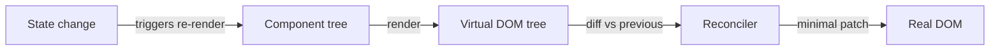

# React Overview

> **One-liner**: React is a JavaScript library for building user interfaces by composing **components** that describe what the UI should look like for a given state — React figures out the DOM updates for you.

---

## Quick Reference

| Concept | What it is |
|---------|------------|
| **React** | UI library (not a framework). Built by Meta, OSS since 2013 |
| **Component** | Reusable function that returns JSX (UI description) |
| **JSX** | HTML-like syntax inside JS, compiled to `React.createElement` calls |
| **Virtual DOM** | In-memory tree React diffs against the previous render |
| **Reconciliation** | Algorithm that diffs and applies the minimum DOM changes |
| **Hooks** | Functions like `useState`, `useEffect` that add state/effects to function components |
| **Vite** | Default modern build tool (replaces deprecated Create React App) |
| **Framework** | Next.js, Remix — sit on top of React, add routing/SSR/data |

---

## Core Concept

**React lets you describe the UI as a function of state.** You write components — functions that take props (inputs) and return JSX (a description of what to render). When state changes, React calls your component again, gets a new JSX tree, diffs it against the previous tree, and applies the minimal DOM changes needed.

This is **declarative**: you say *what* the UI should look like at each moment, not *how* to mutate the DOM. Compared to vanilla JS or jQuery (where you say "find this element, change this attribute"), declarative UI scales much better — you don't track which elements need updating; React does.

React itself is small and unopinionated. It does **components, state, and rendering**. Everything else — routing, data fetching, styling, server rendering — is handled by libraries (React Router, TanStack Query, Tailwind) or by frameworks (Next.js, Remix). When you "learn React" you're really learning React + a stack around it.

Today (React 18+), components are **function components with hooks**. Class components still exist for legacy reasons but should not be used in new code.

---

## Diagram



---

## Syntax & API

### Hello World (Vite + React + TS)

```bash
npm create vite@latest my-app -- --template react-ts
cd my-app
npm install
npm run dev
```

```tsx
// src/App.tsx
export default function App() {
  return <h1>Hello, React</h1>;
}
```

### A component with state

```tsx
import { useState } from "react";

export default function Counter() {
  const [count, setCount] = useState(0);

  return (
    <div>
      <p>Count: {count}</p>
      <button onClick={() => setCount(count + 1)}>+1</button>
    </div>
  );
}
```

### Mounting React into the DOM

```tsx
// src/main.tsx
import { createRoot } from "react-dom/client";
import App from "./App";

createRoot(document.getElementById("root")!).render(<App />);
```

```html
<!-- index.html -->
<div id="root"></div>
<script type="module" src="/src/main.tsx"></script>
```

---

## Common Patterns

```text
The React ecosystem at a glance:

UI library            → React
Build tool            → Vite (or Next.js' bundler)
Language              → TypeScript (default for new projects in 2025)
Routing               → React Router, or Next.js / Remix file-based
Data fetching         → TanStack Query, SWR, or framework loaders
Forms                 → React Hook Form + Zod
Styling               → Tailwind CSS, CSS modules, or vanilla-extract
Component primitives  → Radix UI, Headless UI, shadcn/ui
Animation             → Framer Motion (motion/react)
Testing               → Vitest + React Testing Library + Playwright
SSR/RSC framework     → Next.js (App Router) or Remix
```

---

## Gotchas & Tips

- **Create React App is deprecated** — use Vite for SPAs, or Next.js / Remix for server-rendered apps.
- **React is a library, not a framework** — you assemble the stack. Frameworks (Next, Remix) make those choices for you.
- **Class components are legacy** — never write new ones. All examples in this vault use function components + hooks.
- **The "virtual DOM" is an implementation detail.** It's not magic and not always faster than vanilla DOM — its value is the *programming model*, not raw speed.
- **React 19 introduces Actions** (`useActionState`, `useFormStatus`, `use`) — these are flagged in their respective notes.
- **Don't fight the data flow.** Props go down, events go up. If you need to share state, lift it to a common parent (or use Context / a store).

---

## See Also

- [[02 - JSX Basics]]
- [[03 - Components and Props]]
- [[04 - State and useState]]
- [[01 - React Internals]]
