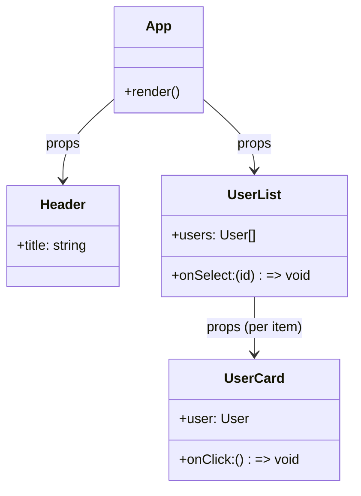

# Components and Props

> **One-liner**: A component is a function that takes **props** (input data) and returns **JSX** (UI description); composing components builds the entire app.

---

## Quick Reference

| Item | Syntax |
|------|--------|
| Function component | `function Name(props) { return <jsx /> }` |
| Arrow component | `const Name = (props) => <jsx />` |
| Pass prop | `<Greeting name="Ana" />` |
| Destructure | `function Greeting({ name }) {...}` |
| Default prop | `function Greeting({ name = "friend" }) {...}` |
| Children prop | `<Card>any JSX here</Card>` → `props.children` |
| Spread props | `<Button {...rest} />` |
| Component naming | **PascalCase** (`UserCard`), not `userCard` |

---

## Core Concept

A **component** is a JavaScript function whose name starts with a capital letter and which returns JSX. Calling a component as `<MyComponent />` tells React to invoke it, get its JSX, and render it.

**Props** ("properties") are how parents pass data to children. They arrive as a single object argument, which is conventionally destructured at the function signature. Props are **read-only** — a child must never mutate `props.foo`. To "change" a prop, the parent owns the state and passes a new value.

The **`children` prop** is special: any JSX you put between a component's opening and closing tags is passed as `props.children`. This is the foundation of composition — wrapping, layouts, and reusable containers all rely on it.

Components compose into a **tree**, with data flowing down through props and events flowing up via callbacks.

---

## Diagram



---

## Syntax & API

### Minimal function component

```tsx
function Hello() {
  return <h1>Hello</h1>;
}

// Use it
<Hello />;
```

### Props (TypeScript)

```tsx
type GreetingProps = {
  name: string;
  excited?: boolean; // optional
};

function Greeting({ name, excited = false }: GreetingProps) {
  return <h1>Hello, {name}{excited ? "!" : "."}</h1>;
}

<Greeting name="Ana" excited />;
```

### Children prop — composition

```tsx
type CardProps = { title: string; children: React.ReactNode };

function Card({ title, children }: CardProps) {
  return (
    <section className="card">
      <h2>{title}</h2>
      <div className="card-body">{children}</div>
    </section>
  );
}

// Usage — anything between tags becomes children
<Card title="Profile">
  <p>Name: Ana</p>
  <button>Edit</button>
</Card>;
```

### Spread props (forward to a wrapped element)

```tsx
type ButtonProps = React.ComponentPropsWithoutRef<"button"> & {
  variant?: "primary" | "secondary";
};

function Button({ variant = "primary", className, ...rest }: ButtonProps) {
  return (
    <button
      className={`btn btn-${variant} ${className ?? ""}`}
      {...rest}
    />
  );
}

<Button onClick={() => alert("hi")} disabled>Click</Button>;
```

---

## Common Patterns

```tsx
// Pattern: pass a callback so the child can notify the parent
function Toolbar({ onSave }: { onSave: () => void }) {
  return <button onClick={onSave}>Save</button>;
}

function Editor() {
  const handleSave = () => console.log("saved");
  return <Toolbar onSave={handleSave} />;
}
```

```tsx
// Pattern: render a list of components
function UserList({ users }: { users: User[] }) {
  return (
    <ul>
      {users.map(u => <li key={u.id}>{u.name}</li>)}
    </ul>
  );
}
```

---

## Gotchas & Tips

- **Component names MUST start with a capital letter.** `<myComponent />` is treated as a literal HTML tag and breaks rendering.
- **Props are immutable inside the component.** Never write `props.foo = "x"`. To change, the parent must pass a new value.
- **Don't pass new objects/functions inline if the child is memoized** — they break referential equality and defeat memoization. See [[03 - useMemo and useCallback]].
- **`children` typing in TS**: prefer `React.ReactNode` (accepts strings, numbers, JSX, arrays, null, etc.).
- **Avoid prop-drilling more than 2–3 levels.** If you're threading the same prop through many components, lift it into Context (see [[05 - useContext]]).
- **Don't use `key` as a regular prop.** It's a React reserved attribute used for list reconciliation, not visible inside the child.
- **Spread carefully** — spreading `{...rest}` onto an unknown element can leak invalid HTML attributes. Prefer typed `ComponentPropsWithoutRef<"button">`.

---

## See Also

- [[02 - JSX Basics]]
- [[04 - State and useState]]
- [[07 - Component Composition]]
- [[19 - TypeScript with React]]
