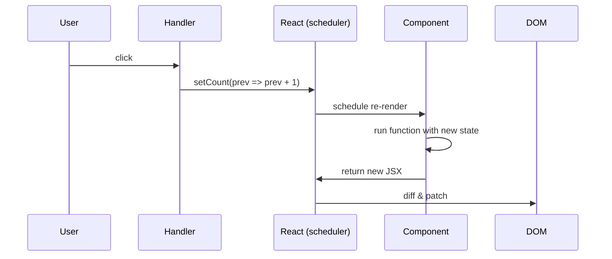

# State and useState

> **One-liner**: `useState` adds a piece of mutable, per-component memory; calling its setter triggers a re-render with the new value.

---

## Quick Reference

| Item | Syntax |
|------|--------|
| Declare state | `const [count, setCount] = useState(0)` |
| Update | `setCount(5)` |
| Functional updater | `setCount(prev => prev + 1)` |
| Lazy initial | `useState(() => expensiveCalc())` |
| Object state | `setUser({ ...user, name: "Ana" })` (always new object) |
| Array push | `setItems([...items, newItem])` |
| Array remove | `setItems(items.filter(x => x.id !== id))` |
| Array update item | `setItems(items.map(x => x.id === id ? {...x, ...patch} : x))` |
| Multiple setters | call them in order; React batches them in one render |

---

## Core Concept

A **stateful** value is one that, when changed, must trigger React to re-render the component. `useState(initial)` returns a pair: the **current value** and a **setter function**. React stores the value across renders (keyed by the call order of hooks), so the variable persists between renders even though the function runs again each time.

The cardinal rule: **state is immutable**. Never mutate the existing value (`user.name = "x"`, `items.push(x)`). Always pass a *new* value (or a function returning one) to the setter. React compares the previous and next values with `Object.is` to decide whether to re-render — mutating in place won't trigger a render and may corrupt UI.

When the new value depends on the previous one (counters, toggles, accumulators), use the **functional updater** (`setCount(prev => prev + 1)`). This is the only safe pattern when multiple updates may be batched in one event handler.

---

## Diagram



---

## Syntax & API

### Basic counter

```tsx
import { useState } from "react";

function Counter() {
  const [count, setCount] = useState(0);

  return (
    <div>
      <p>{count}</p>
      <button onClick={() => setCount(count + 1)}>+1</button>
      <button onClick={() => setCount(0)}>reset</button>
    </div>
  );
}
```

### Functional updater (use when next depends on prev)

```tsx
function Counter() {
  const [count, setCount] = useState(0);

  // ✅ Correct — each call uses latest value
  const incTwice = () => {
    setCount(prev => prev + 1);
    setCount(prev => prev + 1);
  };

  // ❌ Wrong — both calls see the same stale `count`
  const incTwiceBuggy = () => {
    setCount(count + 1);
    setCount(count + 1);
  };

  return <button onClick={incTwice}>+2</button>;
}
```

### Object / array state — never mutate

```tsx
const [user, setUser] = useState({ name: "Ana", age: 30 });

// ✅ new object
setUser({ ...user, age: 31 });
setUser(prev => ({ ...prev, age: prev.age + 1 }));

// ❌ mutation — no re-render
user.age = 31;
setUser(user);
```

```tsx
const [todos, setTodos] = useState<Todo[]>([]);

setTodos([...todos, newTodo]);                          // add
setTodos(todos.filter(t => t.id !== id));               // remove
setTodos(todos.map(t => t.id === id ? {...t, done: true} : t)); // update
```

### Lazy initial value (skip expensive work after first render)

```tsx
const [tree, setTree] = useState(() => buildHugeTree());
// `buildHugeTree()` runs only on first render
```

---

## Common Patterns

```tsx
// Pattern: toggle boolean
const [open, setOpen] = useState(false);
<button onClick={() => setOpen(o => !o)}>Toggle</button>

// Pattern: form field
const [name, setName] = useState("");
<input value={name} onChange={e => setName(e.target.value)} />

// Pattern: derive from state — DON'T put derived values in state
const [items, setItems] = useState<Item[]>([]);
const total = items.reduce((s, i) => s + i.price, 0); // ✅ derive on render
// ❌ don't useState(0) for total and try to keep it in sync
```

---

## Gotchas & Tips

- **State updates are asynchronous.** After `setCount(5)`, `count` is still the old value in the same function. The new value is visible on the next render.
- **State is per-instance.** Two `<Counter />` siblings each have their own `count`. Component identity is determined by position in the tree.
- **Don't store derived values in state.** Compute them during render. Storing them duplicates the source of truth and causes "out of sync" bugs.
- **Multiple `setState` calls in one event are batched** — only one re-render. Across `setTimeout`/`Promise` callbacks, React 18 also batches automatically.
- **In Strict Mode (dev), components render twice** to surface impure renders. State setters are not double-called for user events but the component function body is. Don't put side effects in the function body.
- **Don't put non-serializable junk in state** if you need SSR or want to debug — keep DOM nodes in `useRef` instead.

---

## See Also

- [[03 - Components and Props]]
- [[10 - useEffect Basics]]
- [[04 - useReducer]]
- [[03 - useMemo and useCallback]]
