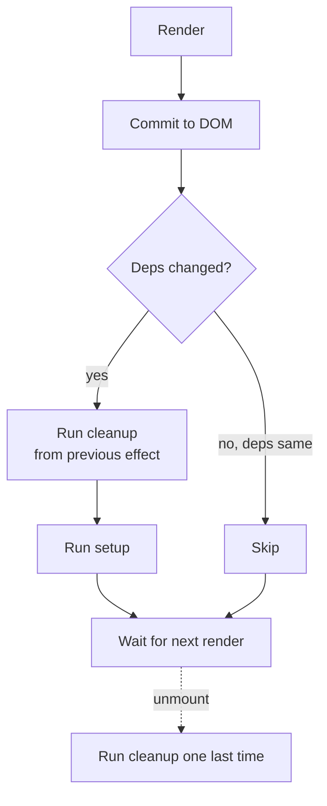

# useEffect Basics

> **One-liner**: `useEffect(fn, deps)` runs `fn` **after** the component renders and the DOM is committed — use it to synchronize React state with something *outside* React (the DOM, a timer, a subscription, the network).

---

## Quick Reference

| Pattern | Syntax |
|---------|--------|
| Run after every render | `useEffect(() => { ... })` |
| Run once on mount | `useEffect(() => { ... }, [])` |
| Run when `x` changes | `useEffect(() => { ... }, [x])` |
| Cleanup on unmount / before next run | `useEffect(() => { ...; return () => cleanup() }, [...])` |
| Don't use for | Derived values, event handlers, transforming props |

---

## Core Concept

A **side effect** is anything that touches the world outside React's render: setting `document.title`, starting a timer, subscribing to a websocket, fetching data. You can't do these in the component body because that runs during render and might run multiple times.

`useEffect(setup, deps)` defers `setup` until **after the render is committed** to the DOM. React then compares `deps` (an array of values) with the previous render's `deps`:
- **Different (or first render)** → run `setup`. If the previous run returned a cleanup function, run it first.
- **Same** → skip the effect.

The optional return value of `setup` is a **cleanup function** that runs before the next effect and on unmount. Use it to undo what `setup` did (clear timer, unsubscribe, abort fetch).

The deps array is the most error-prone part of React. **The rule**: list every reactive value the effect uses (props, state, derived values from them). Don't lie. The `react-hooks/exhaustive-deps` ESLint rule enforces this — never silence it without thinking.

---

## Diagram



---

## Syntax & API

### Run once on mount (and clean up on unmount)

```tsx
import { useEffect } from "react";

function Clock() {
  useEffect(() => {
    const id = setInterval(() => console.log(new Date()), 1000);
    return () => clearInterval(id);   // cleanup on unmount
  }, []);                             // [] = run once on mount

  return <p>see console</p>;
}
```

### Re-run when a value changes

```tsx
function PageTitle({ title }: { title: string }) {
  useEffect(() => {
    document.title = title;
  }, [title]);                        // re-run when title changes

  return null;
}
```

### Subscribe + unsubscribe

```tsx
function OnlineStatus() {
  const [online, setOnline] = useState(navigator.onLine);

  useEffect(() => {
    const onOnline  = () => setOnline(true);
    const onOffline = () => setOnline(false);

    window.addEventListener("online",  onOnline);
    window.addEventListener("offline", onOffline);

    return () => {
      window.removeEventListener("online",  onOnline);
      window.removeEventListener("offline", onOffline);
    };
  }, []);

  return <span>{online ? "🟢 online" : "🔴 offline"}</span>;
}
```

### Fetch on mount (basic — see [[10 - Fetching Data]] for production version)

```tsx
function UserView({ id }: { id: string }) {
  const [user, setUser] = useState<User | null>(null);

  useEffect(() => {
    let cancelled = false;
    fetch(`/api/users/${id}`)
      .then(r => r.json())
      .then(data => { if (!cancelled) setUser(data); });

    return () => { cancelled = true; };  // ignore stale response
  }, [id]);

  if (!user) return <Spinner />;
  return <h1>{user.name}</h1>;
}
```

---

## Common Patterns

```tsx
// Pattern: effect with multiple deps
useEffect(() => {
  log(`opened ${item.id} from ${source}`);
}, [item.id, source]);

// Pattern: effect that should NOT depend on a prop it uses inside a callback
//   → store the latest value in a ref and read from the ref
const onSomething = useEvent(callback); // see useEffectEvent (RFC) / useRef
```

---

## Gotchas & Tips

- **Don't use `useEffect` for derived values.** Compute them during render: `const total = items.reduce(...)`. Effects re-render twice (set state inside effect → another render).
- **Don't use `useEffect` for event handlers.** Put logic inside the handler — effects are for synchronization, not actions.
- **Empty deps `[]` does NOT mean "run on mount" semantically** — it means "this effect uses no reactive values." The lint rule will yell if that's a lie.
- **Strict Mode runs effects twice in dev** (mount → unmount → mount). This surfaces missing cleanup. Not a bug.
- **Race conditions on async work**: the cleanup function MUST cancel or ignore the in-flight result, or a stale response can clobber fresh state. See [[01 - useEffect Deep Dive]].
- **Don't mutate the deps array dynamically** (`useEffect(fn, condition ? [a] : [a, b])` is illegal). React relies on stable hook order.
- **Effects run after paint** in React 18+. For DOM measurements that must happen before paint (avoid flicker), use `useLayoutEffect`.
- **If you `setState` unconditionally in an effect, you'll loop.** Always guard with a condition or include the right deps.

---

## See Also

- [[04 - State and useState]]
- [[01 - useEffect Deep Dive]]
- [[10 - Fetching Data]]
- [[06 - Custom Hooks]]
