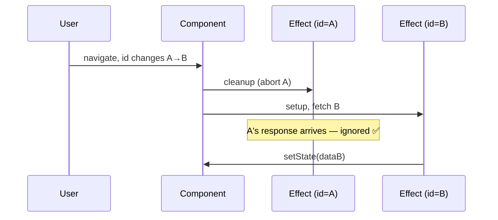

# useEffect Deep Dive

> **One-liner**: Most React bugs live in `useEffect` — stale closures, race conditions, missing cleanup, and "effects that should be event handlers"; this note enumerates them and the fixes.

---

## Quick Reference

| Pitfall | Fix |
|---------|-----|
| **Stale closure** (effect reads old `count`) | Add to deps, or use functional setState, or `useRef` for "latest" value |
| **Race condition** (newer fetch resolves before older) | `AbortController` or a `cancelled` flag in cleanup |
| **Missing cleanup** | Return a cleanup function — every subscription/timer/listener must be undone |
| **Effect fires too often** (unstable deps) | Memoize objects/functions with `useMemo`/`useCallback`, or pull stable primitives |
| **`setState` infinite loop** | Don't unconditionally `setState` inside an effect that depends on that state |
| **Effect for derived value** | Compute during render — no effect needed |
| **Effect for event response** | Move logic into the event handler, not an effect |

---

## Core Concept

`useEffect`'s job is **synchronization**: keep the outside world in sync with React state. Anything else is misuse.

The single hardest rule: **the function passed to `useEffect` is a closure over the render that created it**. It sees the values of state and props at the moment of render. If you forget to list a value in the deps array, the effect re-runs without re-capturing — and you read a stale value. The `react-hooks/exhaustive-deps` lint rule exists for exactly this.

The second hardest rule: **async work is fire-and-forget**. By the time a `fetch` resolves, the user may have navigated, the props may have changed, or a newer request may already be in flight. Every async effect needs a way to **cancel or ignore late results** — either an `AbortController` or a `cancelled` boolean checked before `setState`.

---

## Diagram



---

## Syntax & API

### Stale closure — fix with functional updater

```tsx
// ❌ Reads stale `count`
useEffect(() => {
  const id = setInterval(() => setCount(count + 1), 1000);
  return () => clearInterval(id);
}, []); // count missing → always sees 0

// ✅ Functional updater — never reads stale value
useEffect(() => {
  const id = setInterval(() => setCount(prev => prev + 1), 1000);
  return () => clearInterval(id);
}, []);
```

### Race condition — `AbortController`

```tsx
useEffect(() => {
  const ctrl = new AbortController();

  fetch(`/api/users/${id}`, { signal: ctrl.signal })
    .then(r => r.json())
    .then(setUser)
    .catch(err => {
      if (err.name !== "AbortError") throw err;
    });

  return () => ctrl.abort();   // cancel previous when id changes / unmount
}, [id]);
```

### Race condition — `cancelled` flag (when API doesn't support abort)

```tsx
useEffect(() => {
  let cancelled = false;

  loadProfile(id).then(data => {
    if (!cancelled) setProfile(data);
  });

  return () => { cancelled = true; };
}, [id]);
```

### Effect that depends on a callback — wrap with `useCallback`

```tsx
function Parent() {
  const onTick = useCallback(() => console.log("tick"), []);
  return <Ticker onTick={onTick} />;
}

function Ticker({ onTick }: { onTick: () => void }) {
  useEffect(() => {
    const id = setInterval(onTick, 1000);
    return () => clearInterval(id);
  }, [onTick]); // ← stable thanks to useCallback
}
```

### Anti-pattern: effect for derived state

```tsx
// ❌ extra render + bug surface
const [items, setItems] = useState<Item[]>([]);
const [total, setTotal] = useState(0);
useEffect(() => { setTotal(items.reduce((s, i) => s + i.price, 0)); }, [items]);

// ✅ derive during render
const items = ...;
const total = items.reduce((s, i) => s + i.price, 0);
```

### Anti-pattern: effect for an event response

```tsx
// ❌ "after I select X, navigate" via effect
useEffect(() => { if (selected) navigate(`/items/${selected}`); }, [selected]);

// ✅ in the handler
const onSelect = (id: string) => {
  setSelected(id);
  navigate(`/items/${id}`);
};
```

---

## Common Patterns

```tsx
// Pattern: subscribe with stable callback via ref-of-latest
function useEvent<T extends (...args: any[]) => any>(handler: T) {
  const ref = useRef(handler);
  useEffect(() => { ref.current = handler; });
  return useCallback(((...args) => ref.current(...args)) as T, []);
}
// (React 19's useEffectEvent is the official version)

// Pattern: debounce a value with effect + cleanup
function useDebounced<T>(value: T, ms = 300): T {
  const [v, setV] = useState(value);
  useEffect(() => {
    const id = setTimeout(() => setV(value), ms);
    return () => clearTimeout(id);
  }, [value, ms]);
  return v;
}
```

---

## Gotchas & Tips

- **Never silence `react-hooks/exhaustive-deps` without thinking.** If you must, write a comment explaining why and how staleness is impossible.
- **Object/function deps re-trigger every render** because their identity changes. Wrap with `useMemo`/`useCallback`, or restructure so the dep is a primitive.
- **`useLayoutEffect` runs synchronously after DOM mutation, before paint.** Use it for measuring layout. Otherwise prefer `useEffect`.
- **Strict Mode double-invocation in dev is a feature** — it surfaces effects that don't clean up properly. Don't disable it.
- **For data fetching, prefer TanStack Query / SWR / framework loaders** ([[11 - TanStack Query]]). Manual `useEffect` fetching is a known foot-gun.
- **React 19's `use(promise)` lets you read promises during render** with Suspense — replacing many manual fetch effects.
- **Don't put refs into the deps array** (`useRef` is intentionally not reactive).
- **Don't call hooks inside effects.** Hooks run during render only.

---

## See Also

- [[10 - useEffect Basics]]
- [[03 - useMemo and useCallback]]
- [[10 - Fetching Data]]
- [[11 - TanStack Query]]
