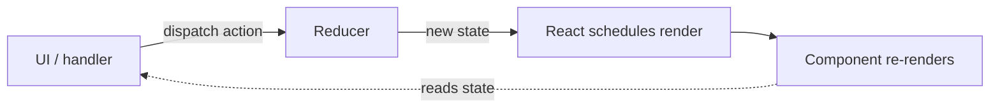

# useReducer

> **One-liner**: `useReducer` is `useState`'s big sibling — state transitions become explicit `(state, action) => newState` functions, perfect when state has many shapes and updates depend on each other.

---

## Quick Reference

| Item | Syntax |
|------|--------|
| Declare | `const [state, dispatch] = useReducer(reducer, initial)` |
| Lazy init | `useReducer(reducer, arg, init => initFn(arg))` |
| Dispatch | `dispatch({ type: "INCREMENT" })` |
| Reducer signature | `(state, action) => newState` (must be pure!) |
| Action shape | usually `{ type: "X", payload?: any }` |
| TS discriminated union | `type Action = { type: "A" } \| { type: "B"; payload: number }` |

| Use `useReducer` when | Stay with `useState` when |
|----------------------|---------------------------|
| Multiple related state fields update together | Single value, simple toggles |
| Next state depends on previous + action | Independent values |
| Complex transition logic, finite states | Simple form fields |
| You'd rather test pure logic in isolation | Inline-update-and-go suffices |

---

## Core Concept

`useReducer(reducer, initial)` returns `[state, dispatch]`. You don't call setters; you `dispatch(action)`, and the **reducer** decides the next state.

The reducer is a **pure function**: `(prev, action) => next`. Same input → same output, no side effects, no mutation. This makes state transitions:
- **Centralized**: one place to read all the rules.
- **Testable**: pure functions are trivial to unit-test.
- **Predictable**: the action log is the source of truth — easy to debug ("what action arrived right before things broke?").

`useReducer` shines when you have **a state machine** — a value with discrete states (idle/loading/success/error) and explicit transitions, or a complex form where many fields update in concert (filters, multi-step wizards). For a single boolean or counter, `useState` is shorter and clearer.

---

## Diagram



---

## Syntax & API

### Counter — `useState` vs `useReducer`

```tsx
// useState version
const [count, setCount] = useState(0);
<button onClick={() => setCount(c => c + 1)}>+</button>

// useReducer version
type Action = { type: "INC" } | { type: "DEC" } | { type: "RESET" };

function reducer(state: number, action: Action): number {
  switch (action.type) {
    case "INC":   return state + 1;
    case "DEC":   return state - 1;
    case "RESET": return 0;
  }
}

const [count, dispatch] = useReducer(reducer, 0);
<button onClick={() => dispatch({ type: "INC" })}>+</button>
<button onClick={() => dispatch({ type: "RESET" })}>0</button>
```

### Realistic example — todo list

```tsx
type Todo = { id: string; title: string; done: boolean };

type Action =
  | { type: "add";    title: string }
  | { type: "toggle"; id: string }
  | { type: "remove"; id: string }
  | { type: "clear-completed" };

function todosReducer(state: Todo[], action: Action): Todo[] {
  switch (action.type) {
    case "add":
      return [...state, { id: crypto.randomUUID(), title: action.title, done: false }];
    case "toggle":
      return state.map(t => t.id === action.id ? { ...t, done: !t.done } : t);
    case "remove":
      return state.filter(t => t.id !== action.id);
    case "clear-completed":
      return state.filter(t => !t.done);
  }
}

function TodoApp() {
  const [todos, dispatch] = useReducer(todosReducer, []);
  const [draft, setDraft] = useState("");

  return (
    <>
      <form onSubmit={e => {
        e.preventDefault();
        if (!draft.trim()) return;
        dispatch({ type: "add", title: draft });
        setDraft("");
      }}>
        <input value={draft} onChange={e => setDraft(e.target.value)} />
      </form>

      <ul>
        {todos.map(t => (
          <li key={t.id}>
            <input
              type="checkbox"
              checked={t.done}
              onChange={() => dispatch({ type: "toggle", id: t.id })}
            />
            {t.title}
            <button onClick={() => dispatch({ type: "remove", id: t.id })}>x</button>
          </li>
        ))}
      </ul>

      <button onClick={() => dispatch({ type: "clear-completed" })}>
        Clear completed
      </button>
    </>
  );
}
```

### Lazy init (avoid recomputing initial state on every render)

```tsx
function init(seed: number) {
  return { count: seed, history: [] as number[] };
}

const [state, dispatch] = useReducer(reducer, 5, init);
// init(5) runs only on first render
```

### Finite-state machine flavor

```tsx
type State =
  | { status: "idle" }
  | { status: "loading" }
  | { status: "success"; data: User }
  | { status: "error";   error: Error };

type Action =
  | { type: "fetch" }
  | { type: "success"; data: User }
  | { type: "error";   error: Error };

function reducer(state: State, action: Action): State {
  switch (action.type) {
    case "fetch":   return { status: "loading" };
    case "success": return { status: "success", data: action.data };
    case "error":   return { status: "error",   error: action.error };
  }
}
```

---

## Common Patterns

```tsx
// Pattern: pair with Context for global app state
const TodosCtx = createContext<{ todos: Todo[]; dispatch: Dispatch<Action> } | null>(null);

function TodosProvider({ children }: { children: ReactNode }) {
  const [todos, dispatch] = useReducer(todosReducer, []);
  return (
    <TodosCtx.Provider value={{ todos, dispatch }}>
      {children}
    </TodosCtx.Provider>
  );
}

// Pattern: derive helpers, don't put them in state
const remaining = todos.filter(t => !t.done).length;
```

---

## Gotchas & Tips

- **The reducer must be pure.** No `fetch`, no `setState`, no `console.log` (well, log is fine in dev). Side effects belong in event handlers or effects, *after* the reducer returns the new state.
- **Always return new objects/arrays.** Never `state.push(x)` or `state.foo = "bar"`.
- **Deafault `switch` case**: TS exhaustiveness with discriminated unions catches missing cases. Add `default: return state;` if you want safe fallback at runtime.
- **Reducers are global functions** — they don't close over component state, so they're easy to extract and test.
- **Strict Mode runs the reducer twice** in dev to surface impurity. Pure reducers are unaffected.
- **For really complex state machines**, look at **XState** — adds guards, services, hierarchical states.
- **Don't dispatch from inside the reducer.** Dispatching during a render → infinite loop.

---

## See Also

- [[04 - State and useState]]
- [[05 - useContext]]
- [[12 - State Management]]
