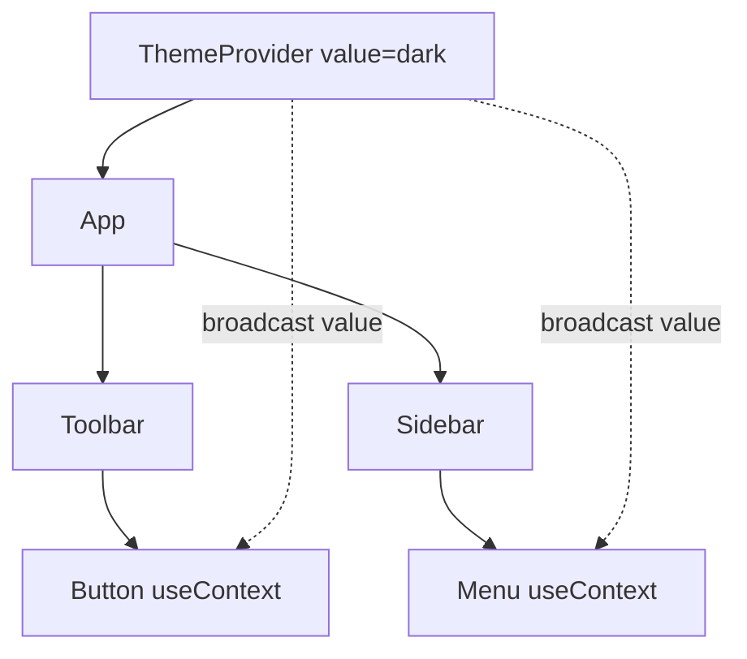

# useContext

> **One-liner**: Context is React's built-in way to pass data through the component tree without prop-drilling — a `Provider` publishes a value, and any descendant can read it via `useContext`.

---

## Quick Reference

| Item | Syntax |
|------|--------|
| Create | `const Ctx = createContext<T>(defaultValue)` |
| Provide | `<Ctx.Provider value={x}>{children}</Ctx.Provider>` |
| Read | `const value = useContext(Ctx)` |
| Default value | Used when no `Provider` is found above |
| TS pattern | `createContext<T \| null>(null)` + custom hook that asserts non-null |
| Re-render trigger | All consumers re-render when `value` reference changes |

---

## Core Concept

When you'd otherwise pass the same prop through 5 layers of components, that's **prop-drilling**. Context fixes it: a parent puts a value into a `Provider`, and any descendant calls `useContext(Ctx)` to read it directly.

The mental model: **Context is broadcast**, not state. It doesn't *manage* state; it *delivers* it. Pair Context with `useState` or `useReducer` to make a global store. The Provider holds the actual state; consumers read it through context.

The big performance gotcha: **every consumer re-renders whenever the Provider's `value` changes** (by reference). If you put `{ user, theme, settings }` into one Context, changing `theme` re-renders all consumers — even ones that only read `user`. Fix by **splitting into multiple Contexts** by update frequency, or use a state-management library (Zustand, Jotai) when contention gets real.

---

## Diagram



---

## Syntax & API

### Minimal example

```tsx
import { createContext, useContext, useState } from "react";

const ThemeCtx = createContext<"light" | "dark">("light");

function App() {
  const [theme, setTheme] = useState<"light" | "dark">("light");

  return (
    <ThemeCtx.Provider value={theme}>
      <button onClick={() => setTheme(t => t === "light" ? "dark" : "light")}>
        Toggle
      </button>
      <Page />
    </ThemeCtx.Provider>
  );
}

function Page() {
  const theme = useContext(ThemeCtx);
  return <main className={theme}>Hello</main>;
}
```

### Robust pattern: typed null + custom hook

```tsx
type AuthContextValue = { user: User | null; login: (u: User) => void; logout: () => void };

const AuthCtx = createContext<AuthContextValue | null>(null);

export function AuthProvider({ children }: { children: React.ReactNode }) {
  const [user, setUser] = useState<User | null>(null);

  const value = useMemo<AuthContextValue>(() => ({
    user,
    login:  (u) => setUser(u),
    logout: () => setUser(null),
  }), [user]);

  return <AuthCtx.Provider value={value}>{children}</AuthCtx.Provider>;
}

export function useAuth() {
  const v = useContext(AuthCtx);
  if (!v) throw new Error("useAuth must be used inside <AuthProvider>");
  return v;
}

// Consumer
const { user, logout } = useAuth();
```

### React 19 simplified Provider

```tsx
// React 19+: <Ctx> works as a Provider directly
<AuthCtx value={value}>
  {children}
</AuthCtx>
```

---

## Common Patterns

```tsx
// Pattern: split contexts to limit re-renders
const ThemeCtx = createContext("light");        // changes rarely
const UserCtx  = createContext<User | null>(null); // changes per login
// Toggling theme doesn't re-render user consumers, and vice versa.
```

```tsx
// Pattern: dispatch + state via two contexts
const StateCtx    = createContext<State | null>(null);
const DispatchCtx = createContext<Dispatch<Action> | null>(null);

function Provider({ children }: { children: ReactNode }) {
  const [state, dispatch] = useReducer(reducer, initial);
  return (
    <StateCtx.Provider value={state}>
      <DispatchCtx.Provider value={dispatch}>
        {children}
      </DispatchCtx.Provider>
    </StateCtx.Provider>
  );
}
// Components that only dispatch never re-render when state changes
```

```tsx
// Pattern: scoped overrides via nested providers
<ThemeCtx.Provider value="dark">
  <Sidebar />            {/* sees "dark" */}
  <ThemeCtx.Provider value="light">
    <Modal />            {/* sees "light" */}
  </ThemeCtx.Provider>
</ThemeCtx.Provider>
```

---

## Gotchas & Tips

- **All consumers re-render on every value change.** If `value` is `{...}` constructed inline, every Provider render creates a new object → all consumers re-render. Wrap with `useMemo`.
- **Context isn't a state manager.** It's a delivery mechanism. The state lives in `useState`/`useReducer` inside the Provider.
- **Default value is for unprovided consumers** — typically a developer mistake. The "throw if null" pattern catches it loudly.
- **Don't read context in event handlers stored in refs** — it captures the value at render time. Read fresh on each call.
- **Big global stores → Zustand / Jotai / Redux.** Context with one giant value performs poorly past a few hundred consumers.
- **Server Components don't have client Context.** Pass via props or use a client wrapper.
- **`use(Ctx)` (React 19)** can read context conditionally, unlike `useContext`. Useful inside `if` branches.

---

## See Also

- [[03 - useMemo and useCallback]]
- [[04 - useReducer]]
- [[12 - State Management]]
- [[10 - State Management Advanced]]
