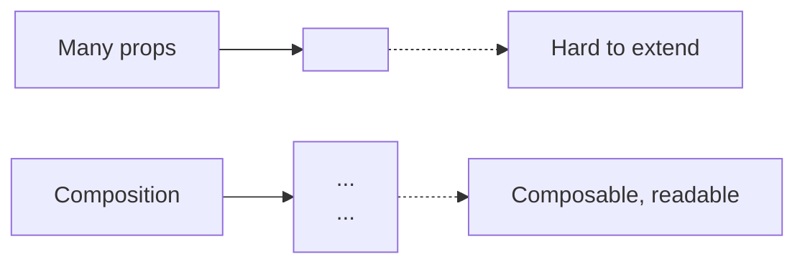

# Component Composition

> **One-liner**: Reuse UI by **composing** small components — pass children, slot props, or compound sub-components — instead of building a single component with 20 boolean props.

---

## Quick Reference

| Pattern | When to use |
|---------|-------------|
| `children` prop | Generic wrapper / layout (Card, Modal, Page) |
| Multiple slot props | Component has 2–3 distinct regions (header/body/footer) |
| **Compound components** | Tightly-related siblings sharing state (Tabs.Root, Tabs.Tab, Tabs.Panel) |
| **Render props** (legacy) | Sharing logic + giving consumer rendering control. Mostly replaced by hooks. |
| **HOC** (legacy) | Wrapping with extra behavior. Mostly replaced by hooks. See [[08 - Higher-Order Components]] |

---

## Core Concept

The first instinct for new React devs is to add props for everything: `<Card hasHeader hasFooter title="..." headerColor="..." footerActions={[]}>`. This produces "god components" — hard to read, easy to break.

**Composition** flips it: instead of describing every variation with a prop, let the consumer **pass JSX**. A `<Card>` doesn't know what's inside; you put what you need.

Three composition mechanisms:

1. **`children` prop** — the simplest. Anything between tags is rendered inside.
2. **Multiple slot props** — `<Page header={...} sidebar={...} body={...} />`. Useful when a component has clearly distinct regions.
3. **Compound components** — `<Tabs>` exposes `<Tabs.Tab>` and `<Tabs.Panel>` as sub-components that share state via context. The classic UI library pattern (Radix, Headless UI, shadcn).

---

## Diagram



---

## Syntax & API

### `children` — the universal slot

```tsx
type CardProps = { children: React.ReactNode };

function Card({ children }: CardProps) {
  return <section className="rounded-lg border p-4">{children}</section>;
}

<Card>
  <h2>Title</h2>
  <p>Body content goes here.</p>
  <button>Action</button>
</Card>;
```

### Multiple slots via props

```tsx
type PageProps = {
  header: React.ReactNode;
  sidebar?: React.ReactNode;
  children: React.ReactNode;
};

function Page({ header, sidebar, children }: PageProps) {
  return (
    <div className="grid grid-cols-[16rem_1fr]">
      <header className="col-span-2">{header}</header>
      {sidebar && <aside>{sidebar}</aside>}
      <main className={sidebar ? "" : "col-span-2"}>{children}</main>
    </div>
  );
}

<Page
  header={<TopBar />}
  sidebar={<NavMenu />}
>
  <Article />
</Page>;
```

### Compound components — shared state via context

```tsx
import { createContext, useContext, useState, ReactNode } from "react";

type TabsCtx = { active: string; setActive: (v: string) => void };
const TabsCtx = createContext<TabsCtx | null>(null);
const useTabs = () => {
  const c = useContext(TabsCtx);
  if (!c) throw new Error("Tabs.* must be used inside <Tabs>");
  return c;
};

function Tabs({ defaultValue, children }: { defaultValue: string; children: ReactNode }) {
  const [active, setActive] = useState(defaultValue);
  return <TabsCtx.Provider value={{ active, setActive }}>{children}</TabsCtx.Provider>;
}

function TabList({ children }: { children: ReactNode }) {
  return <div role="tablist" className="flex gap-2">{children}</div>;
}

function Tab({ value, children }: { value: string; children: ReactNode }) {
  const { active, setActive } = useTabs();
  const selected = active === value;
  return (
    <button
      role="tab"
      aria-selected={selected}
      className={selected ? "font-bold" : "text-gray-500"}
      onClick={() => setActive(value)}
    >
      {children}
    </button>
  );
}

function Panel({ value, children }: { value: string; children: ReactNode }) {
  const { active } = useTabs();
  return active === value ? <div role="tabpanel">{children}</div> : null;
}

Tabs.List = TabList;
Tabs.Tab = Tab;
Tabs.Panel = Panel;

export { Tabs };

// Usage
<Tabs defaultValue="overview">
  <Tabs.List>
    <Tabs.Tab value="overview">Overview</Tabs.Tab>
    <Tabs.Tab value="details">Details</Tabs.Tab>
  </Tabs.List>
  <Tabs.Panel value="overview">...overview...</Tabs.Panel>
  <Tabs.Panel value="details">...details...</Tabs.Panel>
</Tabs>;
```

### Render props (legacy — usually a custom hook is better)

```tsx
type Props = { children: (state: { x: number; y: number }) => React.ReactNode };

function MouseTracker({ children }: Props) {
  const [pos, setPos] = useState({ x: 0, y: 0 });
  useEffect(() => {
    const onMove = (e: MouseEvent) => setPos({ x: e.clientX, y: e.clientY });
    window.addEventListener("mousemove", onMove);
    return () => window.removeEventListener("mousemove", onMove);
  }, []);
  return <>{children(pos)}</>;
}

<MouseTracker>
  {pos => <p>{pos.x}, {pos.y}</p>}
</MouseTracker>;

// Modern equivalent — useMousePosition() custom hook
```

---

## Common Patterns

```tsx
// Pattern: polymorphic "as" prop
type ButtonProps<E extends React.ElementType> = {
  as?: E;
  children: React.ReactNode;
} & React.ComponentPropsWithoutRef<E>;

function Button<E extends React.ElementType = "button">({ as, ...rest }: ButtonProps<E>) {
  const Tag = as || "button";
  return <Tag {...rest} />;
}

<Button>Click</Button>
<Button as="a" href="/x">Link</Button>
```

```tsx
// Pattern: forwarding children to a wrapped element ("slot" pattern)
function Slot({ children, ...props }: any) {
  return React.cloneElement(React.Children.only(children), {
    ...props,
    ...children.props,
    className: clsx(props.className, children.props.className),
  });
}
// Used by Radix UI's `asChild` to merge props into the consumer's element
```

---

## Gotchas & Tips

- **Don't add a boolean prop where children would do.** `<Card hasHeader title="...">` → `<Card><Header>...</Header></Card>`.
- **Compound components require Context** if siblings need shared state. Without it, the parent has to manage it via cloneElement (clunky).
- **`React.cloneElement`** is rare in app code — prefer composition. It's mostly used inside library code (Slot pattern).
- **Render props are mostly legacy.** Replace with a custom hook + plain children.
- **`children` is typed `ReactNode`**, which accepts strings, numbers, JSX, arrays, fragments, null, undefined, booleans.
- **Don't over-engineer.** A simple component with 3 props is fine. Composition is for things that *grow*.
- **Headless libraries (Radix, Headless UI, React Aria) use compound components heavily** — read their source for production patterns.

---

## See Also

- [[03 - Components and Props]]
- [[05 - useContext]]
- [[14 - Design Systems]]
