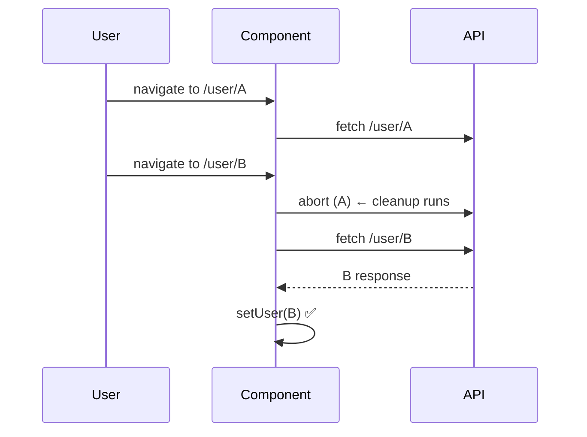

# Fetching Data

> **One-liner**: Fetching data in React is harder than it looks — you need loading/error states, cancellation on unmount or prop change, and protection against race conditions; for production, jump straight to [[11 - TanStack Query]].

---

## Quick Reference

| Concern | Solution |
|---------|----------|
| Show spinner | `{isLoading && <Spinner />}` from explicit state |
| Show error | `{error && <ErrorView ... />}` |
| Cancel on unmount | `AbortController` + cleanup in `useEffect` |
| Race conditions | Same `AbortController`, or a `cancelled` flag |
| Re-fetch when input changes | Add input to deps array |
| Cache, dedupe, retry, refresh | **Use [[11 - TanStack Query]]** — don't roll your own |

---

## Core Concept

The naive version — `useEffect(() => { fetch(url).then(setData); }, [url])` — has at least four bugs:
1. No loading or error state — the UI flickers.
2. If the user navigates away mid-fetch, you `setState` on an unmounted component.
3. If `url` changes twice quickly (A → B), the response from A may arrive after B and overwrite it.
4. No retries, deduplication, or background refresh.

This note shows the **manual fix** (good to understand) and then strongly recommends moving to a library. In a 2025 React app, hand-rolled `fetch` in `useEffect` is appropriate only for one-off cases (e.g., a single splash screen).

For Server Components ([[04 - Server Components]]), you `await` directly in the component — no `useEffect` needed. For client components, use TanStack Query, SWR, or framework loaders (Next.js / Remix).

---

## Diagram



---

## Syntax & API

### Manual fetch with state, cleanup, and abort

```tsx
type State<T> =
  | { status: "idle" }
  | { status: "loading" }
  | { status: "success"; data: T }
  | { status: "error";   error: Error };

function UserView({ id }: { id: string }) {
  const [state, setState] = useState<State<User>>({ status: "idle" });

  useEffect(() => {
    const ctrl = new AbortController();
    setState({ status: "loading" });

    (async () => {
      try {
        const r = await fetch(`/api/users/${id}`, { signal: ctrl.signal });
        if (!r.ok) throw new Error(`HTTP ${r.status}`);
        const data = (await r.json()) as User;
        setState({ status: "success", data });
      } catch (err) {
        if ((err as Error).name === "AbortError") return; // ignore cancellations
        setState({ status: "error", error: err as Error });
      }
    })();

    return () => ctrl.abort();
  }, [id]);

  switch (state.status) {
    case "idle":
    case "loading": return <Spinner />;
    case "error":   return <ErrorView error={state.error} />;
    case "success": return <h1>{state.data.name}</h1>;
  }
}
```

### Extract as a custom hook

```tsx
function useFetch<T>(url: string): State<T> {
  const [state, setState] = useState<State<T>>({ status: "loading" });

  useEffect(() => {
    const ctrl = new AbortController();
    setState({ status: "loading" });

    fetch(url, { signal: ctrl.signal })
      .then(r => {
        if (!r.ok) throw new Error(`HTTP ${r.status}`);
        return r.json() as Promise<T>;
      })
      .then(data => setState({ status: "success", data }))
      .catch(err => {
        if (err.name !== "AbortError") setState({ status: "error", error: err });
      });

    return () => ctrl.abort();
  }, [url]);

  return state;
}

// Usage
const state = useFetch<User>(`/api/users/${id}`);
```

### POST / mutation pattern (no caching)

```tsx
const [submitting, setSubmitting] = useState(false);
const [error, setError] = useState<Error | null>(null);

const onSubmit = async (data: FormData) => {
  setSubmitting(true);
  setError(null);
  try {
    const r = await fetch("/api/users", {
      method: "POST",
      headers: { "content-type": "application/json" },
      body: JSON.stringify(data),
    });
    if (!r.ok) throw new Error(`HTTP ${r.status}`);
  } catch (e) {
    setError(e as Error);
  } finally {
    setSubmitting(false);
  }
};
```

---

## Common Patterns

```tsx
// Pattern: tagged union state — exhaustive switch in TS
// (see useFetch above) — much safer than three separate booleans

// Pattern: dependent fetches
// First: load user; then: load user's posts
const userQ = useQuery(["user", id], () => fetchUser(id));
const postsQ = useQuery(
  ["posts", id],
  () => fetchPosts(id),
  { enabled: !!userQ.data },     // only run after user loads
);
```

```tsx
// Pattern: React 19 — use(promise) inside Suspense
function UserName({ promise }: { promise: Promise<User> }) {
  const user = use(promise);     // suspends until resolved
  return <h1>{user.name}</h1>;
}

<Suspense fallback={<Spinner />}>
  <UserName promise={fetchUser(id)} />
</Suspense>
```

---

## Gotchas & Tips

- **Always handle the loading state.** Without it, you get blank screens or flicker.
- **Always handle errors.** Network failures and 5xx are not edge cases.
- **Cancel on unmount or input change.** Otherwise you'll see "Can't perform a React state update on an unmounted component" warnings (and worse, race-condition bugs).
- **Caching, dedupe, refetch on focus, polling** — these are non-trivial. Don't reinvent. Use TanStack Query.
- **Don't fetch in render.** It must be in an effect (or a Server Component / Suspense `use`).
- **Race condition example**: typing "react" then "vue" in a search box; "react" results may arrive last. Cancellation fixes this.
- **For SSR/RSC**, fetching happens on the server in async components — no `useEffect` involved.
- **CORS** lives at the response, not the request. If you can't `fetch` cross-origin, the server must add `Access-Control-Allow-Origin`.

---

## See Also

- [[10 - useEffect Basics]]
- [[01 - useEffect Deep Dive]]
- [[11 - TanStack Query]]
- [[03 - Suspense]]
