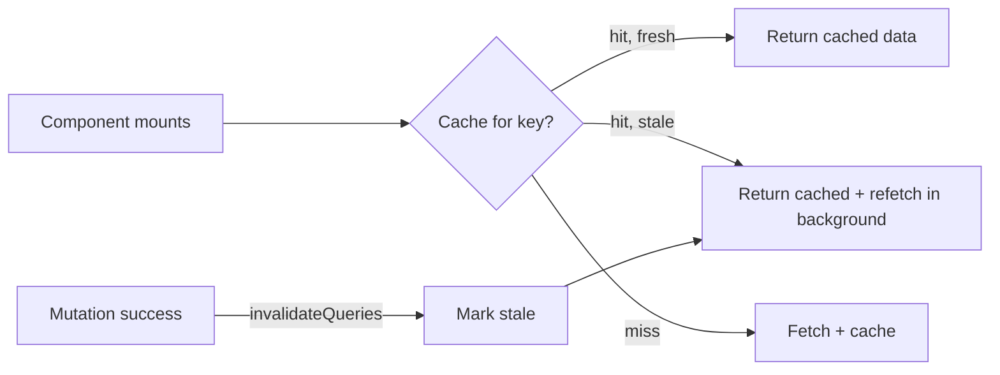

# TanStack Query

> **One-liner**: TanStack Query (formerly React Query) is the de-facto data-fetching layer for React — it handles caching, deduplication, background refresh, retry, mutation, and optimistic updates so you don't have to write any of it.

---

## Quick Reference

| API | Purpose |
|-----|---------|
| `useQuery({ queryKey, queryFn })` | Read; returns `{ data, isLoading, error, refetch, ... }` |
| `useMutation({ mutationFn })` | Write; returns `{ mutate, isPending, error, ... }` |
| `useQueryClient()` | Access the client (invalidate, prefetch, set data) |
| `queryClient.invalidateQueries({ queryKey })` | Mark cached queries stale → refetch |
| `queryClient.setQueryData(key, updater)` | Optimistic update / direct cache write |
| `queryClient.prefetchQuery(...)` | Warm cache (e.g., on hover) |
| Devtools | `<ReactQueryDevtools />` — install separately |

| Query state | When |
|-------------|------|
| `isPending` | No data yet |
| `isFetching` | Network request in flight (incl. background refresh) |
| `isError` | Last fetch threw |
| `isSuccess` | Has data |
| `isStale` | Cache is older than `staleTime` |

---

## Core Concept

TanStack Query treats your server data as a **cache keyed by query keys**. Components subscribe to a key; the library deduplicates concurrent requests, returns cached data instantly while fetching in the background, and notifies subscribers when fresh data arrives.

The two big primitives:
- **`useQuery`** — read. Idempotent, cached, automatically retries, refetches on window focus / reconnect.
- **`useMutation`** — write. Not cached; you typically `invalidateQueries` after a successful mutation to refresh related reads.

The mental shift: you stop thinking "fetch on mount, store in state" and start thinking "declare what data this component needs by key; the library handles the rest."

For mutations, **optimistic updates** make the UI feel instant: write to the cache immediately, fire the request in the background, roll back on error.

---

## Diagram



---

## Syntax & API

### Setup

```bash
npm install @tanstack/react-query @tanstack/react-query-devtools
```

```tsx
// main.tsx
import { QueryClient, QueryClientProvider } from "@tanstack/react-query";
import { ReactQueryDevtools } from "@tanstack/react-query-devtools";

const queryClient = new QueryClient({
  defaultOptions: {
    queries: { staleTime: 30_000, refetchOnWindowFocus: false },
  },
});

createRoot(document.getElementById("root")!).render(
  <QueryClientProvider client={queryClient}>
    <App />
    <ReactQueryDevtools />
  </QueryClientProvider>,
);
```

### `useQuery`

```tsx
import { useQuery } from "@tanstack/react-query";

function UserView({ id }: { id: string }) {
  const { data, isPending, error } = useQuery({
    queryKey: ["user", id],
    queryFn:  ({ signal }) => fetch(`/api/users/${id}`, { signal }).then(r => r.json() as Promise<User>),
  });

  if (isPending) return <Spinner />;
  if (error)     return <ErrorView error={error} />;
  return <h1>{data.name}</h1>;
}
```

### `useMutation` + invalidate

```tsx
import { useMutation, useQueryClient } from "@tanstack/react-query";

function CreateUser() {
  const qc = useQueryClient();

  const m = useMutation({
    mutationFn: (input: NewUser) =>
      fetch("/api/users", {
        method: "POST",
        body: JSON.stringify(input),
      }).then(r => r.json() as Promise<User>),
    onSuccess: () => {
      qc.invalidateQueries({ queryKey: ["users"] }); // refresh list
    },
  });

  return (
    <button
      onClick={() => m.mutate({ name: "Ana", email: "a@x.com" })}
      disabled={m.isPending}
    >
      {m.isPending ? "Saving…" : "Create"}
    </button>
  );
}
```

### Optimistic update

```tsx
const m = useMutation({
  mutationFn: (patch: Patch) => api.update(patch),

  onMutate: async (patch) => {
    await qc.cancelQueries({ queryKey: ["item", patch.id] });
    const prev = qc.getQueryData<Item>(["item", patch.id]);
    qc.setQueryData<Item>(["item", patch.id], old => old ? { ...old, ...patch } : old);
    return { prev };          // context for rollback
  },
  onError: (_err, patch, ctx) => {
    if (ctx?.prev) qc.setQueryData(["item", patch.id], ctx.prev);
  },
  onSettled: (_d, _e, patch) => {
    qc.invalidateQueries({ queryKey: ["item", patch.id] });
  },
});
```

### Dependent / conditional queries

```tsx
const userQ = useQuery({ queryKey: ["user", id], queryFn: () => fetchUser(id) });

const postsQ = useQuery({
  queryKey: ["posts", id],
  queryFn: () => fetchPosts(id),
  enabled: !!userQ.data,        // wait for user before fetching posts
});
```

### Pagination / infinite query

```tsx
const q = useInfiniteQuery({
  queryKey: ["feed"],
  queryFn:  ({ pageParam = 0 }) => fetchPage(pageParam),
  initialPageParam: 0,
  getNextPageParam: (last) => last.nextCursor ?? undefined,
});
```

---

## Common Patterns

```tsx
// Pattern: type-safe query key factory
const keys = {
  users: {
    all:    ["users"] as const,
    list:   (filter: string)         => [...keys.users.all, "list", filter] as const,
    detail: (id: string)             => [...keys.users.all, "detail", id] as const,
  },
};

useQuery({ queryKey: keys.users.detail(id), queryFn: () => fetchUser(id) });
qc.invalidateQueries({ queryKey: keys.users.all });
```

```tsx
// Pattern: prefetch on hover
<Link
  to={`/users/${id}`}
  onMouseEnter={() => qc.prefetchQuery({
    queryKey: ["user", id],
    queryFn:  () => fetchUser(id),
  })}
>
  view
</Link>
```

---

## Gotchas & Tips

- **Query keys are arrays** and must be stable. Don't construct them inline with new objects each render.
- **`staleTime` defaults to 0** — every mount refetches. For most apps, set 30s–5min globally.
- **`refetchOnWindowFocus: true` is on by default**. Friendly UX; disable in tests.
- **Mutations don't auto-invalidate.** You decide which queries to invalidate via `onSuccess`.
- **Don't store mutation state in `useState`.** `useMutation` already gives you `isPending`/`error`.
- **`signal` from queryFn supports `AbortController`** — pass it to `fetch` for cancellation.
- **Suspense mode**: `useSuspenseQuery` + `<Suspense>` lets you skip the `isLoading` branch in render.
- **For RSC apps (Next.js App Router)**, prefer fetching on the server. Use TanStack Query mostly for client-side mutations and live data.
- **Devtools are essential** while learning. Install them and look at the cache.

---

## See Also

- [[10 - Fetching Data]]
- [[01 - useEffect Deep Dive]]
- [[03 - Suspense]]
- [[12 - State Management]]
