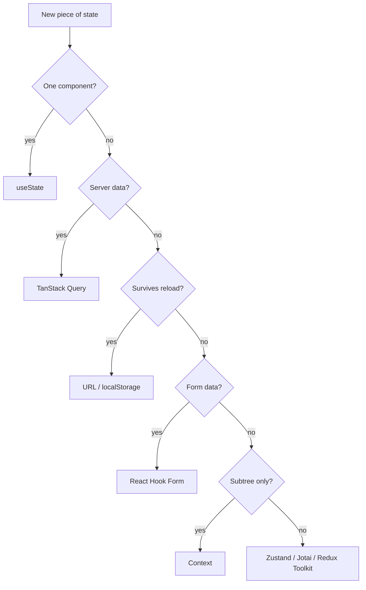

# State Management

> **One-liner**: Choose the simplest place state can live — **local** (`useState`) > **lifted** (parent owns it) > **Context** (broadcast within a subtree) > **library** (Zustand/Jotai/Redux Toolkit, for cross-cutting global state).

---

## Quick Reference

| Where state lives | Tool | Use when |
|------------------|------|----------|
| Inside a component | `useState`, `useReducer` | The component is the only consumer |
| In a common parent | "Lift state up" | 2–3 siblings need it |
| Provider tree | Context + `useReducer` | Many descendants in a subtree need it; updates are infrequent |
| Global store | **Zustand** / Jotai / Redux Toolkit | App-wide state, frequent updates, many consumers |
| Server cache | **TanStack Query** / SWR | Data that comes from an API |
| URL | Router state / search params | State that should survive reload / be shareable |
| Form fields | React Hook Form | Form-shaped state |

**Most apps need only `useState` + lifted state + TanStack Query + a small Zustand store. That's it.**

---

## Core Concept

There is no single "right" state management tool. The question is **where state lives** — the rest follows.

The decision tree:
1. Can it live inside one component? → `useState`.
2. Do 2–3 siblings need it? → lift it to their common parent.
3. Does a deep subtree need it (theme, auth, locale)? → **Context** + `useState`/`useReducer`.
4. Does the whole app need it, with frequent updates and many subscribers? → **Zustand** (or Jotai/Redux Toolkit).
5. Does it come from an API? → **TanStack Query**, not your global store.
6. Should it survive reload or be shareable via URL? → URL search params.

**Most app state isn't really app state — it's server state**. TanStack Query owns the server cache; you don't put fetched data in Redux.

The 2010s default of "everything in Redux" is wrong in 2025. Modern apps mix: local state for UI, TanStack Query for server data, a tiny Zustand store for cross-cutting client state (active workspace, sidebar collapsed, theme).

---

## Diagram



---

## Syntax & API

### Lifted state (the pre-Context fix)

```tsx
function Parent() {
  const [filter, setFilter] = useState("");
  return (
    <>
      <SearchBox value={filter} onChange={setFilter} />
      <List filter={filter} />
    </>
  );
}
```

### Context + reducer

```tsx
type State = { theme: "light" | "dark"; sidebar: boolean };
type Action = { type: "toggle-theme" } | { type: "toggle-sidebar" };

const StateCtx    = createContext<State | null>(null);
const DispatchCtx = createContext<React.Dispatch<Action> | null>(null);

function reducer(s: State, a: Action): State {
  switch (a.type) {
    case "toggle-theme":   return { ...s, theme: s.theme === "light" ? "dark" : "light" };
    case "toggle-sidebar": return { ...s, sidebar: !s.sidebar };
  }
}

export function AppProvider({ children }: { children: React.ReactNode }) {
  const [state, dispatch] = useReducer(reducer, { theme: "light", sidebar: true });
  return (
    <StateCtx.Provider value={state}>
      <DispatchCtx.Provider value={dispatch}>
        {children}
      </DispatchCtx.Provider>
    </StateCtx.Provider>
  );
}

export const useAppState    = () => useContext(StateCtx)!;
export const useAppDispatch = () => useContext(DispatchCtx)!;
```

### Zustand (smallest global store)

```bash
npm install zustand
```

```tsx
import { create } from "zustand";

type Store = {
  count: number;
  increment: () => void;
  reset: () => void;
};

export const useCounter = create<Store>(set => ({
  count: 0,
  increment: () => set(s => ({ count: s.count + 1 })),
  reset:     () => set({ count: 0 }),
}));

// Use anywhere — no Provider needed
function Counter() {
  const count     = useCounter(s => s.count);
  const increment = useCounter(s => s.increment);
  return <button onClick={increment}>{count}</button>;
}
```

### Jotai (atom-based)

```tsx
import { atom, useAtom } from "jotai";

const countAtom = atom(0);

function Counter() {
  const [count, setCount] = useAtom(countAtom);
  return <button onClick={() => setCount(c => c + 1)}>{count}</button>;
}
```

### Redux Toolkit (when your team already uses Redux)

```tsx
import { createSlice, configureStore } from "@reduxjs/toolkit";
import { Provider, useDispatch, useSelector } from "react-redux";

const counter = createSlice({
  name: "counter",
  initialState: { value: 0 },
  reducers: {
    increment(s) { s.value += 1; },                   // RTK uses Immer — mutation is OK here
  },
});

const store = configureStore({ reducer: { counter: counter.reducer } });

function App() {
  return <Provider store={store}><Counter /></Provider>;
}

function Counter() {
  const value = useSelector((s: any) => s.counter.value);
  const dispatch = useDispatch();
  return <button onClick={() => dispatch(counter.actions.increment())}>{value}</button>;
}
```

---

## Common Patterns

```tsx
// Pattern: split server state from UI state
const usersQ = useQuery({ queryKey: ["users"], queryFn: fetchUsers });   // server
const selectedUserId = useStore(s => s.selectedUserId);                  // client
```

```tsx
// Pattern: URL is state too
const [search, setSearch] = useSearchParams();        // React Router
const filter = search.get("filter") ?? "";
<input value={filter} onChange={e => setSearch({ filter: e.target.value })} />
```

---

## Gotchas & Tips

- **Don't put server data in a global store.** TanStack Query is purpose-built; replicating its features manually is a quagmire.
- **Don't reach for Redux on day one.** It's not wrong, just heavier than most apps need.
- **Context is not a store.** It's a delivery mechanism. Pair with `useReducer`/`useState` for actual state.
- **Splitting Context** by update frequency reduces re-renders. One mega-context kills perf.
- **Zustand selectors enable referential bailout** — `useStore(s => s.x)` only re-renders when `x` changes.
- **Persist sparingly.** Only persist what users care about across reloads (auth tokens, drafts). Use `zustand/middleware` `persist` or `localStorage`.
- **Server Components** ([[04 - Server Components]]) shift more state to the URL/database — global client state shrinks.
- **Avoid duplicating state.** If two stores can drift, consolidate.

---

## See Also

- [[04 - State and useState]]
- [[05 - useContext]]
- [[11 - TanStack Query]]
- [[10 - State Management Advanced]]
