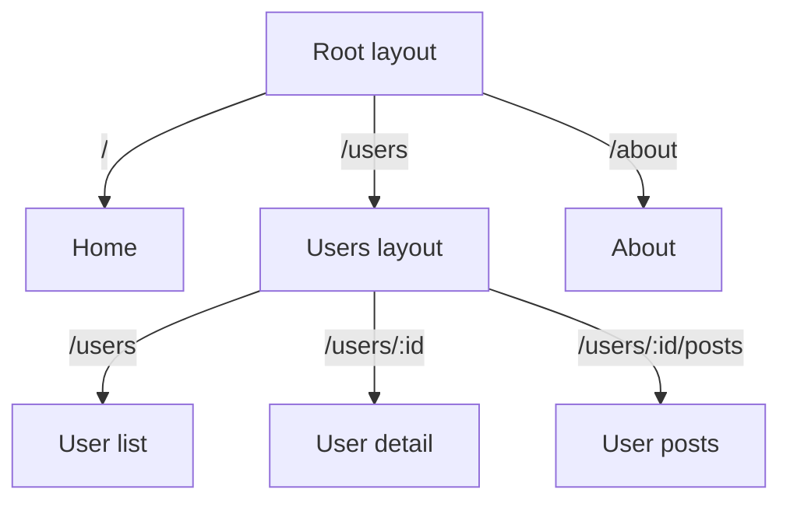

# React Router

> **One-liner**: React Router is the standard SPA router — it maps URLs to components, supports nested routes, URL params, and (in v6.4+) loaders/actions that fetch and mutate data alongside the route.

---

## Quick Reference

| Item | Syntax |
|------|--------|
| Install | `npm install react-router-dom` |
| Define routes | `createBrowserRouter([...])` (data router) or `<BrowserRouter>` + `<Routes>` |
| Link | `<Link to="/about">` (no full reload) |
| Active link | `<NavLink to="/x" className={({isActive}) => ...}>` |
| Navigate programmatically | `const nav = useNavigate(); nav("/x")` |
| Path params | `:id` in path → `useParams<{id: string}>()` |
| Search params | `const [search, setSearch] = useSearchParams()` |
| Nested route | Children render in the parent's `<Outlet />` |
| Loader (v6.4+) | `loader: async ({ params }) => ...` → `useLoaderData()` |
| Action (v6.4+) | `action: async ({ request }) => ...` for `<Form>` submissions |

---

## Core Concept

React Router turns the URL into application state. When you click a `<Link>`, it intercepts the click, updates the URL via the History API, and renders the component(s) matched by the new URL — no full reload.

Two API styles in v6:
1. **Declarative router** — JSX `<BrowserRouter><Routes><Route /></Routes></BrowserRouter>`. Simple, no data loading helpers.
2. **Data router (v6.4+)** — `createBrowserRouter([...])` + `<RouterProvider>`. Routes can have **loaders** (run before render to fetch data) and **actions** (run on `<Form>` POST). This is the modern, recommended style — and it's converging with Remix.

**Nested routes** mean a parent route's UI persists while children change. The parent renders an `<Outlet />` where the child mounts. Combined with loaders, this gives parallel data loading and partial reloads.

In **React Router v7+** (released as the next iteration of Remix), data routes are the default and the framework includes file-system routing.

---

## Diagram



---

## Syntax & API

### Declarative routes (simplest setup)

```tsx
import { BrowserRouter, Routes, Route, Link, Outlet, useParams } from "react-router-dom";

function Layout() {
  return (
    <>
      <nav>
        <Link to="/">Home</Link> | <Link to="/users">Users</Link>
      </nav>
      <main><Outlet /></main>
    </>
  );
}

function UserDetail() {
  const { id } = useParams<{ id: string }>();
  return <h1>User {id}</h1>;
}

export default function App() {
  return (
    <BrowserRouter>
      <Routes>
        <Route path="/" element={<Layout />}>
          <Route index element={<Home />} />
          <Route path="users" element={<UserList />} />
          <Route path="users/:id" element={<UserDetail />} />
          <Route path="*" element={<NotFound />} />
        </Route>
      </Routes>
    </BrowserRouter>
  );
}
```

### Data router with loaders + actions

```tsx
import { createBrowserRouter, RouterProvider, useLoaderData, Form } from "react-router-dom";

const router = createBrowserRouter([
  {
    path: "/",
    element: <Layout />,
    children: [
      { index: true, element: <Home /> },
      {
        path: "users/:id",
        loader: async ({ params }) => {
          const r = await fetch(`/api/users/${params.id}`);
          return r.json();
        },
        action: async ({ request, params }) => {
          const data = await request.formData();
          await fetch(`/api/users/${params.id}`, { method: "PATCH", body: data });
          return { ok: true };
        },
        element: <UserDetail />,
      },
    ],
  },
]);

function UserDetail() {
  const user = useLoaderData() as User;

  return (
    <>
      <h1>{user.name}</h1>
      <Form method="post">
        <input name="name" defaultValue={user.name} />
        <button type="submit">Save</button>
      </Form>
    </>
  );
}

export default function App() {
  return <RouterProvider router={router} />;
}
```

### Programmatic navigation

```tsx
import { useNavigate } from "react-router-dom";

function LoginButton() {
  const navigate = useNavigate();
  const onLogin = async () => {
    await login();
    navigate("/dashboard", { replace: true });
  };
  return <button onClick={onLogin}>Login</button>;
}
```

### Search params

```tsx
import { useSearchParams } from "react-router-dom";

function Search() {
  const [search, setSearch] = useSearchParams();
  const q = search.get("q") ?? "";

  return (
    <input
      value={q}
      onChange={e => setSearch({ q: e.target.value })}
    />
  );
}
```

---

## Common Patterns

```tsx
// Pattern: protected route via wrapper
function RequireAuth({ children }: { children: React.ReactNode }) {
  const { user } = useAuth();
  if (!user) return <Navigate to="/login" replace />;
  return <>{children}</>;
}

<Route path="/dashboard" element={<RequireAuth><Dashboard /></RequireAuth>} />
```

```tsx
// Pattern: lazy-load route (code splitting)
import { lazy, Suspense } from "react";
const Settings = lazy(() => import("./Settings"));

<Route path="/settings" element={
  <Suspense fallback={<Spinner />}><Settings /></Suspense>
} />
```

```tsx
// Pattern: redirect from loader
loader: () => {
  const user = getUser();
  if (!user) throw redirect("/login");
  return user;
}
```

---

## Gotchas & Tips

- **Use `<Link>` (or `useNavigate`)**, not `<a href>`, for in-app navigation. `<a>` triggers a full reload.
- **`useParams` is untyped at runtime.** TS generic is just hint; verify with Zod if user input is critical.
- **Data router is the future.** Use `createBrowserRouter` for new apps; declarative routes are fine for tiny demos.
- **Nested routes need `<Outlet />`** in the parent. Forgetting it makes children silently disappear.
- **`replace: true` doesn't push a new history entry** — useful after login.
- **`useLoaderData` is typed as `unknown`** — cast or use `LoaderFunctionArgs` typing helpers.
- **Loaders run on every navigation by default**, but the router de-dupes during a single transition. Use `shouldRevalidate` to opt out.
- **Don't fetch in `useEffect` on a route component if you have a loader** — duplicates work.
- **React Router v7 = the new Remix.** If starting fresh and you want SSR + RSC, look at React Router 7 / Remix together (see [[09 - Remix and React Router 7]]).

---

## See Also

- [[14 - Code Splitting]]
- [[09 - Remix and React Router 7]]
- [[08 - Next.js App Router]]
