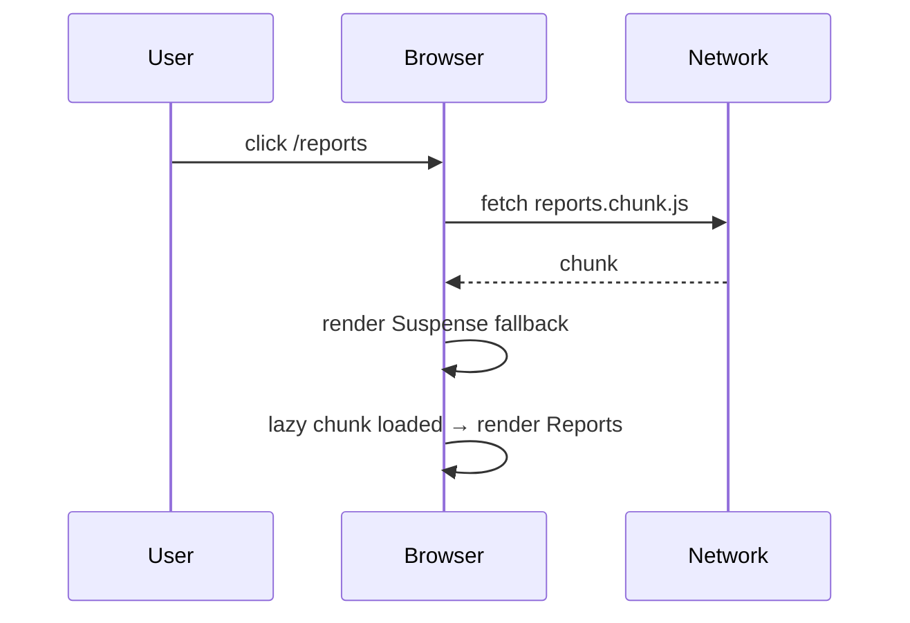

# Code Splitting

> **One-liner**: Split your bundle into chunks that load on demand — `React.lazy(() => import(...))` + `<Suspense>` is the React-native way; pair it with route-level splitting to keep first-page load tiny.

---

## Quick Reference

| Technique | Loads when |
|-----------|-----------|
| **Static `import`** | At app start (always shipped) |
| **Dynamic `import()`** | When the call runs |
| **`React.lazy(() => import(...))`** | When the component is first rendered |
| **Route-based splitting** | When the user navigates to that route |
| **Component-based splitting** | When a heavy modal/chart actually opens |
| **`<link rel="modulepreload">` / Vite hint** | Prefetch in the background |

---

## Core Concept

Bundlers (Vite, Webpack, esbuild) emit one big JS file by default. As your app grows, that file grows — eventually multi-MB, hurting first-page load. **Code splitting** breaks the bundle into chunks; the browser only downloads what's needed for the current view.

Modern JS does it via **dynamic `import()`** — `import("./Heavy")` returns a promise. The bundler statically detects the call and emits a separate chunk.

`React.lazy(() => import("./X"))` wraps that promise into a component that **suspends** until loaded. You wrap the lazy component in `<Suspense fallback={...}>` to render a placeholder during load.

The **biggest win is route-level splitting**. Each route becomes its own chunk; visiting `/dashboard` doesn't download the entire admin panel.

---

## Diagram



---

## Syntax & API

### Lazy component + Suspense

```tsx
import { lazy, Suspense } from "react";

const Reports = lazy(() => import("./Reports"));

function App() {
  return (
    <Suspense fallback={<Spinner />}>
      <Reports />
    </Suspense>
  );
}
```

### Route-level splitting (React Router data router)

```tsx
import { createBrowserRouter } from "react-router-dom";

const router = createBrowserRouter([
  {
    path: "/",
    element: <Layout />,
    children: [
      { index: true, lazy: () => import("./routes/home") },        // route-as-chunk
      { path: "reports", lazy: () => import("./routes/reports") },
      { path: "settings", lazy: () => import("./routes/settings") },
    ],
  },
]);
```

```tsx
// routes/reports.tsx — exports `Component` + optional `loader`/`action`
import { Reports } from "../pages/Reports";
export const Component = Reports;
export async function loader() { /* ... */ }
```

### Splitting a heavy modal — load only when opened

```tsx
const Editor = lazy(() => import("./RichEditor"));

function App() {
  const [open, setOpen] = useState(false);

  return (
    <>
      <button onClick={() => setOpen(true)}>Edit</button>
      {open && (
        <Suspense fallback={<Spinner />}>
          <Editor />
        </Suspense>
      )}
    </>
  );
}
```

### Prefetch on hover

```tsx
function ReportsLink() {
  return (
    <a
      href="/reports"
      onMouseEnter={() => import("./Reports")}     // start the download
      onClick={(e) => { e.preventDefault(); navigate("/reports"); }}
    >
      Reports
    </a>
  );
}
```

### Named exports — wrap with default

```tsx
// React.lazy needs a default export. For a named export:
const Editor = lazy(() => import("./Editor").then(m => ({ default: m.Editor })));
```

---

## Common Patterns

```tsx
// Pattern: split a chart library
const Chart = lazy(() => import("./Chart"));      // pulls in d3 only when needed

// Pattern: split by user role
const AdminPanel = lazy(() => import("./AdminPanel"));
{user.isAdmin && (
  <Suspense fallback={<Spinner />}>
    <AdminPanel />
  </Suspense>
)}

// Pattern: error boundary around lazy (chunk download can fail)
<ErrorBoundary fallback={<ChunkError />}>
  <Suspense fallback={<Spinner />}>
    <Reports />
  </Suspense>
</ErrorBoundary>
```

---

## Gotchas & Tips

- **`React.lazy` requires a default export.** Re-wrap named exports with `.then(m => ({ default: m.X }))`.
- **Always wrap in `<Suspense>`.** Lazy without Suspense throws.
- **Chunks can fail to download** (deploy mid-session, network blip). Wrap in an error boundary that prompts a reload — see [[15 - Error Boundaries]].
- **Avoid splitting tiny components** — the per-chunk overhead (HTTP request, JS parsing) outweighs savings.
- **Watch your bundle.** `vite build --report` (or `rollup-plugin-visualizer`) shows what's in each chunk.
- **`React.lazy` doesn't work in Server Components.** Use `next/dynamic` (Next.js) or framework-specific equivalents.
- **Preload critical chunks** with `<link rel="modulepreload">` so they don't block above-the-fold rendering.
- **Don't lazy-load components that always render on first paint** — adds latency for no benefit.
- **In dev (Vite)**, lazy chunks are hot-reloaded; the perf benefit appears in prod builds.

---

## See Also

- [[03 - Suspense]]
- [[15 - Error Boundaries]]
- [[16 - Build and Bundling]]
- [[06 - Performance Optimization]]
