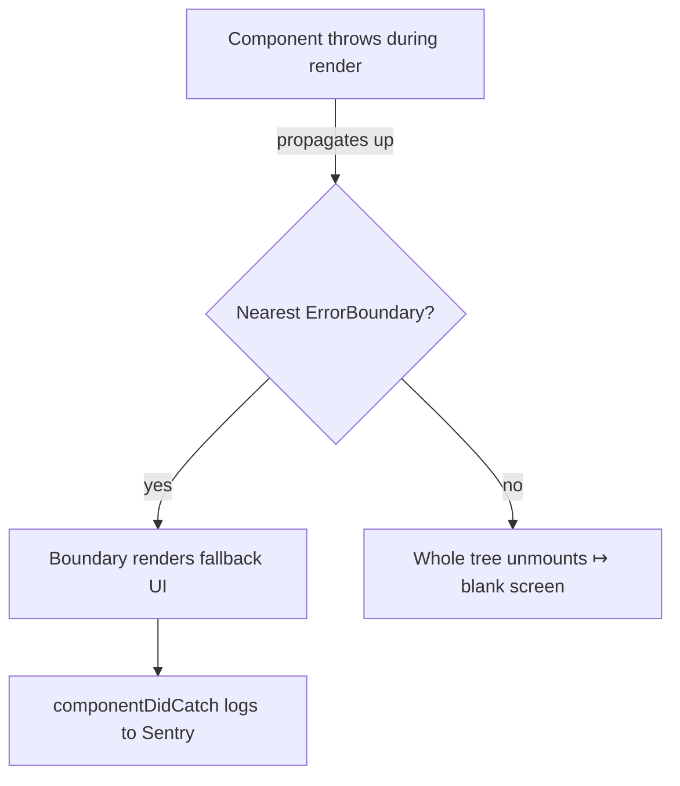

# Error Boundaries

> **One-liner**: An **error boundary** is a component that catches render-time errors in its children and renders a fallback UI instead of crashing the whole app — and it's still the only API in React that requires a class component.

---

## Quick Reference

| Item | Detail |
|------|--------|
| Catches | Errors thrown during **render**, in **lifecycle**, in **constructors** of children |
| Doesn't catch | Event handlers, async (`setTimeout`, promises), SSR errors, errors *in itself* |
| Required APIs | `static getDerivedStateFromError()` + `componentDidCatch()` |
| Library | `react-error-boundary` — function-component-friendly wrapper, recommended |
| Where to put | App root, route boundaries, around heavy widgets, around lazy chunks |
| React 19 | New `onCaughtError`, `onUncaughtError` root options for global logging |

---

## Core Concept

By default, an uncaught error during render kills the entire React tree — the user sees a blank page. **Error boundaries** catch errors from descendants and let you render a fallback (e.g., "Something went wrong. [Reload]").

Error boundaries are **class components** (the only legacy API still required) because the catch hooks (`getDerivedStateFromError`, `componentDidCatch`) don't have function-component equivalents. Use **`react-error-boundary`** in practice — it gives you a clean function-API wrapper, fallback render prop, and a `useErrorHandler` hook to manually report errors from event handlers.

Important: error boundaries do **not** catch errors in event handlers or async callbacks. Those reach the browser's `window.onerror` / `unhandledrejection` instead. For those, use try/catch in handlers or `useErrorHandler` from `react-error-boundary` to manually push them into a boundary.

---

## Diagram



---

## Syntax & API

### Class component (React's built-in API)

```tsx
import { Component, ReactNode } from "react";

type Props = { fallback: ReactNode; children: ReactNode };
type State = { error: Error | null };

class ErrorBoundary extends Component<Props, State> {
  state: State = { error: null };

  static getDerivedStateFromError(error: Error): State {
    return { error };                       // update state on error
  }

  componentDidCatch(error: Error, info: React.ErrorInfo) {
    // side-effect: log to monitoring
    console.error(error, info.componentStack);
  }

  render() {
    return this.state.error ? this.props.fallback : this.props.children;
  }
}

// Usage
<ErrorBoundary fallback={<p>Something went wrong.</p>}>
  <App />
</ErrorBoundary>
```

### Recommended: `react-error-boundary` library

```bash
npm install react-error-boundary
```

```tsx
import { ErrorBoundary } from "react-error-boundary";

function Fallback({ error, resetErrorBoundary }: any) {
  return (
    <div role="alert">
      <p>Something went wrong:</p>
      <pre>{error.message}</pre>
      <button onClick={resetErrorBoundary}>Try again</button>
    </div>
  );
}

<ErrorBoundary
  FallbackComponent={Fallback}
  onError={(err, info) => logToSentry(err, info)}
  onReset={() => queryClient.clear()}
>
  <Dashboard />
</ErrorBoundary>
```

### Manually push async errors into a boundary

```tsx
import { useErrorBoundary } from "react-error-boundary";

function MyComp() {
  const { showBoundary } = useErrorBoundary();

  const onClick = async () => {
    try {
      await api.do();
    } catch (err) {
      showBoundary(err);     // surfaces in nearest ErrorBoundary
    }
  };

  return <button onClick={onClick}>Do</button>;
}
```

### React 19 — global handlers

```tsx
import { createRoot } from "react-dom/client";

createRoot(document.getElementById("root")!, {
  onCaughtError: (err, info) => logToSentry(err, info),
  onUncaughtError: (err, info) => logToSentry(err, info),
}).render(<App />);
```

---

## Common Patterns

```tsx
// Pattern: layered boundaries — granular fallbacks
<ErrorBoundary FallbackComponent={AppCrash}>
  <Layout>
    <ErrorBoundary FallbackComponent={RouteCrash}>
      <Outlet />
      <ErrorBoundary FallbackComponent={WidgetCrash}>
        <Chart />          {/* widget crash doesn't kill the route */}
      </ErrorBoundary>
    </ErrorBoundary>
  </Layout>
</ErrorBoundary>
```

```tsx
// Pattern: reset on route change
import { useLocation } from "react-router-dom";

function RouteBoundary({ children }: { children: ReactNode }) {
  const { key } = useLocation();
  return (
    <ErrorBoundary
      key={key}                             // remount on navigation
      FallbackComponent={Fallback}
    >
      {children}
    </ErrorBoundary>
  );
}
```

```tsx
// Pattern: error boundary + suspense for lazy chunks
<ErrorBoundary FallbackComponent={ChunkError}>
  <Suspense fallback={<Spinner />}>
    <LazyRoute />
  </Suspense>
</ErrorBoundary>
```

---

## Gotchas & Tips

- **Doesn't catch event handlers.** Errors thrown in `onClick` reach `window.onerror`. Use `useErrorBoundary().showBoundary` to surface them.
- **Doesn't catch promises** (`setTimeout`, `fetch.then`). Wrap in try/catch and call `showBoundary`.
- **Doesn't catch SSR errors.** Server frameworks (Next.js, Remix) have their own error pages.
- **Doesn't catch errors in the boundary itself.** Wrap the boundary with another boundary or root-level error handlers.
- **Reset is your responsibility.** After fallback, clicking "retry" should re-mount the subtree (use `key` change or `react-error-boundary`'s `resetKeys`).
- **Always log errors.** A silent boundary hides bugs from your monitoring.
- **In dev, errors still appear in the console** — that's React, not your boundary. In prod, only the boundary handles them.
- **Pair with Suspense for lazy chunks** — if a chunk fails to download, the boundary catches it.

---

## See Also

- [[14 - Code Splitting]]
- [[03 - Suspense]]
- [[17 - Monitoring and Errors]]
