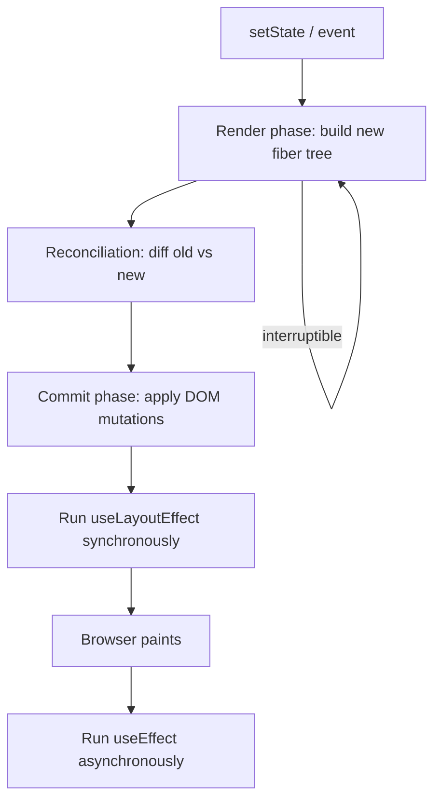

# React Internals

> **One-liner**: React's internals split work into a **render phase** (build a fiber tree describing the next UI, interruptible) and a **commit phase** (apply changes to the DOM, synchronous) — understanding this explains memoization, concurrent mode, and Strict Mode behavior.

---

## Quick Reference

| Concept | What it is |
|---------|-----------|
| **Element** | The plain JS object returned by JSX (`{ type, props, key }`) — cheap, immutable |
| **Component** | The function/class that produces elements |
| **Fiber** | Internal node representing a unit of work for one component instance |
| **Render phase** | Call components, build the new fiber tree, **pure, interruptible** |
| **Commit phase** | Apply DOM mutations + run effects, **synchronous, atomic** |
| **Reconciliation** | Diff old vs new fiber tree to compute the minimum patch |
| **Reconciler vs renderer** | Reconciler is platform-agnostic; `react-dom`, `react-native`, etc. are renderers |
| **Strict Mode** | Double-invokes components/effects in dev to surface impurity |
| **React Compiler** (RC) | Auto-memoizes components — reduces need for `useMemo`/`useCallback` |

---

## Core Concept

When state changes, React doesn't immediately update the DOM. It runs a **render phase**: starting at the root (or the component that updated), it calls components top-down, producing a new tree of **fibers**. A fiber is a small object with pointers to siblings/parent/child, plus the component's props, state, and pending work.

Render is **pure and interruptible**. React can pause, abandon, or restart it (this is what concurrent mode exploits — see [[02 - Concurrent Features]]). Because of that, **components must be pure during render** — no DOM writes, no `setState` from a render-time call, no fetch.

Once the new tree is built and reconciliation finds the minimum changes needed, React enters the **commit phase**: synchronous, atomic. It applies DOM mutations, then runs `useLayoutEffect` (sync, before paint), then schedules `useEffect` (after paint).

`React.memo`, `useMemo`, `useCallback` exist to **let React skip subtrees during reconciliation**: if a memoized component receives the same props (by reference), React reuses the previous fiber tree and skips its render.

---

## Diagram



---

## Syntax & API

### Inspect what's happening

```tsx
// 1. React DevTools "Highlight updates" — visual flash on re-render
// 2. React DevTools Profiler tab — record a session, see flamegraph
// 3. console.log inside a component — most blunt instrument

function Row({ item }: Props) {
  console.log("render row", item.id);
  return <li>{item.name}</li>;
}
```

### Strict Mode — surface impurity

```tsx
import { StrictMode } from "react";

createRoot(rootEl).render(
  <StrictMode>
    <App />
  </StrictMode>,
);

// In dev, every component:
// - renders twice
// - mounts → unmounts → mounts (effects fire 2×)
// Catches: missing effect cleanup, render-phase side effects, non-pure reducers
```

### Why pure render matters

```tsx
// ❌ Side effect during render — fires on every render, including the discarded ones
function Row({ id }: { id: string }) {
  fetch(`/api/track?row=${id}`);            // 💥 maybe never commits → leaks
  return <li>{id}</li>;
}

// ✅ Side effects in useEffect (or event handlers)
function Row({ id }: { id: string }) {
  useEffect(() => { fetch(`/api/track?row=${id}`); }, [id]);
  return <li>{id}</li>;
}
```

### Bailout — same props, no work

```tsx
const Row = memo(function Row({ item }: { item: Item }) {
  return <li>{item.name}</li>;
});

// Parent re-renders, but if `item` is referentially equal,
// Row's render function is NOT called.
```

### Keys reset state — under the hood, React mounts a new fiber

```tsx
{users.map(u => <Editor key={u.id} user={u} />)}
// When selected user changes, Editor's `key` changes → React unmounts old fiber,
// mounts new — internal state (drafts, focus) is reset.
```

---

## Common Patterns

```text
Mental model for "why did this re-render?"
1. Did this component's state/reducer change?  → re-render
2. Did its parent re-render and pass new props?
   - If memoized: bail out only if props are referentially equal
   - If not memoized: re-render
3. Did a Context this component reads change value (by reference)? → re-render
4. None of the above? → did NOT re-render
```

```text
React Compiler (React 19 RC):
- Lints + transforms your components at build time.
- Inserts memoization automatically for stable values.
- When stable, eliminates 90% of manual useMemo/useCallback calls.
- Adopts gradually — opt in per file/route.
```

---

## Gotchas & Tips

- **Render must be pure.** Reads OK; writes (state mutation, DOM, network, time) bad. Strict Mode's double-render is your friend here.
- **Fiber is not the virtual DOM.** It's React's internal scheduling structure. The "virtual DOM" was a marketing term for the element tree.
- **Commit phase is atomic.** All DOM updates from one render apply together — no mid-paint inconsistency.
- **`useLayoutEffect` runs before paint** (synchronous, may block). Use only for measurements that must happen before the user sees the frame.
- **`useEffect` runs after paint** (async). User may see one frame before the effect runs.
- **State updates during render** (without proper guards) cause infinite loops and a warning.
- **Strict Mode's double-invocation only happens in dev.** Don't disable it.
- **Use the Profiler, not intuition.** "I think this is slow" is wrong half the time.
- **Re-render ≠ re-mount.** A component re-rendering keeps its state. Re-mounting (from `key` change, parent unmount) resets it.

---

## See Also

- [[02 - Concurrent Features]]
- [[03 - useMemo and useCallback]]
- [[06 - Performance Optimization]]
