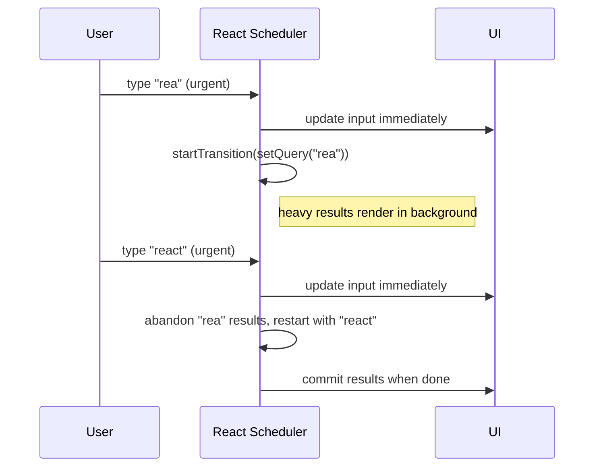

# Concurrent Features

> **One-liner**: React 18+ can render in the background, prioritize urgent updates over slow ones, and bail out of stale work — `useTransition` and `useDeferredValue` are the two main hooks that opt into this.

---

## Quick Reference

| Hook / API | Use for |
|------------|---------|
| `useTransition()` | Marking an update as **non-urgent** (e.g., switching tabs that triggers a slow render) |
| `startTransition(fn)` | Same, without the `isPending` boolean (works outside components too) |
| `useDeferredValue(value)` | Render a stale `value` while the new one renders in the background |
| `Suspense` | Pair with transitions so fallbacks don't flash on quick navigations |
| `useSyncExternalStore` | Subscribe to external stores in a concurrent-safe way |
| Automatic batching | All updates (incl. promises, timeouts) batch automatically in R18+ |

---

## Core Concept

In React 17, every state update was urgent — once started, render couldn't be interrupted. Type into a search box that triggered a heavy filter, and the input stayed unresponsive until the filter finished.

React 18 introduced **concurrent rendering**: the renderer can pause mid-render, ship a higher-priority update, then come back. State updates marked as **transitions** (`startTransition`) are interruptible; updates outside transitions (typing, clicking) are still urgent.

`useTransition` returns `[isPending, startTransition]`. Wrap a state update that triggers slow rendering in `startTransition` to keep the UI responsive. Use `isPending` to show a subtle "loading" indicator without blocking.

`useDeferredValue` is the inverse: pass it a fast-changing value (search query) and React renders with the previous value while the new one re-renders in the background — perfect for keeping an input snappy while a heavy results list catches up.

---

## Diagram



---

## Syntax & API

### `useTransition` — keep input responsive

```tsx
import { useState, useTransition } from "react";

function Search() {
  const [text, setText]       = useState("");      // urgent — input
  const [results, setResults] = useState<Item[]>([]);
  const [isPending, startTransition] = useTransition();

  const onChange = (e: React.ChangeEvent<HTMLInputElement>) => {
    const v = e.target.value;
    setText(v);                                    // urgent — feels instant
    startTransition(() => {
      setResults(filterMillionItems(v));           // non-urgent — interruptible
    });
  };

  return (
    <>
      <input value={text} onChange={onChange} />
      {isPending && <Spinner />}
      <List items={results} />
    </>
  );
}
```

### `startTransition` (no hook needed)

```tsx
import { startTransition } from "react";

function Tabs() {
  const [tab, setTab] = useState("home");

  return (
    <button onClick={() => {
      startTransition(() => setTab("reports"));   // heavy tab render
    }}>
      Reports
    </button>
  );
}
```

### `useDeferredValue` — render results behind a faster input

```tsx
function Search() {
  const [query, setQuery] = useState("");
  const deferredQuery     = useDeferredValue(query);
  const isStale           = query !== deferredQuery;

  return (
    <>
      <input value={query} onChange={e => setQuery(e.target.value)} />
      <div style={{ opacity: isStale ? 0.5 : 1 }}>
        <SlowResults query={deferredQuery} />     {/* heavy memoized list */}
      </div>
    </>
  );
}

const SlowResults = memo(function SlowResults({ query }: { query: string }) {
  const items = useMemo(() => filterMillionItems(query), [query]);
  return <List items={items} />;
});
```

### Suspense + transitions — no fallback flash

```tsx
function App() {
  const [route, setRoute] = useState("/");
  const [, startTransition] = useTransition();

  return (
    <>
      <button onClick={() => startTransition(() => setRoute("/reports"))}>
        Reports
      </button>
      <Suspense fallback={<Spinner />}>
        <Page route={route} />
      </Suspense>
    </>
  );
}
// Without startTransition: navigating shows fallback briefly.
// With:                    React keeps showing previous page until new one is ready.
```

### `useSyncExternalStore` (for store libraries)

```tsx
const value = useSyncExternalStore(
  subscribe,    // (cb) => unsubscribe
  getSnapshot,  // () => current value
  getServerSnapshot, // () => SSR value (optional)
);
```

---

## Common Patterns

```tsx
// Pattern: avoid sync work blocking input
const onSearch = (q: string) => {
  setQuery(q);                                    // urgent
  startTransition(() => setResults(compute(q)));  // background
};

// Pattern: useMemo + useDeferredValue keeps a slow filter from blocking UI
const deferred = useDeferredValue(query);
const items = useMemo(() => slowFilter(deferred), [deferred]);
```

---

## Gotchas & Tips

- **Transitions don't make the work itself faster** — they let urgent work jump ahead. CPU spent is the same.
- **`useTransition` only marks setState calls inside the callback as transitions.** Async work (`await fetch`) inside doesn't auto-mark resulting setStates.
- **`useDeferredValue` only helps if downstream is memoized.** Without `React.memo`/`useMemo`, the same render still happens.
- **Don't put input updates inside `startTransition`.** They become non-urgent and feel laggy.
- **`isPending` lets you show a hint without blocking** — fade results, dim a tab title, show a tiny spinner.
- **Concurrent features compose with Suspense** — together they give "render the new tree in the background, swap when ready."
- **Strict Mode dev double-renders may exaggerate transition behavior** — verify with prod build.
- **Automatic batching in React 18** removed many places where you'd `setState` and immediately re-read — now all updates batch.

---

## See Also

- [[01 - React Internals]]
- [[03 - Suspense]]
- [[06 - Performance Optimization]]
