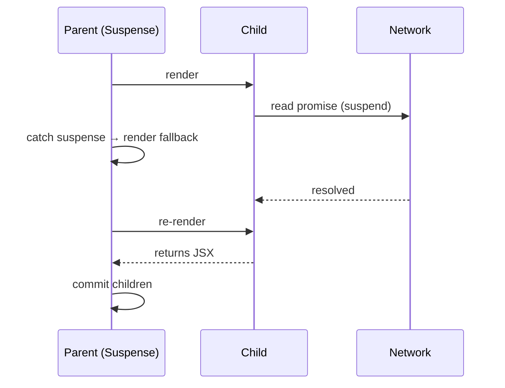

# Suspense

> **One-liner**: `<Suspense fallback={...}>` lets a child **suspend** (signal "I'm not ready") and renders the fallback in its place — originally for lazy code-splitting, now also the standard mechanism for declarative async data and streaming SSR.

---

## Quick Reference

| Boundary | Use |
|----------|-----|
| `<Suspense fallback={<X />}>` | Renders `X` while children suspend |
| What can suspend | `lazy()` components, `use(promise)` (R19), framework data hooks (TanStack `useSuspenseQuery`, RSC fetch) |
| Multiple children | First one that suspends triggers the fallback |
| Nested boundaries | Inner one catches first; outer falls back if no inner |
| With `useTransition` | Avoids fallback flicker on quick navigations |
| SSR streaming | Server emits HTML for resolved parts, streams the rest |

---

## Core Concept

`Suspense` is a declarative way to handle "something isn't ready yet." A descendant throws a special signal (originally a Promise; in React 19, `use(promise)` formalizes it). The nearest `<Suspense>` boundary catches it, renders its `fallback`, and re-tries when the promise resolves.

Three common uses:
1. **Code splitting** — `React.lazy(() => import(...))` ([[14 - Code Splitting]]).
2. **Data fetching** — `useSuspenseQuery` (TanStack), `use(promise)` (R19), or RSC `await fetch(...)`.
3. **Streaming SSR** — server sends a fast HTML shell, then streams chunks as data resolves.

The big benefit: **loading states are colocated with rendering**, not scattered through every leaf component. A page lays out its skeleton; data and chunks fill in declaratively.

---

## Diagram



---

## Syntax & API

### Lazy code split

```tsx
import { lazy, Suspense } from "react";

const Reports = lazy(() => import("./Reports"));

<Suspense fallback={<Spinner />}>
  <Reports />
</Suspense>
```

### Data fetching with `use` (React 19)

```tsx
import { Suspense, use } from "react";

function UserName({ promise }: { promise: Promise<User> }) {
  const user = use(promise);                 // suspends until resolved
  return <h1>{user.name}</h1>;
}

function Page() {
  const promise = useMemo(() => fetchUser("42"), []);
  return (
    <Suspense fallback={<Spinner />}>
      <UserName promise={promise} />
    </Suspense>
  );
}
```

### TanStack Query — `useSuspenseQuery`

```tsx
import { useSuspenseQuery } from "@tanstack/react-query";

function User({ id }: { id: string }) {
  const { data } = useSuspenseQuery({
    queryKey: ["user", id],
    queryFn:  () => fetchUser(id),
  });
  return <h1>{data.name}</h1>;   // no isLoading branch — Suspense handles it
}

<Suspense fallback={<Spinner />}>
  <User id="42" />
</Suspense>
```

### Server Components — implicit suspense

```tsx
// app/users/[id]/page.tsx (Next.js App Router)
async function UserPage({ params }: { params: { id: string } }) {
  const user = await fetchUser(params.id);     // server-side await; streams while waiting
  return <h1>{user.name}</h1>;
}
```

### Nested boundaries — granular fallbacks

```tsx
<Suspense fallback={<PageSkeleton />}>
  <Layout>
    <Suspense fallback={<HeaderSkeleton />}><Header /></Suspense>
    <Suspense fallback={<MainSkeleton />}><Main /></Suspense>
    <Suspense fallback={<SidebarSkeleton />}><Sidebar /></Suspense>
  </Layout>
</Suspense>
```

### `useTransition` + Suspense — no flicker on quick switches

```tsx
const [, startTransition] = useTransition();

<button onClick={() => startTransition(() => setId(nextId))}>
  next
</button>
<Suspense fallback={<Spinner />}>
  <UserDetail id={id} />          {/* old detail stays visible until new is ready */}
</Suspense>
```

---

## Common Patterns

```tsx
// Pattern: ErrorBoundary + Suspense (a "loader pair")
<ErrorBoundary FallbackComponent={ErrorView}>
  <Suspense fallback={<Spinner />}>
    <DataDriven />
  </Suspense>
</ErrorBoundary>
```

```tsx
// Pattern: split parallel data fetches with multiple boundaries
//        each one renders independently when its data resolves
<Suspense fallback={<UserSkeleton />}><UserHeader id={id} /></Suspense>
<Suspense fallback={<PostsSkeleton />}><UserPosts  id={id} /></Suspense>
<Suspense fallback={<FollowSkeleton />}><UserFollowers id={id} /></Suspense>
```

```tsx
// Pattern: SSR streaming (Next.js App Router)
// page.tsx is async — Next streams as Suspense boundaries resolve.
export default function Page() {
  return (
    <Layout>
      <Suspense fallback={<HeaderSkeleton />}>
        <SlowHeader />     {/* awaits DB; streamed in when ready */}
      </Suspense>
      <Articles />          {/* fast — sent immediately */}
    </Layout>
  );
}
```

---

## Gotchas & Tips

- **A bare promise from random code won't suspend.** You need `lazy()`, `use(promise)`, or a Suspense-aware library.
- **The promise must be stable across renders.** Don't create it inside the suspending component, or it never resolves (every render gets a new promise → suspends forever). Lift it, memoize it, or use a fetcher library.
- **Only one fallback per boundary.** If multiple children suspend, you see the boundary's fallback once, then everything renders together.
- **Wrap with `useTransition`** to avoid jarring fallback flashes on user-initiated navigation.
- **Errors thrown inside Suspense reach Error Boundaries**, not Suspense. Pair them.
- **`lazy()` requires a default export.** Re-wrap named exports.
- **Don't put `useEffect` data fetching under Suspense expecting it to suspend.** It doesn't — `useEffect` runs after commit, never blocks render.
- **In RSC, `await` in a server component implicitly creates a suspense point.**
- **Test with realistic latency.** Local fetches resolve too fast to see the fallback flow.

---

## See Also

- [[14 - Code Splitting]]
- [[02 - Concurrent Features]]
- [[04 - Server Components]]
- [[15 - Error Boundaries]]
