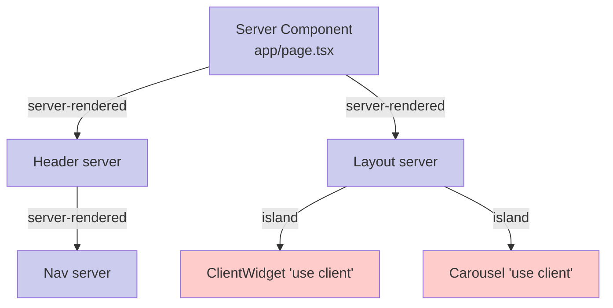

# Server Components

> **One-liner**: **React Server Components (RSC)** run on the server, never ship to the browser, can `await` data directly, and serialize their output as React elements that interleave with regular **client components** marked `"use client"`.

---

## Quick Reference

| Aspect | Server Component | Client Component |
|--------|------------------|------------------|
| Where it runs | Server (build or request time) | Browser (and SSR) |
| Marker | Default in app router | `"use client"` at file top |
| Can `await fetch` directly | ✅ | ❌ (use TanStack Query / `use`) |
| Can use hooks | ❌ (no `useState`, `useEffect`) | ✅ |
| Can use Browser APIs | ❌ | ✅ |
| Can import server-only deps (DB, fs) | ✅ | ❌ |
| Bundle size impact | **Zero** (never sent) | Adds to client bundle |
| Pass props to client child | Must be **serializable** (no functions) |
| Default in | Next.js App Router, Remix v3+ |

---

## Core Concept

Until 2023, every React component shipped to the browser. RSC introduces a second kind: components that render on the server and **never ship JS for themselves**. The server runs them, produces a tree of React elements (a special serialized format), and streams that tree to the client. The client renders it just like any other React tree — except the server portions have zero JS cost.

The model: **server components are the default**; you mark **client components** with `"use client"` at the top of the file. Server components can render client components and pass them props. Client components can render `children` that the server pre-rendered.

What server components can do:
- `await` directly (DB queries, fs, REST).
- Import server-only modules (Prisma, Redis client).
- Render *all* their JSX server-side, sending only HTML + a small payload describing client components.

What they can't do:
- Use hooks (`useState`, `useEffect`, `useContext`).
- Use browser APIs.
- Receive non-serializable props (functions, classes, JSX from the client).

---

## Diagram



---

## Syntax & API

### Server component (Next.js App Router)

```tsx
// app/users/[id]/page.tsx — runs on server
import { db } from "@/lib/db";

export default async function UserPage({ params }: { params: { id: string } }) {
  const user = await db.user.findUnique({ where: { id: params.id } });
  if (!user) return <NotFound />;

  return (
    <article>
      <h1>{user.name}</h1>
      <p>{user.bio}</p>
      <FollowButton userId={user.id} />     {/* client component */}
    </article>
  );
}
```

### Client component

```tsx
// app/components/FollowButton.tsx
"use client";

import { useState } from "react";

export function FollowButton({ userId }: { userId: string }) {
  const [following, setFollowing] = useState(false);

  return (
    <button onClick={() => setFollowing(f => !f)}>
      {following ? "Unfollow" : "Follow"}
    </button>
  );
}
```

### Composition: server can render client (and vice versa via children)

```tsx
// server
export default async function Page() {
  const items = await fetchItems();
  return (
    <ClientList>
      {items.map(i => (
        <ServerCard key={i.id} item={i} />     {/* server-rendered children */}
      ))}
    </ClientList>
  );
}

// client
"use client";
export function ClientList({ children }: { children: React.ReactNode }) {
  const [collapsed, setCollapsed] = useState(false);
  return (
    <div>
      <button onClick={() => setCollapsed(c => !c)}>Toggle</button>
      {!collapsed && children}             {/* server JSX flows in as children */}
    </div>
  );
}
```

### `server-only` / `client-only` packages

```ts
// lib/db.ts
import "server-only";        // throws if accidentally imported into a client component
import { Prisma } from "@prisma/client";
export const db = new Prisma();
```

### Streaming with Suspense

```tsx
// app/page.tsx
export default function Page() {
  return (
    <>
      <FastHeader />
      <Suspense fallback={<MainSkeleton />}>
        <SlowMain />          {/* awaits DB; HTML streams when ready */}
      </Suspense>
    </>
  );
}
```

---

## Common Patterns

```tsx
// Pattern: pass server data into a client component as props
async function Page() {
  const user = await db.user.findFirst();
  return <ProfileEditor initialUser={user} />;   // client component takes data as prop
}

"use client";
function ProfileEditor({ initialUser }: { initialUser: User }) {
  const [user, setUser] = useState(initialUser);
  // ...
}
```

```tsx
// Pattern: avoid the "client all the way down" trap
// ❌ Putting "use client" too high turns everything below into client.
// ✅ Push interactivity to the smallest leaf component.

// app/page.tsx (server)
//   ↓ renders
// <Layout> (server)
//   ↓ renders
// <FollowButton /> (client only — small, leaf)
```

---

## Gotchas & Tips

- **`"use client"` is contagious.** Anything imported by a client component becomes part of the client bundle. Keep client components small and leaf-level.
- **Server components can't use Context.** Pass data via props. (R19 RSC + `cache()` covers most "shared computation" needs.)
- **Props from server → client must be serializable.** No functions, no Dates as Date objects (use ISO strings), no class instances.
- **Server components can render client components, and vice versa via `children` props** — but you can't `import` server components from client files.
- **Don't import server-only libraries (`fs`, DB clients) from client components** — bundlers warn or fail.
- **`async` components only work as server components.** Client components can't be async functions.
- **Caching**: Next.js wraps `fetch` with smart caching/dedup; explicit `cache()` and `revalidateTag()` give finer control.
- **Frameworks needed.** RSC requires bundler integration. Use Next.js (App Router), Remix v3+, Waku, or Redwood.
- **Hydration mismatches** still apply for client components rendered inside server output.

---

## See Also

- [[03 - Suspense]]
- [[05 - Server Actions]]
- [[07 - Rendering Strategies]]
- [[08 - Next.js App Router]]
