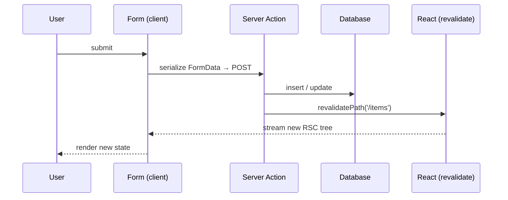

# Server Actions

> **One-liner**: A **Server Action** is an async function marked `"use server"` that you can call directly from a client component (or pass to `<form action>`); the framework wires up the network call, so writes feel like local function calls.

---

## Quick Reference

| API | Purpose |
|-----|---------|
| `"use server"` (file or fn directive) | Mark a function as a server action |
| `<form action={fn}>` | Submit form to the action; works without JS (progressive enhancement) |
| `useActionState(action, initial)` | Bind state to an action call; returns `[state, formAction, isPending]` |
| `useFormStatus()` | Inside a form, read `pending`/`data`/`method` (must be in a child of `<form>`) |
| `useOptimistic(state, reducer)` | Render an optimistic value while a mutation is in flight |
| `revalidatePath` / `revalidateTag` (Next) | Invalidate caches after a mutation |
| `redirect` (Next) | Redirect from inside an action |

---

## Core Concept

Server Actions (introduced as part of React 19 / Next.js App Router) collapse the client/server divide for **writes**. Instead of writing a client-side `onSubmit` that POSTs to a `/api/...` route handler, you write a single `async` function on the server, mark it `"use server"`, and call it from a form (or button click) on the client. The framework serializes arguments, makes the round-trip, and gives you the result back — type-safe, end to end.

The model is two complementary primitives:
- **`<form action={action}>`** — works without JavaScript (progressive enhancement). The browser submits the form natively; the server runs the action; the page re-renders.
- **`useActionState`** — wraps an action with state for client-side errors and pending status, while preserving the no-JS submit path.

`useFormStatus` and `useOptimistic` round out the toolbox: status read-out for nested submit buttons, and instant UI updates that roll back on failure.

---

## Diagram



---

## Syntax & API

### Define an action

```tsx
// app/actions/createTodo.ts
"use server";

import { db } from "@/lib/db";
import { revalidatePath } from "next/cache";
import { redirect } from "next/navigation";
import { z } from "zod";

const schema = z.object({ title: z.string().min(1).max(120) });

export async function createTodo(_prev: unknown, formData: FormData) {
  const parsed = schema.safeParse({ title: formData.get("title") });
  if (!parsed.success) {
    return { error: parsed.error.flatten().fieldErrors };
  }

  await db.todo.create({ data: parsed.data });
  revalidatePath("/todos");
  redirect("/todos");
}
```

### Use with `<form action>` (works without JS)

```tsx
// app/todos/new/page.tsx (server component)
import { createTodo } from "@/app/actions/createTodo";

export default function NewTodo() {
  return (
    <form action={createTodo}>
      <input name="title" required />
      <button type="submit">Add</button>
    </form>
  );
}
```

### Add state + pending with `useActionState`

```tsx
"use client";
import { useActionState } from "react";
import { createTodo } from "@/app/actions/createTodo";

const initial = { error: null as Record<string, string[]> | null };

export function TodoForm() {
  const [state, formAction, isPending] = useActionState(createTodo, initial);

  return (
    <form action={formAction}>
      <input name="title" required />
      {state.error?.title && <p className="err">{state.error.title.join(", ")}</p>}
      <button type="submit" disabled={isPending}>
        {isPending ? "Adding…" : "Add"}
      </button>
    </form>
  );
}
```

### `useFormStatus` — inside a child of `<form>`

```tsx
"use client";
import { useFormStatus } from "react-dom";

function SubmitButton() {
  const { pending } = useFormStatus();
  return <button type="submit" disabled={pending}>{pending ? "Saving…" : "Save"}</button>;
}
```

### Optimistic UI

```tsx
"use client";
import { useOptimistic, useTransition } from "react";
import { addTodo } from "./actions";

export function Todos({ initial }: { initial: Todo[] }) {
  const [optimistic, addOptimistic] = useOptimistic(initial, (state, t: Todo) => [...state, t]);
  const [, start] = useTransition();

  const onAdd = (title: string) => {
    start(async () => {
      const draft = { id: crypto.randomUUID(), title, done: false };
      addOptimistic(draft);                 // instant
      await addTodo(title);                 // real write; revalidate updates initial
    });
  };

  return (
    <>
      <ul>{optimistic.map(t => <li key={t.id}>{t.title}</li>)}</ul>
      <Adder onAdd={onAdd} />
    </>
  );
}
```

### Calling an action outside a form (button, RHF)

```tsx
"use client";
import { startTransition } from "react";
import { deleteTodo } from "./actions";

<button onClick={() => startTransition(() => deleteTodo(todo.id))}>x</button>
```

---

## Common Patterns

```tsx
// Pattern: action + Zod for validation, returning typed errors
type Result =
  | { ok: true; data: Todo }
  | { ok: false; fieldErrors: Record<string, string[]> };

export async function createTodo(prev: Result | null, fd: FormData): Promise<Result> {
  const parsed = schema.safeParse(Object.fromEntries(fd));
  if (!parsed.success) return { ok: false, fieldErrors: parsed.error.flatten().fieldErrors };
  const data = await db.todo.create({ data: parsed.data });
  return { ok: true, data };
}
```

```tsx
// Pattern: action shared between RHF and form action
const onSubmit = handleSubmit(async values => {
  const fd = new FormData();
  Object.entries(values).forEach(([k, v]) => fd.append(k, String(v)));
  const result = await createTodo(null, fd);
  if (!result.ok) Object.entries(result.fieldErrors).forEach(([k, msgs]) =>
    setError(k as any, { message: msgs.join(", ") })
  );
});
```

---

## Gotchas & Tips

- **Actions are HTTP endpoints under the hood.** Treat their inputs as untrusted — validate with Zod, authenticate, authorize.
- **Action inputs and outputs must be serializable.** Functions, classes, and DOM nodes won't survive the network hop.
- **`revalidatePath` / `revalidateTag`** is how you tell Next to refresh cached data after a mutation. Without it, the new state appears only after a hard reload.
- **Form actions support no-JS** — that's the point. Don't rely on client-only logic for required functionality.
- **`useFormStatus` only works in a child of `<form>`** that uses an action. Outside, it always returns idle.
- **Optimistic updates must be reversible.** If the action fails, your UI should roll back — `useOptimistic` resets when `initial` updates from revalidation.
- **You can call actions from event handlers** (not just forms), but wrap them in `startTransition` so React knows the update is non-urgent.
- **Don't expose secrets in actions.** They run on the server, but be careful about what you `console.log` (logs may be visible).
- **Type safety**: action's return type flows back through `useActionState`. Pin it with explicit types for nice ergonomics.

---

## See Also

- [[04 - Server Components]]
- [[09 - Forms Advanced]]
- [[11 - Forms at Scale]]
- [[08 - Next.js App Router]]
