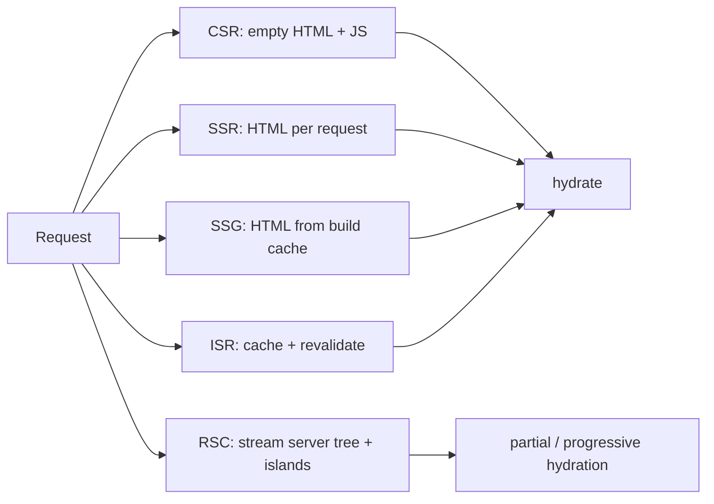

# Rendering Strategies

> **One-liner**: React apps can render in five places — **CSR**, **SSR**, **SSG**, **ISR**, **RSC** — each picks a different point in the tradeoff between fastest first paint, freshest data, lowest server cost, and richest interactivity.

---

## Quick Reference

| Mode | Where it renders | Best for |
|------|------------------|----------|
| **CSR** (Client-Side Rendering) | Browser | Pure SPAs (dashboards behind login), no SEO needed |
| **SSR** (Server-Side Rendering) | Per request, on server | Personalized pages, fresh data every time |
| **SSG** (Static Site Generation) | At build time | Blogs, marketing, docs — content rarely changes |
| **ISR** (Incremental Static Regen) | Build + on-demand revalidation | Mostly-static sites with periodic updates |
| **RSC** (React Server Components) | Server, streamed | Modern hybrid: server components + client islands |

| Concept | Mean |
|---------|------|
| **Hydration** | Client takes over server-rendered HTML, attaching listeners + state |
| **Hydration mismatch** | Server HTML ≠ client first render → React warns + replaces tree |
| **Streaming SSR** | Server flushes HTML chunks as data resolves (with Suspense) |
| **Selective hydration** | React 18 hydrates ready parts first; doesn't block on slow ones |
| **Islands** | Static HTML with isolated interactive components (Astro, RSC pattern) |

---

## Core Concept

A "rendering strategy" answers: *when and where does the HTML for a page get produced, and how does the page become interactive?*

- **CSR**: server sends an empty `<div id="root">`. The browser downloads JS, runs React, and renders. Slow first paint, but smooth navigation after. SEO requires extra work.
- **SSR**: server runs React for each request, sends full HTML. Fast first paint, fresh data, SEO-friendly. Then **hydration** attaches React on the client.
- **SSG**: same as SSR but pre-computed at build time. Files served from CDN — extremely fast and cheap.
- **ISR**: SSG with the option to regenerate a page on demand or on a timer.
- **RSC**: server components render to a special serialized format and stream to the client; client components render alongside as islands. Bundles shrink because server components don't ship JS.

In 2025 Next.js / Remix App Router, **RSC + selective rendering modes per route** is the default. You no longer pick *one* strategy — each route can be SSG, dynamic SSR, or RSC-with-streaming as needed.

---

## Diagram



---

## Syntax & API

### CSR (Vite + React Router)

```tsx
// main.tsx — empty index.html, all rendering on client
createRoot(document.getElementById("root")!).render(<App />);
```

### SSR / SSG / ISR (Next.js Pages Router — legacy but common)

```tsx
// SSR — runs per request
export async function getServerSideProps(ctx) {
  const data = await db.query(...);
  return { props: { data } };
}

// SSG — runs at build
export async function getStaticProps() {
  const data = await fs.readJson("posts.json");
  return { props: { data } };
}

// ISR — SSG + revalidation
export async function getStaticProps() {
  return { props: { data }, revalidate: 60 };  // refresh every 60s after build
}
```

### Modern Next.js App Router (RSC + per-route mode)

```tsx
// app/posts/[slug]/page.tsx — defaults to RSC
export const dynamic = "force-static";        // SSG-like
export const revalidate = 3600;               // ISR (revalidate hourly)

// or
export const dynamic = "force-dynamic";       // SSR-like (per request)

export default async function Post({ params }) {
  const post = await getPost(params.slug);    // server-side fetch
  return <Article post={post} />;
}
```

### Hydration

```tsx
// React internally — you don't call this in App Router
import { hydrateRoot } from "react-dom/client";
hydrateRoot(rootEl, <App />);
```

### Streaming SSR with Suspense

```tsx
// Next App Router — flushes HTML in chunks
export default function Page() {
  return (
    <>
      <FastHeader />
      <Suspense fallback={<Skeleton />}>
        <SlowMain />     {/* awaits 800ms; HTML appears when ready */}
      </Suspense>
    </>
  );
}
```

---

## Common Patterns

```tsx
// Pattern: per-route choice in Next App Router
// app/blog/[slug]/page.tsx       → static (SSG)
// app/dashboard/page.tsx         → dynamic (SSR per request)
// app/feed/page.tsx              → ISR with revalidate=60
// app/admin/components.tsx       → "use client" (CSR after hydration)
```

```tsx
// Pattern: avoid hydration mismatch
function ClientOnly({ children }: { children: React.ReactNode }) {
  const [mounted, setMounted] = useState(false);
  useEffect(() => setMounted(true), []);
  return mounted ? children : null;
}
// Use for content that legitimately differs server vs client (timestamps, user-agent)
```

---

## Gotchas & Tips

- **Hydration mismatches are real bugs**, not warnings to suppress. Look for: time-based content, randomness, browser-only globals, conditional content based on `window`/`navigator`.
- **CSR-only apps need SEO workarounds** (prerender service, headless browser, social-card unfurlers). RSC/SSR removes the problem.
- **SSG scales to infinity for free** (CDN edge cache). ISR is the "I want SSG but my data changes sometimes" answer.
- **Streaming SSR + Suspense** lets the user see the shell while data loads — better TTFB and perceived speed.
- **RSC reduces JS bundle dramatically**, but adds server cost. You're trading one for the other.
- **Don't fetch on the client if you can fetch on the server.** RSC + framework caching almost always wins.
- **React Native has its own renderer.** The reconciler is shared; the platform layer differs.
- **A page can be partly static and partly dynamic** in App Router — Next decides per-segment based on what you `await`.
- **Edge runtime vs Node runtime**: edge is fast and global, but limited (no Node APIs). Node is full-featured but slower and regional.

---

## See Also

- [[04 - Server Components]]
- [[03 - Suspense]]
- [[08 - Next.js App Router]]
- [[09 - Remix and React Router 7]]
