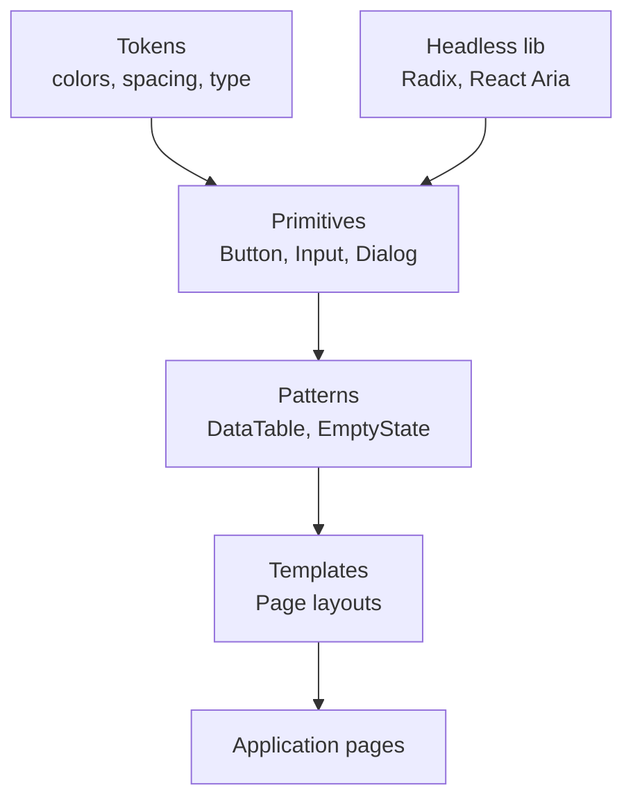

# Design Systems

> **One-liner**: A design system is **tokens → primitives → patterns → pages**, often built on **headless** component libraries (Radix UI, React Aria, Headless UI) and styled with Tailwind or CSS variables — `shadcn/ui` is the default copy-into-repo starter in 2025.

---

## Quick Reference

| Layer | What lives here |
|-------|-----------------|
| **Tokens** | Colors, spacing, type scale, radii, shadows — usually CSS variables |
| **Primitives** | Button, Input, Dialog, Tabs — accessible, unstyled (or themed) |
| **Patterns** | DataTable, Page header, Empty state — composed of primitives |
| **Templates** | Login page layout, Settings layout |
| **Pages** | Actual feature implementations |

| Approach | Library |
|----------|---------|
| Headless (you style) | **Radix UI**, **React Aria**, **Headless UI** |
| Pre-styled (Tailwind) | **shadcn/ui** (copy in), **DaisyUI**, **Park UI** |
| Pre-styled (CSS-in-JS) | MUI (Material), Chakra UI, Mantine |
| Native-feel | shadcn/ui (modern) > MUI (Material), Ant (enterprise dashboards) |
| Tools | Storybook (catalog), Figma → tokens (Style Dictionary, Tokens Studio) |

---

## Core Concept

Design systems exist to **stop reinventing every dropdown**. The 2025 sweet spot:

1. **Headless primitives** for behavior (focus management, ARIA, keyboard nav). Radix UI and React Aria solve the hard parts of UI: dialogs that trap focus, listboxes that handle arrow keys, etc. They ship no styling.
2. **Tokens as CSS variables** — themeable, instant dark mode, minimal runtime cost.
3. **Tailwind** (or CSS modules) for styling those primitives in your project's voice.
4. **`shadcn/ui`** is the breakthrough: instead of installing a styled library, you **copy components into your repo** (curated Radix + Tailwind recipes). You own them, change them, no vendor lock-in.

For "I just need a dashboard fast," use a pre-styled library (MUI, Mantine). For long-lived apps where design is part of the brand, build on headless primitives.

---

## Diagram



---

## Syntax & API

### Tokens as CSS variables

```css
/* tokens.css */
:root {
  --color-bg: 0 0% 100%;             /* HSL components for arithmetic */
  --color-fg: 222 47% 11%;
  --color-primary: 221 83% 53%;
  --color-primary-fg: 0 0% 100%;

  --space-1: 0.25rem;
  --space-2: 0.5rem;
  --space-4: 1rem;

  --radius-md: 0.5rem;
}
[data-theme="dark"] {
  --color-bg: 222 47% 11%;
  --color-fg: 0 0% 100%;
}
```

```tsx
<div style={{
  background: `hsl(var(--color-bg))`,
  color: `hsl(var(--color-fg))`,
  padding: `var(--space-4)`,
  borderRadius: `var(--radius-md)`,
}}>
  ...
</div>
```

### Headless dialog (Radix UI)

```tsx
import * as Dialog from "@radix-ui/react-dialog";

function ConfirmDelete({ onConfirm }: { onConfirm: () => void }) {
  return (
    <Dialog.Root>
      <Dialog.Trigger asChild>
        <button className="btn-danger">Delete</button>
      </Dialog.Trigger>

      <Dialog.Portal>
        <Dialog.Overlay className="fixed inset-0 bg-black/40" />
        <Dialog.Content className="fixed inset-1/2 -translate-x-1/2 -translate-y-1/2 rounded-md bg-white p-6 shadow-lg">
          <Dialog.Title className="text-lg font-bold">Delete this?</Dialog.Title>
          <Dialog.Description>This cannot be undone.</Dialog.Description>
          <div className="mt-4 flex gap-2">
            <Dialog.Close asChild>
              <button className="btn">Cancel</button>
            </Dialog.Close>
            <button className="btn-danger" onClick={onConfirm}>Delete</button>
          </div>
        </Dialog.Content>
      </Dialog.Portal>
    </Dialog.Root>
  );
}
```

### shadcn/ui style — copy in, then own

```bash
npx shadcn@latest init       # set up Tailwind + design tokens
npx shadcn@latest add button dialog dropdown-menu input
# files appear in src/components/ui/* — yours to edit
```

```tsx
// src/components/ui/button.tsx (example shape)
import * as React from "react";
import { Slot } from "@radix-ui/react-slot";
import { cva, type VariantProps } from "class-variance-authority";
import { cn } from "@/lib/utils";

const buttonVariants = cva(
  "inline-flex items-center justify-center rounded-md text-sm font-medium transition-colors focus-visible:outline-none focus-visible:ring-2 disabled:opacity-50",
  {
    variants: {
      variant: {
        default: "bg-primary text-primary-foreground hover:bg-primary/90",
        ghost:   "hover:bg-accent hover:text-accent-foreground",
        outline: "border border-input bg-background hover:bg-accent",
      },
      size: { sm: "h-8 px-3", md: "h-10 px-4", lg: "h-12 px-6" },
    },
    defaultVariants: { variant: "default", size: "md" },
  },
);

export type ButtonProps = React.ComponentPropsWithoutRef<"button"> &
  VariantProps<typeof buttonVariants> & { asChild?: boolean };

export function Button({ className, variant, size, asChild, ...props }: ButtonProps) {
  const Comp = asChild ? Slot : "button";
  return <Comp className={cn(buttonVariants({ variant, size }), className)} {...props} />;
}
```

### Storybook — catalog your primitives

```bash
npx storybook@latest init
```

```tsx
// Button.stories.tsx
import type { Meta, StoryObj } from "@storybook/react";
import { Button } from "./Button";

const meta: Meta<typeof Button> = { component: Button };
export default meta;

export const Default: StoryObj<typeof Button> = { args: { children: "Click me" } };
export const Ghost:   StoryObj<typeof Button> = { args: { children: "Ghost", variant: "ghost" } };
```

---

## Common Patterns

```tsx
// Pattern: variant API with `cva`
const badge = cva("inline-flex rounded px-2 py-0.5 text-xs", {
  variants: {
    intent: { info: "bg-blue-100 text-blue-800", warn: "bg-amber-100 text-amber-800" },
  },
});

<span className={badge({ intent: "warn" })}>Pending</span>
```

```tsx
// Pattern: theme switcher via data attribute
<html data-theme={prefersDark ? "dark" : "light"}>...</html>
// CSS variables defined per theme attr → instant theme change, no JS re-render
```

---

## Gotchas & Tips

- **Behavior is hard, styling is easy.** Always start from a headless primitive (Radix, React Aria) — don't reinvent focus traps, ARIA, keyboard nav.
- **`asChild` (Radix pattern)** lets you swap the rendered element without losing behavior. Crucial for `<Link asChild><Button>...</Button></Link>`.
- **Tokens, not magic numbers.** "Why is this padding 13px?" should never be answerable with "I dunno."
- **Dark mode = swap CSS variables.** Don't fork your styles; theme via `[data-theme="dark"]`.
- **Storybook pays off** once you have ~20 primitives. Below that, it's overhead.
- **Keep variants small.** "5 variants × 4 sizes × 3 states = 60 button shapes" → reduce.
- **Document accessibility per primitive.** "Press Tab → focus advances" should be a tested invariant.
- **shadcn/ui is the antidote to npm-update fatigue** — you own the source, no breaking changes from upstream.
- **For internal dashboards, use a batteries-included library** (Mantine, Chakra, Ant) and ship. For consumer apps, invest in a custom system.
- **Visual regression** (Chromatic, Percy + Storybook) catches unintended style changes.

---

## See Also

- [[09 - Styling]]
- [[07 - Component Composition]]
- [[20 - Accessibility]]
- [[12 - Animations]]
