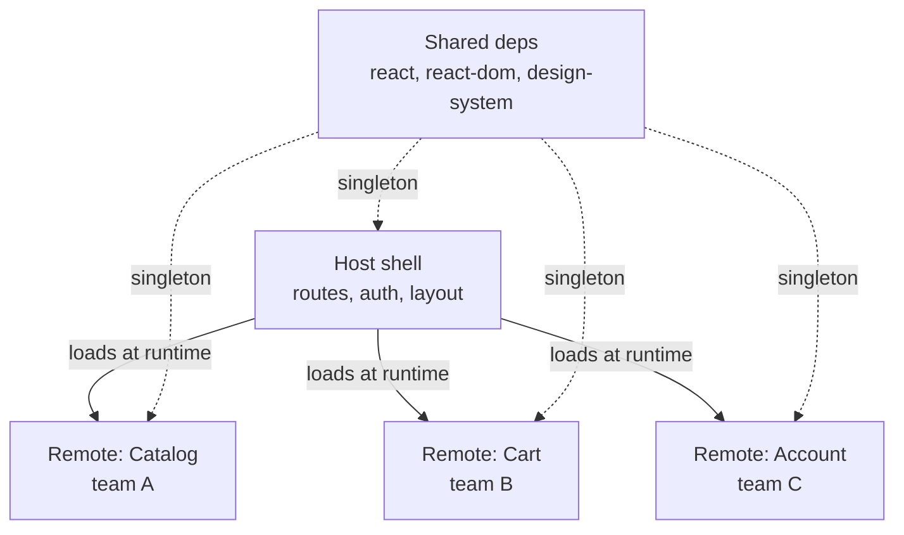

# Micro-Frontends

> **One-liner**: Micro-frontends split a single web app into independently-deployed pieces (often one per team), composed at **build time** (npm packages), **server time** (server-side includes), or **runtime** (Module Federation, single-spa, iframes) — powerful at large org scale, overkill for most teams.

---

## Quick Reference

| Composition | Tool | Tradeoff |
|-------------|------|----------|
| Build-time (monorepo packages) | Nx, Turborepo, pnpm workspaces | Simple, one deploy artifact, **not** independent deploys |
| Server-side composition | Edge Side Includes (ESI), Hypernova | Deep infra, no client orchestration |
| **Module Federation** (Webpack 5+, Rspack, Vite plugin) | `@module-federation/vite`, Webpack `ModuleFederationPlugin` | True runtime composition; shared deps; complex |
| **single-spa** | `single-spa` framework | Multi-framework apps (React + Vue + Angular cohabiting) |
| iframes | Browser native | Strong isolation; weak UX (auth, routing, height) |
| Web components | Custom Elements | Framework-agnostic; weaker prop-passing |

---

## Core Concept

A **micro-frontend** lets multiple teams deliver pieces of a single product independently — separate repos, separate CI, separate deploys, composed in the user's browser. The pitch: parallel team velocity at very large org scale.

The reality: **most teams don't need this**. Module Federation adds significant complexity around shared dependencies (one React or many?), routing (who owns the URL?), state (shared store or duplicated?), and design system drift (each team picks their own buttons).

When it earns its keep:
- **20+ teams** all touching the same large product (Amazon, Spotify scale).
- **Acquisitions** — fold a freshly-acquired app into an existing shell with minimal rewrite.
- **Multi-framework cohabitation** during a migration (legacy Angular + new React + future Solid).

For 2–5 teams, a **monorepo** (Nx, Turborepo) gives most of the benefits (independent ownership, code sharing) with far less complexity.

---

## Diagram



---

## Syntax & API

### Module Federation with Vite (`@module-federation/vite`)

```ts
// Remote (catalog) — vite.config.ts
import { defineConfig } from "vite";
import react from "@vitejs/plugin-react";
import federation from "@module-federation/vite";

export default defineConfig({
  plugins: [
    react(),
    federation({
      name: "catalog",
      filename: "remoteEntry.js",
      exposes: { "./CatalogApp": "./src/CatalogApp.tsx" },
      shared: ["react", "react-dom"],
    }),
  ],
});
```

```ts
// Host shell — vite.config.ts
import federation from "@module-federation/vite";

export default defineConfig({
  plugins: [
    federation({
      name: "host",
      remotes: {
        catalog: "http://localhost:5001/remoteEntry.js",
        cart:    "http://localhost:5002/remoteEntry.js",
      },
      shared: ["react", "react-dom"],
    }),
  ],
});
```

```tsx
// Host loads remote at runtime
import { lazy, Suspense } from "react";

const CatalogApp = lazy(() => import("catalog/CatalogApp"));

function HostShell() {
  return (
    <Layout>
      <Suspense fallback={<Spinner />}>
        <CatalogApp />
      </Suspense>
    </Layout>
  );
}
```

### single-spa (multi-framework)

```ts
// root-config.ts
import { registerApplication, start } from "single-spa";

registerApplication({
  name: "catalog",
  app: () => System.import("@org/catalog"),
  activeWhen: ["/catalog"],
});

registerApplication({
  name: "cart",
  app: () => System.import("@org/cart"),
  activeWhen: ["/cart"],
});

start();
```

### Web component as a micro-frontend (any framework can produce/consume)

```tsx
// Inside the remote: register a custom element
import { createRoot } from "react-dom/client";

class CatalogElement extends HTMLElement {
  connectedCallback() {
    const root = createRoot(this);
    root.render(<CatalogApp />);
  }
}
customElements.define("x-catalog", CatalogElement);

// Inside the host (any framework or plain HTML)
<x-catalog></x-catalog>
```

---

## Common Patterns

```ts
// Pattern: shared singleton design system + auth context
shared: {
  react:                       { singleton: true, requiredVersion: "^18.0.0" },
  "react-dom":                 { singleton: true, requiredVersion: "^18.0.0" },
  "@org/design-system":        { singleton: true },
  "@org/auth-client":          { singleton: true },
}
// Without singleton, each remote bundles its own copy → bigger downloads + duplicated state.
```

```text
Pattern: contracts between host and remote
- Host owns: routing, auth, layout chrome, telemetry sink
- Remote exposes: a default-export React component, optional bootstrap()/unmount()
- Communication: props, custom events, shared store via Context
```

---

## Gotchas & Tips

- **Shared dependency mismatches are the #1 pain.** Pin React versions across teams or accept duplicate bundles.
- **Routing is a fight.** Decide who owns the URL — usually the host. Remotes get a sub-path.
- **Auth must be centralized.** Session token in a singleton client, distributed via Context or cookies.
- **Independent deploys mean independent failure.** A broken remote should fall back gracefully — wrap in error boundaries.
- **Bundle size**: federation can shrink the host but inflate total bytes if shared deps mismatch.
- **CSS leakage** between micro-frontends is a real bug. Scope styles (CSS modules, prefixes) or use shadow DOM.
- **Design system drift** is the silent killer of UX. Mandate one design system across remotes; review with screenshots.
- **Local dev** gets harder. Multiple dev servers, port juggling, federation's hot reload quirks.
- **Module Federation is Webpack-native.** Vite support via plugin is good now (2024+) but newer; expect rough edges.
- **Sometimes a monorepo + library is enough.** Test that hypothesis before adopting MF.

---

## See Also

- [[16 - Build and Bundling]]
- [[14 - Design Systems]]
- [[08 - Next.js App Router]]
