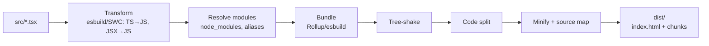

# Build and Bundling

> **One-liner**: A modern React build is **Vite + esbuild + Rollup** under the hood — esbuild for dev, Rollup for prod, with tree-shaking, minification, code splitting, source maps, and asset pipeline; you rarely write config beyond a few plugins.

---

## Quick Reference

| Tool | What it does |
|------|--------------|
| **Vite** | Dev server (esbuild) + prod build (Rollup); the default for SPAs in 2025 |
| **Webpack** | The legacy giant; still common in CRA-era apps and Module Federation |
| **esbuild** | Ultra-fast Go-based JS/TS transformer + bundler |
| **Rollup** | ES-module-native bundler with the best tree-shaking |
| **Rspack** | Webpack-compatible Rust-based bundler (faster) |
| **Turbopack** | Vercel's Rust bundler (Next.js dev mode) |
| **SWC** | Rust JS/TS compiler (Next.js production transform) |
| **Babel** | Older JS compiler (still used for some plugins) |

| Concept | Mean |
|---------|------|
| **Tree-shaking** | Eliminate unused exports from the bundle |
| **Code splitting** | Multiple output chunks loaded on demand |
| **Minification** | Strip whitespace, mangle names, drop comments |
| **Source maps** | Map minified output back to source for debugging |
| **Hot Module Replacement (HMR)** | Patch running module without full reload |
| **Asset hashing** | `app.[hash].js` for CDN immutable caching |

---

## Core Concept

The build pipeline goes: **source files → transform (TS/JSX) → resolve modules → bundle → optimize → emit**.

In dev, **speed dominates**: Vite uses esbuild's lightning transforms and serves source files as native ES modules — no bundling. Browsers fetch each module on demand. Hot Module Replacement swaps changed modules in-place.

In prod, **bundle size and runtime speed dominate**: Rollup tree-shakes, splits chunks, hashes filenames for CDN caching, and minifies. The output is a tiny `index.html` + a handful of `*.js` and `*.css` chunks.

**Tree-shaking** requires ES modules (`import`/`export`) and pure-marked code. CommonJS (`require`) defeats it. Modern libraries publish ESM builds; older ones may force you to ship dead code.

**Code splitting** happens automatically per route (with React.lazy + Suspense) and per dynamic import. Manual hints (`/* webpackChunkName: "x" */`) name chunks.

---

## Diagram



---

## Syntax & API

### Vite project setup

```bash
npm create vite@latest my-app -- --template react-ts
cd my-app
npm install
npm run dev      # esbuild dev server
npm run build    # Rollup prod build → dist/
npm run preview  # serve dist/ for sanity check
```

### `vite.config.ts` — typical add-ons

```ts
import { defineConfig } from "vite";
import react from "@vitejs/plugin-react";
import { visualizer } from "rollup-plugin-visualizer";
import tsconfigPaths from "vite-tsconfig-paths";

export default defineConfig({
  plugins: [
    react(),
    tsconfigPaths(),                 // honor tsconfig "paths" aliases
    visualizer({ open: true }),      // bundle analysis HTML
  ],
  build: {
    sourcemap: true,
    rollupOptions: {
      output: {
        manualChunks: {              // explicit shared chunk
          react: ["react", "react-dom"],
          ui: ["@radix-ui/react-dialog", "framer-motion"],
        },
      },
    },
  },
});
```

### Inspect the bundle

```bash
npm run build
# rollup-plugin-visualizer auto-opens dist/stats.html → treemap of all chunks
```

### Code splitting via dynamic import

```tsx
const Editor = lazy(() => import("./Editor"));
// → Editor.[hash].js becomes its own chunk
```

### Pre-rendering / static export with Vite

```bash
# vite-plugin-ssg, react-snap, or use a framework (Next/Remix) for production SSR
```

### Compare runtimes (build speed)

```text
On a 200-component app:
  Webpack 4 (Babel)              ~ 35–60s build, 2–6s HMR
  Webpack 5 (Babel)              ~ 25–40s build, 1–3s HMR
  Webpack 5 (SWC)                ~ 12–20s build, 0.5–1s HMR
  Vite (esbuild + Rollup)        ~  6–10s build, < 200ms HMR
  Rspack                         ~  3–6s  build, < 200ms HMR
  Turbopack (Next dev)           ~ < 1s startup, < 100ms HMR
```

### Browser targets / `tsconfig` target

```json
// tsconfig.json
{
  "compilerOptions": {
    "target": "ES2022",      // modern: smaller, faster output
    "module": "ESNext",
    "jsx": "react-jsx",      // automatic runtime
    "moduleResolution": "bundler"
  }
}
```

```json
// vite.config — browserslist via build.target
build: { target: "es2022" }
```

---

## Common Patterns

```ts
// Pattern: split heavy vendor into its own chunk
manualChunks: {
  charts: ["recharts", "d3-shape", "d3-scale"],
}

// Pattern: alias for cleaner imports
resolve: {
  alias: { "@": "/src" }
}
// then: import { Button } from "@/components/Button";

// Pattern: env vars (Vite uses VITE_ prefix)
console.log(import.meta.env.VITE_API_URL);
```

---

## Gotchas & Tips

- **Use Vite for new SPA projects.** Webpack is fine for legacy CRA migrations or where Module Federation is required.
- **CommonJS deps defeat tree-shaking.** If a library only ships CJS, the whole module ends up in your bundle. Check the visualizer.
- **Avoid `import * as X from "lodash"`.** Use `import x from "lodash/x"` or `lodash-es`.
- **Source maps in prod**: ship them but with `hidden-source-map` (browsers don't fetch them; Sentry uploads do).
- **Lock peer dependency versions** to avoid duplicate React in the bundle. Use `npm ls react` to verify exactly one.
- **Don't manually code-split tiny components.** Per-chunk overhead (HTTP, parse) eats the savings below ~30 KB.
- **Disable inline source maps in prod.** Bloat with no end-user benefit.
- **HMR breaks for non-pure modules.** A module with side effects on import causes full reload.
- **Watch `.gitignore`**: `dist/`, `node_modules/`, `.vite/` (cache), `coverage/`, `.next/`.
- **Don't bundle large static assets.** Reference them via `import url from "./big.png"` so they're separate files with hashes.

---

## See Also

- [[14 - Code Splitting]]
- [[15 - Micro-Frontends]]
- [[06 - Performance Optimization]]
