# Senior React Developer — Interview Questions & Answers

> **Scope**: 5+ years of React in production. Focus is on **trade-off analysis**, **rendering model**, **performance under load**, **server/client boundaries**, and **leadership-grade decisions** — not hook trivia.

Senior React interviews probe how you reason about the framework's *model* (rendering, reconciliation, concurrency, the server boundary) and how you make *trade-offs* (CSR vs SSR vs RSC, Context vs store, memo vs measure-first). Many of these have no single "correct" answer; the interviewer wants to hear constraints, alternatives, and the reasoning behind your pick.

---

## Table of Contents

1. [Architecture & Component Design](#architecture--component-design)
2. [Rendering, Reconciliation & Internals](#rendering-reconciliation--internals)
3. [Performance & Profiling](#performance--profiling)
4. [State Management Deep Dive](#state-management-deep-dive)
5. [Concurrent React & Suspense](#concurrent-react--suspense)
6. [Server Components, SSR & the Network](#server-components-ssr--the-network)
7. [Data Fetching at Scale](#data-fetching-at-scale)
8. [Forms, Mutations & Optimistic UI](#forms-mutations--optimistic-ui)
9. [TypeScript, Testing & Quality](#typescript-testing--quality)
10. [Build, Bundling & Delivery](#build-bundling--delivery)
11. [Observability & Production](#observability--production)
12. [Leadership, Code Review, Trade-offs](#leadership-code-review-trade-offs)

---

## Architecture & Component Design

### 1. Walk through how you'd architect a large multi-team React app.

**What the interviewer is listening for:** module boundaries, ownership, build strategy, shared design system, data layer, routing, deploy cadence.

A reasonable narrative:

1. **Monorepo with package boundaries** — pnpm/Turborepo or Nx. Each team owns one or more packages. ESLint `no-restricted-imports` enforces the dependency graph.
2. **Routing-level code splitting** — route segments map to lazy-loaded chunks. Each team owns the routes under a path prefix.
3. **Shared design system** — versioned package (`@org/ui`) with Radix/Headless UI primitives + tokens. Breaking changes go through a deprecation cycle, not a flag day.
4. **Shared data layer** — TanStack Query (or SWR / RTK Query) with conventions on query keys, stale times, and error shape. Domain-specific hooks live in the team's package.
5. **Cross-team contracts via types, not runtime** — generated TypeScript clients from OpenAPI / GraphQL schema. Compile-time errors beat runtime surprises.
6. **Independent deploys when possible** — Next.js App Router with route groups, or module federation if teams must ship on different cadences (be honest about its cost).
7. **Observability per route** — web-vitals + Sentry tagged by route owner, so the right team is paged.
8. **Architecture decision records (ADRs)** in the repo — the *reasoning* survives turnover.

The senior signals: **explicit module boundaries**, **typed contracts**, **shared primitives over shared pages**, **honest about module federation**, **deploy independence is a goal, not a default**.

```mermaid
graph TD
    Repo[Monorepo] --> UI[@org/ui<br/>design system]
    Repo --> Auth[@org/auth]
    Repo --> Data[@org/data<br/>API clients + query hooks]
    Repo --> AppA[apps/checkout]
    Repo --> AppB[apps/dashboard]
    AppA --> UI
    AppA --> Auth
    AppA --> Data
    AppB --> UI
    AppB --> Auth
    AppB --> Data
    UI --> Tokens[design tokens]
    Data --> OpenAPI[generated types<br/>from OpenAPI]
```

---

### 2. When does Module Federation earn its keep, and when is it cargo cult?

**Earns its keep:**
- Truly independent deploy cadence across teams (e.g., a host shell loaded by 5 internal apps shipping daily).
- Runtime composition where you can't rebuild the host when a remote ships.
- Long-running products where build-time monorepo coupling is genuinely impractical.

**Cargo cult:**
- "Microservices for the frontend" with one team. You bought distributed-systems problems for nothing.
- Shared React/React-DOM versions are non-negotiable across remotes — a bump becomes a coordination project.
- SSR + module federation is hard. Hydration, streaming, Suspense boundaries — every feature is an open issue.

**Cheaper alternatives** that solve 80% of the use case:
- Monorepo + route-level code splitting.
- Next.js multi-zone (separate deploys, single user-facing domain).
- iframes — unfashionable but excellent isolation when teams truly don't share a runtime.

---

### 3. How do you decide between composition, render props, and a custom hook?

The decision tree:

| Need | Reach for |
|------|-----------|
| Share *behavior/state* with no markup of its own | Custom hook |
| Share *markup structure* with consumer-controlled slots | Composition (`children`, named slots) |
| Share *markup* with deeply data-driven children | Render prop / function-as-child |
| Cross-cutting wrapper (auth gate, telemetry boundary) | HOC (still legitimate for typing wrappers) |

Hooks replaced ~80% of HOC and render-prop use cases. The remaining 20% is real: a `<Tooltip>` whose anchor is a render-prop child, a `<Form>` that uses compound components (`<Form.Field>`, `<Form.Submit>`).

**Anti-pattern:** turning every component into a render-prop "for flexibility." You've recreated jQuery plugins with a worse API.

---

### 4. Compound components — when are they worth the API complexity?

Compound components (`<Tabs>`, `<Tabs.List>`, `<Tabs.Trigger>`, `<Tabs.Panel>`) shine when:
- The relationship between subparts is implicit (selected tab → visible panel) and you want consumers to *arrange* the parts.
- You have multiple legitimate layouts of the same primitive.

They're overkill when:
- The component has one shape and consumers don't customize layout. A flat prop API (`<Tabs items={...} />`) is simpler.
- You only ship one variant. Deferred flexibility is a YAGNI tax.

State sharing: Context inside the parent. Children read via a hook (`useTabsContext()`), which throws if used outside the provider — turning a runtime mistake into an obvious error.

Senior signal: **headless primitives** (Radix, Headless UI) are the modern reference for this pattern — study them rather than reinventing.

---

### 5. How do you design a component API that ages well?

- **Props are part of your public API.** Renaming `onChange` to `onValueChange` is a breaking change. Treat them with the same care as a REST endpoint.
- **Prefer small, orthogonal props** over one big config object. `<Button variant="primary" size="md" />`, not `<Button config={{...}} />`.
- **Use `children` for markup, props for data.** A label is a string prop; rich content is `children`.
- **Polymorphism via `as` / `asChild` (Radix-style)** when consumers need to swap the rendered element without re-implementing behavior.
- **Forward refs** for any component a consumer might focus, measure, or animate. Skipping `forwardRef` paints you into a corner; React 19 makes `ref` a regular prop on function components, removing some boilerplate.
- **Don't leak implementation.** A modal that exposes its internal scroll container as a prop locks you into that DOM forever.

---

## Rendering, Reconciliation & Internals

### 6. Walk through what happens between `setState` and the DOM mutating.

1. **Schedule** — `setState` enqueues an update on the fiber for that component. React asks the scheduler to render at a priority (default = synchronous-ish, transition = lower).
2. **Render phase** — React walks the fiber tree from the dirty root. For each component, it calls the function, returning new elements. This phase is **pure and interruptible** in concurrent mode.
3. **Reconciliation** — React diffs new elements against the existing fiber tree. Same type at same key → reuse fiber, update props. Different type → unmount old, mount new.
4. **Commit phase** — React applies the changes to the DOM in one synchronous pass. Lifecycle effects (`useLayoutEffect`) run synchronously after DOM mutations but before the browser paints. Passive effects (`useEffect`) run after paint.
5. **Browser paint** — pixels.

The senior signals: render is **not** the DOM; render is reconciliation. Commit is the DOM. Concurrent React can **discard** a render that's been superseded by a higher-priority update.

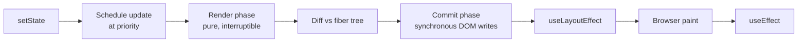
```mermaid
flowchart LR
    setState --> Schedule[Schedule update<br/>at priority]
    Schedule --> Render[Render phase<br/>pure, interruptible]
    Render --> Reconcile[Diff vs fiber tree]
    Reconcile --> Commit[Commit phase<br/>synchronous DOM writes]
    Commit --> Layout[useLayoutEffect]
    Layout --> Paint[Browser paint]
    Paint --> Passive[useEffect]
```

---

### 7. What are fibers and why did React adopt them?

A **fiber** is a JS object representing a unit of work for one element instance — its type, props, state, child/sibling pointers, hook list, effect tags. The fiber tree mirrors the element tree.

The pre-fiber reconciler (Stack reconciler) was recursive and synchronous — once it started, it ran to completion, blocking the main thread. Fiber rewrote it as a **linked-list traversal** that can:
- **Pause** between units of work and yield to the browser.
- **Abort** a work-in-progress tree if a higher-priority update arrives.
- **Reuse** the previous tree (`current`) while building the next (`workInProgress`).

This is what makes `useTransition`, `Suspense` boundaries with fallbacks, and time-slicing possible. Without fibers, none of concurrent React works.

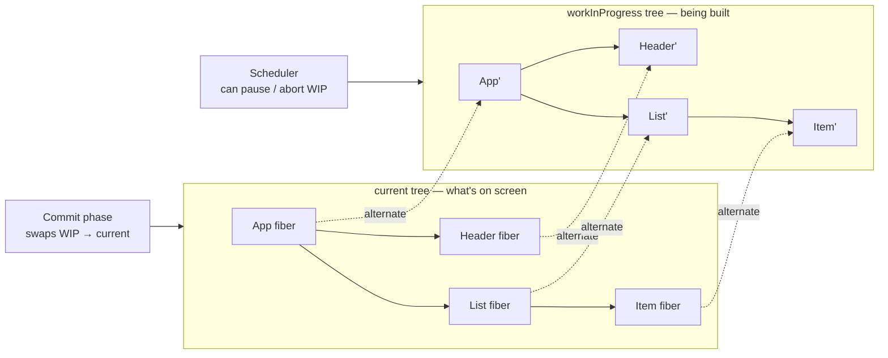
```mermaid
graph LR
    subgraph Current[current tree — what's on screen]
        C1[App fiber] --> C2[Header fiber]
        C1 --> C3[List fiber]
        C3 --> C4[Item fiber]
    end
    subgraph WIP[workInProgress tree — being built]
        W1[App'] --> W2[Header']
        W1 --> W3[List']
        W3 --> W4[Item']
    end
    C1 -.alternate.-> W1
    C2 -.alternate.-> W2
    C3 -.alternate.-> W3
    C4 -.alternate.-> W4
    Scheduler[Scheduler<br/>can pause / abort WIP] --> WIP
    Commit[Commit phase<br/>swaps WIP → current] --> Current
```

---

### 8. Why does React double-invoke components in StrictMode, and what should you do about it?

In dev, StrictMode invokes function components, hooks, and effects **twice** to surface side effects that don't belong in render or that aren't safe to re-run.

Things it catches:
- Mutations during render (`array.push(item)` inside the body).
- Effects that don't clean up (subscriptions that double-fire).
- Stale closures masked by React running the effect once in dev.

What you should do: **embrace it.** If your effect can't survive a double-invoke, it has a bug — likely missing cleanup or non-idempotent setup. The fix is the cleanup function, not "wrap in a ref to skip the second call."

The exception is when you genuinely need a one-time side effect (analytics page-view ping). Those belong outside the render tree (router-level instrumentation) or are gated by a stable id you de-dupe at the destination, not by hacking around StrictMode.

---

### 9. Explain the rules of hooks at the implementation level.

Hooks rely on **call order** to map to slots in a per-fiber linked list. On each render React walks the list in order; the first `useState` is slot 0, the second is slot 1, and so on. There's no name lookup.

This is why:
- **No conditionals around hooks** — skipping a hook on one render shifts every subsequent slot, returning the wrong state.
- **No hooks outside React functions** — there's no fiber to attach the linked list to.
- **Custom hooks compose** — a custom hook is just function inlining; its hooks join the same list at the call site's position.

The ESLint plugin (`react-hooks/rules-of-hooks` and `exhaustive-deps`) is non-optional in real projects.

---

### 10. Keys: what do they really do, and what's wrong with index keys?

A `key` tells the reconciler "this element corresponds to *that* fiber from the previous render." Without keys, React falls back to position, which is fine for stable lists but wrong for reordered, inserted, or filtered ones.

**Index keys** (`key={i}`) tell React position equals identity. When you delete the first item, every subsequent item gets a new "identity" → React reuses the wrong fibers, preserving stale state and DOM (focus, input value, animation in progress) on the wrong row.

The right key is **stable + unique within siblings**. Database IDs are ideal. Synthesized keys (`${user.id}-${tab}`) work when an ID alone isn't unique. `crypto.randomUUID()` at render time is *worse than no key* — it forces a remount every render.

When position genuinely *is* identity (a static list of literal strings), index keys are fine. Be honest about which case you're in.

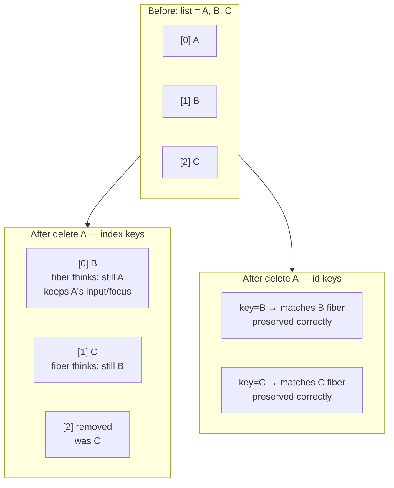
```mermaid
flowchart TB
    subgraph Before[Before: list = A, B, C]
        B0["[0] A"]
        B1["[1] B"]
        B2["[2] C"]
    end
    subgraph IdxAfter[After delete A — index keys]
        I0["[0] B<br/>fiber thinks: still A<br/>keeps A's input/focus"]
        I1["[1] C<br/>fiber thinks: still B"]
        I2["[2] removed<br/>was C"]
    end
    subgraph IdAfter[After delete A — id keys]
        D0["key=B → matches B fiber<br/>preserved correctly"]
        D1["key=C → matches C fiber<br/>preserved correctly"]
    end
    Before --> IdxAfter
    Before --> IdAfter
```

---

### 11. When you change a `key`, what happens?

Same component type with a different key → React **unmounts** the old fiber subtree (running cleanup effects, losing local state) and **mounts** a fresh one. This is the canonical "reset state on change" pattern:

```tsx
<UserProfile key={userId} userId={userId} />
```

Switching `userId` discards in-progress edits, scroll position, and animation state from the previous user. Cheaper than `useEffect(() => resetEverything(), [userId])`, and impossible to forget a field.

Don't abuse it: remounting is more expensive than a re-render, and it loses good state along with bad. Use it when "this is conceptually a different thing" — not as a band-aid for stale closures.

---

### 12. Why is calling `setState` during render usually wrong, and when is it OK?

Calling `setState` during render is **OK** as a derived-state pattern when:
- You're computing state from *props* and you've already detected the prop changed (the "store previous prop" pattern).
- The new state is computed from current state in the same render.

React tolerates this and re-renders with the new state immediately, without an intermediate paint.

It's **wrong** when it creates an infinite render loop, when you call it from inside an event handler closure passed to a child (defer to an effect or handler), or when the better solution is to *derive* the value during render without state at all (`const fullName = first + ' ' + last`).

**Senior heuristic:** before adding `useState` ask "is this derivable?" Most "state" in React apps is unnecessary state.

---

## Performance & Profiling

### 13. How do you actually find and fix a slow render?

The honest answer: **measure, don't guess.**

1. **React Profiler** — record an interaction, find the long commit, identify which components rendered and how long they took.
2. **Why did this render?** — Profiler "Why did this render?" tooltip + the React DevTools highlights flag.
3. **Performance tab** (Chrome) — see whether your time is in React render, in browser layout, in style recalc, or in script outside React.
4. **`<Profiler>` API in production** — sample real users for a few interactions and ship the data to your APM.

Once you've localized:

- Render is too long → memoize work *inside* the component (`useMemo` for the expensive calc, virtualize the long list).
- Too many components rendered → `React.memo` boundaries, stable callback identities (`useCallback`), or split context to scope re-renders.
- Long task off the React side → `startTransition` to deprioritize, web worker for true CPU work.

**Senior signal:** name the bottleneck before reaching for `memo`. "I memo'd the leaf and the parent still re-renders" is a sign the parent is the issue.

---

### 14. `useMemo` / `useCallback` / `React.memo` — what's the actual rule?

The rule is **"measure first."** Default to no memoization. Reach for it when:

- A child is wrapped in `React.memo` and you need the parent to pass stable props.
- A computation in the render body is genuinely expensive (>1ms in a profile, on representative data).
- A value is in a dependency array and instability is causing extra effect runs or re-fetches.

Memoization isn't free: every `useMemo` adds a comparison and a closure allocation. Used everywhere, it adds noise without speed.

A common failure mode: `React.memo` on a leaf that receives a fresh inline `{}` every render. The leaf compares props, sees they're "different" by identity, and re-renders anyway. Either stabilize the prop or drop the memo.

> **React Compiler** (in beta) automates much of this. If your codebase adopts it, *delete* manual memoization rather than layering both — the compiler does a better job and tracks dependencies more precisely.

---

### 15. How does `useTransition` change the perf story?

`useTransition` lets you mark a state update as **non-urgent**. React keeps the previous UI interactive while rendering the new one in the background, and *discards* the in-progress render if a higher-priority update arrives.

Concrete win: typing in a search box that filters a 10k-row list. Without transitions, every keystroke blocks the input until the list is recomputed and committed. With `startTransition(() => setQuery(value))`, the input stays responsive; the list catches up when it can.

It does **not** make the work faster. The list still takes the same total CPU. It changes *priority* — input first, list second, with a `isPending` flag for spinners.

Pair with `useDeferredValue` when you don't own the setter (e.g., a derived value from props).

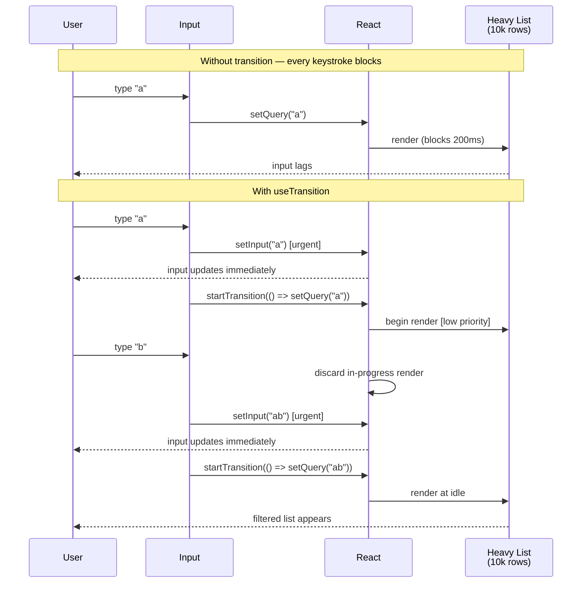
```mermaid
sequenceDiagram
    participant User
    participant Input
    participant React
    participant List as Heavy List<br/>(10k rows)

    Note over User,List: Without transition — every keystroke blocks
    User->>Input: type "a"
    Input->>React: setQuery("a")
    React->>List: render (blocks 200ms)
    List-->>User: input lags

    Note over User,List: With useTransition
    User->>Input: type "a"
    Input->>React: setInput("a") [urgent]
    React-->>User: input updates immediately
    Input->>React: startTransition(() => setQuery("a"))
    React->>List: begin render [low priority]
    User->>Input: type "b"
    React->>React: discard in-progress render
    Input->>React: setInput("ab") [urgent]
    React-->>User: input updates immediately
    Input->>React: startTransition(() => setQuery("ab"))
    React->>List: render at idle
    List-->>User: filtered list appears
```

---

### 16. List virtualization — when, and what are the gotchas?

Virtualize when:
- The list has more than a few hundred rows.
- Row height is consistent or measurable (`react-virtual` handles dynamic heights).
- The bottleneck is *DOM size*, not data fetching.

Gotchas:
- **Find-in-page (Ctrl+F)** doesn't find rows that aren't rendered. For accessibility and basic UX, this is real. Virtual lists with browser-level search require workarounds (`content-visibility: auto` is sometimes a better pick).
- **Focus loss** when a focused row scrolls out of the rendered window.
- **Sticky headers / variable rows** add complexity. Use `@tanstack/react-virtual` rather than rolling your own.
- **SEO** — content not in initial HTML won't be indexed. Don't virtualize SSR-critical content.

Cheaper alternative for moderate lists: native CSS `content-visibility: auto` + `contain-intrinsic-size`. The browser skips off-screen layout/paint without you managing windows.

---

### 17. How do you debug a "context is re-rendering everything" problem?

Context fires re-renders for **every consumer** when the value identity changes — and a fresh `{}` or array every render is identity change.

Diagnostic steps:
1. Profiler shows wide re-render fanout under a Provider.
2. Inspect the value: is it memoized? `useMemo(() => ({ user, login, logout }), [user])`.
3. Even memoized, *all* consumers re-render when *any* field changes.

Fixes (in order of preference):
- **Split the context** by update frequency. Auth user (changes rarely) vs theme (changes rarely) vs current selection (changes often) → three providers.
- **Selector pattern** via `use-context-selector` or move to a real store (Zustand, Jotai, Redux).
- **Stable references** — split actions out (rarely change) from state (often changes), in two contexts.

Senior signal: "Context is for low-frequency global values. For high-frequency state, reach for a store with selectors."


```mermaid
graph TD
    subgraph Bad[One Context, fresh value every render]
        P1[Provider<br/>value=&#123;user, theme, cart, page&#125;] -->|new ref each render| C1[Header]
        P1 -->|re-render| C2[Sidebar]
        P1 -->|re-render| C3[Cart]
        P1 -->|re-render| C4[Footer]
        P1 -->|re-render| C5[Page body]
    end
    subgraph Good[Split contexts by update frequency]
        UP[UserProvider<br/>changes rarely] --> H[Header]
        TP[ThemeProvider<br/>changes rarely] --> S[Sidebar]
        CP[CartProvider<br/>changes often] --> Cart[Cart only]
        UP --> Footer
    end
    Bad -.refactor.-> Good
```

---

### 18. Hydration mismatch — root causes and how you debug.

A hydration mismatch happens when SSR HTML doesn't match the first client render. Common causes:

- **Time-, locale-, or random-dependent rendering** — `new Date()`, `Math.random()`, `Intl.DateTimeFormat` with the user's locale.
- **Browser-only APIs in render** — `window`, `localStorage`, feature detection that returns differently server vs client.
- **Conditional rendering on `typeof window`** — SSR sees `undefined`, client sees object → different tree.
- **Invalid HTML nesting** — `<p><div></p>` gets parsed by the browser into a different tree than the server emitted.
- **Third-party scripts mutating DOM** before hydration (browser extensions, analytics).

Debug:
1. The error in dev points at the offending element.
2. `suppressHydrationWarning` is a *last* resort for genuinely-acceptable mismatches (e.g., a timestamp). Don't blanket-apply.
3. For client-only content, render `null` on server and on first client paint, then `useEffect` to flip a flag and render. Or use `<ClientOnly>` wrapper / `next/dynamic({ ssr: false })`.

Senior signal: **deterministic render is a contract**, not a suggestion. Anywhere you see `Date.now()` or `Math.random()` in a component, ask if it should be in an effect or pushed to props.

---

## State Management Deep Dive

### 19. Decide between Context, Zustand, Redux Toolkit, Jotai for a real product.

Decision factors and where each fits:

| Need | Pick |
|------|------|
| A handful of slow-changing globals (theme, user, locale) | Context |
| App-wide store, frequent updates, want selectors with no extra boilerplate | Zustand |
| Complex state machines, time-travel debugging, many devs, strict patterns | Redux Toolkit |
| Atomic state, fine-grained subscriptions, derived atoms feel natural | Jotai |
| Server cache (data from APIs) | TanStack Query / RTK Query / SWR — *not* a general store |

The most common senior mistake is putting **server data into client state**. The server is the source of truth. Use a query library; subscribe components to query results; mutate via mutations that invalidate. Your "global state" shrinks to the genuinely client-only stuff (UI mode, draft inputs, ephemeral selections).

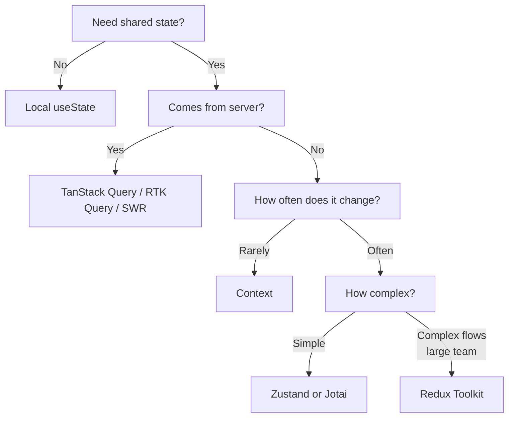
```mermaid
flowchart TD
    A[Need shared state?] -->|No| L[Local useState]
    A -->|Yes| B[Comes from server?]
    B -->|Yes| C[TanStack Query / RTK Query / SWR]
    B -->|No| D[How often does it change?]
    D -->|Rarely| E[Context]
    D -->|Often| F[How complex?]
    F -->|Simple| G[Zustand or Jotai]
    F -->|Complex flows<br/>large team| H[Redux Toolkit]
```

---

### 20. What does Redux still give you that hooks-only patterns don't?

- **Single store, single reducer pipeline** — predictable mutations, every change observable in DevTools.
- **Time-travel debugging + replay** — invaluable for bug repros in complex flows.
- **Middleware ecosystem** — RTK Query, listener middleware, sagas (legacy), persistence.
- **Strict patterns at scale** — when 30 engineers touch the same store, conventions matter more than ergonomics.

What it *costs*: more boilerplate (mitigated by RTK), an extra mental model for new hires, and the temptation to put server data in the store (use RTK Query, don't roll your own).

For a small team starting today, **Zustand or Jotai + TanStack Query** is the lighter default. Redux earns its keep on long-lived large codebases or when DevTools time-travel is genuinely used.

---

### 21. State colocation — what's the principle?

Lift state **only as high as it needs to be**. The lower the state lives, the smaller the re-render fanout and the easier it is to delete.

Process:
1. Start with `useState` in the component that uses it.
2. If a sibling needs it, lift to the nearest common parent.
3. If a deeply-nested descendant needs it, consider Context — *or* lift via composition (`children`, render props) to avoid prop drilling without making it global.

Anti-pattern: every new state goes straight into Redux "because we might need it later." Now your store is bloated, every component is coupled to it, and deletion is a coordination effort.

The senior framing: **prop drilling 2–3 levels is fine.** Reach for Context when the alternative is genuinely worse.

---

### 22. State machines (XState, useReducer) — when do they pay off?

When state has **invalid transitions**. A form that goes `idle → submitting → success | error → idle` has 4 states; a `useState` boolean tuple (`isLoading`, `isError`, `data`) has 8 representable combinations, half of which are bugs (`isLoading: true, isError: true`).

`useReducer` covers most cases — actions narrow inputs, the reducer enforces transitions. Pull in XState when:
- You need parallel states (auth status × network status × form status).
- You want a visual diagram of the machine for non-engineer review.
- Behavior is invariant-heavy and worth modeling formally.

Don't reach for XState for a 3-state component. The overhead beats the safety.

---

## Concurrent React & Suspense

### 23. Explain the mental model of Suspense.

Suspense is **a boundary that catches a thrown promise** during render. While the promise is pending, React renders the boundary's `fallback`. When the promise resolves, React re-renders the children.

Key implications:
- **Components don't track loading themselves.** A data hook *throws a promise* (or `use(promise)` in React 19) and the nearest Suspense above handles it.
- **Multiple children → one fallback.** If three siblings each suspend, the boundary stays in fallback until *all* resolve. Wrap each in its own boundary to get independent fallbacks.
- **Streaming SSR** sends the fallback HTML first, then streams the resolved chunk when ready. The user sees content progressively.
- **Suspense + `useTransition`** keeps the previous UI on screen while a new page suspends — no fallback flicker.

Suspense for data was a long road; it's now stable via React 19 + `use(promise)` in client components, and a first-class concept in RSC frameworks (Next.js, Remix).

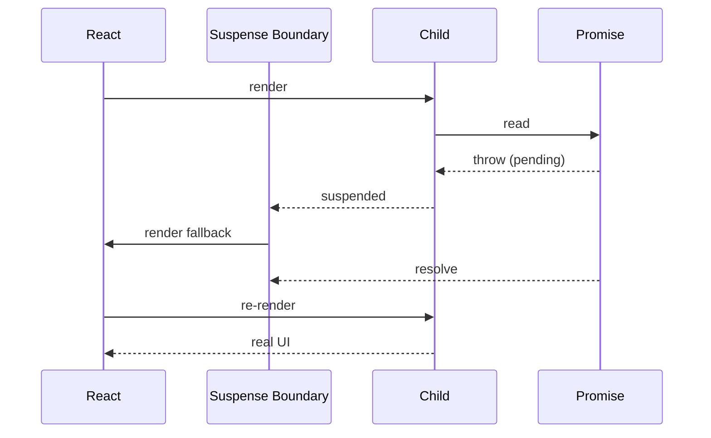
```mermaid
sequenceDiagram
    participant React
    participant Boundary as Suspense Boundary
    participant Child
    participant Promise

    React->>Child: render
    Child->>Promise: read
    Promise-->>Child: throw (pending)
    Child-->>Boundary: suspended
    Boundary->>React: render fallback
    Promise-->>Boundary: resolve
    React->>Child: re-render
    Child-->>React: real UI
```

---

### 24. `useTransition` vs `useDeferredValue` — when does each apply?

| | useTransition | useDeferredValue |
|---|---|---|
| Who triggers | You wrap the **setter call** | You wrap a **value** you receive |
| You own the setter? | Yes | Often no (props, third-party hook) |
| Returns | `[isPending, startTransition]` | The deferred value |

Practical pattern:
- **`useTransition`**: tab switch, route navigation, search filter — you control the input.
- **`useDeferredValue`**: a memoized child fed by a prop you don't control; render at lower priority while typing.

Both signal "this update is interruptible." Both keep the previous UI interactive. Neither makes the work faster.

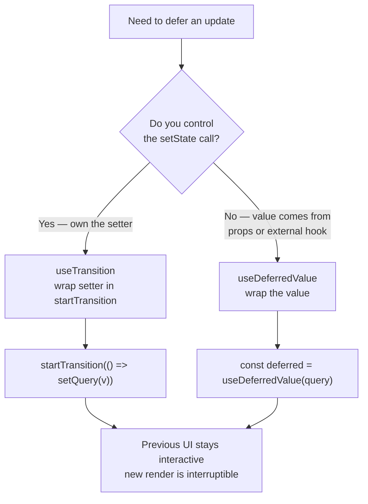
```mermaid
flowchart TD
    Start[Need to defer an update] --> Q1{Do you control<br/>the setState call?}
    Q1 -->|Yes — own the setter| UT[useTransition<br/>wrap setter in startTransition]
    Q1 -->|No — value comes from<br/>props or external hook| UD[useDeferredValue<br/>wrap the value]
    UT --> EX1["startTransition(() => setQuery(v))"]
    UD --> EX2["const deferred = useDeferredValue(query)"]
    EX1 --> Out[Previous UI stays interactive<br/>new render is interruptible]
    EX2 --> Out
```

---

### 25. What does React 19's `use(promise)` actually do?

`use` is a hook (callable conditionally, unlike others) that **reads** a promise or context. For a promise:

- If pending → throws to the nearest Suspense.
- If resolved → returns the value.
- If rejected → throws to the nearest error boundary.

This unifies Suspense and data: a server component (or React 19 client component) calls `use(fetchUser(id))`, the framework caches the promise across renders (you don't re-fetch each render), and Suspense + Error Boundary handle the loading/error states **without any state of your own**.

Caveat: in client components, you must memoize/cache the promise yourself (or use a library like TanStack Query that does). Naively calling `use(fetch(...))` in render creates a new promise every render → infinite re-fetch.

---

### 26. Suspense waterfall — how do you avoid it?

A waterfall is when one component's fetch starts only after a parent's fetch resolves, serially. Three nested components → 3× latency.

Avoid by:
- **Hoisting fetches** to the route loader / RSC root (Next.js / Remix loaders run before render and parallelize).
- **Parallel `Promise.all`** at the top of an RSC, then pass results down.
- **Prefetching** on hover / route transition (Next.js `<Link prefetch>`, TanStack Router prefetching).
- **Avoiding the trap of "data hook per component"** in client-side React — colocate where ergonomic, fetch in parallel from a route loader.

The framework matters: Next.js / Remix / TanStack Router are designed around parallel loaders to dodge this exact problem.

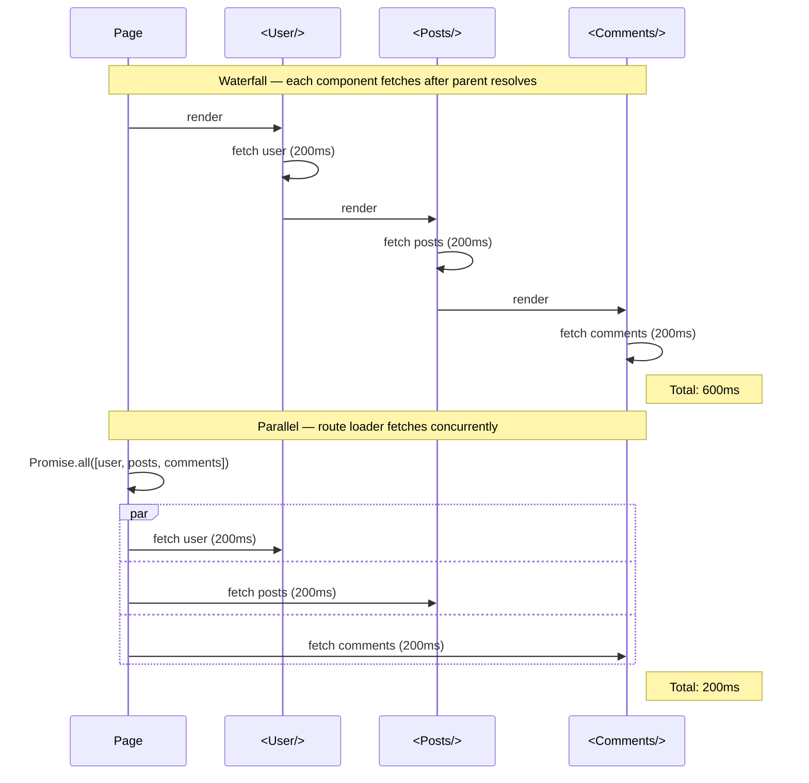
```mermaid
sequenceDiagram
    participant Page
    participant User as <User/>
    participant Posts as <Posts/>
    participant Comments as <Comments/>

    Note over Page,Comments: Waterfall — each component fetches after parent resolves
    Page->>User: render
    User->>User: fetch user (200ms)
    User->>Posts: render
    Posts->>Posts: fetch posts (200ms)
    Posts->>Comments: render
    Comments->>Comments: fetch comments (200ms)
    Note right of Comments: Total: 600ms

    Note over Page,Comments: Parallel — route loader fetches concurrently
    Page->>Page: Promise.all([user, posts, comments])
    par
        Page->>User: fetch user (200ms)
    and
        Page->>Posts: fetch posts (200ms)
    and
        Page->>Comments: fetch comments (200ms)
    end
    Note right of Comments: Total: 200ms
```

---

## Server Components, SSR & the Network

### 27. Explain the React Server Components mental model in 60 seconds.

Components are split into two kinds:

- **Server Components (default in App Router)**: run **once, on the server**, at request time. They can `await` data, read files, call DB. They render to a serialized payload — *not* HTML, but a tree of components, props, and references to client component slots. They have **no state, no effects, no event handlers**.
- **Client Components** (`"use client"` directive): the React you've always written. They run on the server during SSR (for HTML) and again on the client (for hydration + interactivity).

The boundary is one-way: a server component can render a client component (passing serializable props or *server-rendered children*), but not the reverse. A client component can include server-rendered children via `children`.

Wins: **less JS shipped** (server components have no client bundle), **direct data access** (no API needed for internal data), **streaming** (Suspense chunks stream as they resolve).

Costs: **two mental models in one codebase**, **serialization rules** (no functions, no class instances as props across the boundary), **harder to reason about caching/staleness**.

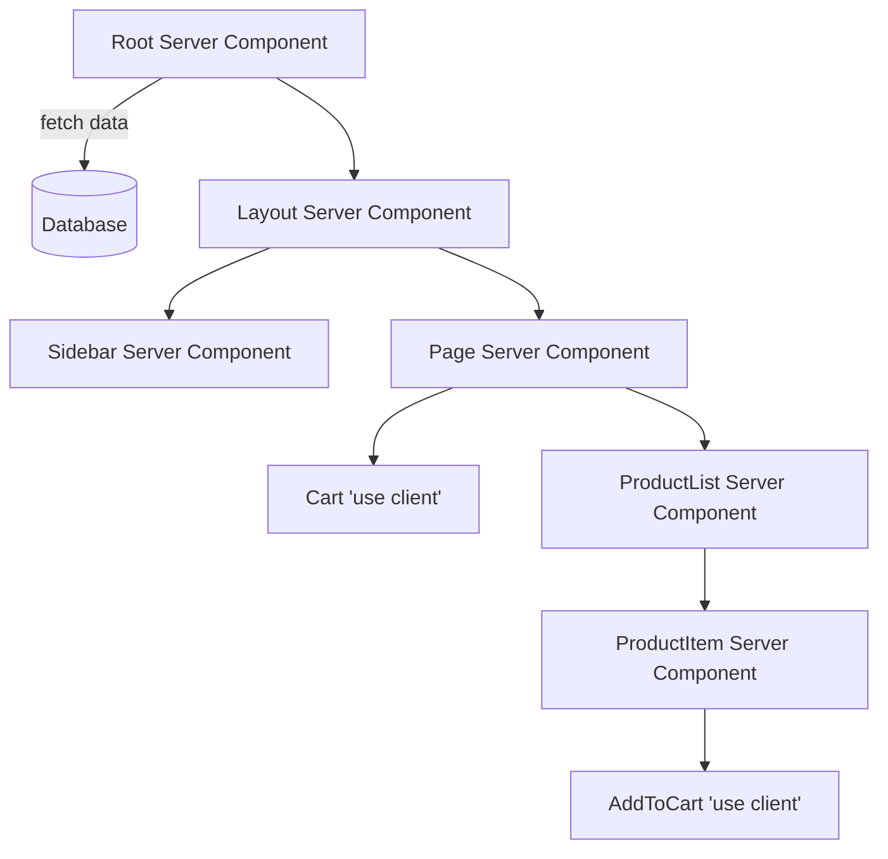
```mermaid
graph TD
    Root[Root Server Component] -->|fetch data| DB[(Database)]
    Root --> Layout[Layout Server Component]
    Layout --> Sidebar[Sidebar Server Component]
    Layout --> Page[Page Server Component]
    Page --> Cart[Cart 'use client']
    Page --> List[ProductList Server Component]
    List --> Item[ProductItem Server Component]
    Item --> AddBtn[AddToCart 'use client']
```

---

### 28. What can and can't cross the server/client boundary?

**Can cross (props from server → client component):**
- JSON-serializable values: strings, numbers, booleans, arrays, plain objects, `null`.
- Server-rendered React elements as `children`.
- Promises (React 19) — the client unwraps with `use`.
- `Date`, `Map`, `Set`, `BigInt`, typed arrays (extended JSON).

**Can't cross:**
- Functions (with one exception: server actions, which are special-cased).
- Class instances.
- Symbols (other than React-internal ones).
- DOM nodes.

**Server actions** (`"use server"`) cross the *other* way: client invokes a server function. Under the hood, the client gets a stable reference; the call becomes an HTTP POST that the framework routes to the server function. Pass arguments must be serializable.

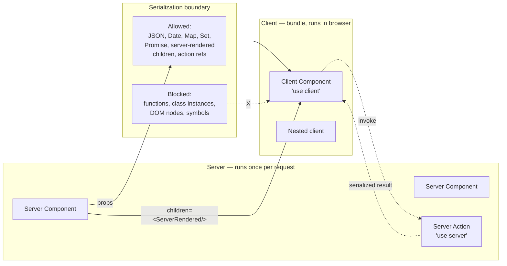
```mermaid
graph LR
    subgraph Server[Server — runs once per request]
        SC1[Server Component]
        SC2[Server Component]
        SA[Server Action<br/>'use server']
    end
    subgraph Wire[Serialization boundary]
        Props[Allowed:<br/>JSON, Date, Map, Set,<br/>Promise, server-rendered<br/>children, action refs]
        Forbidden[Blocked:<br/>functions, class instances,<br/>DOM nodes, symbols]
    end
    subgraph Client[Client — bundle, runs in browser]
        CC1[Client Component<br/>'use client']
        CC2[Nested client]
    end
    SC1 -->|props| Props
    Props --> CC1
    SC1 -->|children=&lt;ServerRendered/&gt;| CC1
    CC1 -.invoke.-> SA
    SA -.serialized result.-> CC1
    Forbidden -.X.-> CC1
```

---

### 29. CSR vs SSR vs SSG vs ISR vs RSC — when does each apply?

| Strategy | Best for | Trade-off |
|----------|----------|-----------|
| **CSR** (Vite SPA) | Auth-gated dashboards, internal tools | No SEO, slower first paint, simpler infra |
| **SSR** (per-request HTML) | Logged-in pages with personalization, dynamic SEO | Server cost per request, TTFB depends on data |
| **SSG** (build-time HTML) | Marketing, docs, blogs — content rarely changes | Rebuild per content change |
| **ISR** (cache + revalidate) | Mostly-static with periodic updates (product pages) | Cache invalidation complexity |
| **RSC** (Next App Router, soon Remix) | Hybrid: static shell + streamed dynamic islands | New mental model, ecosystem still maturing |

The senior framing: most real apps are a *mix*. A landing page is SSG, the product detail is ISR, the dashboard is SSR with RSC for data-heavy server components and client islands for interactivity. Pick per route, not per app.

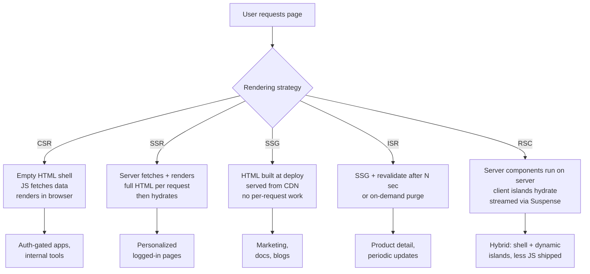
```mermaid
graph TD
    Req[User requests page] --> Strategy{Rendering strategy}
    Strategy -->|CSR| CSR[Empty HTML shell<br/>JS fetches data<br/>renders in browser]
    Strategy -->|SSR| SSR[Server fetches + renders<br/>full HTML per request<br/>then hydrates]
    Strategy -->|SSG| SSG[HTML built at deploy<br/>served from CDN<br/>no per-request work]
    Strategy -->|ISR| ISR[SSG + revalidate after N sec<br/>or on-demand purge]
    Strategy -->|RSC| RSC[Server components run on server<br/>client islands hydrate<br/>streamed via Suspense]
    CSR --> A1[Auth-gated apps,<br/>internal tools]
    SSR --> A2[Personalized<br/>logged-in pages]
    SSG --> A3[Marketing,<br/>docs, blogs]
    ISR --> A4[Product detail,<br/>periodic updates]
    RSC --> A5[Hybrid: shell + dynamic<br/>islands, less JS shipped]
```

---

### 30. What problem do Server Actions solve, and what's the catch?

The problem: a client form needs to call the server. Without actions, you write an API route (`/api/createPost`), a fetch in the client, error handling on both sides, and a way to invalidate cache.

Server Actions collapse that into a single typed function:

```tsx
// app/posts/actions.ts
"use server";
export async function createPost(formData: FormData) {
  const post = await db.posts.insert({ title: formData.get("title") });
  revalidatePath("/posts");
  return post;
}

// app/posts/new-post-form.tsx
"use client";
import { createPost } from "./actions";

export function NewPostForm() {
  return (
    <form action={createPost}>
      <input name="title" />
      <button type="submit">Create</button>
    </form>
  );
}
```

You get progressive enhancement (the form works without JS), end-to-end type safety, and built-in cache revalidation.

The catch:
- **Security:** every action is a public endpoint. Authn/authz checks belong **inside** the action body — never trust args.
- **Bundle leaks:** referencing a server-only secret in a file imported by a client component will leak it. Use `import "server-only"` to fail at build.
- **Error UX:** uncaught errors surface to the nearest error boundary; design explicitly with `useActionState` for field-level errors.
- **Framework coupling:** today, Next.js and emerging frameworks. Less portable than a REST API.

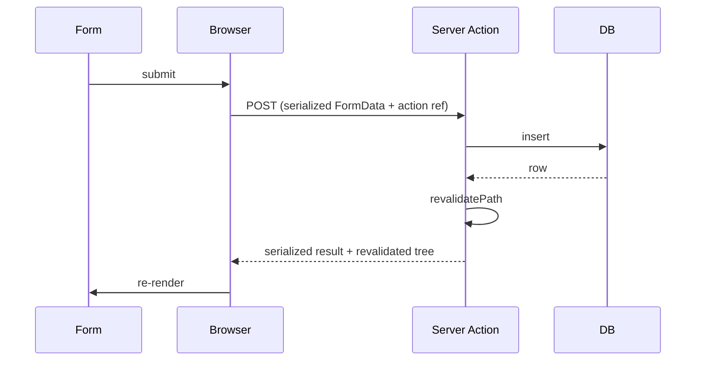
```mermaid
sequenceDiagram
    participant Form
    participant Browser
    participant Action as Server Action
    participant DB

    Form->>Browser: submit
    Browser->>Action: POST (serialized FormData + action ref)
    Action->>DB: insert
    DB-->>Action: row
    Action->>Action: revalidatePath
    Action-->>Browser: serialized result + revalidated tree
    Browser->>Form: re-render
```

---

### 31. Edge runtime vs Node runtime — how do you choose?

**Edge** (V8 isolates, run close to the user): excellent for low-latency, lightweight handlers — auth checks, A/B routing, geolocation-aware redirects, simple SSR with KV reads.

**Node** (full Node API): when you need filesystem, native modules, large dependencies (Prisma was edge-incompatible for years), or long-running operations.

Constraints to remember at the edge:
- No Node-only APIs (`fs`, `child_process`, native crypto modules).
- Bundle size limits (~1–4 MB depending on platform).
- Cold start is faster than serverless Node, but per-request CPU is metered tightly.
- Database drivers — TCP-based PG/MySQL drivers don't work; use HTTP-based proxies (Neon, PlanetScale, Hyperdrive).

Senior signal: **the edge isn't free.** A single slow database query at the edge is worse than a fast query from a co-located Node region. Pick edge for handlers that finish in <50ms and don't need a real DB connection.

---

### 32. Streaming SSR — what does it actually buy you?

Streaming flushes HTML to the browser **as it's generated**, instead of waiting for the entire page. Combined with Suspense:

1. Server sends the shell + fallbacks immediately.
2. Browser starts rendering, downloading CSS/JS in parallel.
3. As each Suspense boundary's data resolves, the server streams the resolved HTML + a tiny script that swaps the fallback.

What you gain: **TTFB is bounded by your shell**, not your slowest data. First contentful paint happens with placeholders; the slowest section doesn't block the fastest.

What you give up: **harder caching** (CDN-level caching of streamed responses requires care), **harder error handling** (an error after headers are sent can't change status code; design error boundaries inside Suspense).

Senior signal: streaming helps when you have a *visible shell* and *out-of-band slow chunks*. A page that's just "load everything then render" doesn't benefit.

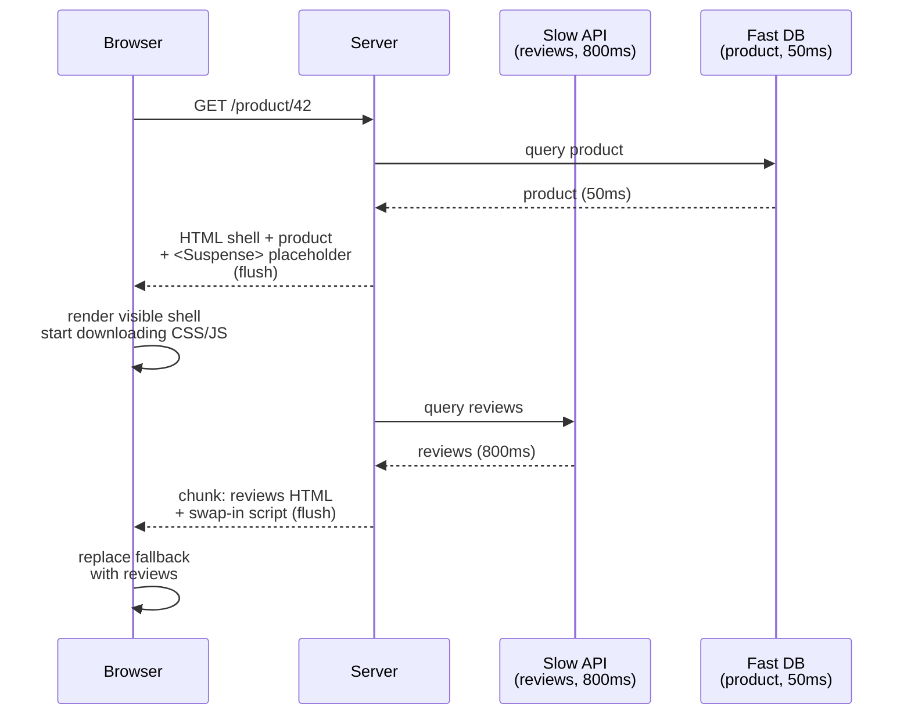
```mermaid
sequenceDiagram
    participant Browser
    participant Server
    participant SlowAPI as Slow API<br/>(reviews, 800ms)
    participant FastDB as Fast DB<br/>(product, 50ms)

    Browser->>Server: GET /product/42
    Server->>FastDB: query product
    FastDB-->>Server: product (50ms)
    Server-->>Browser: HTML shell + product<br/>+ <Suspense> placeholder<br/>(flush)
    Browser->>Browser: render visible shell<br/>start downloading CSS/JS
    Server->>SlowAPI: query reviews
    SlowAPI-->>Server: reviews (800ms)
    Server-->>Browser: chunk: reviews HTML<br/>+ swap-in script (flush)
    Browser->>Browser: replace fallback<br/>with reviews
```

---

## Data Fetching at Scale

### 33. Walk through the lifecycle of a TanStack Query.

1. **Query key** uniquely identifies the data (`['user', userId]`).
2. **First mount with this key** → status `loading`, fires the query function.
3. **Resolves** → status `success`, data cached against the key, all components subscribed to this key re-render.
4. **`staleTime` window** → next mount returns cached data immediately, no fetch.
5. **After `staleTime`** → cached data still served, but a background refetch fires (`isFetching: true`, `data` is the previous value). UI doesn't flicker.
6. **`gcTime` after last unmount** → data evicted from cache.
7. **Mutations + invalidation** → `queryClient.invalidateQueries(['user'])` marks matching queries stale; active subscribers refetch.

Why teams adopt it: most "data fetching code" you'd write by hand (loading flags, error states, refetch on focus, dedupe in-flight requests, cache, optimistic updates) is already there.

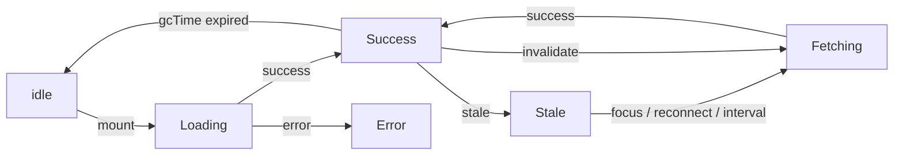
```mermaid
flowchart LR
    Idle[idle] -->|mount| Loading
    Loading -->|success| Success
    Loading -->|error| Error
    Success -->|stale| Stale
    Stale -->|focus / reconnect / interval| Fetching
    Fetching -->|success| Success
    Success -->|invalidate| Fetching
    Success -->|gcTime expired| Idle
```

---

### 34. Designing query keys at scale — what conventions hold up?

A few that survive 100+ queries:

- **Hierarchical arrays**, not strings. `['posts', { authorId, status }]` allows partial invalidation: `invalidateQueries({ queryKey: ['posts'] })` matches everything under `posts`.
- **Object filters in a single position**, not spread across keys. Inconsistent ordering produces cache misses.
- **A `queryKeys` factory module** per feature, exporting builders: `postKeys.detail(id)`, `postKeys.list({ authorId })`. Refactors stay safe.
- **Don't include user identity** in keys when the QueryClient is per-user (sign-out clears the client). Do include it when one client serves multiple identities.

Mutation invalidation: prefer **targeted** (`postKeys.detail(id)`) over **wide** (`postKeys.all`). Wide invalidations cascade refetches across the app.

---

### 35. Optimistic updates — when do they pay off and how do you do them safely?

Pay off when the action is **likely to succeed and slow to confirm** — likes, follows, marking read, drag-to-reorder. The user sees instant feedback; the rare failure rolls back.

The safe pattern (TanStack Query):

```tsx
useMutation({
  mutationFn: api.toggleLike,
  onMutate: async (postId) => {
    await queryClient.cancelQueries({ queryKey: postKeys.detail(postId) });
    const previous = queryClient.getQueryData(postKeys.detail(postId));
    queryClient.setQueryData(postKeys.detail(postId), (old) => ({
      ...old,
      liked: !old.liked,
      likeCount: old.likeCount + (old.liked ? -1 : 1),
    }));
    return { previous };
  },
  onError: (_err, postId, ctx) => {
    queryClient.setQueryData(postKeys.detail(postId), ctx?.previous);
  },
  onSettled: (_d, _e, postId) => {
    queryClient.invalidateQueries({ queryKey: postKeys.detail(postId) });
  },
});
```

The four moves: **cancel** in-flight, **snapshot** for rollback, **apply** the optimistic patch, **reconcile** on settle.

Don't use optimistic updates for actions with strong server-side validation that the client can't predict (creating an order with stock that may have run out).

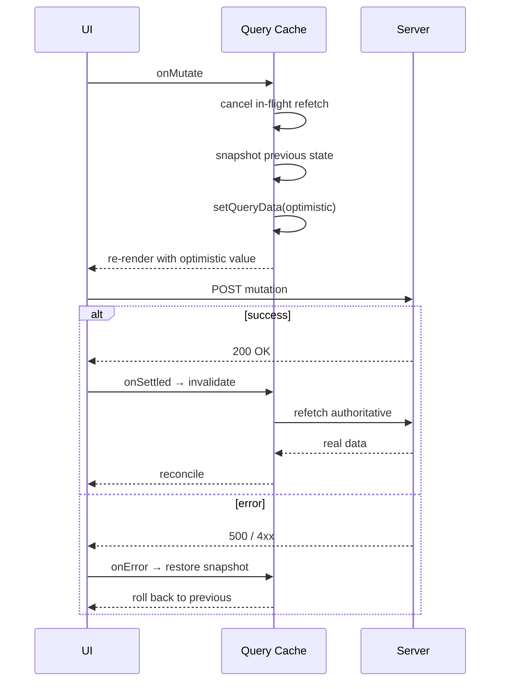
```mermaid
sequenceDiagram
    participant UI
    participant Cache as Query Cache
    participant Server

    UI->>Cache: onMutate
    Cache->>Cache: cancel in-flight refetch
    Cache->>Cache: snapshot previous state
    Cache->>Cache: setQueryData(optimistic)
    Cache-->>UI: re-render with optimistic value
    UI->>Server: POST mutation
    alt success
        Server-->>UI: 200 OK
        UI->>Cache: onSettled → invalidate
        Cache->>Server: refetch authoritative
        Server-->>Cache: real data
        Cache-->>UI: reconcile
    else error
        Server-->>UI: 500 / 4xx
        UI->>Cache: onError → restore snapshot
        Cache-->>UI: roll back to previous
    end
```

---

### 36. GraphQL vs REST + TanStack Query for a new project — how do you decide?

**REST + TanStack Query** is the default. It's lighter, simpler, plays well with HTTP caching, and the TanStack ecosystem covers most of what GraphQL clients give you.

**GraphQL (Apollo, urql, Relay)** earns its keep when:
- The frontend genuinely needs custom field selection per screen (mobile + web with different bandwidth / view requirements).
- You have many clients consuming one backend, and per-client over-fetching is a real cost.
- Schema-first ergonomics, codegen, and fragment colocation are valued by the team.

**Trade-offs to be honest about:**
- HTTP caching is harder with GraphQL (everything is POST). You lean on the client cache.
- N+1 on the resolver side is easy to introduce, hard to spot.
- `Relay` is powerful but opinionated; team buy-in matters.
- `tRPC` is a third option for TS-only stacks: end-to-end types without schema or HTTP layer ceremony.

---

## Forms, Mutations & Optimistic UI

### 37. Controlled vs uncontrolled — what's your default?

- **Uncontrolled (`defaultValue` + `ref` or FormData)** for simple forms with submit-time validation. Lower JS, no per-keystroke renders, native browser features (autofill, password manager) work cleanly.
- **Controlled** when you need real-time validation, conditional fields, dynamic lists, or to mirror state into another part of the UI.

For non-trivial forms, use **React Hook Form**. It's mostly uncontrolled under the hood (refs) with a controlled-feeling API. Combined with **Zod**, you get one schema for client validation, server validation (server actions or APIs), and TS types.

Avoid: writing 40 `useState` calls for one form. That's a sign you needed RHF or `useReducer` 30 fields ago.

---

### 38. With Server Actions, how do you handle field-level errors and pending state?

`useActionState` (React 19, formerly `useFormState`) is the bridge:

```tsx
"use client";
import { useActionState } from "react";
import { createPost } from "./actions";

export function NewPostForm() {
  const [state, formAction, isPending] = useActionState(createPost, { errors: {} });
  return (
    <form action={formAction}>
      <input name="title" aria-invalid={!!state.errors?.title} />
      {state.errors?.title && <p role="alert">{state.errors.title}</p>}
      <button disabled={isPending}>{isPending ? "Saving…" : "Save"}</button>
    </form>
  );
}
```

The action returns the new state (errors, success values). `useFormStatus` inside the form lets nested children read `pending` without prop drilling.

Validate with a shared Zod schema on both sides. The action body re-validates (never trust the client) and shapes the response to drive `useActionState`.

---

### 39. Multi-step wizards — what's a clean architecture?

Three approaches, each with a fit:

1. **One form, multiple visual steps.** `react-hook-form` keeps state across steps; each step renders a subset of fields. Validation per step on `Next`. Single submit at the end. Best when the steps are linear and short.
2. **Per-step server persistence.** Each step's `Next` POSTs and persists; refresh-safe, deep-linkable, abandonment is recoverable. Use when the form is long, contains payments, or compliance demands an audit trail.
3. **State machine** (XState) for branching wizards where step N depends on choices in step M. Worth the overhead when you have non-linear flows.

For all three: **do not put draft form state in Redux/Zustand** unless the user expects it across navigations. Form state is local; persist deliberately.

---

## TypeScript, Testing & Quality

### 40. Type a polymorphic component (`as` prop) without making consumers cry.

The pattern:

```tsx
import { ElementType, ComponentPropsWithoutRef, Ref } from "react";

type ButtonOwnProps<E extends ElementType = "button"> = {
  as?: E;
  variant?: "primary" | "secondary";
};

type ButtonProps<E extends ElementType> = ButtonOwnProps<E> &
  Omit<ComponentPropsWithoutRef<E>, keyof ButtonOwnProps>;

export function Button<E extends ElementType = "button">({
  as,
  variant = "primary",
  ...rest
}: ButtonProps<E>) {
  const Tag = as || "button";
  return <Tag data-variant={variant} {...rest} />;
}

// usage: TS knows `to` is required when as="a" (with router Link types)
<Button>plain</Button>
<Button as="a" href="/x">link</Button>
```

The senior nuance: full polymorphic typing (with `ref` forwarding and full prop inference) is verbose. **Radix's `asChild` pattern** is often a better trade — the consumer renders their own element as a child, the wrapper merges behavior via `Slot`. Less type gymnastics, more flexibility.

---

### 41. What makes a React test resilient vs flaky?

Resilient:
- **Query by what users see** — `getByRole('button', { name: /save/i })`, not `getByTestId`.
- **`findBy*` for async** appearance, never `setTimeout` + `getBy*`.
- **`userEvent`, not `fireEvent`** — simulates real interactions (focus, key sequences).
- **MSW** to intercept network at the boundary, instead of mocking individual modules. Tests look like the real network round-trip.
- **Avoid asserting on implementation** (state shape, internal classnames). Test behavior — what the user sees and can do.

Flaky causes:
- Snapshot tests for components that legitimately change. Snapshots have a place (small, stable bits of output); whole-tree snapshots rot fast.
- Real timers for animations — use fake timers and advance them.
- Real network — flake city. MSW.
- Tests sharing state across test cases — reset stores, reset cache between tests.

---

### 42. How do you test React Server Components / actions?

It's still a moving target.

For **logic inside server components and actions**, prefer extracting the data + validation into plain TS functions and unit-test them — leave only the JSX shell in the RSC.

For **integration**, the maturing answer is:
- **Playwright** for end-to-end, including server actions (real browser → real server).
- **Vitest with `@testing-library/react`** for client components.
- Framework-specific tooling (Next.js test-runner integrations) is improving but not yet at the polish of client-side tests.

Senior signal: don't try to mock the React server runtime. The boundary is the integration; test it end-to-end.

---

## Build, Bundling & Delivery

### 43. Vite vs Next.js vs Remix — which when?

- **Vite (SPA)**: best for app-like products, internal tools, dashboards behind auth. Simplest mental model. No SSR by default. Pair with TanStack Router for type-safe routing or React Router 6+.
- **Next.js (App Router)**: best for products that mix marketing + app, need RSC + Server Actions, want Vercel's deploy pipeline (or self-hosted with care). Most mature ecosystem.
- **Remix / React Router 7**: best for product-y apps where the "loaders + actions + nested routes" model fits the team's mindset; framework-agnostic deploys, web-platform-aligned.

Picking: **what's the dominant use case** — interactive app behind login (Vite or Remix), or content + app hybrid with SEO and personalization (Next.js)?

---

### 44. How do you analyze and reduce bundle size?

1. **Visualize first.** `vite-bundle-analyzer`, `next-bundle-analyzer`, `rollup-plugin-visualizer`. Find the fattest dependencies.
2. **Route-level code splitting.** `React.lazy` + `Suspense`, or framework-native (Next.js / Remix do this by default).
3. **Tree-shake aggressively.** Avoid `import * as`. Use ESM-only packages where possible. Audit `sideEffects: false` claims.
4. **Replace heavy deps.** `date-fns/esm` or `dayjs` instead of moment; `lodash-es` per-method imports or native; `zod` is small but full Joi is large.
5. **Defer truly optional code.** Charts, rich editors, PDF viewers — dynamic import at the moment of use.
6. **Audit polyfills.** `core-js` ballooning means your browserslist target is too low.
7. **Server-render and ship less JS** for content routes. RSC takes this further — server components don't ship at all.

Set a budget. CI fails if a route's JS > N kB. Without a budget, regressions ship every sprint.

---

### 45. CSS strategy — Tailwind vs CSS Modules vs CSS-in-JS?

| | Best at | Watch out for |
|---|---|---|
| **Tailwind** | Velocity, design-system enforcement via constraints, no runtime cost | Class noise in JSX, content-purge config matters, theming has nuance |
| **CSS Modules** | Scoped CSS without runtime, plays well with SSR and RSC | More boilerplate, no design constraints by default |
| **vanilla-extract / Panda** | Type-safe, zero-runtime, great with RSC | Build complexity, learning curve |
| **Emotion / styled-components** | Dynamic styling from props, established patterns | Runtime cost, RSC-incompatible (must be in client components), SSR bundle work |

For new projects today, **Tailwind + CVA (class-variance-authority)** or **vanilla-extract + tokens** are strong defaults. Runtime CSS-in-JS is increasingly hard to recommend post-RSC; Emotion/styled-components are still fine in pure client SPAs.

---

### 46. PWA, service workers, offline — when is it worth it?

PWA pays off when:
- Repeat-visit users on mobile would benefit from a native-feeling install.
- Offline reads (cached articles, last-viewed dashboard) genuinely improve UX.
- You have a content-heavy site where cache-first delivery beats network-first on TTI.

Beware:
- **Service worker debugging is brutal.** Stale SW serving stale assets is the canonical "why isn't my deploy live" problem.
- **Cache invalidation strategies** matter: immutable filenames + versioned manifest is the safe pattern.
- **PWA isn't a substitute for a native app** for camera, background sync, push notifications on iOS (Apple's PWA support trails).

Use Workbox or the framework's PWA plugin (`vite-plugin-pwa`, `@serwist/next`) — don't hand-roll.

---

## Observability & Production

### 47. What does "good observability" look like for a React app?

Three layers:

1. **Errors** — Sentry (or equivalent) catching uncaught exceptions, promise rejections, and React errors via error boundaries. Source maps uploaded so stack traces are readable. Release tagging so you know which deploy a spike came from.
2. **Web vitals** — LCP, INP (replaced FID), CLS. Sample real users (`web-vitals` library → POST to your collector or use a vendor RUM). Aggregate by route.
3. **Custom telemetry** — interaction tracking (form submit, mutation success/failure), feature flag exposure, client-side performance marks (`performance.mark` + `performance.measure`).

Senior signals:
- **Tag every event with route + release**, so the right team is notified.
- **Sample, don't ship 100%.** RUM data is large; 5–10% sampling is plenty for most metrics.
- **Session replay** (Sentry Replay, FullStory) is gold for "I can't repro this" bugs but is a privacy and bandwidth cost — gate by feature.

---

### 48. INP regression — how do you debug?

INP (Interaction to Next Paint) measures the worst input-to-paint latency the user experienced. A regression usually means one or more interactions block the main thread.

Workflow:
1. **Web Vitals report** (Chrome UX report or your RUM) — which interactions, which pages.
2. **Performance tab + Interactions track** — record locally, find the long task.
3. **Identify the cause:**
   - Synchronous expensive computation in an event handler → move to `startTransition` or off the main thread.
   - Big render fanout from a state change → split context, narrow subscriptions, virtualize.
   - Third-party script blocking (analytics, A/B testing) → defer, use partytown, or kill it.
   - Layout thrash from reading layout in a loop → batch reads, use `requestAnimationFrame`.

`useTransition` is a hammer that often fixes "input lag" because it lets the input update commit before the heavy render does.

---

### 49. Error boundaries — where do they go and what do they show?

Error boundaries catch errors during render, in lifecycle methods, and in the constructors of the whole tree below them. They **don't** catch:
- Event handlers (use try/catch + an error reporter manually).
- Async code (rejected promises bubble to `window.onunhandledrejection`).
- Errors thrown during their own rendering.

Where to place:
- **Root boundary** for "the app crashed, here's a refresh button + report sent to Sentry."
- **Per-route boundary** so a broken sub-page doesn't whitewash the shell.
- **Per-feature boundary** for risky third-party widgets or experimental components (chart libs that occasionally throw on weird data).

Use `react-error-boundary` for hooks-friendly API + reset support. Always log to your error tracker in `onError`. The fallback should let the user **recover** (retry, go home), not just say "something went wrong."

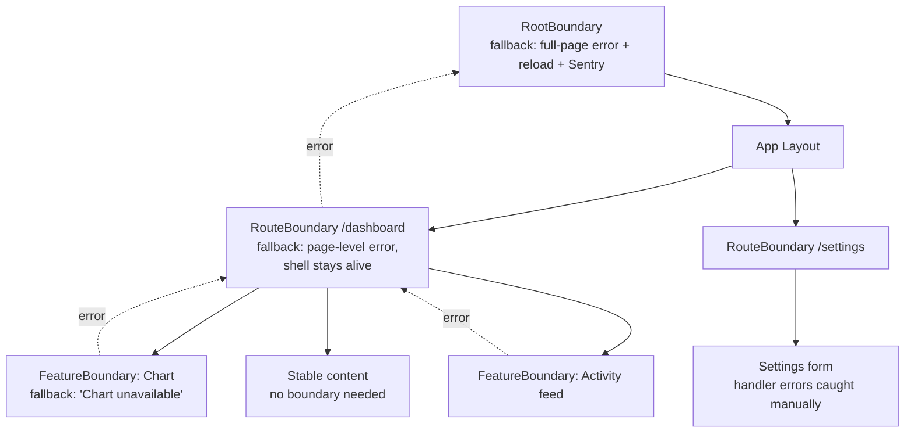
```mermaid
graph TD
    Root[RootBoundary<br/>fallback: full-page error + reload + Sentry] --> Layout[App Layout]
    Layout --> RouteA[RouteBoundary /dashboard<br/>fallback: page-level error,<br/>shell stays alive]
    Layout --> RouteB[RouteBoundary /settings]
    RouteA --> Widget1[FeatureBoundary: Chart<br/>fallback: 'Chart unavailable']
    RouteA --> Widget2[FeatureBoundary: Activity feed]
    RouteA --> Stable[Stable content<br/>no boundary needed]
    RouteB --> Form[Settings form<br/>handler errors caught manually]
    Widget1 -.error.-> RouteA
    Widget2 -.error.-> RouteA
    RouteA -.error.-> Root
```

---

## Leadership, Code Review, Trade-offs

### 50. How do you run a React-focused code review?

A senior reviewer's checklist (in priority order):

1. **Correctness around React's model:** missing dependency arrays, stale closures, `setState` in render without guard, mutating state, key bugs.
2. **Boundary placement:** is this a server or client component? Is `"use client"` higher than necessary, dragging server logic into the client bundle?
3. **State location:** is this server cache pretending to be client state? Is local state in a global store for no reason?
4. **Performance smell:** unstable inline objects/callbacks across `React.memo` boundaries, Context value not memoized, list without virtualization that will grow.
5. **Accessibility:** semantic HTML, focus management on modal/route changes, keyboard reachability, `aria-*` only when semantics aren't enough.
6. **Test coverage of the *behavior*, not the implementation.**
7. **API design** of new components — naming, prop shape, future extensibility.
8. **Bundle impact** — new heavy dep? Did the author check?

What I *don't* burn time on: stylistic preferences ESLint/Prettier already enforce. Bike-shedding the file location of a hook.

---

### 51. How do you onboard a senior backend engineer to React without them learning every footgun the hard way?

A condensed onboarding path:

1. **Mental model first.** "Components are pure functions of props + state. Every render is a new function call." Two days of grokking this beats two weeks of debugging stale closures.
2. **The hooks rules and *why*.** Show the linked-list-by-call-order implementation. They'll never violate the rules again.
3. **The render → commit → effect timeline.** With a sequence diagram. Every confusing bug they'll hit traces back to this.
4. **What lives where:** server cache (TanStack Query), client state (component or store), URL state (router). Show the decision tree.
5. **The team's component conventions** + the design system docs.
6. **Pair on a non-trivial PR.** Throw them at a real ticket with a senior reviewer.

What I skip in week 1: Suspense internals, RSC nuances, the React Compiler. Layer those after the foundation is solid.

---

### 52. Make the case (or counter-case) for adopting RSC mid-project.

**Case for:**
- Bundle size is a measured problem, especially on key landing routes.
- You're already on Next.js (App Router) or Remix is on the roadmap.
- A meaningful share of pages are read-heavy (lists, details) that would benefit from server-side data + zero JS.
- Team has the bandwidth to learn the model and refactor incrementally.

**Case against:**
- Tight deadlines, no slack for a model shift.
- App is highly interactive throughout (a designer tool, an IDE) — RSC's wins are smaller, the model is more friction.
- Heavy investment in CSS-in-JS (Emotion, styled-components) that doesn't compose with RSC — refactor cost is non-trivial.
- Team has no Next.js / Remix experience and adoption would mean two large changes at once.

Migration shape: **start at the leaves** — convert leaf data-fetching components to server components, leave interactive shells alone, wrap the boundary with `"use client"` where needed. You don't need to flip the whole app.

---

### 53. Architecture Decision Records — what should one look like?

Short, dated, immutable. Numbered. ~1 page.

```markdown
# ADR 0014 — Pick TanStack Query as the data-fetching layer

## Status
Accepted, 2026-04-22.

## Context
We have ~30 pages making fetch calls with hand-rolled loading/error/cache.
Bug rate is high (race conditions, no dedupe), and onboarding takes too long.

## Decision
Adopt TanStack Query as the standard data-fetching layer for all client components.
Establish queryKey conventions per feature module.

## Alternatives
- RTK Query — already use Redux for one slice; would force broader Redux adoption.
- SWR — comparable; chose TanStack for richer mutation/devtools support.
- Roll our own — rejected; reinvents what's solved.

## Consequences
+ Removes ~600 lines of boilerplate.
+ Devtools surface bugs faster.
- One more dep, one more thing to learn.
- Need to write queryKey conventions doc + lint to enforce.
```

ADRs go in the repo, numbered, never edited (only superseded by new ADRs). The *why* is the durable artifact.

---

### 54. Build vs buy on the frontend.

| Factor | Build | Buy |
|--------|-------|-----|
| Core to product differentiation | ✅ | |
| Commodity (auth, analytics, error tracking) | | ✅ |
| Available off-shelf is good enough | | ✅ |
| Time-to-market matters | | ✅ |
| Long-term lock-in concern | ✅ | |

**Examples:**
- Auth UI for a SaaS — buy (Clerk, Auth0, Supabase). Not differentiating; getting it wrong is expensive.
- Design-system primitives — *use* (Radix, Headless UI, shadcn/ui as a base). Build *on top*. Don't roll a `<Combobox>` from scratch.
- Rich text editor — buy (TipTap, Lexical, Slate). Building one is a multi-year project.
- Charts — buy (Recharts, Visx, Tremor). Build only if you're a charting product.
- Form library — buy (React Hook Form). Hand-rolling is a tax.
- Internal design system — *build* (it is your differentiation).

**Beware NIH** ("Not Invented Here") and the inverse: chaining 12 SaaS subscriptions for a three-person team. Each one is integration + billing + security review.

---

### 55. How do you handle a major React/Next migration (e.g., 18 → 19 + App Router)?

1. **Inventory.** What's deprecated, what's behavior-changed, what's only an opt-in. React 19 removed several long-deprecated APIs; Next App Router is opt-in route-by-route.
2. **Codemod what you can.** `npx codemod@latest react/19/migration-recipe` and equivalent for Next.
3. **Land the framework upgrade *first*** with no behavior changes (Pages Router still works alongside App Router). Ship.
4. **Migrate one route at a time** to App Router. Each migration is a small PR with a feature flag if needed.
5. **Track regressions** in error rate + web vitals per route. Roll back per route if a migration causes a spike.
6. **Don't combine with a feature push.** Migrations look small until they aren't; a parallel feature deadline turns a 2-week project into a 2-month firefight.

Senior signal: **migrations succeed when they're boring.** The team that ships small, reversible PRs over 6 weeks beats the team that does a heroic 2-week branch.

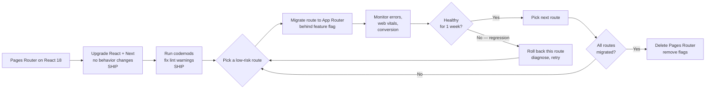
```mermaid
flowchart LR
    Start[Pages Router on React 18] --> Up[Upgrade React + Next<br/>no behavior changes<br/>SHIP]
    Up --> Codemod[Run codemods<br/>fix lint warnings<br/>SHIP]
    Codemod --> Pick{Pick a low-risk route}
    Pick --> Migrate[Migrate route to App Router<br/>behind feature flag]
    Migrate --> Watch[Monitor errors,<br/>web vitals,<br/>conversion]
    Watch --> OK{Healthy<br/>for 1 week?}
    OK -->|Yes| Next[Pick next route]
    OK -->|No — regression| Roll[Roll back this route<br/>diagnose, retry]
    Roll --> Pick
    Next --> Done{All routes<br/>migrated?}
    Done -->|No| Pick
    Done -->|Yes| Cleanup[Delete Pages Router<br/>remove flags]
```

---

### 56. What's the most senior frontend skill that's *not* about React?

A few candidates that come up in real reviews:

- **Owning the user experience end-to-end** — TTFB, hydration cost, image strategy, fonts, third-party budget. The framework is one input.
- **Reading and shaping product requirements.** Pushing back on a feature whose UX won't survive contact with users.
- **Owning the contract with backend.** Driving OpenAPI / GraphQL schema discussions, not consuming whatever's handed over.
- **Design partnership.** Translating Figma into a system, not pixel-pushing per screen. Naming the design tokens.
- **Writing for engineers.** ADRs, post-mortems, RFCs. Senior IC influence is text.

The interviewer wants to hear that you operate beyond "I write components." React expertise is table stakes for the title; the senior multiplier is the skills around it.

---

## See Also

- Vault topics: [[Welcome]], [[React Master Index]] for deeper notes on hooks, RSC, performance, build tooling.
- Mid-level questions: see prior `Mid-Level React Developer.md` (if you create one).

---
