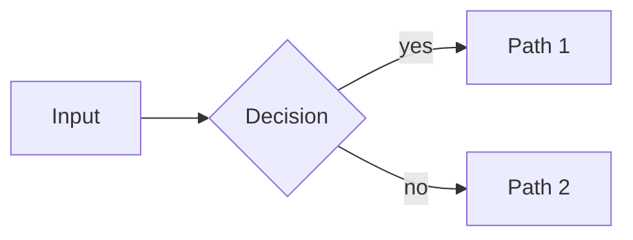

# <Topic Title>

> **One-liner**: What this is and why it matters in one sentence.

---

## Quick Reference

| Item | Value / Syntax |
|------|----------------|
| Key concept | `Code or value` |
| Common API | `Method()` |

---

## Core Concept

Plain-English explanation. No jargon without definition. Analogies encouraged. Max 3–4 short paragraphs.

---

## Diagram

*(Optional — include only when a diagram clarifies more than prose. Use Mermaid.)*



---

## Syntax & API

```csharp
// Minimal working example — always compilable
```

### Variant / Overload

```csharp
// Additional syntax forms
```

---

## Common Patterns

```csharp
// Pattern: descriptive name
```

---

## Gotchas & Tips

- Pitfall 1
- Version-specific behavior
- Performance note

---

## See Also

- [[Related Note 1]]
- [[Related Note 2]]
